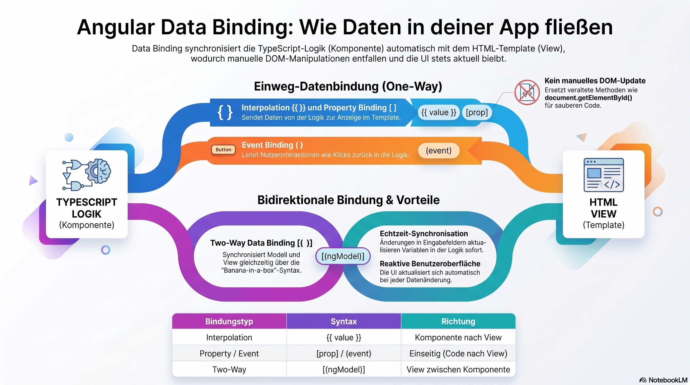

In Angular, **Data Binding** is the mechanism that coordinates the communication between a component's logic (TypeScript) and its template (HTML). It allows you to define how data flows, ensuring that the UI stays in sync with the application state without manual DOM manipulation.

There are four main types of data binding in Angular, categorized by the direction of data flow:

---

### 1. Interpolation (One-way: Source to View)
Interpolation is the most common way to display data from your TypeScript class in the HTML. It uses **double curly braces** `{{ }}`.

*   **Syntax:** `{{ value }}`
*   **Usage:** Used to embed dynamic text or the result of a logic expression.
*   **Example:**
    *   *TS:* `userName = 'John Doe';`
    *   *HTML:* `<h1>Welcome, {{ userName }}</h1>`

### 2. Property Binding (One-way: Source to View)
Property binding allows you to set the value of a property of an HTML element or a directive. It uses **square brackets** `[]`.

*   **Syntax:** `[property]="value"`
*   **Usage:** Used to toggle button states, change image sources, or pass data to child components.
*   **Example:**
    *   *TS:* `imageUrl = 'logo.png';` `isDisabled = true;`
    *   *HTML:* `` or `<button [disabled]="isDisabled">Click Me</button>`

### 3. Event Binding (One-way: View to Source)
Event binding allows you to listen for and respond to user actions such as clicks, keystrokes, or mouse movements. It uses **parentheses** `()`.

*   **Syntax:** `(event)="method()"`
*   **Usage:** Used to trigger logic in the TypeScript class when a user interacts with the UI.
*   **Example:**
    *   *TS:* `onSave() { console.log('Saved!'); }`
    *   *HTML:* `<button (click)="onSave()">Save Data</button>`

### 4. Two-Way Data Binding (Both Ways)
Two-way data binding ensures that the model and the view are updated simultaneously. If the user changes an input field, the variable in TypeScript updates; if the variable in TypeScript changes, the input field updates. It uses the **"Banana-in-a-box"** syntax `[()]`.

*   **Requirement:** Requires the `FormsModule` to be imported in your application.
*   **Syntax:** `[(ngModel)]="property"`
*   **Example:**
    *   *TS:* `userEmail = '';`
    *   *HTML:* `<input [(ngModel)]="userEmail">`
    *   *Result:* As you type in the input, the `userEmail` variable updates in real-time.

---

### Summary Table

| Binding Type | Syntax | Direction | Purpose |
| :--- | :--- | :--- | :--- |
| **Interpolation** | `{{ value }}` | Component → View | Display data as text. |
| **Property Binding** | `[prop]="val"` | Component → View | Set element attributes/properties. |
| **Event Binding** | `(event)="fn()"` | View → Component | Respond to user actions. |
| **Two-Way Binding** | `[(ngModel)]="val"` | View ↔ Component | Sync form inputs with data. |

### Why use Data Binding?
1.  **Reduces Boilerplate:** You don't need to write `document.getElementById().innerText = ...` or manual event listeners.
2.  **Reactive UI:** The view updates automatically whenever the underlying data changes.
3.  **Clean Code:** It separates the logic (how data is processed) from the presentation (how data looks).
