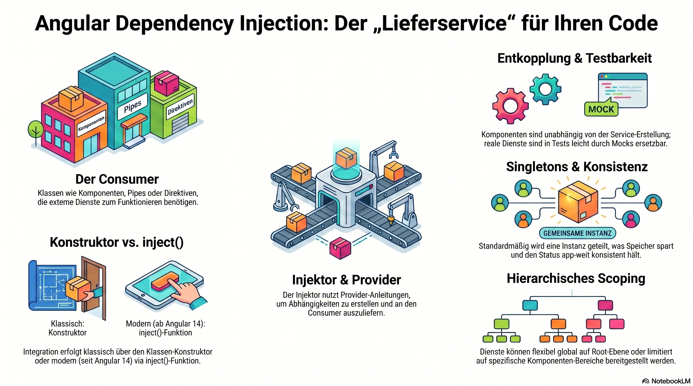

# Angular Dependency Injection



Angular Dependency Injection (DI) is _a powerful design pattern where a class (like a component) requests its dependencies from an external source rather than creating them itself_. \[1, 2]

It is the "glue" that allows different parts of your application to communicate in a modular and decoupled way. \[3, 4]

## 1. How It Works

Think of DI as a "delivery service" for your code.

* The Dependency: A service or value that a class needs to function (e.g., a `DataService` to fetch users).
* The Consumer: The class (Component, Pipe, or Directive) that needs the dependency.
* The Injector: The mechanism that finds or creates the required dependency and "injects" it into the consumer.
* The Provider: A set of instructions telling the injector _how_ to create the dependency. \[1, 5, 6, 7, 8, 9, 10]

## 2. Using DI in Your Code

There are two main ways to inject a dependency:

* Constructor Injection (Traditional): You declare the dependency as a parameter in your class constructor.
  ```typescript
  constructor(private dataService: DataService) { }
  ```
* The `inject()` Function (Modern): Introduced in Angular 14, this allows you to inject dependencies directly into class fields.
  ```typescript
  private dataService = inject(DataService);
  ```
  \[8, 11, 12, 13]

## 3. Key Benefits

* Decoupling: Your component doesn't need to know how to create the service; it just knows how to use it.
* Singletons: By default, services are singletons, meaning one instance is shared across the app, saving memory and keeping state consistent.
* Testability: You can easily swap a "real" service for a "mock" service during unit testing to isolate your code.
* Hierarchical Scoping: You can provide a service globally at the root level or limit it to a specific component subtree. \[1, 5, 11, 14, 15, 16, 17, 18]

Would you like to see an example of how to provide a service at different levels (Root vs. Component), or should we dive into mocking dependencies for tests?


\[1] [https://www.youtube.com](https://www.youtube.com/watch?v=G8zXugcYd7o\&t=48)

\[2] [https://medium.com](https://medium.com/@viiveksingh93/understanding-dependency-injection-in-angular-a-practical-example-e98c80eb5aab)

\[3] [https://www.geeksforgeeks.org](https://www.geeksforgeeks.org/angular-js/angular-dependency-injection/)

\[4] [https://viitorcloud.com](https://viitorcloud.com/blog/angular-dependency-injection-patterns/)

\[5] [https://www.geeksforgeeks.org](https://www.geeksforgeeks.org/angular-js/angular-dependency-injection/)

\[6] [https://www.telerik.com](https://www.telerik.com/blogs/dependency-injection-angular)

\[7] [https://www.telerik.com](https://www.telerik.com/blogs/dependency-injection-angular)

\[8] [https://devot.team](https://devot.team/blog/dependency-injection-in-angular)

\[9] [https://www.youtube.com](https://www.youtube.com/watch?v=z7-Uk3WPYHE\&t=23)

\[10] [https://dev.to](https://dev.to/artem_turlenko/understanding-angular-dependency-injection-how-it-works-best-practice-2j68)

\[11] [https://medium.com](https://medium.com/ngconf/how-angular-dependency-injection-works-under-the-hood-cc210f7040bd)

\[12] [https://blog.logrocket.com](https://blog.logrocket.com/how-dependency-injection-works-in-angular/)

\[13] [https://medium.com](https://medium.com/@abdulkhader_95798/understanding-angular-injection-context-40a05c164d7f)

\[14] [https://www.freecodecamp.org](https://www.freecodecamp.org/news/angular-dependency-injection/)

\[15] [https://www.youtube.com](https://www.youtube.com/watch?v=SgijwIBAQ0E\&t=6)

\[16] [https://blog.bitsrc.io](https://blog.bitsrc.io/understanding-dependency-injection-and-services-in-angular-7054e783a0b6)

\[17] [https://medium.com](https://medium.com/@vijay.net10/unlocking-the-power-of-dependency-injection-in-angular-key-benefits-for-your-applications-8207bce856d0)

\[18] [https://blog.angular-university.io](https://blog.angular-university.io/angular-dependency-injection/)
