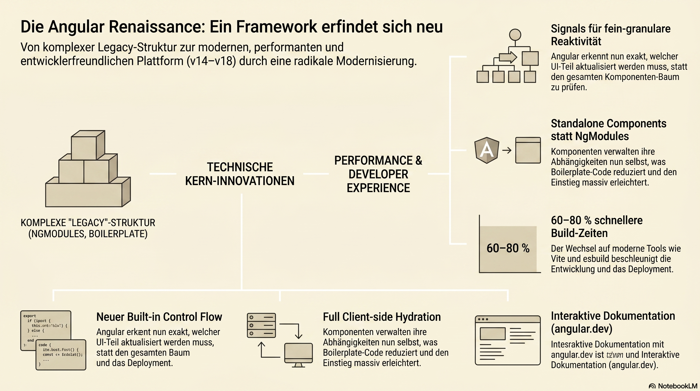

# Renaissance of the framework

[Enjoy a German translation](../Summaries/Modernizing_ a_Web_ Powerhouse.md)

The **"Angular Renaissance"** refers to a period of rapid innovation, modernization, and a complete "rebranding" of the framework that began around late 2022 (with Angular v14/15) and reached full momentum with **Angular v17 and v18**.

For years, Angular was perceived as a "stagnant" or "corporate" framework—powerful but overly verbose, complex, and slow to adopt modern web trends compared to React, Vue, or Svelte. The Renaissance is the Google team’s successful effort to make Angular **faster, lighter, and more developer-friendly.**

Here are the key pillars of the Angular Renaissance:

---

### 1. Signals (Fine-Grained Reactivity)
The most significant technical shift is the introduction of **Signals**.
*   **The Old Way:** Angular relied entirely on `Zone.js` to detect changes. When something changed, Angular would often check the entire component tree, which could be inefficient.
*   **The Renaissance way:** Signals allow Angular to know *exactly* which piece of data changed and which specific part of the UI needs to update. This leads to better performance and a simpler mental model for developers.

### 2. Standalone Components (Removing NgModules)
For years, the biggest hurdle for beginners was the `NgModule`. You couldn't just create a component; you had to "register" it in a module.
*   **The Change:** Standalone components (introduced in v14 and made the default in v17) allow components to manage their own dependencies. This reduced boilerplate code significantly and made the framework much easier to learn.

### 3. New Control Flow (Built-in Syntax)
Angular replaced the old structural directives (`*ngIf`, `*ngFor`, and `*ngSwitch`) with a new **Built-in Control Flow** syntax.
*   **Old:** `
...
`
*   **New:** `@if (isLoggedIn) { ... }`
*   **Why it matters:** The new `@` syntax is more performant, supports `empty` blocks for loops, and is much closer to standard JavaScript logic.

### 4. Hydration and SSR (Server-Side Rendering)
Previously, Angular's SSR (Server-Side Rendering) story was lagging. It used "destructive hydration," where the server-rendered page would be flickered and rebuilt from scratch on the client.
*   **The Change:** The Renaissance introduced **Full Client-side Hydration**. Angular now "picks up" where the server left off without flickering. They also integrated **Deferrable Views** (`@defer`), which allows developers to lazy-load parts of a template only when they enter the viewport or when the browser is idle.

### 5. Modern Tooling (Vite and esbuild)
Angular moved away from the aging Webpack build system.
*   **The Change:** By default, new Angular projects use **esbuild** and **Vite**. This has resulted in build speeds and "Hot Module Replacement" (HMR) times that are 60–80% faster than before.

### 6. Branding and Documentation
The "Renaissance" isn't just technical; it’s a vibe shift.
*   **New Identity:** Angular launched a brand-new logo (shifting from the old red shield to a modern, gradient-heavy design).
*   **angular.dev:** They launched a new documentation site (**[angular.dev](https://angular.dev)**) that includes interactive tutorials in the browser, making the learning curve much shallower.

---

### Summary: Why is it called a "Renaissance"?
It is called a Renaissance because Angular managed to do something few frameworks achieve: **it modernized itself without breaking the ecosystem.** 

By adopting the best ideas from other frameworks (Signals from Solid.js, Vite from the Vue ecosystem, template syntax similar to Svelte) while keeping its "batteries-included" corporate stability, Angular has become a top-tier choice for modern web development again.