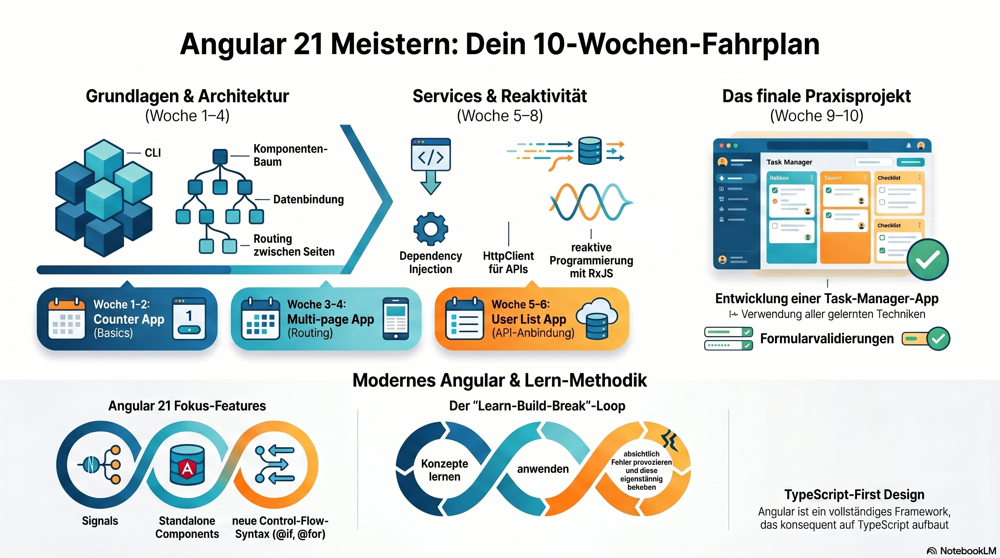

# How to learn Angular 21?

Learning Angular effectively (including the upcoming Angular versions like [Angular 21](https://angular.dev/events/v21)) is less about memorizing APIs and more about building structured, real-world apps step by step. Since you already worked through JavaScript, Node, and TypeScript bootcamps, you’re in a strong position—Angular is basically where all of that comes together.

Here’s a **clear, practical roadmap** tailored to how you’ve been learning 👇

***

# 🧭 Phase 1: Angular Fundamentals (Week 1–2)

## What Angular really is

Angular is:

* A **framework** (not just a library like React)

* Built with **TypeScript-first design**

* Based on:

  * [Components](./Atoms/Angular_Component.md)

  * [Dependency Injection](./Atoms/Angular_Dependency_Injection.md)

  * [RxJS](./Atoms/Angular_RxJS.md) (reactive programming)
 
      * [Angular RxJS Tutorial](./Atoms/Angular_RxJS-Tutorial.md)
      * [Angular RxJS Bootcamp](./Atoms/Angular_RxJS_Bootcamp.md)
      * [RxJS Deep Dive](./RxJS/RxJS_deep_dive.md)

## Core concepts to learn

* [Angular CLI](./Atoms/Angular_CLI.md) (`ng new`, `ng serve`)

    * [Angular CLI Tutorial](./Atoms/Angular-CLI_Tutorial.md)
    * [Hands on Angular CLI Tuturial](./Atoms/Hands_on_Angular_CLI_tutorial.md)
    * [Angular CLI Bootcamp](./Atoms/Angular_CLI_Bootcamp.md)

* Project structure

    * [Angular Project Structure](./Atoms/Angular_Project_Structure.md)
    * [Installing the Angular CLI](./Atoms/Angular_CLI_Instalation.md)
    * [Angular Project Structure Example](./Atoms/Angular_Project_Structure_Example.md)

* Components (`@Component`)

    * [Angular Component Creation](./Atoms/Angular_Component_Creation.md)
    * [Angular Components](./Atoms/Angular_Component.md)
    * [Angular Component Tutorial](./Atoms/Angular_Component_Tutorial.md)
    * [Angular Component Bootcamp](./Atoms/Angular_Component_Bootcamp.md)

* Templates (HTML + bindings)

    * [Angular Templates](./Atoms/Angular_Templates.md)
    * [Angular Template Tutorial](./Atoms/Angular_Template_Tutorial.md)
    * [Angular Template Bootcamp](./Atoms/Angular_Template_Bootcamp.md)

* Data binding:

    * [Anguar Data Bindings](./Atoms/Angular_Data_Bindings.md) => Continue here.

  * `{{ }}` 👉 [Interpolation](./Atoms/Angular_Interpolation.md)
 
      * [Angular Interpolation Tutorial](./Atoms/Angular_Interpolation_Tutorial.md)

  * `[property]` 👉 [Property Binding](./Atoms/Angular_Property_Bindings.md)
 
      * [Angular Property Binding Tutorial](./Atoms/Angular_Property_Binding_Tutorial.md)
    
  * `(event)` 👉 Event Binding

  * `[(ngModel)]` 👉 Tow Way Binding

## Hands-on project

👉 Build a **Counter App**

* Increment / decrement buttons

* Display value

* Reset button

***

# 🧱 Phase 2: Components & Architecture (Week 3–4)

## Learn how Angular apps are structured

* Component tree

* `@Input()` / `@Output()`

* Smart vs dumb components

## Routing (very important)

* Angular Router

* Route parameters

* Navigation

## Hands-on project

👉 Build a **Multi-page App**

* Home page

* About page

* Contact page

* Navigation bar

***

# 🔄 Phase 3: Services & Dependency Injection (Week 5–6)

This is where Angular becomes _real Angular_.

## Learn:

* Services (`ng generate service`)

* Dependency Injection

* Singleton services

## HTTP & APIs

* `HttpClient`

* Fetch data from APIs

* Observables (basic RxJS)

## Hands-on project

👉 Build a **User List App**

* Fetch users from API (e.g. JSONPlaceholder)

* Display list

* Show user details

***

# ⚡ Phase 4: Reactive Programming (Week 7)

Angular heavily uses RxJS.

## Learn:

* Observables

* `subscribe()`

* `map`, `filter`

* Async pipe

👉 You don’t need to master everything—focus on:

* HTTP streams

* Async pipe usage

***

# 🧩 Phase 5: Forms (Week 8)

## Two approaches:

* Template-driven forms

* Reactive forms (recommended)

## Learn:

* Form validation

* Form controls

* Form groups

👉 Project:

* **Login / Registration Form**

  * Validation

  * Error messages

***

# 🏗️ Phase 6: Real App Build (Week 9–10)

Now combine everything.

👉 Build a **Task Manager App**

* Add / edit / delete tasks

* Routing

* Services

* Forms

* API (fake backend)

***

# 🚀 Phase 7: Modern Angular Features (Angular 16 → 21)

Angular has evolved a lot recently. Focus on:

## Signals (important 🔥)

* New reactivity system

* Alternative to RxJS in some cases

## Standalone Components

* No need for NgModules anymore

## New control flow syntax

* `@if`, `@for` instead of `*ngIf`, `*ngFor`

***

# 🧠 How to Study (Important)

Given your bootcamp style, use this loop:

1. Learn concept (30–60 min)

2. Build small example

3. Break it on purpose

4. Fix it

5. Extend it

👉 Avoid:

* Watching too many tutorials without coding

* Copy-pasting

***

# 🛠️ Tools You’ll Use

* Angular CLI

* Browser DevTools (Chrome)

* VS Code

* Optional backend: Node.js

***

# 📚 Recommended Learning Sources

* Official Angular docs (best source)

* YouTube (for visuals)

* Small GitHub projects

***

# 🧩 If You Want…

I can build you a **full 10-week Angular 21 bootcamp**, just like your:

* JavaScript bootcamp

* Node.js bootcamp

* TypeScript bootcamp

👉 Just say:\
**“Week 1 Angular Bootcamp please”**

and I’ll structure it day-by-day with exercises 👍
