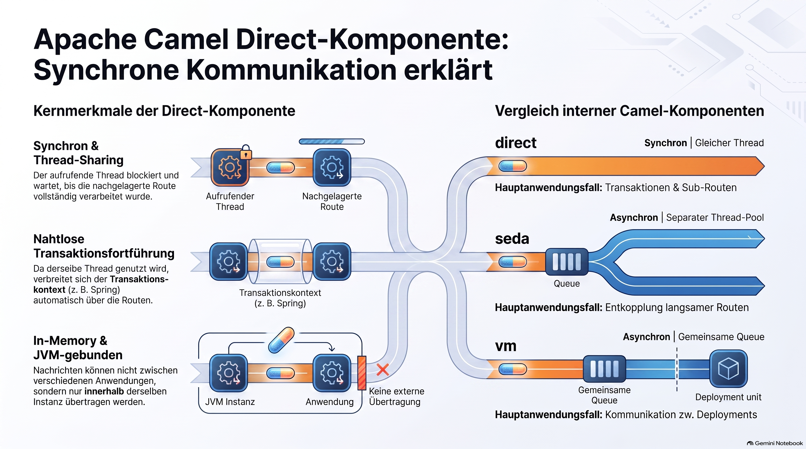

> [NOTE!]
> Diese Quellen erläutern die Funktionsweise der **Apache Camel Direct-Komponente**, die als **synchroner Verbindungsmechanismus** innerhalb einer einzelnen Java-Anwendung dient. Der Datenaustausch erfolgt dabei **ohne Thread-Wechsel**, sodass der aufrufende Prozess blockiert bleibt, bis die Zielroute vollständig abgearbeitet wurde. Da die Kommunikation im selben Speicherbereich stattfindet, lassen sich **Transaktionen nahtlos übertragen**, was die Komponente ideal für die Aufteilung komplexer Workflows in **wiederverwendbare Teilrouten** macht. Ein entscheidendes Merkmal ist, dass jeder Endpunktname nur von **einem einzigen Konsumenten** belegt werden darf, um Konflikte beim Start der Anwendung zu vermeiden. Im Gegensatz zu Komponenten wie SEDA oder VM bietet die Direct-Lösung eine **performante, speicherbasierte Kopplung** ohne die Komplexität externer Warteschlangen. Insgesamt wird die Komponente als effizientes Werkzeug für den **direkten Aufruf von Camel-Routen** aus Java-Code oder zur strukturellen Organisation innerhalb eines Spring Boot-Kontexts beschrieben.


# Apache Camel Direct Component

In Apache Camel, `direct:start` is _an endpoint URI indicating that a route consumes messages from a Direct Component named "start"_. The string `"start"` is simply an arbitrary name given to the endpoint; it could just as easily be named `"direct:input"`, `"direct:process"`, or `"direct:foo"`. 

***

## What is a "Direct" Component?

The Direct component provides synchronous invocation between routes or components within the same `CamelContext` (JVM instance).

```unset
[Calling Thread] ---> (Producer Template / Route A) ---> [direct:start] ---> (Route B)

                              |                                                |
                              +<--------------(Synchronous Return)-------------+
```

When a producer sends a message exchange to a `direct` endpoint, Camel does not spin up a new thread or use an underlying message queue. Instead, it directly invokes the next consumer by reusing the exact same calling thread. \[2]

***

## Key Characteristics of Direct Components

* Synchronous & Thread-Sharing: The calling thread blocks and waits until the downstream route completely finishes processing. \[2, 3]
* Transaction Awareness: Because it runs on the same thread, any transaction context (like a Spring `@Transactional` block) propagates seamlessly across the routes.
* Single Consumer Limit: A specific direct endpoint name (e.g., `direct:start`) can only be consumed by one route (`from("direct:start")`). If you map two routes to the exact same direct URI name, Camel will throw an exception at startup.
* In-Memory Only: It cannot pass messages between different applications or separate microservices; it strictly links routes running in the same Spring Boot JVM. \[1]
* Implicit Creation: You do not need to pre-register or define the endpoint beans in your code; Apache Camel creates them dynamically on the fly as soon as they are referenced in a route. \[1]

***

## Core Use Cases

## 1. Invoking a Route from Java Code (Spring Controller / Service)

You can inject a `ProducerTemplate` into your Spring Boot beans to manually pass a payload into a Camel route. \[4, 5]

```java
@RestController
public class OrderController {

    @Autowired
    private ProducerTemplate producerTemplate;

    @PostMapping("/order")
    public String createOrder(@RequestBody String orderJson) {
        // Sync call: This thread blocks until the route finishes and returns the result
        return producerTemplate.requestBody("direct:start", orderJson, String.class);
    }
}
```

## 2. Breaking Down Large Routes into Reusable Sub-Routes

If a route becomes too long or complex, you can split it into small, maintainable fragments. \[6]

```java
@Component
public class OrderRoute extends RouteBuilder {
    @Override
    public void configure() {
        // Main Route
        from("jetty:http://localhost:8080/order")
            .to("direct:validateOrder")  // Hands off processing synchronously
            .to("direct:processPayment") // Next sequential step
            .to("jms:queue:orders");

        // Sub-Route A
        from("direct:validateOrder")
            .log("Validating payload...")
            .bean(ValidationBean.class);

        // Sub-Route B
        from("direct:processPayment")
            .log("Processing payment...")
            .bean(PaymentBean.class);
    }
}
```

***

## Comparison: `direct` vs. Other Internal Components

If you need alternative execution styles inside Spring Boot, Camel offers other internal components:

| Component | Execution Style | Threading behavior                                                                     | Use Case                                                                          |
| --------- | --------------- | -------------------------------------------------------------------------------------- | --------------------------------------------------------------------------------- |
| `direct`  | Synchronous     | Reuses the same thread.                                                                | Transactional processing, code-to-route entry, and sub-routing.                   |
| `seda`    | Asynchronous    | Uses a separate thread pool via an internal blocking queue.                            | Decoupling slow routes or high-throughput tasks without blocking the main thread. |
| `vm`      | Asynchronous    | Uses a blocking queue shared across different deployment apps within the same JVM JVM. | Communicating between separate war/jar deployments inside an application server.  |

If you are looking to design a specific messaging pattern, let me know how you plan to trigger this route or whether your workflow requires asynchronous (fire-and-forget) execution.


