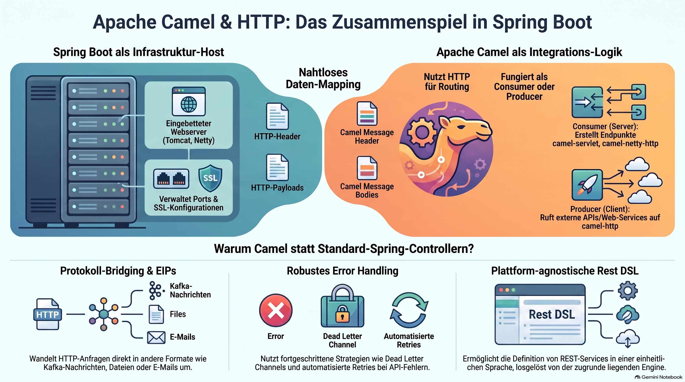

> [NOTE!]
> In diesem Text wird das Zusammenspiel zwischen **Spring Boot** und **Apache Camel** im Rahmen der **HTTP-Kommunikation** erläutert. Während Spring Boot die notwendige **Infrastruktur** und den Webserver bereitstellt, übernimmt Apache Camel die **Logik** und das **Routing** der Datenströme. Camel fungiert dabei flexibel als **Producer oder Consumer**, um externe Dienste aufzurufen oder eigene Endpunkte für komplexe Integrationen bereitzustellen. Besonders hervorgehoben wird die **Rest DSL**, welche die Definition von Schnittstellen vereinfacht und eine nahtlose Transformation von **Headern und Inhalten** ermöglicht. Die Kombination beider Technologien eignet sich vor allem für anspruchsvolle Aufgaben wie das **Protokoll-Bridging** oder die Anwendung von **Enterprise Integration Patterns**. Letztlich dient HTTP in diesem Ökosystem als zentrales Bindeglied, das den Datenaustausch zwischen verschiedensten Systemen koordiniert.


# Bridging Systems with Apache Camel and Spring Boot HTTP


In the context of **Spring Boot** and **Apache Camel**, **HTTP** is primarily treated as a **communication protocol** used to either expose services (as a server) or consume services (as a client).

While Spring Boot provides the underlying "engine" (the web server), Apache Camel provides the "logic" and "routing" for how those HTTP requests are handled.

Here is a breakdown of how HTTP functions in this ecosystem:

---

### 1. The Role of Spring Boot (The Infrastructure)

Spring Boot acts as the host. When you include the `spring-boot-starter-web` or `spring-boot-starter-undertow` dependency, Spring Boot:
*   **Embeds a Web Server:** It starts a server (like Tomcat, Jetty, or Netty) on a specific port (default 8080).
*   **Provides the Context:** It manages the lifecycle of the application and provides the configuration (security, SSL, port settings) that HTTP requests will use.

### 2. The Role of Apache Camel (The Routing)

Camel views HTTP as a **Component**. In Camel, HTTP is rarely just about "sending a message"; it's about integrating systems. Camel uses HTTP in two ways:

#### A. As a Consumer (The Server Side)

You use Camel to create an HTTP endpoint that listens for incoming requests.
*   **The Component:** You might use `camel-servlet`, `camel-jetty`, or `camel-netty-http`.
*   **The Logic:** Instead of writing a standard `@RestController`, you define a route.
*   **Example:**
    ```java
    from("servlet:/hello")
        .setBody(constant("Hello from Camel HTTP!"));
    ```
    *In this case, HTTP is the **entry point** into a complex integration workflow.*

#### B. As a Producer (The Client Side)

You use Camel to call an external API or web service.
*   **The Component:** `camel-http`.
*   **The Logic:** Camel treats the external HTTP service as a destination in a route.
*   **Example:**
    ```java
    from("direct:startCall")
        .setHeader(Exchange.HTTP_METHOD, constant("POST"))
        .to("http://api.external-service.com/data")
        .log("Response received: ${body}");
    ```
---

### 3. Key Concepts: The Rest DSL

In modern Spring Boot/Camel apps, HTTP is usually managed via the **Rest DSL (Domain Specific Language)**. This allows you to define RESTful services in a way that is "platform-agnostic" but runs on top of Spring Boot’s HTTP capabilities.

```java
rest("/api")
    .get("/users/{id}")
        .to("direct:getUserDetails")
    .post("/users")
        .type(User.class)
        .to("jms:queue:newUserQueue");
```
In this example, HTTP is the **transport layer** that triggers a message to be sent to a background JMS queue.

---

### 4. How Data is Handled (Exchange & Message)

When an HTTP request enters a Camel route:
1.  **Headers:** HTTP headers (like `Content-Type`, `Authorization`, or `User-Agent`) are converted into **Camel Message Headers**.
2.  **Body:** The HTTP payload (JSON, XML, or plain text) becomes the **Camel Message Body**.
3.  **Status Codes:** Camel maps HTTP status codes (200, 404, 500) to the `Exchange.HTTP_RESPONSE_CODE` header to communicate back to the caller.

---

### 5. Why use Camel for HTTP instead of just Spring `@RestController`?

While Spring MVC is great for standard web apps, you use Camel's HTTP components when:
*   **Protocol Bridging:** You need to take an HTTP request and immediately turn it into a File, a Kafka message, or an Email.
*   **Error Handling:** You want to use Camel's sophisticated retry logic and "Dead Letter Channels" for failed API calls.
*   **Complexity:** You are implementing **Enterprise Integration Patterns (EIPs)** like Content-Based Routing (e.g., if header `X-Region` is 'US', send to Server A; otherwise, send to Server B).

### Summary
In the Spring Boot and Apache Camel world, **HTTP is the glue**. Spring Boot provides the **web container** to listen for it, and Camel provides the **connectors** to process that HTTP data and move it through your business logic.
