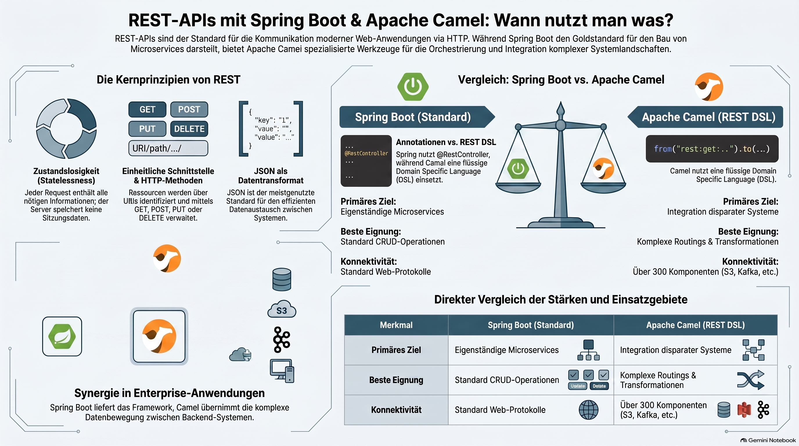

> [NOTE!]
> Dieser Text erläutert die Implementierung von **REST-APIs** innerhalb der Frameworks **Spring Boot** und **Apache Camel**. Während Spring Boot primär für die Erstellung eigenständiger **Microservices** mittels Annotationen genutzt wird, dient Apache Camel als mächtiges Werkzeug für die **Systemintegration** und komplexe Datenroutings. Die Quelle beschreibt grundlegende **REST-Prinzipien** wie Statuslosigkeit und die Verwendung von **HTTP-Methoden** sowie den Datenaustausch im **JSON-Format**. Ein direkter Vergleich verdeutlicht, dass Spring Boot ideal für standardisierte **CRUD-Operationen** ist, während Camel seine Stärken bei der Verknüpfung zahlreicher externer Schnittstellen ausspielt. In der Praxis werden beide Technologien oft kombiniert, um sowohl eine stabile **Anwendungsstruktur** als auch eine flexible Logik für den **Datentransfer** zu gewährleisten. Die bereitgestellten Code-Beispiele veranschaulichen die unterschiedlichen Programmieransätze der beiden Java-basierten Frameworks.


# Apache Camel REST API 🐪

A **REST API** (Representational State Transfer) is an architectural style for designing networked applications. It allows different software systems to communicate over the web using the **HTTP protocol**. In the context of **Spring Boot** and **Apache Camel** 🐪, it is the primary way these frameworks expose functionality to the outside world or consume services from others.

### 1. Core Principles of REST

For an API to be considered "RESTful," it should follow these key constraints:

*   **Statelessness:** Each request from a client must contain all the information needed to understand and process the request. The server does not "remember" previous interactions (no session state).

*   **Uniform Interface:** Resources (like a "User" or "Order") are identified by **URIs** (e.g., `/api/users/1`).

*   **HTTP Methods:** Operations are performed using standard HTTP verbs:

    *   `GET`: Retrieve a resource.

    *   `POST`: Create a new resource.

    *   `PUT` / `PATCH`: Update an existing resource.

    *   `DELETE`: Remove a resource.

*   **Data Format:** While REST can support various formats, **JSON** is the most common standard for exchanging data.

---


### 2. REST in Spring Boot

Spring Boot is the most popular framework for building REST APIs in the Java ecosystem. It simplifies the process by providing built-in annotations and an embedded server (like Tomcat).

**How it works:**

*   **`@RestController`:** Marks a class as a handler for REST requests.

*   **`@RequestMapping` / `@GetMapping`:** Maps specific URLs to Java methods.

*   **Automatic Conversion:** Spring Boot automatically converts Java objects into JSON (and vice versa) using libraries like Jackson.


**Example Snippet:**

```java

@RestController

@RequestMapping("/api/products")

public class ProductController {

    @GetMapping("/{id}")

    public Product getProduct(@PathVariable String id) {

        return productService.findById(id); // Returns a JSON object

    }

}

```
---

 
### 3. REST in Apache Camel 🐪

While Spring Boot focuses on building the service itself, **Apache Camel** 🐪 is an integration framework. 
It uses a **REST DSL (Domain Specific Language)** to define REST endpoints as part of an integration "route."
 
**When to use Camel for REST:**

*   When you need to **orchestrate** multiple systems (e.g., an API call that needs to fetch data from a database, call a legacy SOAP service, and then send a message to a queue).

*   When you want to use Camel's 300+ connectors easily within your API.

**How it works:**

Camel provides a `camel-rest` component that can integrate with Spring Boot. You define your API structure in a `RouteBuilder`.

 
**Example Snippet:**

```java

rest("/api/orders")

    .get("/{id}")

        .to("direct:getOrderDetails") // Routes the request to another logic block

    .post()

        .type(Order.class)

        .to("jms:queue:newOrders"); // Directly sends the API input to a message queue

```
--- 

### Summary Comparison

| Feature | Spring Boot (Standard) | Apache Camel (REST DSL) |

| :--- | :--- | :--- |

| **Primary Goal** | Building standalone microservices. | Integrating disparate systems. |

| **Syntax** | Annotation-based (`@RestController`). | Fluent API / DSL (`rest().get()`). |

| **Best For** | Standard CRUD operations, business logic. | Complex routing, data transformation, EIPs. |

| **Connectivity** | Standard REST/Web protocols. | Hundreds of components (S3, Kafka, Salesforce, etc.). |

 
In many enterprise applications, developers use **both together**: 
Spring Boot provides the application framework, while Apache Camel handles the complex logic of moving data between the API and other backend systems.
