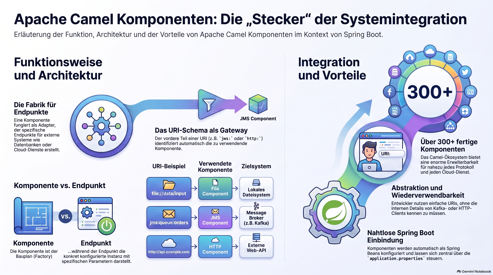

> [NOTE!]
> Dieser Text erläutert die zentrale Rolle von **Apache Camel Components** als technische **Bindeglieder** innerhalb eines Integrations-Frameworks. Diese Komponenten fungieren primär als **Endpunkt-Fabriken**, die eine nahtlose Kommunikation zwischen Camel und verschiedensten externen Systemen über spezifische **URIs** ermöglichen. Durch die Abstraktion komplexer Protokolle dienen sie als **Adapter**, die den Zugriff auf Datenbanken oder Cloud-Dienste erheblich vereinfachen. Besonders im Kontext von **Spring Boot** profitieren Entwickler von einer automatisierten Konfiguration und der globalen Verwaltung dieser Bausteine als **Beans**. Dank der enormen Vielfalt an verfügbaren Modulen lässt sich das System flexibel erweitern und auf individuelle Anforderungen zuschneiden. Letztlich bilden diese Komponenten das Fundament für eine **effiziente Datenintegration**, indem sie die technische Komplexität hinter einer einheitlichen Schnittstelle verbergen.


# Apache Camel Component

In the context of **Apache Camel** (especially when used with **Spring Boot**), a **Component** is essentially a **factory for endpoints**.

It acts as the adapter or connector that allows Camel to communicate with external systems, protocols, or data formats.

Here is a breakdown of what a Component is and how it works:

---

### 1. The Gateway to External Systems

Apache Camel is an integration framework. To talk to a database, a message broker (like Kafka), or a cloud service (like AWS S3), Camel needs a driver. The **Component** is that driver.

When you write a Camel route, the "scheme" at the beginning of the URI identifies which component to use:

*   `file://data/input` → Uses the **File Component**.
*   `jms:queue:orders` → Uses the **JMS Component**.
*   `http://api.example.com` → Uses the **HTTP Component**.

### 2. The Component-Endpoint Relationship

A Component’s primary job is to create **Endpoints**. 
*   **Component:** The blueprint/factory (e.g., the `MailComponent`).
*   **Endpoint:** A specific instance configured with a URI (e.g., `mail:smtp.gmail.com?user=admin`).

### 3. How it works in Spring Boot

When using Camel with Spring Boot, components are typically managed as **Spring Beans**.

#### Auto-Configuration

If you add a starter dependency to your `pom.xml`, Spring Boot automatically configures the component for you:
```xml
<dependency>
    <groupId>org.apache.camel.springboot</groupId>
    <artifactId>camel-jms-starter</artifactId>
</dependency>
```
Camel will automatically look for a `JmsComponent` bean in the Spring Application Context.

#### Configuration via `application.properties`

Spring Boot allows you to configure these components globally using properties:
```properties
# Configure the global behavior of the File component
camel.component.file.run-logging-level=INFO
# Configure a JMS connection factory for the JMS component
camel.component.jms.connection-factory=#myPooledConnectionFactory
```

### 4. Code Example
In a Spring Boot `RouteBuilder` class, you use components via their URI strings:

```java
@Component
public class MyRoute extends RouteBuilder {
    @Override
    public void configure() {
        // 'timer' and 'log' are built-in components
        from("timer:foo?period=5000") 
            .setBody(constant("Hello World"))
            .to("log:myLogger"); 
    }
}
```

### 5. Custom Components

If you have a proprietary system, you can create your own component by:
1.  Implementing the `Component` interface (usually extending `DefaultComponent`).
2.  Defining an `Endpoint`.
3.  Defining a `Producer` (to send data) and/or a `Consumer` (to receive data).
4.  Registering it as a `@Bean` in Spring Boot.

### Summary: Why are Components important?

*   **Abstraction:** You don’t need to know how the Kafka client or the HTTP client works internally; you just use the URI.
*   **Reusability:** You can configure a component once (e.g., setting credentials for an FTP server) and use it across many routes.
*   **Extensibility:** There are over 300+ pre-built components in the Camel ecosystem, making it easy to connect to almost anything.

**In short:** If Camel is the "glue" of your integration, **Components** are the "plugs" that fit into different types of sockets.