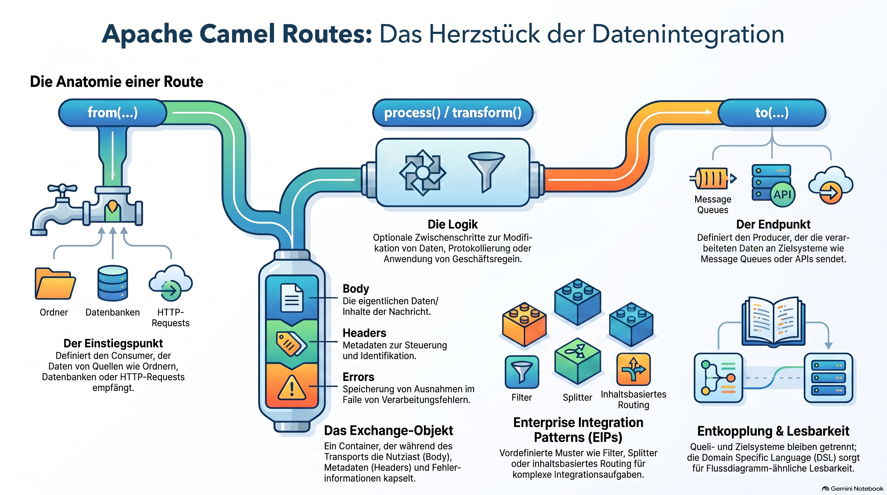

>[NOTE!]
>Diese Quelle erläutert das Konzept der **Apache Camel Route**, die als zentrales Element für den Datentransport zwischen verschiedenen Systemen dient. Man kann sich diese Route wie eine **Pipeline** vorstellen, die Informationen von einem **Ausgangspunkt** empfängt, sie bei Bedarf **verarbeitet oder umwandelt** und schließlich an ein **Ziel** weiterleitet. Der Prozess nutzt dabei sogenannte **Endpunkte** zur Kommunikation und verpackt Daten in ein **Exchange-Objekt**, welches auch Metadaten enthält. Ein wesentlicher Vorteil dieses Modells ist die **Entkopplung** von Systemen, da die Route die gesamte Logik der Zustellung und **Fehlerbehandlung** übernimmt. Durch den Einsatz von **Enterprise Integration Patterns** lassen sich zudem komplexe Aufgaben wie das Filtern oder Aufteilen von Nachrichten einfach umsetzen. Letztlich fungiert die Route als **bindendes Glied**, das unterschiedliche Softwareanwendungen durch eine lesbare, flussdiagrammähnliche Struktur effizient miteinander verbindet.


# Apache Camel Route

In Apache Camel, a **Route** is the most fundamental building block. 
It is a step-by-step definition of how a message should move from a source to a destination, including any processing or transformations that happen along the way.

Think of a route as a **pipeline** or a **workflow** for data.

---

### 1. The Basic Structure
A route is essentially a chain of events that follows this pattern:
**Source → Logic/Processing → Destination**

In Camel terminology, this is expressed as:
1.  **`from(...)`**: The entry point (Consumer). This is where the data comes from (e.g., a folder, a database, or an HTTP request).
2.  **`process()` / `transform()`**: The optional middle steps where you modify the data, log it, or apply business logic.
3.  **`to(...)`**: The exit point (Producer). This is where the data is sent (e.g., a message queue, an email, or another API).

---

### 2. A Simple Example (Java DSL)
If you wanted to move files from an "input" folder to an "output" folder, the route would look like this:

```java
from("file:data/input")    // 1. Source: Watch this folder
  .log("Moving ${file:name}") // 2. Processing: Log the filename
  .to("file:data/output");   // 3. Destination: Move it here
```

---

### 3. Key Concepts within a Route

*   **Endpoints:** These are the URLs (like `file:inbox` or `jms:queue:orders`) that tell Camel how to talk to different systems.
*   **The Exchange:** When a message moves through a route, Camel wraps it in an object called an **Exchange**. This object holds the actual data (Body), metadata (Headers), and any errors that occur.
*   **EIPs (Enterprise Integration Patterns):** Routes allow you to use industry-standard patterns easily. For example:
    *   **Filtering:** Only move messages if they meet a condition.
    *   **Content-Based Routing:** Send the message to "Path A" if it’s an Invoice, but "Path B" if it’s a Receipt.
    *   **Splitter:** Take one message containing 10 items and split it into 10 individual messages.

---

### 4. Why use Routes?
*   **Decoupling:** The source system doesn't need to know anything about the destination system. The route handles the translation.
*   **Readability:** Camel uses a **DSL (Domain Specific Language)**. Whether you write routes in Java, XML, or YAML, they are designed to be readable and look like a flowchart.
*   **Error Handling:** You can define specific "onException" rules for a route, so if a step fails (e.g., a database goes down), the route knows how to retry or redirect the message to an error folder.

### Summary
A **Route** is a configured path that takes a message from point A, potentially changes it or makes decisions about it, and delivers it to point B. It is the "glue" that connects different software applications together.