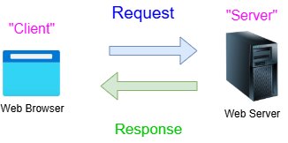

# The Hypertext Transfer Protocol (HTTP) Overview

**HTTP** stands for **Hypertext Transfer Protocol**. It is the fundamental protocol used by the World Wide Web to define how messages are formatted and transmitted, and what actions web servers and browsers should take in response to various commands.

Think of HTTP as the **language** that your web browser (like Chrome or Firefox) uses to talk to a web server (where a website's data lives).

---

### 1. How It Works: The Request-Response Cycle

[HTTP](https://en.wikipedia.org/wiki/HTTP) follows a simple "Request-Response" model between a **client** and a **server**:

1.  **The Request (Client):** You type a URL (like `www.google.com`) into your browser. Your browser sends an [HTTP](https://en.wikipedia.org/wiki/HTTP) request to the server where that website is hosted.
2.  **The Response (Server):** The server receives the request, finds the necessary files ([HTML](https://en.wikipedia.org/wiki/HTTP), images, CSS), and sends back an [HTTP](https://en.wikipedia.org/wiki/HTTP) response containing those files.
3.  **Rendering:** Your browser receives the response and turns the code into the visual webpage you see.

### 2. Key Components of HTTP

#### A. HTTP Methods (Verbs)
When a browser sends a request, it uses a specific **"method"** to tell the server what to do:
*   **GET:** Retrieve data (e.g., loading a webpage).
*   **POST:** Send data to the server (e.g., submitting a contact form or logging in).
*   **PUT/PATCH:** Update existing data on the server.
*   **DELETE:** Remove data from the server.

#### B. Status Codes

The server responds with a three-digit code to tell the browser if the request was successful:
*   **200 OK:** Everything worked perfectly.
*   **301 Moved Permanently:** The page has a new URL.
*   **404 Not Found:** The server couldn't find the page you asked for.
*   **500 Internal Server Error:** The server crashed or hit a snag.

### 3. HTTP vs. HTTPS

You have likely noticed that most URLs now start with **HTTPS** (Hypertext Transfer Protocol **Secure**).
*   **HTTP:** Data is sent in "plain text." If a hacker intercepts the data, they can read your passwords or credit card numbers.
*   **HTTPS:** Uses **SSL/TLS encryption**. It scrambles the data so that even if it is intercepted, it cannot be read. Today, [HTTPS](https://en.wikipedia.org/wiki/HTTPS) is the standard for almost all websites.

### 4. Characteristics of HTTP

*   **Stateless:** By itself, [HTTP](https://en.wikipedia.org/wiki/HTTP) is "stateless," meaning the server doesn't remember who you are from one request to the next. This is why websites use **Cookies**—to help the server remember that you are logged in.
*   **Media Independent:** [HTTP](https://en.wikipedia.org/wiki/HTTP) can transfer any kind of data (text, images, video, etc.) as long as the client and server know how to handle it.

### Summary

Without [HTTP](https://en.wikipedia.org/wiki/HTTP), the internet as we know it wouldn't exist. It is the invisible "delivery person" that fetches the data you want and brings it to your screen.

[HTTP](https://en.wikipedia.org/wiki/HTTP) stands for _**Hypertext Transfer Protocol**_ and is the foundational application-layer protocol used for transmitting web pages and other hypermedia data across the internet. 

How [HTTP](https://en.wikipedia.org/wiki/HTTP) Works

* **Client-Server Model:** Communication relies on a **client** (such as a web browser like Chrome or Firefox) sending a message and a **server** (where a website is hosted) processing it. 
* **Request-Response Cycle:** The client sends an **HTTP request** (asking for a specific resource or submitting form data), and the server replies with an **HTTP response** (containing the data or a status code like `200 OK` or `404 Not Found`).
* **Stateless Nature:** Each request-response pair is independent; the protocol itself does not naturally retain session memory between separate clicks, though cookies and tokens are used to manage state.

Key Characteristics

* **Methods:** Standard actions define what the request wants to do, such as **GET** (retrieve data) or **POST** (send data/submit forms).
* **Evolution:** It has progressed through multiple versions (**HTTP/1.1**, **HTTP/2**, and **HTTP/3**) to improve speed, efficiency, and security.
* **Security (HTTPS):** Plain [HTTP](https://en.wikipedia.org/wiki/HTTP) transmits data unencrypted, whereas **HTTPS** (Hypertext Transfer Protocol Secure) adds encryption layers like TLS to protect sensitive user information. 
