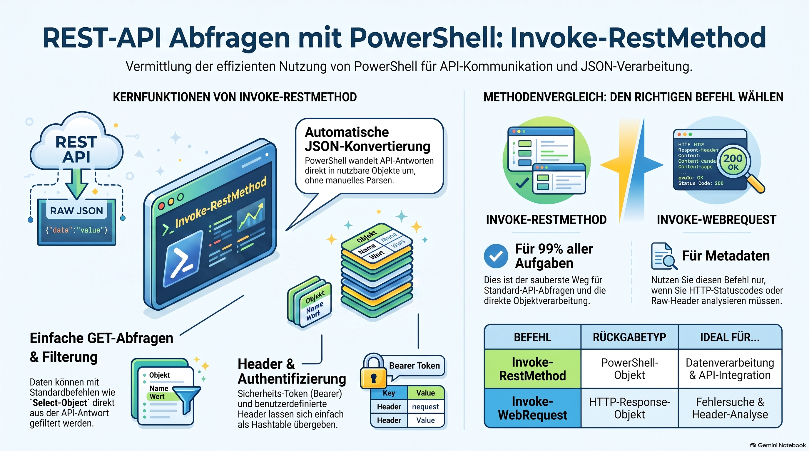

> [NOTE!]
> Dieser Text erläutert, wie man mit **PowerShell** effizient Abfragen an **REST-APIs** stellt, wobei der Fokus auf dem Befehl **Invoke-RestMethod** liegt. Da dieses Werkzeug **JSON-Daten** automatisch in **PowerShell-Objekte** umwandelt, vereinfacht es die Verarbeitung von Informationen erheblich. Der Autor demonstriert verschiedene Anwendungsszenarien, wie das Abrufen einzelner Datensätze, die Nutzung von **Schleifen** für mehrere Anfragen und das Senden von **Sicherheits-Headern**. Ergänzend wird **Invoke-WebRequest** als Alternative vorgestellt, falls detaillierte Metadaten wie **HTTP-Statuscodes** benötigt werden. Insgesamt dient der Leitfaden als praktische Anleitung, um Schnittstellen mit minimalem manuellem Aufwand anzusprechen und die Ergebnisse direkt im Terminal zu formatieren.

# PowerShell Guide to Mastering REST API Queries

## Querying REST APIs with Invoke-RestMethod

To query a REST API using PowerShell, the most common and powerful command is **`Invoke-RestMethod`**. It is specifically designed for REST APIs because it automatically converts JSON responses into easy-to-use PowerShell objects.

Here is how you can query the Star Wars API (or your local Camel proxy) using different scenarios.

### 1. Basic GET Request

If your Spring Boot application is running on `localhost:8080`, use this command to get data for character #1 (Luke Skywalker):

```powershell
$response = Invoke-RestMethod -Uri "http://localhost:8080/api/sw/character/1"

# View the whole object
$response

# Access specific properties
Write-Host "Name: $($response.name)"
Write-Host "Height: $($response.height)cm"
```

---

### 2. Handling the Response as an Object

Unlike many other languages where you have to manually "parse" the JSON, PowerShell does it for you. You can treat the API result like a variable:

```powershell
$character = Invoke-RestMethod -Uri "http://localhost:8080/api/sw/character/1"

# Print specific fields in a table format
$character | Select-Object name, height, mass, hair_color | Format-Table
```

---

### 3. Querying Multiple Characters (Looping)

If you want to fetch multiple characters at once and display them in a list:

```powershell
# Fetch IDs 1 through 5
foreach ($id in 1..5) {
    $url = "http://localhost:8080/api/sw/character/$id"
    $char = Invoke-RestMethod -Uri $url
    Write-Host "Character $id is $($char.name)" -ForegroundColor Cyan
}
```

---

### 4. Getting Detailed Metadata (Status Codes)

If you need to see the **HTTP Status Code** (e.g., 200 OK, 404 Not Found) or the raw headers, use **`Invoke-WebRequest`** instead:

```powershell
$result = Invoke-WebRequest -Uri "http://localhost:8080/api/sw/character/1"

# Check the status code
Write-Host "Status Code: $($result.StatusCode)"

# View Response Headers
$result.Headers

# Convert the raw content to JSON manually if needed
$data = $result.Content | ConvertFrom-Json
```

---

### 5. Sending Headers (If your API requires them)

If you later add security or custom headers to your Camel route, you can send them like this:

```powershell
$headers = @{
    "Authorization" = "Bearer MySecretToken"
    "Accept"        = "application/json"
}

Invoke-RestMethod -Uri "http://localhost:8080/api/sw/character/1" -Headers $headers
```

### Summary: Which one should I use?

*   **`Invoke-RestMethod`**: Use this **99% of the time**. It is cleaner and returns a usable object immediately.
*   **`Invoke-WebRequest`**: Use this only if you need to inspect **HTTP headers** or the **Status Code** specifically.