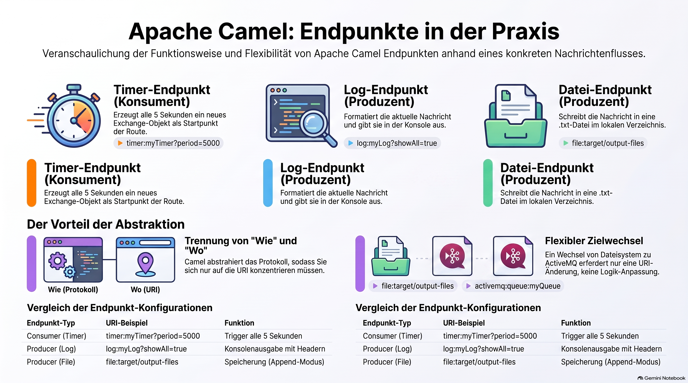

> [NOTE!]
> Diese Quelle bietet eine praxisnahe Anleitung zur Implementierung von **Apache Camel** innerhalb einer **Spring Boot**-Anwendung. Der Text beschreibt eine spezifische Route, die einen **Timer** als Auslöser nutzt, um Daten sowohl in einer **Konsole** zu protokollieren als auch in einer **lokalen Datei** zu speichern. Dabei werden die technischen Rollen von **Consumern und Producern** sowie die notwendigen Abhängigkeiten und Konfigurationen detailliert erläutert. Ein zentraler Fokus liegt auf der **Abstraktion von Endpunkten**, die es ermöglicht, Zielsysteme allein durch die Anpassung von **URIs** auszutauschen. Letztlich verdeutlicht das Beispiel, wie Entwickler durch Camel die zugrunde liegende **Protokollkomplexität** effizient verbergen können.


# Apache Camel Endpoint Example

To give you a complete, runnable example, 
let's create a scenario where we use **three different types of endpoints** in one single route.

**The Scenario:**
1.  **Timer Endpoint (Consumer):** Triggers the route every 5 seconds.
2.  **Log Endpoint (Producer):** Prints the message to the console.
3.  **File Endpoint (Producer):** Saves the message as a `.txt` file in a local folder.

### 1. The Maven Dependency

In your Spring Boot `pom.xml`, you only need the Camel starter:

```xml
<dependency>
    <groupId>org.apache.camel.springboot</groupId>
    <artifactId>camel-spring-boot-starter</artifactId>
    <version>4.4.0</version> <!-- Use current version -->
</dependency>
```
> [NOTE!]
> Feel free to create a Spring Boot project via Sping Initilizr


### 2. The Route Definition
.
**The Scenario:**
1.  **Timer Endpoint (Consumer):** Triggers the route every 5 seconds.
2.  **Log Endpoint (Producer):** Prints the message to the console.
3.  **File Endpoint (Producer):** Saves the message as a `.txt` file in a local folder.

### 1. The Maven Dependency

In your Spring Boot `pom.xml`, you only need the Camel starter:

```xml
<dependency>
    <groupId>org.apache.camel.springboot</groupId>
    <artifactId>camel-spring-boot-starter</artifactId>
    <version>4.4.0</version> <!-- Use current version -->
</dependency>
```

### 2. The Route Definition


Create a Java class in your Spring Boot project. 
Camel will automatically find it because of the `@Component` annotation.
```java
import org.apache.camel.builder.RouteBuilder;
import org.springframework.stereotype.Component;

@Component
public class MyFirstRoute extends RouteBuilder {

    @Override
    public void configure() throws Exception {
        
        // 1. CONSUMER ENDPOINT (The Source)
        // Scheme: timer, Path: trigger, Options: period of 5000ms
        from("timer:myTimer?period=5000")
        
            // Logic to set the message content
            .setBody(simple("Hello from Camel! Current time is: ${header.firedTime}"))
            
            // 2. PRODUCER ENDPOINT (Destination: Console)
            // Scheme: log, Path: myLog, Options: showAll=true
            .to("log:myLog?showAll=true")
            
            // 3. PRODUCER ENDPOINT (Destination: Local File)
            // Scheme: file, Path: target/output-files, Options: fileName
            .to("file:target/output-files?fileName=log-report.txt&fileExist=Append");
    }
}
```

---

### 3. Deep Dive into the Endpoints used:

#### A. The Timer Endpoint: `timer:myTimer?period=5000`
*   **Role:** Consumer (the `from(...)`).
*   **Component:** `TimerComponent`.
*   **What it does:** It acts as a heartbeat. Every 5 seconds, it generates a new "Exchange" (the Camel message object) and sends it down the path.

#### B. The Log Endpoint: `log:myLog?showAll=true`
*   **Role:** Producer (the `to(...)`).
*   **Component:** `LogComponent`.
*   **What it does:** It takes the message currently in the route and formats it as a text string to be printed in your Spring Boot console. The option `showAll=true` tells Camel to print headers and properties, not just the body.

#### C. The File Endpoint: `file:target/output-files?fileName=log-report.txt&fileExist=Append`
*   **Role:** Producer (the `to(...)`).
*   **Component:** `FileComponent`.
*   **What it does:** It writes the message body to your hard drive. 
    *   The **Path** is `target/output-files`.
    *   The **Option** `fileName=log-report.txt` sets the specific name.
    *   The **Option** `fileExist=Append` ensures that every 5 seconds it adds a new line instead of overwriting the file.

---

### 4. How to Run It
1.  Start your Spring Boot application.
2.  Watch the **Console Output**: You will see a log entry every 5 seconds.
3.  Check your **Project Folder**: Look in `target/output-files/`. You will see a file named `log-report.txt` that grows every few seconds.

### Why this is powerful:
If you wanted to change the output from a **File** to an **ActiveMQ Queue**, you wouldn't change your Java logic. You would simply change the Endpoint URI:

**From:** `.to("file:target/output-files")`  
**To:** `.to("activemq:queue:orders")`

Camel endpoints abstract the "How" (the protocol) so you can focus on the "Where" (the URI).)

Create a Java class in your Spring Boot project. 
Camel will automatically find it because of the `@Component` annotation.

```java
import org.apache.camel.builder.RouteBuilder;
import org.springframework.stereotype.Component;

@Component
public class MyFirstRoute extends RouteBuilder {

    @Override
    public void configure() throws Exception {
        
        // 1. CONSUMER ENDPOINT (The Source)
        // Scheme: timer, Path: trigger, Options: period of 5000ms
        from("timer:myTimer?period=5000")
        
            // Logic to set the message content
            .setBody(simple("Hello from Camel! Current time is: ${header.firedTime}"))
            
            // 2. PRODUCER ENDPOINT (Destination: Console)
            // Scheme: log, Path: myLog, Options: showAll=true
            .to("log:myLog?showAll=true")
            
            // 3. PRODUCER ENDPOINT (Destination: Local File)
            // Scheme: file, Path: target/output-files, Options: fileName
            .to("file:target/output-files?fileName=log-report.txt&fileExist=Append");
    }
}
```

---

### 3. Deep Dive into the Endpoints used:

#### A. The Timer Endpoint: `timer:myTimer?period=5000`
*   **Role:** Consumer (the `from(...)`).
*   **Component:** `TimerComponent`.
*   **What it does:** It acts as a heartbeat. Every 5 seconds, it generates a new "Exchange" (the Camel message object) and sends it down the path.

#### B. The Log Endpoint: `log:myLog?showAll=true`
*   **Role:** Producer (the `to(...)`).
*   **Component:** `LogComponent`.
*   **What it does:** It takes the message currently in the route and formats it as a text string to be printed in your Spring Boot console. The option `showAll=true` tells Camel to print headers and properties, not just the body.

#### C. The File Endpoint: `file:target/output-files?fileName=log-report.txt&fileExist=Append`
*   **Role:** Producer (the `to(...)`).
*   **Component:** `FileComponent`.
*   **What it does:** It writes the message body to your hard drive. 
    *   The **Path** is `target/output-files`.
    *   The **Option** `fileName=log-report.txt` sets the specific name.
    *   The **Option** `fileExist=Append` ensures that every 5 seconds it adds a new line instead of overwriting the file.

---

### 4. How to Run It
1.  Start your Spring Boot application.
2.  Watch the **Console Output**: You will see a log entry every 5 seconds.
3.  Check your **Project Folder**: Look in `target/output-files/`. You will see a file named `log-report.txt` that grows every few seconds.

### Why this is powerful:
If you wanted to change the output from a **File** to an **ActiveMQ Queue**, you wouldn't change your Java logic. You would simply change the Endpoint URI:

**From:** `.to("file:target/output-files")`  
**To:** `.to("activemq:queue:orders")`

Camel endpoints abstract the "How" (the protocol) so you can focus on the "Where" (the URI).