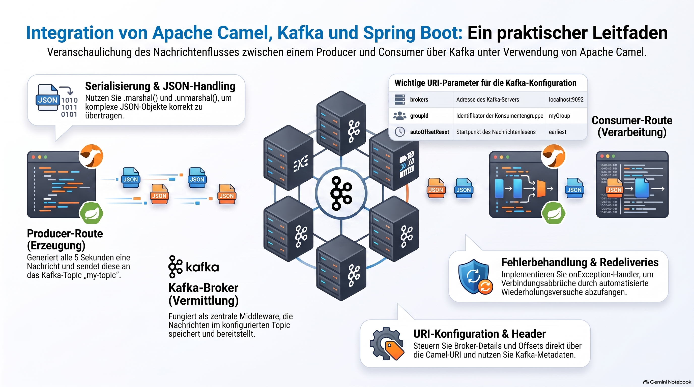

> [NOTE!]
> Dieses Dokument bietet eine strukturierte Anleitung zur Integration von **Apache Camel**, **Spring Boot** und **Kafka**. Der Fokus liegt auf der Erstellung eines **Produzenten**, der regelmäßig Daten generiert, sowie eines **Konsumenten**, der diese Nachrichten verarbeitet und protokolliert. Neben den notwendigen **Abhängigkeiten** und der **Konfiguration** werden essenzielle Programmierlogiken innerhalb der **Camel-Route** erläutert. Fortgeschrittene Konzepte wie die **Serialisierung von JSON-Daten** und Strategien zur **Fehlerbehandlung** runden die technische Übersicht ab. Zudem werden wichtige **URI-Optionen** und der Umgang mit **Metadaten** in den Nachrichten-Headern thematisiert. Die Anleitung dient somit als praktischer Leitfaden für den Aufbau einer stabilen **Messaging-Infrastruktur**.

# Apache Camel Kafka Example

To integrate **Spring Boot**, **Apache Camel**, and **Kafka**, you need three main components: dependencies, configuration, and a Camel Route.

This example demonstrates a simple flow:
1.  **Producer Route**: Generates a message every 5 seconds and sends it to a Kafka topic called `my-topic`.
2.  **Consumer Route**: Listens to `my-topic` and logs the received message.

### 1. Project Dependencies (Maven)

Add these to your `pom.xml`. (Assuming Spring Boot 4.x and Camel 4.x).

```xml
<dependencies>
    <!-- Spring Boot Starter -->
    <dependency>
        <groupId>org.springframework.boot</groupId>
        <artifactId>spring-boot-starter</artifactId>
    </dependency>

    <!-- Camel Spring Boot Starter -->
    <dependency>
        <groupId>org.apache.camel.springboot</groupId>
        <artifactId>camel-spring-boot-starter</artifactId>
        <version>4.8.0</version> <!-- Use the latest version -->
    </dependency>

    <!-- Camel Kafka Starter -->
    <dependency>
        <groupId>org.apache.camel.springboot</groupId>
        <artifactId>camel-kafka-starter</artifactId>
        <version>4.8.0</version>
    </dependency>
</dependencies>
```

---

### 2. Configuration (`application.properties`)

Configure your Kafka broker connection here. If you are running Kafka locally, the default is `localhost:9092`.

```properties
# Application Name
spring.application.name=camel-kafka-demo

# Kafka Configuration
# Camel uses these properties to auto-configure the Kafka component
camel.component.kafka.brokers=localhost:9092

# Optional: Global consumer group ID
camel.component.kafka.group-id=camel-group
```

---

### 3. The Camel Route (`KafkaRoute.java`)

This is where the logic happens. We extend `RouteBuilder`.

```java
import org.apache.camel.builder.RouteBuilder;
import org.springframework.stereotype.Component;

import java.util.Date;

@Component
public class KafkaRoute extends RouteBuilder {

    @Override
    public void configure() throws Exception {

        // 1. PRODUCER: Send a message to Kafka every 5 seconds
        from("timer:myTimer?period=5000")
            .setBody(constant("Hello from Camel at " + new Date()))
            .to("kafka:my-topic")
            .log("Sent to Kafka: ${body}");

        // 2. CONSUMER: Read messages from Kafka
        from("kafka:my-topic?groupId=camel-group")
            .log("Received from Kafka: ${body}")
            .to("mock:result"); // You can route this to a DB, File, or another API
    }
}
```

---

### 4. Main Application Class

```java
import org.springframework.boot.SpringApplication;
import org.springframework.boot.autoconfigure.SpringBootApplication;

@SpringBootApplication
public class CamelKafkaApplication {
    public static void main(String[] args) {
        SpringApplication.run(CamelKafkaApplication.class, args);
    }
}
```

---

### How to Run This

1.  **Start Kafka**: Ensure you have Zookeeper and Kafka running locally.
    ```bash
    # Example (using Docker for quick setup)
    docker run -d --name kafka -p 9092:9092 apache/kafka:latest
    ```
2.  **Run the App**: Run the Spring Boot application.
3.  **Check Logs**: You should see logs appearing every 5 seconds:
    ```text
    INFO: Sent to Kafka: Hello from Camel at Wed Oct 25...
    INFO: Received from Kafka: Hello from Camel at Wed Oct 25...
    ```

---

### Key Concepts for Production

*   **Serialization**: By default, Camel sends the message body as a String or Byte array. If you want to send JSON objects, you should use `.marshal().json()` before sending and `.unmarshal().json()` after receiving.
*   **Error Handling**: You can add `.onException(KafkaException.class).maximumRedeliveries(3)` to handle connection drops.
*   **URI Options**: The Kafka URI supports many parameters:
    *   `kafka:topicName?brokers=localhost:9092&groupId=myGroup&autoOffsetReset=earliest`
*   **Headers**: Camel automatically maps Kafka headers (like `kafka.OFFSET` or `kafka.PARTITION`) into Camel Exchange headers, which you can access via `${header.kafka.OFFSET}`.