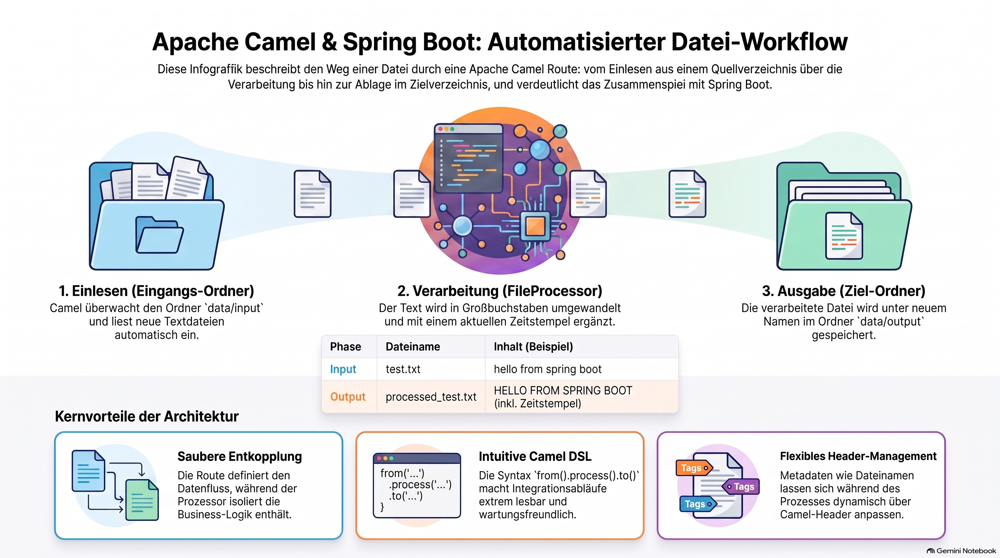

> [NOTE!]
> Dieser Text bietet eine praktische Anleitung zur Implementierung von **Apache Camel** innerhalb eines **Spring Boot-Projekts**. Er beschreibt detailliert, wie eine **automatisierte Datenroute** erstellt wird, die Textdateien aus einem Quellverzeichnis liest und diese verarbeitet. Mithilfe einer speziellen **Processor-Klasse** wird der Text in Großbuchstaben umgewandelt und mit einem aktuellen **Zeitstempel** sowie einem neuen Dateinamen versehen. Das Beispiel erläutert zudem die notwendigen **Abhängigkeiten in der pom.xml** und die Definition der Pipeline mittels der **Camel Domain Specific Language**. Abschließend zeigt der Leitfaden auf, wie die **Entkoppelung von Logik und Datenfluss** die Effizienz der Softwareentwicklung steigert. Dieser strukturierte Ansatz verdeutlicht die einfache Handhabung von **Dateitransfer-Prozessen** in modernen Java-Anwendungen.

# Building a Spring Boot File Processor with Apache Camel


This is a complete, runnable **Spring Boot** project example. 

In this scenario, we will:
1.  Read a text file from an `input` folder.
2.  Use a **Processor** to capitalize the text and add a "Processed on" timestamp.
3.  Write the result to an `output` folder.

### 1. Project Dependencies (`pom.xml`)
You need the Spring Boot starter and the specific Camel component starters (in this case, `file`).

```xml
<dependencies>
    <!-- Spring Boot Starter -->
    <dependency>
        <groupId>org.springframework.boot</groupId>
        <artifactId>spring-boot-starter</artifactId>
    </dependency>

    <!-- Apache Camel Spring Boot Starter -->
    <dependency>
        <groupId>org.apache.camel.springboot</groupId>
        <artifactId>camel-spring-boot-starter</artifactId>
        <version>4.x.x</version> <!-- Use the latest version -->
    </dependency>

    <!-- Camel File Component -->
    <dependency>
        <groupId>org.apache.camel.springboot</groupId>
        <artifactId>camel-file-starter</artifactId>
        <version>4.x.x</version>
    </dependency>
</dependencies>
```

---

### 2. The Processor (`FileProcessor.java`)
This class contains our custom logic.

```java
import org.apache.camel.Exchange;
import org.apache.camel.Processor;
import org.springframework.stereotype.Component;
import java.time.LocalDateTime;

@Component
public class FileProcessor implements Processor {

    @Override
    public void process(Exchange exchange) throws Exception {
        // 1. Get the original file content from the body
        String originalContent = exchange.getIn().getBody(String.class);

        // 2. Modify the content (Business Logic)
        String updatedContent = originalContent.toUpperCase() 
                                + "\nProcessed on: " + LocalDateTime.now();

        // 3. Set the new body back into the exchange
        exchange.getIn().setBody(updatedContent);

        // 4. Optionally, change the output filename via headers
        String oldName = exchange.getIn().getHeader(Exchange.FILE_NAME, String.class);
        exchange.getIn().setHeader(Exchange.FILE_NAME, "processed_" + oldName);
    }
}
```

---

### 3. The Route (`MyRoute.java`)
This is where we define the "pipeline."

```java
import org.apache.camel.builder.RouteBuilder;
import org.springframework.stereotype.Component;

@Component
public class MyRoute extends RouteBuilder {

    private final FileProcessor fileProcessor;

    // Inject our processor
    public MyRoute(FileProcessor fileProcessor) {
        this.fileProcessor = fileProcessor;
    }

    @Override
    public void configure() throws Exception {
        // From the 'input' directory
        from("file:data/input?noop=true") // noop=true means don't delete source file
            .routeId("fileCopyRoute")
            .log("Receiving file: ${header.CamelFileName}")
            
            // Pass the message to our custom processor
            .process(fileProcessor)
            
            .log("Finished processing ${header.CamelFileName}")
            
            // Write the result to the 'output' directory
            .to("file:data/output");
    }
}
```

---

### 4. The Application Class (`Application.java`)

```java
import org.springframework.boot.SpringApplication;
import org.springframework.boot.autoconfigure.SpringBootApplication;

@SpringBootApplication
public class CamelDemoApplication {
    public static void main(String[] args) {
        SpringApplication.run(CamelDemoApplication.class, args);
    }
}
```

---

### How to test this:

1.  **Run the application.**
2.  **Create the folders:** In your project root, create a folder named `data`, and inside it, a folder named `input`.
3.  **Create a file:** Create a file named `test.txt` inside `data/input` with some text like: 
    *   *“hello from spring boot and camel”*
4.  **Check the result:** Within seconds, Camel will detect the file. Check the `data/output` folder. You will find a file named `processed_test.txt` containing:
    *   *HELLO FROM SPRING BOOT AND CAMEL*
    *   *Processed on: 2023-10-27T...*

### Key Takeaways from this Example:
*   **Decoupling:** The `Route` defines *where* data comes from and goes. The `Processor` defines *what* happens to the data.
*   **Headers:** We used `Exchange.FILE_NAME` to rename the file dynamically inside the processor.
*   **DSL:** The `from(...).process(...).to(...)` syntax is the Camel "Domain Specific Language" (DSL), which makes the flow very easy to read.