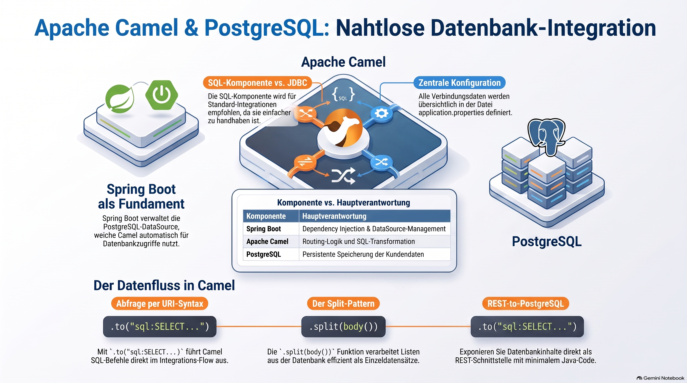

> [NOTE!]
> Dieser Text bietet eine praktische Anleitung zur Integration von **PostgreSQL-Datenbanken** in **Apache Camel** innerhalb einer **Spring Boot-Umgebung**. Der Autor erläutert, dass Camel über die **SQL-Komponente** direkt auf die von Spring Boot verwaltete **DataSource** zugreifen kann, was manuellen JDBC-Code überflüssig macht. Anhand konkreter Beispiele wird gezeigt, wie man **Abfragen ausführt**, Daten mittels der **Split-Funktion** verarbeitet und Parameter über **Message-Header** dynamisch einbindet. Die Anleitung umfasst zudem die Konfiguration der **Abhängigkeiten**, die Einrichtung der Datenbank via **Docker** sowie die Erstellung von **REST-Schnittstellen** zur Datenmanipulation. Abschließend wird betont, dass die Stärke dieser Architektur in der **Abstraktion komplexer Integrationsprozesse** liegt, wodurch sich Entwickler auf den logischen Datenfluss konzentrieren können.


# How to connect a PostgreSQL with Apache Camel?


Absolutely. A very common combination is:

**Spring Boot + Apache Camel + PostgreSQL**

The important idea is that Camel does not need to talk to PostgreSQL using JDBC code directly. Camel provides a **JDBC component** (and also a **SQL component**) that can use Spring Boot's configured `DataSource`.

Let's build a small example step by step.

***

# 1. What we are going to build

We'll create this flow:

```text
PostgreSQL
     │
     │ SQL query
     ▼
Apache Camel
     │
     │ process result
     ▼
Console / Log
```

For example, PostgreSQL contains:

```text
customers
────────────────────────
id    name
1     Alice
2     Bob
3     Charlie
```

Camel periodically executes:

```sql
SELECT id, name FROM customers
```

and receives the result.

***

# 2. Create the Spring Boot project

We'll use Maven.

The important dependencies are:

```xml
<dependencies>

    <!-- Spring Boot -->
    <dependency>
        <groupId>org.springframework.boot</groupId>
        <artifactId>spring-boot-starter</artifactId>
    </dependency>

    <!-- Apache Camel -->
    <dependency>
        <groupId>org.apache.camel.springboot</groupId>
        <artifactId>camel-spring-boot-starter</artifactId>
        <version>4.18.0</version>
    </dependency>

    <!-- Camel SQL -->
    <dependency>
        <groupId>org.apache.camel.springboot</groupId>
        <artifactId>camel-sql-starter</artifactId>
        <version>4.18.0</version>
    </dependency>

    <!-- PostgreSQL JDBC driver -->
    <dependency>
        <groupId>org.postgresql</groupId>
        <artifactId>postgresql</artifactId>
        <scope>runtime</scope>
    </dependency>

</dependencies>
```

If you're creating the project with Spring Initializr, select:

```text
Spring Boot
    └── Spring Boot Starter

Apache Camel
    └── camel-spring-boot-starter

Camel SQL
    └── camel-sql-starter

PostgreSQL Driver
```

For a real project, I'd recommend using the current Camel version compatible with your Spring Boot version rather than blindly copying the version above.

***

# 3. Start PostgreSQL

For learning, Docker is an easy way to start PostgreSQL.

```powershell
docker run --name postgres-camel `
    -e POSTGRES_USER=camel `
    -e POSTGRES_PASSWORD=camel `
    -e POSTGRES_DB=cameldb `
    -p 5432:5432 `
    -d postgres
```

Check that it is running:

```powershell
docker ps
```

You should see something similar to:

```text
postgres-camel
postgres
5432->5432
```

***

# 4. Create a table

You can connect to PostgreSQL with `psql`, for example:

```powershell
docker exec -it postgres-camel psql -U camel -d cameldb
```

Then:

```sql
CREATE TABLE customers (
    id SERIAL PRIMARY KEY,
    name VARCHAR(100) NOT NULL
);
```

Insert some data:

```sql
INSERT INTO customers (name)
VALUES
    ('Alice'),
    ('Bob'),
    ('Charlie');
```

Check:

```sql
SELECT * FROM customers;
```

Result:

```text
 id |  name
----+---------
  1 | Alice
  2 | Bob
  3 | Charlie
```

Exit:

```sql
\q
```

***

# 5. Configure the PostgreSQL connection

Now Spring Boot needs to know how to connect to PostgreSQL.

Create:

```text
src/main/resources/application.properties
```

with:

```properties
spring.datasource.url=jdbc:postgresql://localhost:5432/cameldb
spring.datasource.username=camel
spring.datasource.password=camel
spring.datasource.driver-class-name=org.postgresql.Driver
```

Spring Boot will automatically create a `DataSource`.

Conceptually:

```text
application.properties
        │
        ▼
Spring Boot
        │
        ▼
DataSource
        │
        ▼
PostgreSQL
```

This is important because **Camel can use this DataSource**.

***

# 6. Create our Camel route

Create:

```text
src/main/java/
    com/example/camel/
        CustomerRoute.java
```

Code:

```java
package com.example.camel;

import org.apache.camel.builder.RouteBuilder;
import org.springframework.stereotype.Component;

@Component
public class CustomerRoute extends RouteBuilder {

    @Override
    public void configure() {

        from("timer:database?period=5000")
            .routeId("customer-database-route")

            .log(">>> Querying PostgreSQL")

            .to("sql:SELECT id, name FROM customers")

            .log(">>> Database result: ${body}");
    }
}
```

That's already enough to perform the query.

***

# 7. What does this Camel URI mean?

This line is the interesting part:

```java
.to("sql:SELECT id, name FROM customers")
```

The structure is:

```text
sql:
 │
 └── SQL statement
```

So:

```text
sql:SELECT id, name FROM customers
```

means:

> Use Camel's SQL component to execute this SQL statement.

Camel uses the Spring Boot `DataSource` to communicate with PostgreSQL.

The architecture is therefore:

```text
                Spring Boot
                    │
                    │ creates
                    ▼
                DataSource
                    │
                    │
                    ▼
Camel ──────── SQL Component
                    │
                    │ JDBC
                    ▼
                PostgreSQL
```

***

# 8. What does `${body}` contain?

This is an important Camel concept.

When the SQL component executes:

```sql
SELECT id, name FROM customers
```

the result is normally represented as a Java collection.

Conceptually:

```java
[
    {id=1, name=Alice},
    {id=2, name=Bob},
    {id=3, name=Charlie}
]
```

Therefore:

```java
.log(">>> Database result: ${body}");
```

might produce something similar to:

```text
>>> Database result:
[
    {id=1, name=Alice},
    {id=2, name=Bob},
    {id=3, name=Charlie}
]
```

The exact formatting can vary.

***

# 9. Let's make the route a little more interesting

We could process each database record individually.

For example:

```java
@Component
public class CustomerRoute extends RouteBuilder {

    @Override
    public void configure() {

        from("timer:database?period=5000")
            .routeId("customer-database-route")

            .log(">>> Querying PostgreSQL")

            .to("sql:SELECT id, name FROM customers")

            .split(body())

            .log("Customer ID: ${body[id]}")
            .log("Customer Name: ${body[name]}");
    }
}
```

Now the flow becomes:

```text
                 PostgreSQL
                     │
                     │
              SELECT customers
                     │
                     ▼
               Camel SQL
                     │
                     ▼
          List of customer rows
                     │
                  split()
                     │
          ┌──────────┼──────────┐
          ▼          ▼          ▼
       Alice        Bob       Charlie
```

This is a very useful Camel pattern.

***

# 10. Understanding `split()`

Before `split()`:

```text
Exchange
   │
   body
   ▼
[
  {id=1, name=Alice},
  {id=2, name=Bob},
  {id=3, name=Charlie}
]
```

After:

```java
.split(body())
```

Camel creates separate processing steps:

```text
Exchange 1
    body = {id=1, name=Alice}

Exchange 2
    body = {id=2, name=Bob}

Exchange 3
    body = {id=3, name=Charlie}
```

This is one of the most important things to understand when working with Camel + databases.

***

# 11. Using SQL parameters

Suppose we want:

```sql
SELECT id, name
FROM customers
WHERE id = ?
```

Camel can use headers as SQL parameters.

For example:

```java
from("direct:findCustomer")
    .to("sql:SELECT id, name FROM customers WHERE id = :#${header.customerId}")
    .log("Result: ${body}");
```

Then another route could do:

```java
from("timer:test?repeatCount=1")
    .setHeader("customerId", constant(2))
    .to("direct:findCustomer");
```

The flow is:

```text
Timer
  │
  │ customerId = 2
  ▼
direct:findCustomer
  │
  ▼
SQL
  │
  │ SELECT ... WHERE id = 2
  ▼
PostgreSQL
```

***

# 12. INSERT example

Camel can also write to PostgreSQL.

For example:

```java
from("direct:createCustomer")

    .setHeader("name", constant("David"))

    .to("""
        sql:INSERT INTO customers (name)
            VALUES (:#${header.name})
        """)

    .log("Customer created");
```

The important syntax is:

```text
:#${header.name}
```

which tells Camel to obtain the value from the Camel message/header.

***

# 13. A REST → PostgreSQL example

This is where things start becoming particularly interesting.

Imagine we expose:

```http
GET /customers
```

The architecture becomes:

```text
HTTP Client
     │
     │ GET /customers
     ▼
Spring Boot
     │
     ▼
Apache Camel
     │
     ▼
SQL Component
     │
     ▼
PostgreSQL
     │
     ▼
List<Customer>
     │
     ▼
HTTP Response
```

The Camel route could look like:

```java
@Component
public class CustomerRoute extends RouteBuilder {

    @Override
    public void configure() {

        from("platform-http:/customers?httpMethodRestrict=GET")
            .routeId("get-customers")

            .log("GET /customers")

            .to("sql:SELECT id, name FROM customers")

            .log("Database result: ${body}");
    }
}
```

Now you have a complete integration flow:

```text
             REST API
                │
                ▼
        Apache Camel Route
                │
                ▼
         SQL Component
                │
                ▼
           PostgreSQL
```

You can test it with PowerShell:

```powershell
curl http://localhost:8080/customers
```

***

# 14. Camel + PostgreSQL architecture

It's useful to distinguish the responsibilities:

```text
┌──────────────────────────────────────────┐
│              Spring Boot                │
│                                          │
│  Configuration                           │
│  Dependency Injection                    │
│  DataSource                              │
│                                          │
│      ┌───────────────────────────┐       │
│      │       Apache Camel        │       │
│      │                           │       │
│      │  Route                    │       │
│      │    │                      │       │
│      │    ▼                      │       │
│      │  SQL Component            │       │
│      │    │                      │       │
│      └────┼──────────────────────┘       │
│           │                              │
└───────────┼──────────────────────────────┘
            │ JDBC
            ▼
      ┌──────────────┐
      │ PostgreSQL   │
      │              │
      │ customers    │
      └──────────────┘
```

The key point is:

**Spring Boot manages the database connection; Camel uses that connection through its SQL component.**

***

# 15. SQL component vs JDBC component

Camel gives you two concepts that are easy to confuse:

### SQL component

```java
.to("sql:SELECT * FROM customers")
```

This is usually the easiest choice for normal database integration.

### JDBC component

```java
.to("jdbc:dataSource")
```

The JDBC component works at a lower level and is useful for more direct JDBC-style operations.

For a beginner learning **Spring Boot + Camel + PostgreSQL**, I recommend starting with:

```text
Camel SQL component
        +
Spring Boot DataSource
        +
PostgreSQL
```

rather than starting with the JDBC component.

***

# 16. The complete minimal example

Your project could look like:

```text
camel-postgres-demo
│
├── pom.xml
│
└── src
    └── main
        ├── java
        │   └── com/example/camel
        │       ├── Application.java
        │       └── CustomerRoute.java
        │
        └── resources
            └── application.properties
```

`application.properties`:

```properties
spring.datasource.url=jdbc:postgresql://localhost:5432/cameldb
spring.datasource.username=camel
spring.datasource.password=camel
spring.datasource.driver-class-name=org.postgresql.Driver
```

`CustomerRoute.java`:

```java
package com.example.camel;

import org.apache.camel.builder.RouteBuilder;
import org.springframework.stereotype.Component;

@Component
public class CustomerRoute extends RouteBuilder {

    @Override
    public void configure() {

        from("timer:database?period=5000")
            .routeId("customer-database-route")

            .log(">>> Querying PostgreSQL")

            .to("sql:SELECT id, name FROM customers")

            .split(body())
                .log(
                    "Customer ID: ${body[id]}, " +
                    "Name: ${body[name]}"
                )
            .end();
    }
}
```

Run Spring Boot:

```powershell
mvn spring-boot:run
```

You should periodically see:

```text
>>> Querying PostgreSQL
Customer ID: 1, Name: Alice
Customer ID: 2, Name: Bob
Customer ID: 3, Name: Charlie
```

***

## One very important Camel concept

Notice what we **didn't** write.

We didn't write:

```java
Connection connection = ...
PreparedStatement statement = ...
ResultSet resultSet = ...
```

Instead, Camel gives us:

```java
.to("sql:SELECT id, name FROM customers")
```

That's one of the main benefits of Camel:

> **You describe the integration flow; Camel takes care of much of the plumbing.**

And this becomes especially powerful when you combine PostgreSQL with the kinds of integrations you've been working with:

```text
File ────────┐
             │
HTTP ────────┤
             │
JMS ─────────┼──► Apache Camel ──► PostgreSQL
             │
REST ────────┤
             │
Tibco ───────┘
```

For your learning path, a very good **next step** would be a hands-on **Spring Boot + Apache Camel + PostgreSQL mini-project** with **REST → Camel → PostgreSQL**, including `GET`, `POST`, `DELETE`, SQL parameters, transactions, error handling, and testing everything with **PowerShell/curl**.
