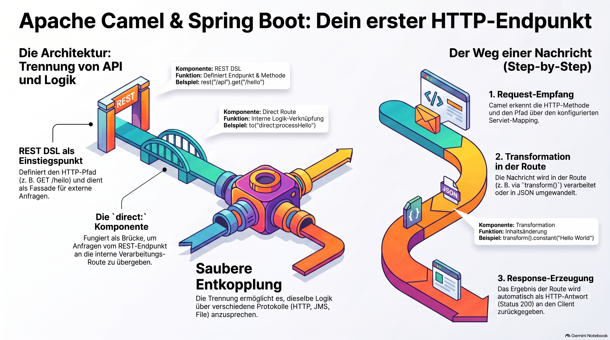

> [NOTE!]
> Dieser Text dient als **praxisorientierte Einführung** in die Kombination von **Spring Boot und Apache Camel**, um eine funktionale **HTTP-Schnittstelle** zu erstellen. Der Autor erläutert den Aufbau einer **REST-DSL**, die eingehende Anfragen entgegennimmt und über interne **Camel-Routen** verarbeitet. Durch schrittweise Anleitungen wird verdeutlicht, wie eine **Trennung zwischen Endpunkt und Prozesslogik** eine flexible Systemintegration ermöglicht. Neben der Konfiguration von Abhängigkeiten zeigt die Quelle auch, wie **JSON-Antworten** generiert und die Ergebnisse mittels **PowerShell oder curl** überprüft werden. Letztlich wird das Kernkonzept von Camel betont, bei dem **HTTP lediglich als einer von vielen möglichen Einstiegspunkten** in eine komplexere Verarbeitungspipeline fungiert.

# Building RESTful HTTP Endpoints with Spring Boot and Camel

Absolutely. Since you're learning **Spring Boot + Apache Camel**, a good beginner example is to create a Camel route that exposes an HTTP endpoint and returns a simple response.

We'll use **Spring Boot + Apache Camel REST DSL**.

## 1. What we are going to build

We want this HTTP endpoint:

```text
GET http://localhost:8080/api/hello
```

and it should return:

```text
Hello from Apache Camel!
```

The flow is:

```text
HTTP Client
     │
     │ GET /api/hello
     ▼
┌─────────────────────┐
│ Apache Camel Route  │
│                     │
│ from("direct:hello")│
│         │           │
│         ▼           │
│ setBody(...)        │
└─────────────────────┘
     │
     ▼
HTTP Response
"Hello from Apache Camel!"
```

***

# 2. Create the Spring Boot project

For Maven, your important dependencies are:

```xml
<dependencies>

    <!-- Spring Boot -->
    <dependency>
        <groupId>org.springframework.boot</groupId>
        <artifactId>spring-boot-starter</artifactId>
    </dependency>

    <!-- Apache Camel Spring Boot -->
    <dependency>
        <groupId>org.apache.camel.springboot</groupId>
        <artifactId>camel-spring-boot-starter</artifactId>
    </dependency>

    <!-- Camel REST -->
    <dependency>
        <groupId>org.apache.camel.springboot</groupId>
        <artifactId>camel-rest-starter</artifactId>
    </dependency>

    <!-- Servlet support -->
    <dependency>
        <groupId>org.apache.camel.springboot</groupId>
        <artifactId>camel-servlet-starter</artifactId>
    </dependency>

</dependencies>
```

The exact Camel version should normally be managed by the Camel Spring Boot BOM or Spring Initializr rather than hard-coded independently.

***

# 3. Spring Boot application

Create:

```text
src/main/java/alice/alice/Application.java
```

```java
package alice.alice;

import org.springframework.boot.SpringApplication;
import org.springframework.boot.autoconfigure.SpringBootApplication;

@SpringBootApplication
public class Application {

    public static void main(String[] args) {
        SpringApplication.run(Application.class, args);
    }
}
```

Nothing Camel-specific is required here.

Spring Boot discovers Camel's `RouteBuilder` automatically.

***

# 4. Create the Camel HTTP endpoint

Now create:

```text
src/main/java/alice/alice/camel/routes/HelloRoute.java
```

```java
package alice.alice.camel.routes;

import org.apache.camel.builder.RouteBuilder;
import org.springframework.stereotype.Component;

@Component
public class HelloRoute extends RouteBuilder {

    @Override
    public void configure() {

        rest("/api")
            .get("/hello")
            .to("direct:hello");

        from("direct:hello")
            .log(">>> HTTP request received <<<")
            .setBody(constant("Hello from Apache Camel!"));
    }
}
```

This is the interesting part.

***

# 5. Understanding the code

Let's look at this:

```java
rest("/api")
    .get("/hello")
    .to("direct:hello");
```

This defines the HTTP endpoint:

```text
GET /api/hello
```

So:

```text
http://localhost:8080/api/hello
```

is connected to:

```text
direct:hello
```

We then have:

```java
from("direct:hello")
```

This starts another Camel route.

So conceptually:

```text
GET /api/hello
       │
       ▼
rest("/api")
    .get("/hello")
       │
       ▼
direct:hello
       │
       ▼
from("direct:hello")
       │
       ▼
setBody(...)
```

***

# 6. Start the application

From PowerShell:

```powershell
.\mvnw.cmd spring-boot:run
```

You should eventually see Spring Boot start on port `8080`.

***

# 7. Call the HTTP endpoint

Since you prefer `curl`/PowerShell rather than Postman, use:

```powershell
curl http://localhost:8080/api/hello
```

You should get:

```text
Hello from Apache Camel!
```

You can also use PowerShell's native HTTP command:

```powershell
Invoke-RestMethod http://localhost:8080/api/hello
```

Result:

```text
Hello from Apache Camel!
```

***

# 8. What actually happens?

There are several components involved.

### Step 1 — HTTP request

Your client sends:

```http
GET /api/hello HTTP/1.1
Host: localhost:8080
```

### Step 2 — Camel receives it

Camel has the REST definition:

```java
rest("/api")
    .get("/hello")
```

Camel recognizes:

```text
/api/hello
```

### Step 3 — Camel sends the message into the route

The REST endpoint forwards the request to:

```text
direct:hello
```

### Step 4 — The route processes the message

This route receives it:

```java
from("direct:hello")
    .log(">>> HTTP request received <<<")
    .setBody(constant("Hello from Apache Camel!"));
```

The body becomes:

```text
Hello from Apache Camel!
```

### Step 5 — Camel creates the HTTP response

The response goes back to the client:

```text
Hello from Apache Camel!
```

***

# 9. A slightly more realistic example

Let's make the endpoint return JSON.

We want:

```http
GET /api/customer
```

to return:

```json
{
    "id": 42,
    "name": "Karl"
}
```

The Camel route could be:

```java
package alice.alice.camel.routes;

import org.apache.camel.builder.RouteBuilder;
import org.springframework.stereotype.Component;

@Component
public class CustomerRoute extends RouteBuilder {

    @Override
    public void configure() {

        rest("/api")
            .get("/customer")
            .produces("application/json")
            .to("direct:customer");

        from("direct:customer")
            .log(">>> Customer request received <<<")
            .setBody(constant("""
                {
                    "id": 42,
                    "name": "Karl"
                }
                """))
            .setHeader("Content-Type", constant("application/json"));
    }
}
```

Then:

```powershell
curl http://localhost:8080/api/customer
```

returns:

```json
{
    "id": 42,
    "name": "Karl"
}
```

***

# 10. HTTP endpoint → Camel route

One important concept to understand is that the HTTP endpoint and the Camel route are **not necessarily the same thing**.

You can think of:

```java
rest("/api")
    .get("/customer")
    .to("direct:customer");
```

as an **entry point**.

And:

```java
from("direct:customer")
```

as the **processing pipeline**.

For example:

```text
                  HTTP
                   │
                   ▼
        GET /api/customer
                   │
                   ▼
        ┌──────────────────┐
        │   REST endpoint  │
        └────────┬─────────┘
                 │
                 ▼
          direct:customer
                 │
                 ▼
        ┌──────────────────┐
        │   Camel Route   │
        │                  │
        │   log            │
        │   transform      │
        │   validate       │
        │   call database  │
        │   call another   │
        │   service        │
        └────────┬─────────┘
                 │
                 ▼
              Response
```

This separation becomes **very useful** when Camel routes become more complex.

***

# 11. One important configuration

For the servlet-based REST DSL, you will typically configure Camel's servlet mapping.

For example:

```properties
camel.servlet.mapping.context-path=/camel/*
```

Then your endpoint becomes:

```text
http://localhost:8080/camel/api/hello
```

So the complete setup can look like:

```text
HTTP Client
    │
    │ GET
    ▼
localhost:8080
    │
    ▼
/camel
    │
    ▼
/api/hello
    │
    ▼
Apache Camel
    │
    ▼
direct:hello
    │
    ▼
Camel processors
    │
    ▼
HTTP response
```

If you're using the current Camel/Spring Boot setup, the exact REST component configuration can vary depending on whether you use **servlet, platform HTTP, or another HTTP consumer**.

***

## 12. The most important Camel idea

For your learning, I would remember this pattern:

```java
rest("/api")
    .get("/hello")
    .to("direct:hello");

from("direct:hello")
    .log("Request received")
    .setBody(constant("Hello!"));
```

Read it almost like English:

> **Expose GET `/api/hello`, send the request to `direct:hello`, and process it in the Camel route.**

And this is the general Camel architecture:

```text
         Consumer
            │
            ▼
     ┌─────────────┐
     │    Camel    │
     │    Route    │
     └──────┬──────┘
            │
     ┌──────┼─────────┐
     ▼      ▼         ▼
   HTTP    JMS       File
   API     Queue     System
```

That's one of the reasons Camel is so useful for integration work: **HTTP is just one possible entry point into a Camel route.**

If you'd like, the next useful step is an example of **`POST /api/orders` → JSON request → Camel route → Java object → JMS message**, which would map very nicely to your JMS Bridge work.
