# Spring Boot Apache Camel Tutorial

Here is a beginner-friendly **Spring Boot + Apache Camel tutorial**.

We'll build a small application step by step and learn the most important Camel concepts along the way.

## Mastering Spring Boot and Apache Camel Integration

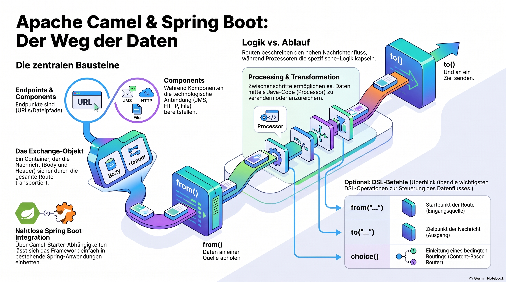

> [NOTE!]
> Dieser Text bietet eine **einsteigerfreundliche Einführung** in das Framework **Apache Camel** und dessen nahtlose Integration in **Spring Boot**. Er erläutert grundlegende Konzepte wie **Routes**, **Endpoints** und **Components**, die den Datenaustausch zwischen verschiedenen Systemen ermöglichen. Anhand praktischer Beispiele wird gezeigt, wie Nachrichten mittels **Prozessoren** transformiert, durch **Filter** gesteuert oder an externe **REST-Schnittstellen** weitergeleitet werden können. Zudem behandelt die Quelle fortgeschrittene Themen wie die **Fehlerbehandlung** und die Nutzung des **Exchange-Objekts** für Metadaten. Ein strukturierter **Lernpfad** rundet die Anleitung ab, um Entwicklern den systematischen Aufbau komplexer Integrationslösungen zu erleichtern.


## 1. What is Apache Camel?

[Apache Camel](https://camel.apache.org/?utm_source=chatgpt.com) is an integration framework. Its main purpose is to help different systems communicate with each other.

For example:

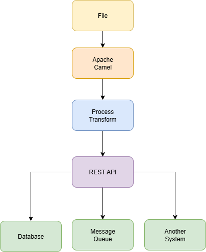

***


Camel 🐪 is especially useful when you need to:

* move data from one system to another 🚚

* transform data ⚙️

* call [REST](./Atoms/Apache_Camel_REST_API.md) services 🔧

* consume or produce messages 📥📤

* read and write files 📝

* integrate JMS brokers 📬

* implement routing logic 🔀

This should fit nicely with your Spring Boot and JMS experience.

***


# 2. The Central Idea: Routes 🔀

The most important concept in Camel is a **route**.🔀

A [route](./Atoms/Camel_Route.md) describes:

> **Where does a message come from, what should happen to it, and where should it go?**

For example:

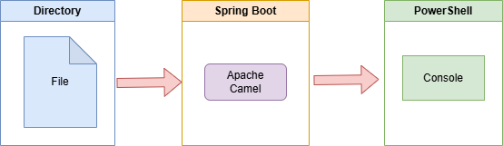

In Camel 🐪 we use the Java ☕ DSL:

```java
from("file:input")
    .log("${body}");
```

Let's break this down:

```java
from("file:input")
```

means:

> Start listening to the `input` directory.

And:

```java
.log("${body}")
```

means:

> Write the content of the message to the log.

So conceptually:

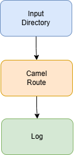

***

# 3. Important Apache Camel Terminology

Before writing code, let's understand a few terms.

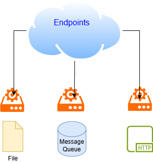

## Apache Camel Endpoints

An **endpoint** is a place where Camel 🐪 communicates with something.

Examples:
```text
file:input
```
⬆️ A file 📁📝 endpoint.

> [NOTE!]
>  Follow the white rabbit 🐇 for an example: [File-Endpoint Example](./Examples/Spring_Boot_Apache_Camel_File_Component_Example.md)

```text
jms:queue:orders
```
⬆️ A JMS queue 📥📤 endpoint.

> [NOTE!]
>  Follow the white rabbit 🐇 for an example: [JMS Example](./Examples/Spring_Boot_Apache_Camel_JMS_Example.md)

```text
http://example.com/api
```
⬆️ An HTTP 🖧 endpoint.

> [NOTE!]
>  Follow the white rabbit 🐇 for an example: [HTTP Example](./Examples/Spring_Boot_Apache_Camel_HTTP_Example.md)

You can think of an endpoint as:

> **An address where a message enters or leaves a Camel route.**

***

## Apache Camel Components

A **component** provides the ability to communicate with a specific technology.

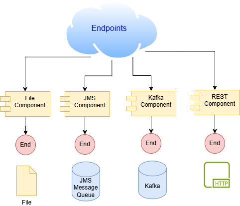

> [NOTE!]
> Follow the white rabit 🐇: [link](./Atoms/Apache_Camel_component.md)

Examples include:

* File component: [Apache Camel and Files](./Examples/Spring_Boot_Apache_Camel_File_Component_Example.md)

* HTTP component: [Apache Camel and HTTP](./Examples/Spring_Boot_Apache_Camel_HTTP_Example.md)

* JMS component: [Apache Camel and JMS](./Examples/Spring_Boot_Apache_Camel_JMS_Example.md)

* Kafka component: [Apache Camel and Kafka](./Examples/Apache_Camel_Kafka_Example.md)

For example as a **Camel endpoint URI**:

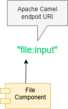

Think of it like this

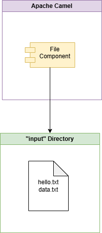

So the Camel endpoint URI:

```text
file:input
```

means:

> **Use the `file` component and point it at the `input` directory.**

***

### 1. What is the meaning of `file` in an endpoint URI?

In:

```java
from("file:input")
```

the part «file» is the **component name**.

Apache Camel has many components:

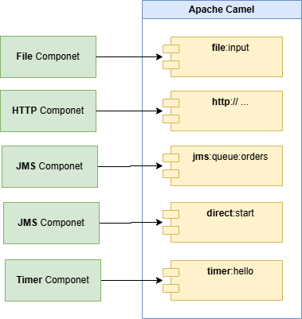

The component tells Camel **what kind of external system or mechanism it is dealing with**.

For example:

| URI                | Component | What it deals with     |
| ------------------ | --------- | ---------------------- |
| `file:input`       | `file`    | Files/directories      |
| `http://...`       | `http`    | HTTP                   |
| `jms:queue:orders` | `jms`     | JMS                    |
| `direct:start`     | `direct`  | Camel-internal routing |
| `timer:hello`      | `timer`   | Timers                 |

***

### 2. What is the meaning of `input` in an endpoint URI?

The next part:

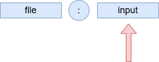

is the **component-specific configuration**.

For the File component, it represents the directory:

```text
input/
```

So when you write:

```java
from("file:input")
```

Camel essentially says:


When a file appears in the `input/` directory, 
Camel can create an **Exchange** and send it into your route.

***

### 3. Connecting this to your upcoming example

You will see something like this:
```java
@Component
public class FileRoute extends RouteBuilder {

    @Override
    public void configure() {

        from("file:input?charset=UTF-8")
            .routeId("my-file-route")
            .log(">>> FILE DETECTED <<<")
            .log("File name: ${header.CamelFileName}")
            .log("File content: ${body}");
    }
}
```

You can visualize the beginning of this route as:

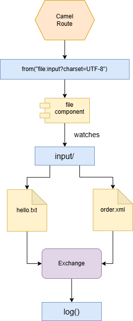


The important idea is:

> **A Camel endpoint URI has a `component` on the left and component-specific details on the right.**

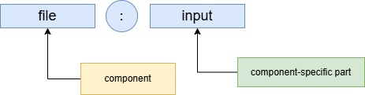

And the `?charset=UTF-8` part is an **option**:

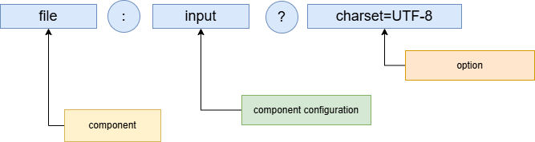


This same mental model becomes very useful when we move from `file:` to **JMS**, because you will see things such as:

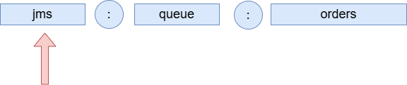

where `jms` is again the **Camel component**.

***

## Apache Camel Messages 📨

Camel 🐪 moves **messages** through [routes](./Atoms/Camel_Route.md).

A [message](./Atoms/Apache_Camel_Messages.md) 📩 usually contains:

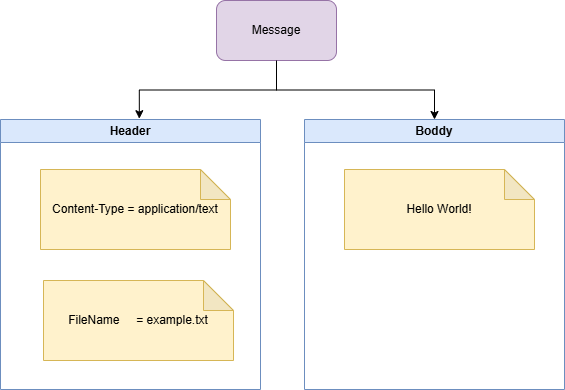

Example:

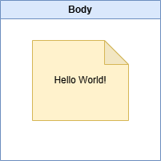

Headers might contain metadata:

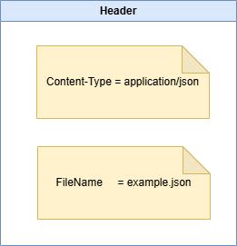

> [NOTE!]
> Feel free to follow the white rabbit 🐇:

1. [Apache Camel Route](./Atoms/Camel_Route.md)
2. [Apache Camel Exchange](./Atoms/Apache_Camel_Exchange.md)
3. [Apache Camel Message](./Atoms/Apache_Camel_Messages.md)

***

# 4. Create a Spring Boot Project 🚀


Create a Spring Boot project using the following spring boot web tool:

[Spring Initializr](https://start.spring.io/?utm_source=chatgpt.com)

Choose the following spring boot project parameters:
```text
Project: Maven 👩‍🏭
Language: Java ☕
Spring Boot: current stable version
```
Add the dependencies:
```text
Spring Web 🌐
Apache Camel 🐪
```


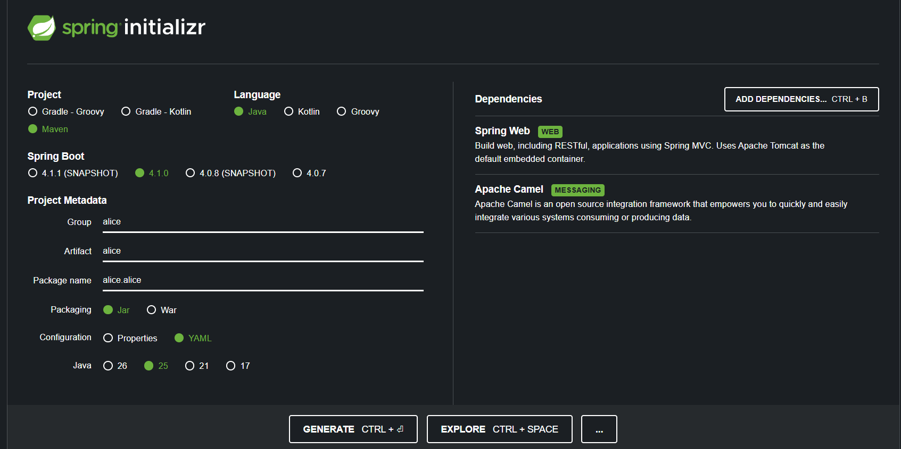


For a Maven 👷‍♀️ project, a typical Camel 🐪 dependency looks like this:

```xml
<dependency>
    <groupId>org.apache.camel.springboot</groupId>
    <artifactId>camel-spring-boot-starter</artifactId>
</dependency>
```

For a file-based example 📁, add the file 📝 component as well:

```xml
<dependency>
    <groupId>org.apache.camel.springboot</groupId>
    <artifactId>camel-file-starter</artifactId>
</dependency>
```

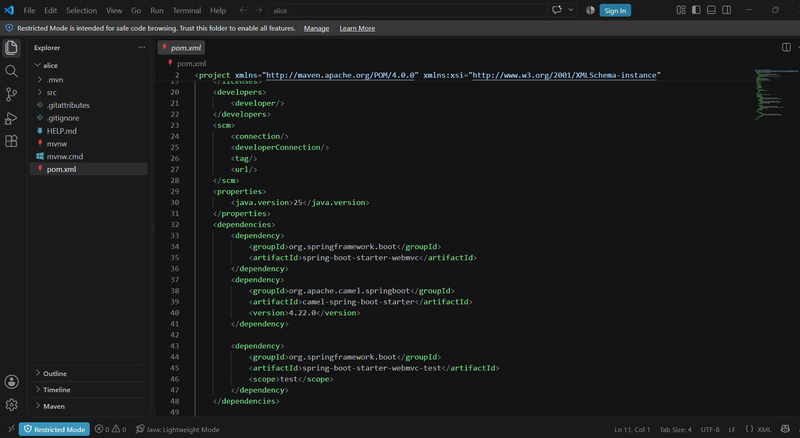

Camel version compatibility depends on the Spring Boot version, so it is best to use the dependency versions recommended by the current Camel Spring Boot documentation.

***

# 5. Your First Camel Route 🛣️


You can start Visual Studio Code from the project root folder 🗂️:

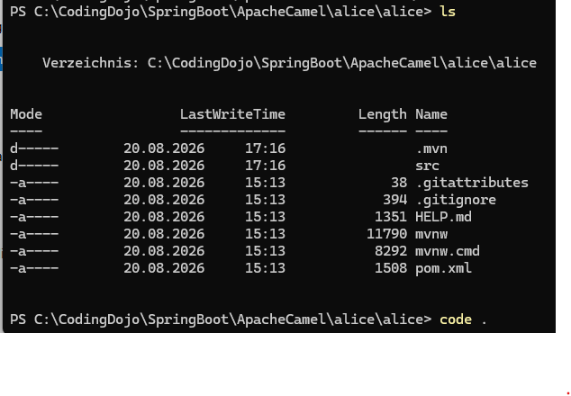
Feel free to install the extension pack for Java☕:

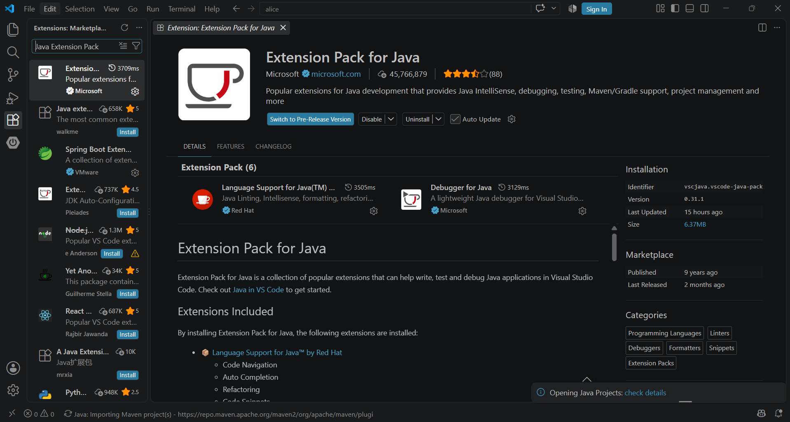

Create a Java ☕package using the extension:
```text
alice.alice.camel.routes
```
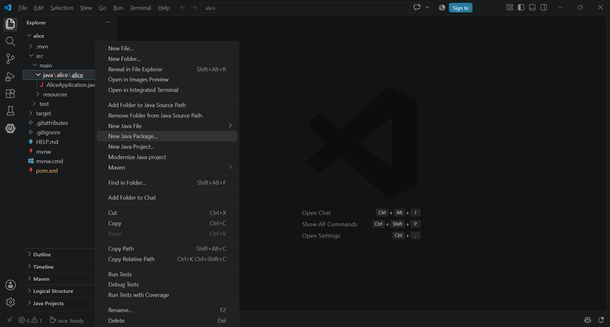

On disk, Java ☕ packages are folders 🗂️ and the folders for «alice.alice> are created during project creation.

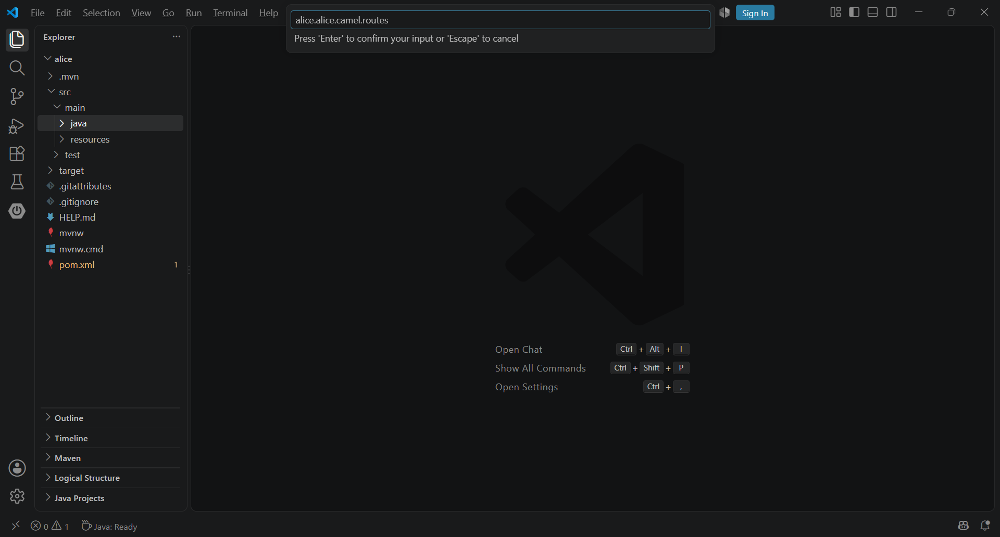

Feel free to verify the directory structure 🗂️ usig the **PowerShell** _tree_ command.

Next create the Java ☕ class file in the Java ☕ package «_alice.alice.camel.routes_» :
```text
FileRoute.java
```
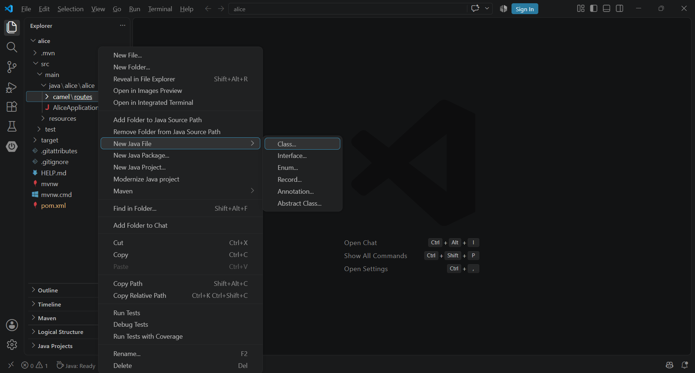

With the name **FileRoute**:

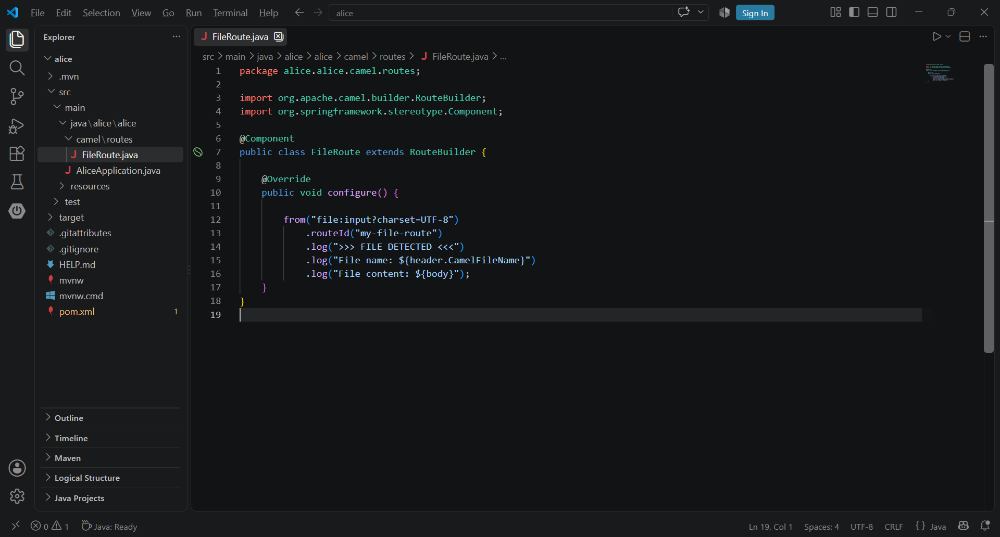

```java
package com.example.camel.routes;

import org.apache.camel.builder.RouteBuilder;
import org.springframework.stereotype.Component;

@Component
public class FileRoute extends RouteBuilder {

    @Override
    public void configure() {

        from("file:input")
            .log("Received file content: ${body}");
    }
}
```
For better debuging it might be useful to explicitly set the encoding to **utf8**:
```java
package alice.alice.camel.routes;

import org.apache.camel.builder.RouteBuilder;
import org.springframework.stereotype.Component;

@Component
public class FileRoute extends RouteBuilder {

    @Override
    public void configure() {

        from("file:input?charset=UTF-8")
            .routeId("my-file-route")
            .log(">>> FILE DETECTED <<<")
            .log("File name: ${header.CamelFileName}")
            .log("File content: ${body}");
    }
}
```
After saving, you can double check by compiling the Maven project:

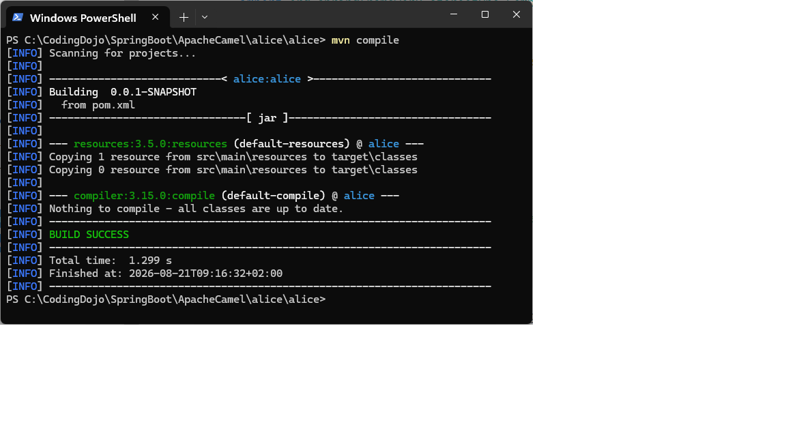
Look at the code, This is a complete [Camel route](./Atoms/Camel_Route.md).
The structure is:

```text
from(...)
    .log(...);
```

You can read it like a sentence:

> From the `input` directory, log the message body.

***

# 6. Run the Application

Create the directory **input** in the project root folder:

```powershell
mkdir input
```

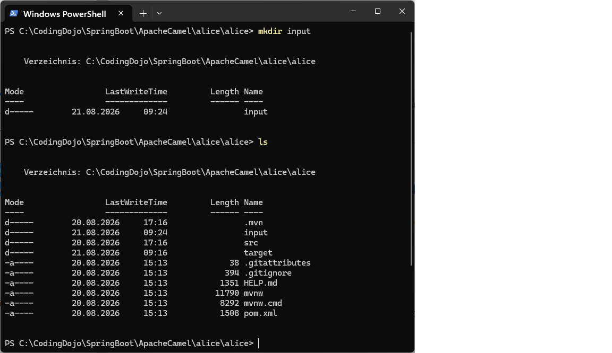

Then start Spring Boot from the project root folder. With this command:
```powershell
mvn spring-boot:run
```
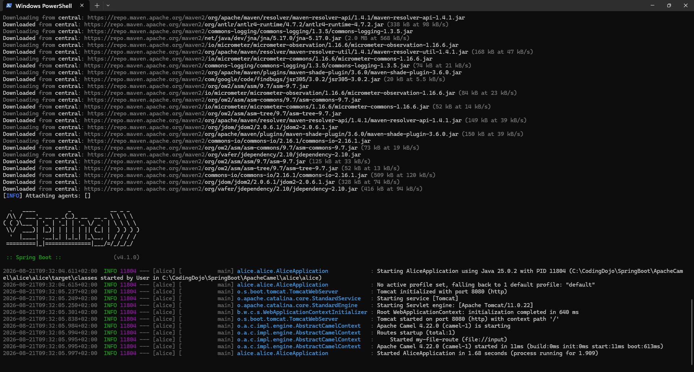

Now create a file:
```powershell
ni input/hello.txt
```
With this content:
```text
Hello Apache Camel!
```
> [NOTE]
> You can also use the Neovim editor to edit the file, type nvim if you have it.

For a quick test you can also use the PowerShell:
```PowerShell
"Hello Apache Camel!" | Out-File -Encoding utf8 .\input\hello.txt
```
So your Maven project structure should be:

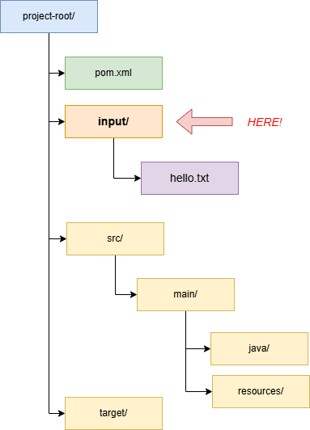

> [NOTE!]
> You can use the PowerShell **tree** command to list the directory structure

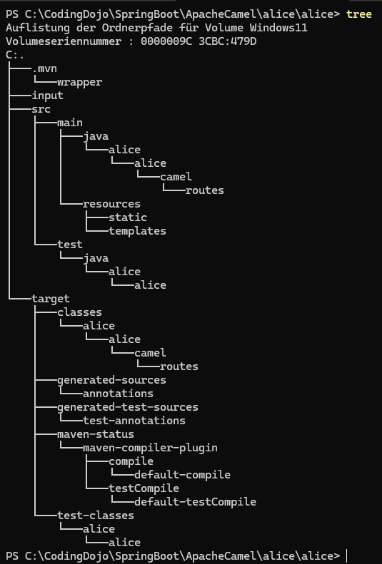

Camel 🐪 should **detect** the file and process it.

The Camel 🐪 route is:

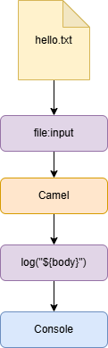

***

# 7. Understanding `from()` and `to()`

A typical Camel 🐪 route looks like this:

```java
from("SOURCE")
    .to("DESTINATION");
```

For example:

```java
from("file:input")
    .to("file:output");
```

This means:

> Read files from `input` and move or copy them to `output`.

The Camel 🐪 flow is:

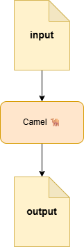

This is one of the simplest possible integration routes.

***


# 8. Add Processing 👩‍🔧

Usually, you don't just move messages. You want to process 🔄 them.

For this, we can use a **Processor** 🔧.

> [NOTE!]
> Feel free to follow the white rabbit: [Apache Camel Processor](./Atoms/Apache_Camel_Processor.md) 

```java
from("file:input")
    .process(exchange -> {

        String body =
            exchange.getMessage().getBody(String.class);

        String upperCaseBody =
            body.toUpperCase();

        exchange.getMessage()
            .setBody(upperCaseBody);

    })
    .to("file:output");
```

Suppose the file contains:

```text
Hello Camel
```

After processing:

```text
HELLO CAMEL
```

The complete Camel flow is:

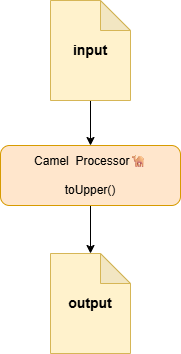

***

# 9. What is an Exchange?

This is one of the most important Camel concepts.

Camel uses a Java  object called an **Exchange** to carry information through a route.

Conceptually:

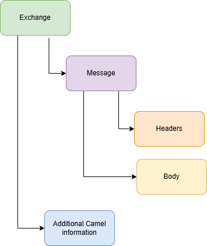


> [NOTE!]
> Feel free to follow the white rabbit: [Apache Camel Exchange](./Atoms/Apache_Camel_Exchange.md) 

Inside a processor:
```java
.process(exchange -> {

    String body =
        exchange.getMessage()
                .getBody(String.class);

})
```

In the code above, you are saying:

> Give me the message body as a `String`.

You can also modify it:

```java
exchange.getMessage()
        .setBody("Hello World");
```

Or access headers:

```java
String fileName =
    exchange.getMessage()
            .getHeader(
                "CamelFileName",
                String.class
            );
```

***

# 10. Using a Separate Processor Class

For more complex logic, don't put everything inside the route.

Create:

```text
UpperCaseProcessor.java
```

```java
package com.example.camel.processor;

import org.apache.camel.Exchange;
import org.apache.camel.Processor;
import org.springframework.stereotype.Component;

@Component
public class UpperCaseProcessor implements Processor {

    @Override
    public void process(Exchange exchange) {

        String body =
            exchange.getMessage()
                    .getBody(String.class);

        String upperCase =
            body.toUpperCase();

        exchange.getMessage()
                .setBody(upperCase);
    }
}
```

Now inject and use it:

```java
package com.example.camel.routes;

import org.apache.camel.builder.RouteBuilder;
import org.springframework.stereotype.Component;

@Component
public class FileRoute extends RouteBuilder {

    private final UpperCaseProcessor upperCaseProcessor;

    public FileRoute(
            UpperCaseProcessor upperCaseProcessor) {

        this.upperCaseProcessor =
            upperCaseProcessor;
    }

    @Override
    public void configure() {

        from("file:input")
            .process(upperCaseProcessor)
            .to("file:output");
    }
}
```

This is closer to normal Spring Boot architecture.

***

# 11. Filtering 🔍 Messages 📩

Camel 🐪 can decide whether a message 📨 should continue.

Example:

```java
from("file:input")
    .choice()
        .when(simple("${body} contains 'important'"))
            .to("file:important")
        .otherwise()
            .to("file:normal");
```

Conceptually:

```text
                 ┌──────────────┐
                 │ File arrives │
                 └──────┬───────┘
                        │
                        ▼
                 ┌──────────────┐
                 │ Is important?│
                 └──────┬───────┘
                   │         │
                 YES         NO
                   │         │
                   ▼         ▼
             important     normal
```

This pattern is based on the **Content-Based Router** enterprise integration pattern.

> [NOTE!]
> Feel free to follow the white rabbit: [Apache Camel Content-Based Route](./Atoms/Apache_Camel_Content-Based_Route.md)

> [NOTE!]
>  You might like to see a complete example:  [Camel File Sorter](./Examples/Camel_File_Sorter.md)

***

# 12. Calling a REST API

Camel can also call HTTP services.

For example:

```java
from("direct:getUser")
    .to("https://example.com/api/users/1")
    .log("${body}");
```

Here:

```text
direct:getUser
```

is an internal Camel endpoint.

You can trigger it from another route:

```java
from("file:input")
    .to("direct:getUser");
```

The flow becomes:

```text
File Route
    │
    ▼
direct:getUser
    │
    ▼
HTTP API
    │
    ▼
Response
```

***

# 13. `direct:` — Internal Communication Between Routes

Imagine you have multiple routes.

### Route 1

```java
from("file:input")
    .to("direct:processOrder");
```

### Route 2

```java
from("direct:processOrder")
    .log("Processing order")
    .to("file:output");
```

Conceptually:

```text
Route 1
────────────

file:input
     │
     ▼
direct:processOrder
          │
          │
          ▼

Route 2
────────────

direct:processOrder
          │
          ▼
     Processing
          │
          ▼
     file:output
```

This is useful for splitting large integrations into smaller logical routes.

***

# 14. Error Handling

Camel provides powerful error handling.

For example:

```java
@Override
public void configure() {

    errorHandler(
        defaultErrorHandler()
            .maximumRedeliveries(3)
    );

    from("file:input")
        .process(exchange -> {

            throw new RuntimeException(
                "Something went wrong!"
            );

        })
        .to("file:output");
}
```

The basic idea is:

```text
Message
   │
   ▼
Processing
   │
   ├── Success ──► Continue
   │
   └── Error
         │
         ▼
      Retry
       │
       ├── Retry 1
       ├── Retry 2
       └── Retry 3
```

You can also handle specific exceptions:

```java
onException(IllegalArgumentException.class)
    .handled(true)
    .log("Invalid input: ${exception.message}");
```

Then your route:

```java
from("file:input")
    .process(exchange -> {

        throw new IllegalArgumentException(
            "Invalid file!"
        );

    });
```

Camel will apply the exception rule.

***

# 15. A More Realistic Example: Order Processing

Let's build a conceptual route.

Imagine you receive order files:

```text
input/
    order-001.json
```

The route:

```text
File
 │
 ▼
Read Order
 │
 ▼
Validate
 │
 ▼
Transform
 │
 ▼
Send to JMS
 │
 ▼
Done
```

Camel code:

```java
from("file:input")
    .routeId("order-processing")
    .log("Received order: ${header.CamelFileName}")

    .process("orderValidator")

    .to("direct:transformOrder")

    .to("jms:queue:orders")
    
    .log("Order sent successfully");
```

Then:

```java
from("direct:transformOrder")
    .routeId("order-transformation")
    .process("orderTransformer");
```

This demonstrates an important idea:

> **Camel routes describe the flow, while processors and services contain business logic.**

A good architecture often looks like:

```text
                    ┌──────────────┐
                    │ Spring Boot  │
                    └──────┬───────┘
                           │
                           ▼
                    ┌──────────────┐
                    │ Camel Route  │
                    │              │
                    │ from → to →  │
                    │ choice → etc │
                    └──────┬───────┘
                           │
              ┌────────────┼────────────┐
              ▼            ▼            ▼
         Processor      Service        JMS
              │            │            │
              └────────────┼────────────┘
                           ▼
                        Systems
```

***

# 16. Important Camel DSL Operations

Here are some of the most useful operations.

| DSL             | Meaning                                  |
| --------------- | ---------------------------------------- |
| `from()`        | Start a route                            |
| `to()`          | Send a message somewhere                 |
| `process()`     | Execute custom Java code                 |
| `log()`         | Write information to the log             |
| `choice()`      | Create conditional routing               |
| `when()`        | Define a condition                       |
| `otherwise()`   | Default condition                        |
| `filter()`      | Only continue if a condition matches     |
| `split()`       | Split one message into multiple messages |
| `aggregate()`   | Combine multiple messages                |
| `multicast()`   | Send a message to multiple destinations  |
| `wireTap()`     | Send a copy elsewhere                    |
| `onException()` | Handle exceptions                        |
| `doTry()`       | Start try/catch-style processing         |
| `doCatch()`     | Handle an exception                      |

***

# 17. A Simple Mental Model

When reading Camel code, think:

```java
from(...)
```

⬇️ **Where does the message come from?**

```java
.process(...)
```

⬇️ **What happens to it?**

```java
.choice()
```

⬇️ **Do we need to make a decision?**

```java
.to(...)
```

⬇️ **Where should it go next?**

So this:

```java
from("jms:queue:orders")

    .process(orderProcessor)

    .choice()

        .when(simple("${body.amount} > 1000"))
            .to("jms:queue:large-orders")

        .otherwise()
            .to("jms:queue:normal-orders");
```

can be read almost like English:

> From the orders queue, process the order. If the amount is greater than 1000, send it to the large-orders queue; otherwise, send it to the normal-orders queue.

***

# Suggested Learning Path

I recommend learning Camel in this order:

### Part 1 — Fundamentals

1. What is Apache Camel?

2. Components

3. Endpoints

4. Messages

5. Exchanges

6. Routes

7. `from()` and `to()`

### Part 2 — Processing

8. Processors

9. Message body

10. Headers

11. Beans and Spring services

12. Type conversion

### Part 3 — Routing

13. `choice()`

14. `filter()`

15. `multicast()`

16. `split()`

17. `direct:` endpoints

### Part 4 — Error Handling

18. `onException()`

19. Redelivery

20. Dead letter channels

21. Retry strategies

### Part 5 — Spring Boot Integration

22. Camel + REST

23. Camel + JMS

24. Camel + ActiveMQ

25. Configuration with `application.yml`

26. Testing Camel routes

### Part 6 — Real-World Project

A particularly useful project for you would be:

```text
REST API
   │
   ▼
Apache Camel
   │
   ├── Validation
   │
   ├── Transformation
   │
   ├── Routing
   │
   ▼
ActiveMQ / JMS
   │
   ▼
Another System
```

This would also connect very naturally to the JMS bridge work you've done with Spring Boot.

If you like, we can continue with **Lesson 2: Apache Camel Architecture**, where I explain in detail:

**CamelContext → Routes → Endpoints → Components → Exchanges → Messages**

with a complete diagram and a small Spring Boot example.
