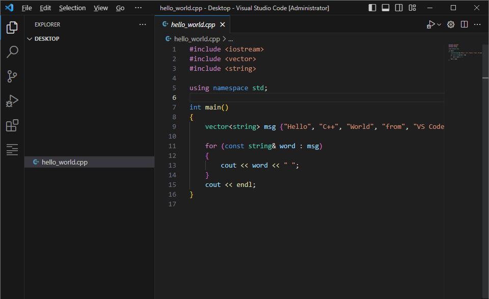
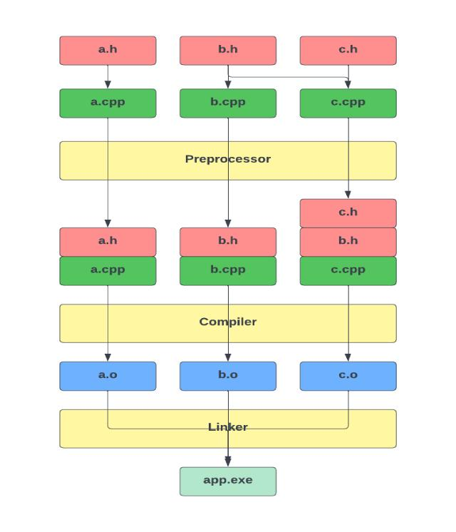

# C++ + CMake Absolute Beginner Bootcamp

From zero to your first practical C++ application.

This bootcamp is designed for your Windows 11 environment with **Visual Studio Code, PowerShell, g++, and CMake**. We will not use Node.js, Deno, or a package manager.

You will learn C++ fundamentals while building a small application with CMake.






## 1. What you will build

Our final project will be a **C++ Task Manager** running in PowerShell.

It will allow you to:

```text
C++ Task Manager
================

1. Add task
2. List tasks
3. Mark task as completed
4. Delete task
5. Save tasks
6. Exit
```

Example:

```text
$ .\build\Debug\task-manager.exe

C++ Task Manager
================

1. Add task
2. List tasks
3. Mark task as completed
4. Delete task
5. Save tasks
6. Exit

Choose an option: 1

Enter task: Learn CMake

Task added successfully.
```

Along the way, you will learn the same basic concepts you need for larger C++ applications.

***

# 2. Bootcamp overview

Recommended duration: **8 weeks**, approximately 4–6 hours per week.

You can also work through it faster. Each week contains practical exercises, not just theory.

| Week | Topic                       | Practical result           |
| ---- | --------------------------- | -------------------------- |
| 1    | C++ fundamentals            | First C++ programs         |
| 2    | Control flow and functions  | Console calculator         |
| 3    | Classes and objects         | Task model                 |
| 4    | C++ Standard Library        | Task collection            |
| 5    | CMake fundamentals          | Multi-file application     |
| 6    | Libraries and testing       | Calculator library + tests |
| 7    | File persistence and errors | Save and load tasks        |
| 8    | Final project               | Complete Task Manager      |

The bootcamp uses a gradual approach: first understand C++, then use CMake to organize the growing application.

***

# Week 0 — Prepare your environment

## Goal

Make sure you can compile and run C++ programs from PowerShell.

### Check the tools

```powershell
g++ --version
cmake --version
code --version
```

You should have:

* A working C++ compiler.

* CMake.

* Visual Studio Code.

If you already completed the first tutorial, you can skip directly to Week 1.

### Create your workspace

```powershell
mkdir C:\CodingDojo\CppBootcamp
cd C:\CodingDojo\CppBootcamp
```

Create your first project:

```powershell
mkdir 01-hello
cd 01-hello
code .
```

Create `main.cpp`:

```cpp
#include <iostream>

int main()
{
    std::cout << "Hello, C++ Bootcamp!" << std::endl;

    return 0;
}
```

Compile:

```powershell
g++ main.cpp -o hello.exe
```

Run:

```powershell
.\hello.exe
```

Expected output:

```text
Hello, C++ Bootcamp!
```

### Exercise

Change the output to:

```text
Hello Karl!
I am learning C++ and CMake.
```

***

# Week 1 — C++ fundamentals

## Goal

Understand variables, data types, operators, and console output.

### 1. Variables

```cpp
#include <iostream>
#include <string>

int main()
{
    std::string name = "Karl";
    int age = 42;
    double temperature = 21.5;
    bool learning = true;

    std::cout << "Name: " << name << std::endl;
    std::cout << "Age: " << age << std::endl;
    std::cout << "Temperature: " << temperature << std::endl;
    std::cout << "Learning: " << learning << std::endl;

    return 0;
}
```

### 2. User input

```cpp
#include <iostream>
#include <string>

int main()
{
    std::string name;

    std::cout << "Enter your name: ";
    std::cin >> name;

    std::cout << "Hello " << name << "!" << std::endl;

    return 0;
}
```

Compile and run:

```powershell
g++ main.cpp -o input.exe
.\input.exe
```

### 3. Build a temperature converter

Create a program that converts Celsius to Fahrenheit.

Formula:

```text
Fahrenheit = Celsius * 9 / 5 + 32
```

Example:

```text
Enter Celsius: 20
Fahrenheit: 68
```

### Exercises

1. Create a program that adds two numbers.

2. Create a program that calculates the area of a rectangle.

3. Create a program that converts Celsius to Fahrenheit.

4. Create a program that calculates your age in months.

**Milestone:** You can create, compile, and run simple C++ programs without CMake.

***

# Week 2 — Control flow and functions

## Goal

Learn how programs make decisions and execute reusable logic.

## 1. `if` and `else`

```cpp
#include <iostream>

int main()
{
    int age;

    std::cout << "Enter your age: ";
    std::cin >> age;

    if (age >= 18)
    {
        std::cout << "Adult" << std::endl;
    }
    else
    {
        std::cout << "Minor" << std::endl;
    }

    return 0;
}
```

## 2. `for` loops

```cpp
#include <iostream>

int main()
{
    for (int i = 1; i <= 5; i++)
    {
        std::cout << "Number: " << i << std::endl;
    }

    return 0;
}
```

## 3. Functions

```cpp
#include <iostream>

int add(int a, int b)
{
    return a + b;
}

int main()
{
    int result = add(10, 5);

    std::cout << result << std::endl;

    return 0;
}
```

## 4. Build a calculator

Your calculator should support:

```text
1. Add
2. Subtract
3. Multiply
4. Divide
5. Exit
```

Example:

```text
Choose operation: 1
Enter first number: 10
Enter second number: 5

Result: 15
```

### Suggested function design

```cpp
double add(double a, double b);
double subtract(double a, double b);
double multiply(double a, double b);
double divide(double a, double b);
```

### Exercises

1. Print numbers from 1 to 100.

2. Print only even numbers.

3. Calculate the factorial of a number.

4. Build a calculator with a menu.

5. Prevent division by zero.

**Milestone:** You can divide a program into functions and implement a small console application.

***

# Week 3 — Classes and objects

## Goal

Understand the foundation of object-oriented C++.

Coming from Java, you will recognize many concepts, but C++ has its own object lifetime and memory rules.

## 1. Your first class

```cpp
#include <iostream>
#include <string>

class Task
{
public:
    std::string title;
    bool completed = false;

    void print()
    {
        std::cout << title << std::endl;
    }
};

int main()
{
    Task task;

    task.title = "Learn C++";
    task.print();

    return 0;
}
```

## 2. Constructor

```cpp
#include <iostream>
#include <string>

class Task
{
public:
    std::string title;
    bool completed;

    Task(std::string taskTitle)
    {
        title = taskTitle;
        completed = false;
    }

    void print()
    {
        std::cout << title << std::endl;
    }
};

int main()
{
    Task task("Learn CMake");

    task.print();

    return 0;
}
```

## 3. Encapsulation

Instead of exposing all fields, we can use `private` and `public`.

```cpp
#include <iostream>
#include <string>

class Task
{
private:
    std::string title;
    bool completed;

public:
    Task(std::string taskTitle)
        : title(taskTitle), completed(false)
    {
    }

    std::string getTitle()
    {
        return title;
    }

    bool isCompleted()
    {
        return completed;
    }

    void complete()
    {
        completed = true;
    }
};
```

## 4. Exercise: Task class

Implement a `Task` class with:

```text
title
completed
constructor
getTitle()
isCompleted()
complete()
```

Then create three tasks:

```cpp
Task task1("Learn C++");
Task task2("Learn CMake");
Task task3("Build an application");
```

Print them.

**Milestone:** You understand how to represent a task as a C++ object.

***

# Week 4 — The C++ Standard Library

## Goal

Learn how to store and manipulate collections of data.

## 1. `std::vector`

A vector is a dynamic collection.

```cpp
#include <iostream>
#include <vector>

int main()
{
    std::vector<int> numbers;

    numbers.push_back(10);
    numbers.push_back(20);
    numbers.push_back(30);

    for (int number : numbers)
    {
        std::cout << number << std::endl;
    }

    return 0;
}
```

## 2. Vector of tasks

```cpp
#include <iostream>
#include <string>
#include <vector>

class Task
{
public:
    std::string title;

    Task(std::string taskTitle)
        : title(taskTitle)
    {
    }
};

int main()
{
    std::vector<Task> tasks;

    tasks.push_back(Task("Learn C++"));
    tasks.push_back(Task("Learn CMake"));

    for (const Task& task : tasks)
    {
        std::cout << task.title << std::endl;
    }

    return 0;
}
```

## 3. Useful Standard Library types

| Type              | Purpose                       |
| ----------------- | ----------------------------- |
| `std::string`     | Text                          |
| `std::vector`     | Dynamic collection            |
| `std::array`      | Fixed-size collection         |
| `std::map`        | Key-value collection          |
| `std::optional`   | Value that may be absent      |
| `std::filesystem` | File and directory operations |

## 4. Exercise: Task collection

Create:

```cpp
class TaskManager
{
public:
    void addTask(std::string title);
    void listTasks();
    void completeTask(int index);
};
```

Use:

```cpp
std::vector<Task> tasks;
```

Implement the methods.

**Milestone:** You can store multiple tasks and manipulate them.

***

# Week 5 — CMake fundamentals

## Goal

Move from manually compiling individual files to managing a real project.

Now CMake becomes the central tool.

## 1. Project structure

Create:

```text
05-cmake-basics
│
├── CMakeLists.txt
│
├── src
│   ├── main.cpp
│   ├── task.cpp
│   └── task.h
│
└── build
```

Create the project:

```powershell
cd C:\CodingDojo\CppBootcamp
mkdir 05-cmake-basics
cd 05-cmake-basics
mkdir src
code .
```

## 2. `CMakeLists.txt`

```cmake
cmake_minimum_required(VERSION 3.20)

project(TaskManager)

add_executable(task-manager
    src/main.cpp
    src/task.cpp
)

target_compile_features(task-manager PRIVATE cxx_std_17)
```

## 3. Configure

```powershell
cmake -S . -B build
```

## 4. Build

```powershell
cmake --build build
```

## 5. Run

Find the executable:

```powershell
Get-ChildItem -Path build -Recurse -Filter "*.exe"
```

Run the path returned by PowerShell, for example:

```powershell
.\build\Debug\task-manager.exe
```

### Important

The exact executable path depends on the generator. If your build uses a single-configuration generator, the executable may be directly under `build`.

## 6. CMake concepts

You should understand these commands:

```cmake
cmake_minimum_required(...)
project(...)
add_executable(...)
target_compile_features(...)
```

Then learn:

```cmake
add_library(...)
target_sources(...)
target_include_directories(...)
target_link_libraries(...)
```

### Exercises

1. Create a CMake project with one source file.

2. Add a second source file.

3. Add a header file.

4. Change the C++ standard to C++20.

5. Create a Debug build.

6. Create a Release build.

7. Delete the build directory and rebuild.

**Milestone:** You can create a multi-file C++ project using CMake.

***

# Week 6 — Libraries and testing

## Goal

Learn how to organize reusable C++ code.

## 1. Why libraries?

Imagine your Task Manager contains:

```text
Task
TaskManager
FileStorage
```

It is useful to separate these components.

The application can depend on a library:

```text
Application
    │
    ▼
TaskManager library
    │
    ▼
Task
```

## 2. CMake library

Example:

```cmake
add_library(task-core
    src/task.cpp
    src/task_manager.cpp
)

add_executable(task-manager
    src/main.cpp
)

target_link_libraries(task-manager PRIVATE task-core)
```

Now you have:

```text
task-core
    │
    ▼
task-manager
```

## 3. Testing

A good starting point is a simple test program.

Example:

```cpp
#include <iostream>

int add(int a, int b)
{
    return a + b;
}

int main()
{
    if (add(2, 3) == 5)
    {
        std::cout << "Test passed" << std::endl;
    }
    else
    {
        std::cout << "Test failed" << std::endl;
    }

    return 0;
}
```

Later, use a testing framework such as GoogleTest.

## 4. CMake testing

CMake provides integration with testing tools through CTest.

Basic example:

```cmake
enable_testing()

add_executable(task-tests
    tests/task_tests.cpp
)

add_test(NAME TaskTests COMMAND task-tests)
```

Run tests:

```powershell
ctest --test-dir build --output-on-failure
```

**Milestone:** You can create a library and run a basic automated test.

***

# Week 7 — File persistence and error handling

## Goal

Make your Task Manager save tasks to disk.

## 1. Write a file

```cpp
#include <fstream>

int main()
{
    std::ofstream file("tasks.txt");

    file << "Learn C++" << std::endl;
    file << "Learn CMake" << std::endl;

    return 0;
}
```

## 2. Read a file

```cpp
#include <fstream>
#include <iostream>
#include <string>

int main()
{
    std::ifstream file("tasks.txt");

    std::string line;

    while (std::getline(file, line))
    {
        std::cout << line << std::endl;
    }

    return 0;
}
```

## 3. Create a storage class

```cpp
class FileStorage
{
public:
    void saveTasks(const std::vector<Task>& tasks);
    std::vector<Task> loadTasks();
};
```

Your application should support:

```text
Add task
List tasks
Save tasks
Load tasks
```

### Exercises

1. Save tasks to `tasks.txt`.

2. Load tasks from `tasks.txt`.

3. Handle a missing file.

4. Prevent an empty task title.

5. Print a helpful error message if saving fails.

**Milestone:** Your application can persist data between runs.

***

# Week 8 — Final project

## Goal

Complete the Task Manager.

## Final structure

```text
task-manager
│
├── CMakeLists.txt
│
├── src
│   ├── main.cpp
│   ├── task.cpp
│   ├── task.h
│   ├── task_manager.cpp
│   ├── task_manager.h
│   ├── file_storage.cpp
│   └── file_storage.h
│
├── tests
│   └── task_tests.cpp
│
└── build
```

## Required features

### Add task

```text
Enter task: Learn CMake

Task added successfully.
```

### List tasks

```text
1. [ ] Learn C++
2. [ ] Learn CMake
3. [x] Build an application
```

### Complete task

```text
Choose task number: 2

Task completed.
```

### Delete task

```text
Choose task number: 1

Task deleted.
```

### Save tasks

```text
Tasks saved successfully.
```

### Load tasks

```text
Tasks loaded successfully.
```

## Final CMake file

A possible final structure:

```cmake
cmake_minimum_required(VERSION 3.20)

project(TaskManager)

add_library(task-core
    src/task.cpp
    src/task_manager.cpp
    src/file_storage.cpp
)

target_include_directories(task-core PUBLIC
    ${CMAKE_CURRENT_SOURCE_DIR}/src
)

target_compile_features(task-core PUBLIC cxx_std_17)

add_executable(task-manager
    src/main.cpp
)

target_link_libraries(task-manager PRIVATE task-core)

enable_testing()

add_executable(task-tests
    tests/task_tests.cpp
)

target_link_libraries(task-tests PRIVATE task-core)

add_test(NAME TaskTests COMMAND task-tests)
```

This demonstrates:

* A reusable library.

* An executable.

* Header include directories.

* Linking.

* C++17.

* Tests.

***

# 3. Your daily learning routine

Since you're building a Zettelkasten, I recommend a short learning cycle.

## Step 1 — Learn

Read one small topic.

Example:

```text
What is a C++ variable?
```

## Step 2 — Type

Type the example yourself in VS Code.

Avoid simply copying and pasting.

## Step 3 — Change

Modify the program.

Example:

```cpp
int age = 42;
```

Change it to:

```cpp
int age = 50;
```

## Step 4 — Break

Intentionally create an error.

Example:

```cpp
std::cout << unknownVariable;
```

Read the compiler error.

## Step 5 — Explain

Write a small Zettelkasten note.

Example:

```markdown
# C++ Variables

A variable stores a value in memory.

Example:

int age = 42;

The type is int.
The name is age.
The initial value is 42.
```

***

# 4. Zettelkasten note ideas

For your C++ learning notes, you could use these headlines:

```text
C++: What is a compiler?

C++: What is the main function?

C++: What is a variable?

C++: What is a function?

C++: What is a class?

C++: What is a constructor?

C++: What is a vector?

CMake: What is CMake?

CMake: What is CMakeLists.txt?

CMake: What is a target?

CMake: What is add_executable()?

CMake: What is add_library()?

CMake: What is target_link_libraries()?
```

A particularly useful note would be:

**CMake: How does a CMake target become an executable?**

This connects the source code, CMake, compiler, linker, and executable into one concept.

***

# 5. Bootcamp completion checklist

By the end, you should be able to answer:

### C++

* What is a C++ source file?

* What does `main()` do?

* What is a variable?

* What is a function?

* What is a class?

* What is a constructor?

* What is a vector?

* What is a reference?

* What is a pointer?

* What is a library?

### CMake

* What is `CMakeLists.txt`?

* What does `project()` do?

* What does `add_executable()` do?

* What does `add_library()` do?

* What is a CMake target?

* What is the difference between configure and build?

* What is the build directory?

* What is the difference between Debug and Release?

* What does `target_link_libraries()` do?

* What is CTest?

***

## Your first assignment

Start with **Week 1, Exercise 1**:

Create a C++ program that asks for two numbers and prints their sum.

Use only:

```text
Visual Studio Code
PowerShell
g++
```

Do not use CMake yet.

Once you can compile and run that program, move to the next exercise. This will give you a solid foundation before the CMake part of the bootcamp becomes more advanced.
