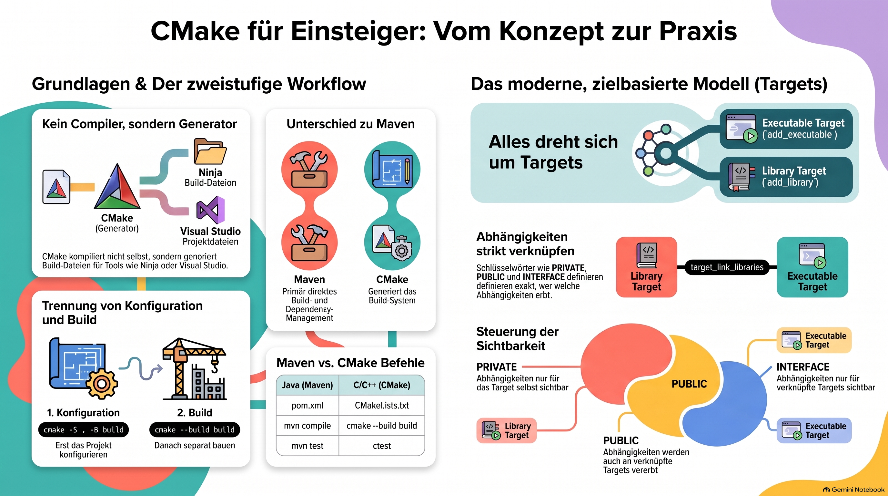

> [NOTE!]
> Dieser Text bietet eine fundierte Einführung in **CMake**, ein System zur **Generierung von Build-Dateien** für Programmiersprachen wie C++. Er richtet sich primär an Java-Entwickler, indem er **Vergleiche zu Maven** zieht und grundlegende Konzepte wie die Datei **CMakeLists.txt** sowie den **Target-basierten Ansatz** erläutert. Der Prozess wird in die Phasen der **Konfiguration** und des eigentlichen **Build-Vorgangs** unterteilt, wobei die Trennung von Quellcode und Build-Verzeichnis betont wird. Zudem werden fortgeschrittene Themen wie die **Verwaltung von Abhängigkeiten**, die Nutzung verschiedener **Generatoren** wie Ninja sowie automatisierte **Tests mit CTest** behandelt. Abschließend liefert die Quelle einen strukturierten **Lernpfad**, um den Übergang von einfachen ausführbaren Dateien zu komplexen professionellen Projekten zu erleichtern.


Absolutely. Since you are a **Java/Spring Boot developer**, I’ll explain CMake from the ground up and relate it to concepts you may already know from **Maven/Gradle**.

# CMake Tutorial — From Beginner to Practical

## 1. What is CMake?

**CMake is a build-system generator.**

It is primarily used for projects written in languages such as:

* C

* C++

* Fortran

The important distinction is:

> **CMake is not the compiler.**

For example:

```text
Your C/C++ source code
        │
        ▼
     CMake
        │
        ▼
Build files
        │
        ▼
Compiler
        │
        ▼
Executable / Library
```

CMake can generate build files for different build systems:

```text
CMakeLists.txt
      │
      ├── Ninja files
      ├── Visual Studio solution
      ├── Unix Makefiles
      └── other generators
```

***

# 2. CMake vs Maven

As a Java developer, this comparison is useful.

| Java             | C/C++                 |
| ---------------- | --------------------- |
| Maven            | CMake                 |
| `pom.xml`        | `CMakeLists.txt`      |
| `mvn compile`    | `cmake --build ...`   |
| `mvn test`       | `ctest`               |
| Java compiler    | GCC / Clang / MSVC    |
| `.jar`           | executable / library  |
| Maven dependency | CMake dependency      |
| Maven plugin     | CMake module/function |

There is an important difference, though:

**Maven is primarily a build/dependency-management tool.**

CMake's primary job is to **describe the build and generate a build system**.

***

# 3. Your First CMake Project

Let's create a very small C++ application.

Project:

```text
hello-cmake/
├── CMakeLists.txt
└── main.cpp
```

`main.cpp`:

```cpp
#include <iostream>

int main() {
    std::cout << "Hello, CMake!" << std::endl;
    return 0;
}
```

Now create `CMakeLists.txt`:

```cmake
cmake_minimum_required(VERSION 3.20)

project(HelloCMake)

add_executable(hello main.cpp)
```

That's enough to build a program.

***

# 4. Understanding CMakeLists.txt

Let's examine it line by line.

### `cmake_minimum_required`

```cmake
cmake_minimum_required(VERSION 3.20)
```

This tells CMake:

> This project requires at least CMake 3.20.

Similar idea to:

```xml
<maven.compiler.release>21</maven.compiler.release>
```

although technically they serve different purposes.

***

## 5. `project()`

```cmake
project(HelloCMake)
```

This defines the project.

You can also specify the language:

```cmake
project(HelloCMake LANGUAGES CXX)
```

`CXX` means C++.

For C:

```cmake
project(HelloCMake LANGUAGES C)
```

For both:

```cmake
project(HelloCMake LANGUAGES C CXX)
```

***

# 6. `add_executable()`

This is one of the most important CMake commands.

```cmake
add_executable(hello main.cpp)
```

It says:

> Create an executable called `hello` using `main.cpp`.

Conceptually:

```text
main.cpp
   │
   ▼
 C++ compiler
   │
   ▼
 hello.exe
```

On Windows, you'll typically get:

```text
hello.exe
```

***

# 7. Building the Project

Now we get to an important CMake concept.

**Do not normally build directly inside your source directory.**

Instead:

```text
hello-cmake/
├── CMakeLists.txt
├── main.cpp
└── build/
```

This is called an **out-of-source build**.

***

## 8. Configure the Project

From PowerShell:

```powershell
cmake -S . -B build
```

Meaning:

```text
-S .
```

means:

> Source directory is the current directory.

And:

```text
-B build
```

means:

> Put generated build files into `build`.

So:

```powershell
cmake -S . -B build
```

roughly means:

```text
CMake:

Read this:
    .

Generate build files here:
    build/
```

***

# 9. Build

After configuration:

```powershell
cmake --build build
```

Now CMake invokes the appropriate underlying build system.

For example:

```text
CMake
  │
  ▼
Ninja / MSBuild / Make
  │
  ▼
C++ compiler
  │
  ▼
hello.exe
```

This separation is extremely important.

***

# 10. Run the Program

Depending on the generator/configuration, the executable may be located somewhere such as:

```text
build\Debug\hello.exe
```

or:

```text
build\hello.exe
```

You can search for it:

```powershell
Get-ChildItem build -Recurse -Filter hello.exe
```

Then run it:

```powershell
.\build\Debug\hello.exe
```

You should see:

```text
Hello, CMake!
```

***

# 11. The CMake Workflow

You should remember this basic workflow:

```text
             CMakeLists.txt
                    │
                    ▼
             cmake -S . -B build
                    │
                    ▼
              Configuration
                    │
                    ▼
               Build system
                    │
                    ▼
             cmake --build build
                    │
                    ▼
                Compiler
                    │
                    ▼
              hello.exe
```

Or, more simply:

```powershell
cmake -S . -B build
cmake --build build
```

***

# 12. Why Does CMake Need Two Steps?

This often confuses beginners.

You might wonder:

> Why can't CMake simply compile my program?

Because CMake separates:

### Configuration

```powershell
cmake -S . -B build
```

from:

### Building

```powershell
cmake --build build
```

During configuration, CMake determines things such as:

* compiler

* compiler capabilities

* libraries

* build system

* source files

* compiler options

* platform

Then it generates the appropriate build system.

***

# 13. CMake Generators

One of CMake's powerful features is that it can generate different build systems.

For example:

```text
CMakeLists.txt
      │
      ├── Visual Studio
      │
      ├── Ninja
      │
      ├── Unix Makefiles
      │
      └── ...
```

On Windows, you can ask CMake what generators are available:

```powershell
cmake --help
```

Look for:

```text
Generators
```

You may see something like:

```text
Visual Studio 18 2026
Ninja
NMake Makefiles
```

The exact versions depend on your installed tools.

***

# 14. Using Ninja

If Ninja is installed:

```powershell
cmake -S . -B build -G Ninja
```

Then:

```powershell
cmake --build build
```

This produces a Ninja-based build directory.

The nice thing is that your `CMakeLists.txt` does not fundamentally change.

***

# 15. CMake Variables

CMake has variables.

For example:

```cmake
set(APP_NAME hello)

add_executable(${APP_NAME} main.cpp)
```

Here:

```cmake
set(APP_NAME hello)
```

creates a variable.

Then:

```cmake
${APP_NAME}
```

expands it.

So this:

```cmake
add_executable(${APP_NAME} main.cpp)
```

becomes:

```cmake
add_executable(hello main.cpp)
```

***

# 16. Adding More Source Files

Suppose our project becomes:

```text
hello-cmake/
├── CMakeLists.txt
├── main.cpp
├── greeting.cpp
└── greeting.h
```

`greeting.h`:

```cpp
#pragma once

void sayHello();
```

`greeting.cpp`:

```cpp
#include <iostream>
#include "greeting.h"

void sayHello() {
    std::cout << "Hello from greeting.cpp!" << std::endl;
}
```

`main.cpp`:

```cpp
#include "greeting.h"

int main() {
    sayHello();
    return 0;
}
```

Then:

```cmake
cmake_minimum_required(VERSION 3.20)

project(HelloCMake LANGUAGES CXX)

add_executable(
    hello
    main.cpp
    greeting.cpp
)
```

Notice:

```text
main.cpp
greeting.cpp
```

are source files.

The header:

```text
greeting.h
```

doesn't normally need to be listed for compilation.

***

# 17. Libraries

This is where CMake becomes particularly interesting.

Imagine:

```text
project/
├── CMakeLists.txt
├── main.cpp
├── math.cpp
└── math.h
```

We could create a library:

```cmake
add_library(mathlib math.cpp)
```

and then an executable:

```cmake
add_executable(myapp main.cpp)
```

Finally:

```cmake
target_link_libraries(myapp PRIVATE mathlib)
```

The dependency graph becomes:

```text
             math.cpp
                │
                ▼
            mathlib
                │
                │
                ▼
             myapp
                ▲
                │
             main.cpp
```

This concept is **very important in CMake**.

***

# 18. Targets

One of the most important concepts to learn is:

# Target

A target can be:

* executable

* library

For example:

```cmake
add_executable(myapp main.cpp)
```

creates a target:

```text
myapp
```

And:

```cmake
add_library(mathlib math.cpp)
```

creates:

```text
mathlib
```

Then:

```cmake
target_link_libraries(myapp PRIVATE mathlib)
```

establishes a relationship:

```text
myapp
  │
  └── depends on → mathlib
```

Modern CMake is heavily **target-oriented**.

***

# 19. Include Directories

Suppose we have:

```text
project/
├── CMakeLists.txt
├── src/
│   └── main.cpp
└── include/
    └── greeting.h
```

You can write:

```cmake
add_executable(myapp src/main.cpp)

target_include_directories(
    myapp
    PRIVATE
    include
)
```

Now the compiler knows that:

```cpp
#include "greeting.h"
```

can be found in:

```text
include/
```

***

# 20. `PRIVATE`, `PUBLIC`, and `INTERFACE`

These three keywords are fundamental to modern CMake.

You will encounter:

```cmake
PRIVATE
PUBLIC
INTERFACE
```

Think of them as describing **dependency visibility**.

For example:

```cmake
target_link_libraries(myapp PRIVATE mathlib)
```

means:

> `myapp` needs `mathlib`, but consumers of `myapp` don't automatically inherit that dependency.

A useful mental model:

```text
PRIVATE
    me → dependency

PUBLIC
    me → dependency
    consumers → dependency

INTERFACE
    me → no compilation dependency
    consumers → dependency
```

This becomes especially important when building libraries.

***

# 21. Compiler Options

You can specify compiler options for a target:

```cmake
target_compile_options(
    myapp
    PRIVATE
    -Wall
    -Wextra
)
```

However, compiler options can be platform-specific.

For cross-platform projects, CMake provides more portable mechanisms.

For example:

```cmake
target_compile_features(
    myapp
    PRIVATE
    cxx_std_20
)
```

This says:

> This target requires C++20.

That's preferable to manually writing compiler-specific flags.

***

# 22. C++ Version

For a C++20 application:

```cmake
cmake_minimum_required(VERSION 3.20)

project(MyApplication LANGUAGES CXX)

add_executable(myapp main.cpp)

target_compile_features(
    myapp
    PRIVATE
    cxx_std_20
)
```

Or you can use:

```cmake
set(CMAKE_CXX_STANDARD 20)
set(CMAKE_CXX_STANDARD_REQUIRED ON)
```

For modern CMake, I recommend becoming comfortable with the **target-based approach**.

***

# 23. Debug vs Release

CMake supports different build configurations.

Typical configurations:

```text
Debug
Release
RelWithDebInfo
MinSizeRel
```

With a multi-configuration generator such as Visual Studio:

```powershell
cmake --build build --config Debug
```

or:

```powershell
cmake --build build --config Release
```

So:

```text
Debug
   ↓
debug symbols
less optimization
easier debugging

Release
   ↓
optimization
production-oriented build
```

***

# 24. Testing with CTest

CMake comes with **CTest**.

This is analogous to the testing side of Maven.

You can enable testing:

```cmake
enable_testing()
```

Suppose we have:

```text
tests/
└── hello_test.cpp
```

We could create a test executable:

```cmake
add_executable(hello_test tests/hello_test.cpp)
```

and register it:

```cmake
add_test(
    NAME HelloTest
    COMMAND hello_test
)
```

Then build:

```powershell
cmake --build build
```

and run:

```powershell
ctest --test-dir build
```

***

# 25. A More Realistic Project

A typical C++ project might look like:

```text
my-project/
│
├── CMakeLists.txt
│
├── src/
│   ├── main.cpp
│   ├── Calculator.cpp
│   └── Calculator.h
│
├── tests/
│   └── CalculatorTest.cpp
│
└── build/
```

The CMake architecture might be:

```text
                   CMakeLists.txt
                         │
             ┌───────────┴───────────┐
             ▼                       ▼
          library                 executable
        calculator                  myapp
             ▲                       │
             │                       │
             └───────────┬───────────┘
                         │
                       tests
```

This is much closer to the kind of structure you'll see in real projects.

***

# 26. The Most Important CMake Commands

I recommend learning these first:

| Command                        | Purpose                       |
| ------------------------------ | ----------------------------- |
| `cmake_minimum_required()`     | Minimum CMake version         |
| `project()`                    | Define project                |
| `add_executable()`             | Create executable             |
| `add_library()`                | Create library                |
| `target_link_libraries()`      | Link dependencies             |
| `target_include_directories()` | Configure header search paths |
| `target_compile_features()`    | Specify language features     |
| `target_compile_options()`     | Compiler options              |
| `add_subdirectory()`           | Include another CMake project |
| `enable_testing()`             | Enable testing                |
| `add_test()`                   | Register test                 |
| `find_package()`               | Find external package         |
| `install()`                    | Define installation           |
| `set()`                        | Set a variable                |

***

# 27. `add_subdirectory()`

This becomes useful when projects grow.

Imagine:

```text
my-project/
├── CMakeLists.txt
├── app/
│   └── CMakeLists.txt
├── library/
│   └── CMakeLists.txt
└── tests/
    └── CMakeLists.txt
```

Root `CMakeLists.txt`:

```cmake
cmake_minimum_required(VERSION 3.20)

project(MyProject LANGUAGES CXX)

add_subdirectory(library)
add_subdirectory(app)
add_subdirectory(tests)
```

This allows each part of the project to manage its own targets.

***

# 28. External Dependencies

Eventually you'll want to use libraries such as:

```text
Boost
OpenSSL
SQLite
fmt
Catch2
GoogleTest
```

CMake commonly uses:

```cmake
find_package(...)
```

For example:

```cmake
find_package(OpenSSL REQUIRED)
```

Then:

```cmake
target_link_libraries(
    myapp
    PRIVATE
    OpenSSL::SSL
)
```

The important modern CMake idea is:

> Find a package → obtain targets → link targets.

***

# 29. CMake Presets

A very useful modern CMake feature is:

```text
CMakePresets.json
```

Instead of remembering long commands such as:

```powershell
cmake -S . -B build -G Ninja ...
```

you can define configurations.

For example:

```json
{
    "version": 6,
    "configurePresets": [
        {
            "name": "debug",
            "generator": "Ninja",
            "binaryDir": "${sourceDir}/build/debug"
        }
    ]
}
```

Then:

```powershell
cmake --preset debug
```

and:

```powershell
cmake --build build/debug
```

This is particularly useful for professional projects.

***

# 30. A Very Important Mental Model

If you come from Maven, don't think:

```text
CMake = Maven for C++
```

Instead think:

```text
CMakeLists.txt
       │
       │ describes
       ▼
     PROJECT
       │
       ├── executable targets
       ├── library targets
       ├── dependencies
       ├── include directories
       ├── compiler requirements
       └── tests
       │
       ▼
 CMake generates build system
       │
       ▼
 Ninja / Make / Visual Studio
       │
       ▼
 Compiler / Linker
       │
       ▼
 Executable / Library
```

That mental model will make CMake much easier.

***

# 31. Your First Hands-On Exercise

I'd recommend doing this yourself rather than just reading about CMake.

### Step 1 — Create directory

```powershell
mkdir cmake-hello
cd cmake-hello
```

### Step 2 — Create `main.cpp`

```cpp
#include <iostream>

int main() {
    std::cout << "Hello CMake!" << std::endl;
    return 0;
}
```

### Step 3 — Create `CMakeLists.txt`

```cmake
cmake_minimum_required(VERSION 3.20)

project(CMakeHello LANGUAGES CXX)

add_executable(hello main.cpp)
```

### Step 4 — Configure

```powershell
cmake -S . -B build
```

### Step 5 — Build

```powershell
cmake --build build
```

### Step 6 — Find the executable

```powershell
Get-ChildItem build -Recurse -Filter hello.exe
```

### Step 7 — Run it

For example:

```powershell
.\build\Debug\hello.exe
```

***

# 32. Recommended CMake Learning Path

Since you're interested in hands-on developer learning, I'd learn CMake in this order:

```text
                    CMake
                      │
          ┌───────────┴───────────┐
          ▼                       ▼
     BASIC CONCEPTS          BUILD WORKFLOW
          │                       │
          ├─ CMakeLists.txt       ├─ configure
          ├─ project()            ├─ generate
          ├─ targets              └─ build
          ├─ executable
          └─ library
                  │
                  ▼
             TARGET MODEL
                  │
          ┌───────┴────────┐
          ▼                ▼
       PRIVATE          PUBLIC
       INTERFACE
          │
          ▼
        DEPENDENCIES
          │
          ├─ include dirs
          ├─ libraries
          ├─ find_package()
          └─ external libraries
                  │
                  ▼
                TESTING
                  │
                  └─ CTest
                  │
                  ▼
             PROFESSIONAL
               CMAKE
                  │
          ├─ presets
          ├─ install
          ├─ packaging
          ├─ cross-platform
          └─ toolchains
```

## The five concepts I'd concentrate on first

If you're completely new to CMake, don't try to memorize all the commands. Concentrate on these:

**1. `CMakeLists.txt`**\
The build description.

**2. Configure vs. build**

```powershell
cmake -S . -B build
cmake --build build
```

**3. Targets**

```cmake
add_executable(...)
add_library(...)
```

**4. Target dependencies**

```cmake
target_link_libraries(...)
```

**5. Target properties**

```cmake
target_include_directories(...)
target_compile_features(...)
target_compile_options(...)
```

Once these five concepts make sense, the rest of CMake becomes considerably easier.

If you'd like, I can also turn this into a **7-Day CMake Absolute Beginner Bootcamp**, with daily PowerShell exercises and progressively building a small C++ project.
