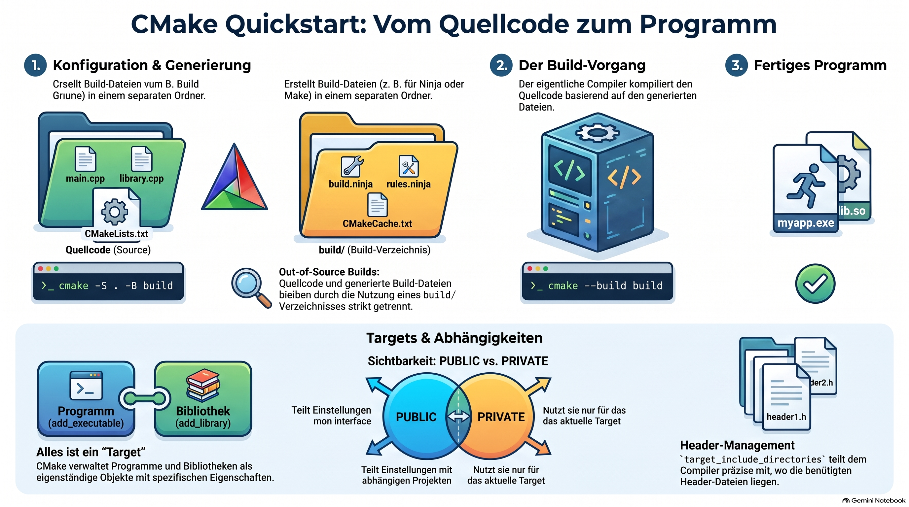

> [NOTE!]
> Dieses Tutorial bietet eine umfassende **Einführung in CMake** als Werkzeug zur Erzeugung von Build-Systemen für C++-Projekte. Der Text beschreibt den gesamten **Entwicklungszyklus**, beginnend bei der Installation notwendiger Tools bis hin zur **Projektstrukturierung** mit Quellcodedateien und Headern. Ein zentraler Fokus liegt auf der **Verwaltung von Targets**, wobei die Definition von Bibliotheken, die Verknüpfung von Abhängigkeiten und die Konfiguration von Compiler-Optionen detailliert erklärt werden. Fortgeschrittene Konzepte wie **automatisierte Tests** mit CTest, die Erstellung von Installationsregeln und die Nutzung von **CMake-Presets** für konsistente Build-Umgebungen werden ebenfalls thematisiert. Abschließend vermittelt die Quelle bewährte Praktiken für **sauberen Code** und effiziente Arbeitsabläufe innerhalb moderner Entwicklungsumgebungen wie VS Code.


# CMake Deep-Dive Tutorial for Beginners

## 1. What Is CMake?

CMake is a build-system generator. It does not compile C++ directly. Instead, it creates build files for tools such as:

- Ninja
- Make
- Visual Studio
- Unix Makefiles

The general workflow is:

```text
CMakeLists.txt
      ↓
CMake configure step
      ↓
Build files
      ↓
Compiler such as g++
      ↓
Executable
```

CMake helps manage:

- Source files
- Header files
- Compiler options
- Build types
- Libraries
- Tests
- Installation
- Cross-platform builds

---

## 2. Install CMake

In PowerShell:

```powershell
winget install --id Kitware.CMake
winget install --id Ninja-build.Ninja
```

Verify the installation:

```powershell
cmake --version
ninja --version
g++ --version
```

If a command is not recognized, restart PowerShell and VS Code.

---

## 3. Create a Project

```powershell
New-Item -ItemType Directory -Force `
    -Path "D:\CodingDojo\CMakeDemo"

Set-Location "D:\CodingDojo\CMakeDemo"

New-Item -ItemType Directory -Force -Path "src"
New-Item -ItemType Directory -Force -Path "include"
New-Item -ItemType Directory -Force -Path "tests"
```

Recommended structure:

```text
CMakeDemo/
├── CMakeLists.txt
├── include/
│   └── calculator.h
├── src/
│   ├── calculator.cpp
│   └── main.cpp
└── tests/
```

Keep generated files in a separate `build` directory.

---

## 4. The First `CMakeLists.txt`

Create `CMakeLists.txt` in the project root:

```cmake
cmake_minimum_required(VERSION 3.20)

project(CMakeDemo
    VERSION 1.0
    LANGUAGES CXX
)

set(CMAKE_CXX_STANDARD 17)
set(CMAKE_CXX_STANDARD_REQUIRED ON)
set(CMAKE_CXX_EXTENSIONS OFF)

add_executable(CMakeDemo
    src/main.cpp
)
```

### Explanation

```cmake
cmake_minimum_required(VERSION 3.20)
```

Specifies the minimum supported CMake version.

```cmake
project(CMakeDemo ...)
```

Defines the project name, version, and programming language.

```cmake
set(CMAKE_CXX_STANDARD 17)
```

Requests C++17.

```cmake
add_executable(CMakeDemo ...)
```

Creates an executable target named `CMakeDemo`.

---

## 5. Add C++ Source Files

Create `src/main.cpp`:

```cpp
#include <iostream>

int main() {
    std::cout << "Hello from CMake!\n";
    return 0;
}
```

Configure the project:

```powershell
cmake -S . -B build -G Ninja `
    -DCMAKE_CXX_COMPILER=g++.exe
```

Build it:

```powershell
cmake --build build
```

Run it:

```powershell
.\build\CMakeDemo.exe
```

### Important Options

| Option | Meaning |
|---|---|
| `-S .` | Source directory |
| `-B build` | Build directory |
| `-G Ninja` | Use Ninja |
| `cmake --build build` | Build the project |

---

## 6. Out-of-Source Builds

An out-of-source build keeps generated files separate from source code.

Recommended:

```powershell
cmake -S . -B build
```

Avoid generating build files directly in the project root:

```powershell
cmake .
```

Clean the build:

```powershell
Remove-Item -Recurse -Force .\build
```

Then configure again:

```powershell
cmake -S . -B build -G Ninja `
    -DCMAKE_CXX_COMPILER=g++.exe
```

---

## 7. Headers and Multiple Source Files

Create `include/calculator.h`:

```cpp
#pragma once

int add(int first, int second);
int multiply(int first, int second);
```

Create `src/calculator.cpp`:

```cpp
#include "calculator.h"

int add(int first, int second) {
    return first + second;
}

int multiply(int first, int second) {
    return first * second;
}
```

Update `src/main.cpp`:

```cpp
#include <iostream>
#include "calculator.h"

int main() {
    std::cout << add(2, 3) << '\n';
    std::cout << multiply(4, 5) << '\n';

    return 0;
}
```

Update `CMakeLists.txt`:

```cmake
add_executable(CMakeDemo
    src/main.cpp
    src/calculator.cpp
)

target_include_directories(CMakeDemo
    PRIVATE
        ${CMAKE_CURRENT_SOURCE_DIR}/include
)
```

`target_include_directories` tells the compiler where to find header files.

---

## 8. Targets

A target is something CMake builds or manages.

Common target types:

```cmake
add_executable(MyApp src/main.cpp)
add_library(MyLibrary STATIC src/library.cpp)
add_library(MyHeaderOnlyLibrary INTERFACE)
```

Targets can have:

- Source files
- Include directories
- Compiler options
- Libraries
- Compile definitions
- Dependencies

CMake works best when settings are attached to targets instead of configured globally.

---

## 9. Libraries

Create a static library:

```cmake
add_library(Calculator STATIC
    src/calculator.cpp
)

target_include_directories(Calculator
    PUBLIC
        ${CMAKE_CURRENT_SOURCE_DIR}/include
)
```

Create an executable:

```cmake
add_executable(CMakeDemo
    src/main.cpp
)
```

Link the library:

```cmake
target_link_libraries(CMakeDemo
    PRIVATE
        Calculator
)
```

### Visibility Keywords

```cmake
PRIVATE
```

Used only by the current target.

```cmake
PUBLIC
```

Used by the current target and targets that link to it.

```cmake
INTERFACE
```

Used only by targets that link to it.

Example:

```cmake
target_include_directories(Calculator
    PUBLIC
        ${CMAKE_CURRENT_SOURCE_DIR}/include
)
```

Consumers of `Calculator` automatically receive the include directory.

---

## 10. Compiler Warnings

Add warnings for GCC and Clang:

```cmake
if (CMAKE_CXX_COMPILER_ID MATCHES "GNU|Clang")
    target_compile_options(CMakeDemo
        PRIVATE
            -Wall
            -Wextra
            -Wpedantic
    )
endif()
```

Warnings help find:

- Unused variables
- Missing return statements
- Suspicious conversions
- Incorrect expressions

Avoid globally applying options when possible.

---

## 11. Debug and Release Builds

Configure a Debug build:

```powershell
cmake -S . -B build-debug -G Ninja `
    -DCMAKE_BUILD_TYPE=Debug `
    -DCMAKE_CXX_COMPILER=g++.exe
```

Configure a Release build:

```powershell
cmake -S . -B build-release -G Ninja `
    -DCMAKE_BUILD_TYPE=Release `
    -DCMAKE_CXX_COMPILER=g++.exe
```

Build Debug:

```powershell
cmake --build build-debug
```

Build Release:

```powershell
cmake --build build-release
```

Debug builds are designed for debugging. Release builds normally include optimization.

---

## 12. Conditional Compilation

Set a compile definition:

```cmake
target_compile_definitions(CMakeDemo
    PRIVATE
        APP_VERSION="1.0"
)
```

Use it in C++:

```cpp
#include <iostream>

int main() {
    std::cout << "Version: " << APP_VERSION << '\n';
}
```

Debug-specific definition:

```cmake
if (CMAKE_BUILD_TYPE STREQUAL "Debug")
    target_compile_definitions(CMakeDemo
        PRIVATE
            DEBUG_BUILD
    )
endif()
```

C++:

```cpp
#ifdef DEBUG_BUILD
    std::cout << "Debug mode\n";
#endif
```

---

## 13. Organizing CMake with Subdirectories

Root `CMakeLists.txt`:

```cmake
cmake_minimum_required(VERSION 3.20)

project(CMakeDemo
    VERSION 1.0
    LANGUAGES CXX
)

set(CMAKE_CXX_STANDARD 17)
set(CMAKE_CXX_STANDARD_REQUIRED ON)

add_subdirectory(src)
```

Create `src/CMakeLists.txt`:

```cmake
add_library(Calculator
    calculator.cpp
)

target_include_directories(Calculator
    PUBLIC
        ${PROJECT_SOURCE_DIR}/include
)

add_executable(CMakeDemo
    main.cpp
)

target_link_libraries(CMakeDemo
    PRIVATE
        Calculator
)
```

This keeps large projects easier to maintain.

---

## 14. CMake Options

Create an option:

```cmake
option(ENABLE_WARNINGS
    "Enable compiler warnings"
    ON
)
```

Use it:

```cmake
if (ENABLE_WARNINGS)
    if (CMAKE_CXX_COMPILER_ID MATCHES "GNU|Clang")
        target_compile_options(CMakeDemo
            PRIVATE
                -Wall
                -Wextra
                -Wpedantic
        )
    endif()
endif()
```

Disable warnings during configuration:

```powershell
cmake -S . -B build -G Ninja `
    -DENABLE_WARNINGS=OFF
```

---

## 15. Variables

Define a variable:

```cmake
set(APP_NAME CMakeDemo)
```

Use a variable:

```cmake
add_executable(${APP_NAME}
    src/main.cpp
)
```

CMake variables use this syntax:

```cmake
${VARIABLE_NAME}
```

Prefer target-based commands over excessive global variables.

---

## 16. Find Packages

CMake can locate installed packages:

```cmake
find_package(Threads REQUIRED)

target_link_libraries(CMakeDemo
    PRIVATE
        Threads::Threads
)
```

The `REQUIRED` keyword causes configuration to fail if the package cannot be found.

Imported targets such as `Threads::Threads` carry their own include paths and linker settings.

---

## 17. Add Tests with CTest

Enable testing:

```cmake
include(CTest)

enable_testing()

add_test(
    NAME ApplicationRuns
    COMMAND CMakeDemo
)
```

Configure and build:

```powershell
cmake -S . -B build -G Ninja
cmake --build build
```

Run tests:

```powershell
ctest --test-dir build --output-on-failure
```

`CTest` runs tests registered with `add_test`.

---

## 18. Install the Application

Add an install rule:

```cmake
install(
    TARGETS CMakeDemo
    RUNTIME DESTINATION bin
)
```

Configure and build:

```powershell
cmake -S . -B build -G Ninja
cmake --build build
```

Install to a custom directory:

```powershell
cmake --install build `
    --prefix "D:\CodingDojo\CMakeDemo\install"
```

The executable will be installed under:

```text
install\bin\
```

---

## 19. CMake Presets

Presets store configuration commands in a file.

Create `CMakePresets.json`:

```json
{
    "version": 6,
    "configurePresets": [
        {
            "name": "debug",
            "displayName": "Debug with Ninja and GCC",
            "generator": "Ninja",
            "binaryDir": "${sourceDir}/build/debug",
            "cacheVariables": {
                "CMAKE_BUILD_TYPE": "Debug",
                "CMAKE_CXX_COMPILER": "g++.exe"
            }
        },
        {
            "name": "release",
            "displayName": "Release with Ninja and GCC",
            "generator": "Ninja",
            "binaryDir": "${sourceDir}/build/release",
            "cacheVariables": {
                "CMAKE_BUILD_TYPE": "Release",
                "CMAKE_CXX_COMPILER": "g++.exe"
            }
        }
    ],
    "buildPresets": [
        {
            "name": "debug",
            "configurePreset": "debug"
        },
        {
            "name": "release",
            "configurePreset": "release"
        }
    ]
}
```

Use the Debug preset:

```powershell
cmake --preset debug
cmake --build --preset debug
```

Use the Release preset:

```powershell
cmake --preset release
cmake --build --preset release
```

Presets make builds consistent across computers and team members.

---

## 20. VS Code Integration

Install extensions:

```powershell
code --install-extension ms-vscode.cpptools
code --install-extension ms-vscode.cmake-tools
```

Open the project:

```powershell
code D:\CodingDojo\CMakeDemo
```

In VS Code:

1. Open the Command Palette with `Ctrl+Shift+P`.
2. Select **CMake: Select Configure Preset**.
3. Choose `debug`.
4. Select **CMake: Build**.
5. Select **CMake: Run Without Debugging**.

VS Code detects `CMakePresets.json` automatically.

---

## 21. Common Errors

### CMake cannot find `g++`

Check:

```powershell
g++ --version
```

Temporarily add MSYS2 to `PATH`:

```powershell
$env:Path += ";C:\msys64\ucrt64\bin"
```

Then delete and recreate the build directory.

### Generator mismatch

If CMake reports that the generator differs from the previous configuration:

```powershell
Remove-Item -Recurse -Force .\build
```

Configure again.

### Header file not found

Verify:

```cmake
target_include_directories(CMakeDemo
    PRIVATE
        ${CMAKE_CURRENT_SOURCE_DIR}/include
)
```

Also confirm that the header exists:

```text
include\calculator.h
```

### Changes do not appear

Rebuild:

```powershell
cmake --build build
```

If configuration changed, reconfigure:

```powershell
cmake -S . -B build -G Ninja
```

---

## 22. Recommended CMake Practices

- Use out-of-source builds.
- Prefer targets over global compiler settings.
- Use `target_link_libraries`.
- Use `target_include_directories`.
- Keep `CMakeLists.txt` readable.
- Use CMake presets for repeatable builds.
- Enable compiler warnings.
- Add tests with CTest.
- Do not commit the `build` directory.
- Use `cmake --build` instead of manually calling the compiler.
- Keep source, headers, tests, and generated files organized.

---

## 23. Complete Daily Workflow

```powershell
Set-Location "D:\CodingDojo\CMakeDemo"

cmake --preset debug

cmake --build --preset debug

ctest --test-dir build/debug --output-on-failure
```

Run the application:

```powershell
.\build\debug\CMakeDemo.exe
```

The normal development cycle is:

1. Edit C++ files.
2. Configure with CMake when settings change.
3. Build the project.
4. Run tests.
5. Run or debug the application.
6. Fix warnings and errors.
7. Repeat.
