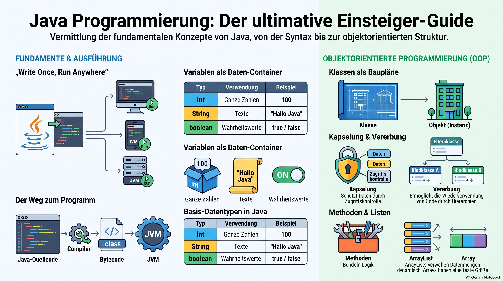

> [NOTE!]
> Dieser Quelltext bietet eine strukturierte **Einführung in die Programmiersprache Java**, die sich explizit an Anfänger mit geringen Vorkenntnissen richtet. Der Leitfaden vermittelt **grundlegende Konzepte** wie Variablen, Datentypen, Kontrollstrukturen und mathematische Operatoren zur Steuerung des Programmablaufs. Ein wesentlicher Schwerpunkt liegt auf der **objektorientierten Programmierung**, wobei Prinzipien wie Kapselung, Vererbung und Schnittstellen anschaulich erläutert werden. Zudem werden fortgeschrittene Themen wie die **Fehlerbehandlung mittels Exceptions** sowie die dynamische Datenverwaltung mit Listen behandelt. Die Quelle schließt mit einem **praktischen Übungsprojekt** und einer strategischen Empfehlung für den weiteren Lernpfad ab. Insgesamt dient der Text als **didaktisches Fundament** für den Aufbau solider Softwareentwicklungs-Fähigkeiten im Java-Ökosystem.


Absolutely! Since you already have some programming experience with Java-related technologies such as Spring Boot, I’ll still build this tutorial from **true Java fundamentals** so that every concept has a solid foundation.

# ☕ Java Absolute Beginner Tutorial

## What you will learn

By the end, you should understand:

1. What Java is

2. How a Java program works

3. Variables and data types

4. Operators

5. `if` statements

6. Loops

7. Methods

8. Arrays

9. Classes and objects

10. Constructors

11. Encapsulation

12. Inheritance

13. Interfaces

14. Collections

15. Exceptions

16. A small beginner project

***

# 1. What is Java?

Java is a **programming language** used to create applications.

You can use Java for:

* Backend applications

* Web applications

* Enterprise software

* Android development

* Desktop applications

* Command-line tools

* Microservices

A famous Java principle is:

> **Write Once, Run Anywhere**

Java programs are compiled into **bytecode**, which runs on the **Java Virtual Machine (JVM)**.

The basic idea is:

```text
Java source code
      ↓
    javac
      ↓
 Java bytecode
      ↓
     JVM
      ↓
 Operating System
```

Your Java source file:

```text
Hello.java
```

After compilation:

```text
Hello.class
```

***

# 2. Your First Java Program

Create a file called:

```text
Hello.java
```

Add:

```java
public class Hello {

    public static void main(String[] args) {

        System.out.println("Hello, World!");

    }

}
```

When you run it, you get:

```text
Hello, World!
```

***

## Understanding the program

Let's look at this:

```java
public class Hello
```

This defines a **class** called `Hello`.

The filename must normally match the public class name:

```text
Hello.java
```

***

### The `main` method

```java
public static void main(String[] args)
```

This is where a normal Java application starts.

Think of it as:

```text
Java program starts
        ↓
main() is called
        ↓
your code runs
```

For now, don't worry about understanding every word in:

```java
public static void main(String[] args)
```

You will understand the individual parts later.

***

# 3. Printing Output

Java uses:

```java
System.out.println();
```

Example:

```java
public class Hello {

    public static void main(String[] args) {

        System.out.println("Hello");
        System.out.println("Karl");
        System.out.println("Welcome to Java!");

    }

}
```

Output:

```text
Hello
Karl
Welcome to Java!
```

Each `println` prints something and then moves to a new line.

***

## `print()` vs `println()`

```java
System.out.print("Hello ");
System.out.print("World");
```

Output:

```text
Hello World
```

But:

```java
System.out.println("Hello");
System.out.println("World");
```

Output:

```text
Hello
World
```

***

# 4. Variables

A **variable** is a named container that stores a value.

Example:

```java
int age = 30;
```

Think about it like this:

```text
Variable
┌──────────┐
│ age      │
│ 30       │
└──────────┘
```

The variable's name is:

```text
age
```

The stored value is:

```text
30
```

***

## Common data types

### Integer

```java
int age = 30;
```

Used for whole numbers:

```text
1
42
100
-5
```

***

### Decimal numbers

```java
double price = 19.99;
```

***

### Text

```java
String name = "Karl";
```

A `String` stores text.

***

### Boolean

A boolean can only have two values:

```java
true
```

or:

```java
false
```

Example:

```java
boolean isJavaFun = true;
```

***

## Example

```java
public class Variables {

    public static void main(String[] args) {

        String name = "Karl";
        int age = 30;
        double height = 1.80;
        boolean likesJava = true;

        System.out.println(name);
        System.out.println(age);
        System.out.println(height);
        System.out.println(likesJava);

    }

}
```

***

# 5. Changing Variables

Variables can change.

```java
int age = 30;

age = 31;
```

Now:

```text
age
 ↓
31
```

You can also use the old value:

```java
int age = 30;

age = age + 1;
```

This means:

```text
Take the current value of age

30

Add 1

30 + 1 = 31

Store the result back in age
```

You can print it:

```java
System.out.println(age);
```

Output:

```text
31
```

***

# 6. Arithmetic Operators

Java can perform mathematical operations.

```java
int a = 10;
int b = 5;
```

## Addition

```java
int result = a + b;
```

Result:

```text
15
```

## Subtraction

```java
int result = a - b;
```

Result:

```text
5
```

## Multiplication

```java
int result = a * b;
```

Result:

```text
50
```

## Division

```java
int result = a / b;
```

Result:

```text
2
```

***

# 7. Strings

A `String` stores text.

```java
String firstName = "Karl";
String lastName = "Schmitt";
```

You can combine strings:

```java
String fullName = firstName + " " + lastName;

System.out.println(fullName);
```

Output:

```text
Karl Schmitt
```

This is called **string concatenation**.

***

# 8. Comparison Operators

Comparison operators compare values.

```java
int age = 30;
```

### Equal to

```java
age == 30
```

### Not equal to

```java
age != 30
```

### Greater than

```java
age > 18
```

### Less than

```java
age < 18
```

### Greater than or equal

```java
age >= 18
```

### Less than or equal

```java
age <= 18
```

These expressions produce:

```java
true
```

or:

```java
false
```

***

# 9. `if` Statements

An `if` statement allows your program to make decisions.

Example:

```java
int age = 20;

if (age >= 18) {

    System.out.println("You are an adult.");

}
```

The program asks:

```text
Is age greater than or equal to 18?
```

Since:

```text
20 >= 18
```

is:

```text
true
```

the code inside the `{ }` runs.

***

## `if` and `else`

```java
int age = 16;

if (age >= 18) {

    System.out.println("Adult");

} else {

    System.out.println("Minor");

}
```

Output:

```text
Minor
```

***

## Multiple conditions

```java
int age = 25;

if (age < 18) {

    System.out.println("Minor");

} else if (age < 65) {

    System.out.println("Adult");

} else {

    System.out.println("Senior");

}
```

***

# 10. Logical Operators

Sometimes you need multiple conditions.

## AND: `&&`

```java
int age = 25;
boolean hasTicket = true;

if (age >= 18 && hasTicket) {

    System.out.println("You may enter.");

}
```

Both conditions must be true.

```text
true && true
```

Result:

```text
true
```

***

## OR: `||`

```java
boolean hasVIPTicket = false;
boolean isEmployee = true;

if (hasVIPTicket || isEmployee) {

    System.out.println("Access granted.");

}
```

Only one condition needs to be true.

***

## NOT: `!`

```java
boolean isLoggedIn = false;

if (!isLoggedIn) {

    System.out.println("Please log in.");

}
```

The `!` means:

```text
NOT
```

***

# 11. Loops

Loops allow you to repeat code.

## `for` loop

```java
for (int i = 0; i < 5; i++) {

    System.out.println(i);

}
```

Output:

```text
0
1
2
3
4
```

Let's break this apart:

```java
int i = 0
```

Start with:

```text
i = 0
```

Then:

```java
i < 5
```

Continue while `i` is less than 5.

Then:

```java
i++
```

Increase `i` by 1.

The flow is:

```text
i = 0
 ↓
print 0
 ↓
i = 1
 ↓
print 1
 ↓
i = 2
 ↓
...
```

***

# 12. `while` Loops

A `while` loop continues while a condition is true.

```java
int number = 0;

while (number < 5) {

    System.out.println(number);

    number++;

}
```

Output:

```text
0
1
2
3
4
```

Be careful!

This creates an infinite loop:

```java
while (true) {

    System.out.println("Hello");

}
```

The condition is always true.

***

# 13. Methods

A **method** is a reusable block of code.

Example:

```java
public static void sayHello() {

    System.out.println("Hello!");

}
```

You can call it:

```java
sayHello();
```

Complete example:

```java
public class Main {

    public static void main(String[] args) {

        sayHello();

    }

    public static void sayHello() {

        System.out.println("Hello!");

    }

}
```

Output:

```text
Hello!
```

***

## Methods with parameters

Parameters allow us to give information to a method.

```java
public static void greet(String name) {

    System.out.println("Hello " + name);

}
```

Call it:

```java
greet("Karl");
greet("Anna");
```

Output:

```text
Hello Karl
Hello Anna
```

Think of the parameter as an input:

```text
greet()
   ↑
   │
"Karl"
```

***

# 14. Methods with Return Values

Methods can return values.

```java
public static int add(int a, int b) {

    return a + b;

}
```

Use it:

```java
int result = add(10, 5);

System.out.println(result);
```

Output:

```text
15
```

The flow is:

```text
add(10, 5)
      ↓
10 + 5
      ↓
15
      ↓
return
      ↓
result = 15
```

***

# 15. Arrays

An array stores multiple values.

```java
String[] names = {

    "Karl",
    "Anna",
    "Peter"

};
```

You can imagine it like this:

```text
Index       Value

0           Karl
1           Anna
2           Peter
```

Arrays start at:

```text
0
```

So:

```java
System.out.println(names[0]);
```

prints:

```text
Karl
```

And:

```java
System.out.println(names[1]);
```

prints:

```text
Anna
```

***

## Looping through an array

```java
String[] names = {

    "Karl",
    "Anna",
    "Peter"

};

for (int i = 0; i < names.length; i++) {

    System.out.println(names[i]);

}
```

Output:

```text
Karl
Anna
Peter
```

***

# 16. Classes

Java is an **object-oriented programming language**.

A class is like a **blueprint**.

For example:

```text
Car
```

A car could have:

```text
brand
model
year
```

We can create a class:

```java
public class Car {

    String brand;
    String model;
    int year;

}
```

This class describes what a `Car` looks like.

***

# 17. Objects

An **object** is created from a class.

The class is the blueprint:

```text
Car
```

The object is an actual thing created from that blueprint:

```text
BMW
```

Example:

```java
Car car = new Car();
```

This means:

```text
Create a new Car object
```

You can assign values:

```java
car.brand = "BMW";
car.model = "X5";
car.year = 2025;
```

And print them:

```java
System.out.println(car.brand);
```

***

# 18. Constructors

A constructor helps create objects.

Example:

```java
public class Car {

    String brand;
    String model;

    public Car(String brand, String model) {

        this.brand = brand;
        this.model = model;

    }

}
```

Now you can create a car like this:

```java
Car car = new Car("BMW", "X5");
```

The values:

```text
"BMW"
"X5"
```

are passed into the constructor.

***

## What does `this` mean?

Look at this:

```java
this.brand = brand;
```

There are two `brand` variables.

The first:

```java
this.brand
```

means:

> The `brand` variable belonging to this object.

The second:

```java
brand
```

means:

> The parameter received by the constructor.

So:

```java
this.brand = brand;
```

means:

```text
Object's brand = received brand
```

***

# 19. Encapsulation

Usually, we don't want other classes to directly change our variables.

Instead of:

```java
public String name;
```

we use:

```java
private String name;
```

Example:

```java
public class Person {

    private String name;

    public String getName() {

        return name;

    }

    public void setName(String name) {

        this.name = name;

    }

}
```

Usage:

```java
Person person = new Person();

person.setName("Karl");

System.out.println(person.getName());
```

This is called **encapsulation**.

The idea is:

```text
Private data
    ↓
Controlled access
    ↓
Getter / Setter
```

***

# 20. Inheritance

Inheritance allows one class to inherit from another.

Example:

```java
public class Animal {

    public void eat() {

        System.out.println("Eating");

    }

}
```

Now:

```java
public class Dog extends Animal {

    public void bark() {

        System.out.println("Woof!");

    }

}
```

The `Dog` inherits:

```text
eat()
```

from:

```text
Animal
```

So:

```java
Dog dog = new Dog();

dog.eat();
dog.bark();
```

Output:

```text
Eating
Woof!
```

***

# 21. Interfaces

An interface defines a **contract**.

Example:

```java
public interface Animal {

    void makeSound();

}
```

A class can implement it:

```java
public class Dog implements Animal {

    @Override
    public void makeSound() {

        System.out.println("Woof!");

    }

}
```

The interface says:

```text
Every Animal must have:

makeSound()
```

The class decides **how** it works.

```text
Animal
   │
   └── makeSound()
           │
           ▼
          Dog
           │
           └── "Woof!"
```

***

# 22. Collections: `ArrayList`

Arrays have a fixed size.

```java
String[] names = new String[3];
```

You can store only three values.

An `ArrayList` can grow dynamically.

```java
import java.util.ArrayList;

ArrayList<String> names = new ArrayList<>();
```

Add values:

```java
names.add("Karl");
names.add("Anna");
names.add("Peter");
```

Print:

```java
System.out.println(names);
```

Output:

```text
[Karl, Anna, Peter]
```

***

## Loop through an `ArrayList`

```java
for (String name : names) {

    System.out.println(name);

}
```

Output:

```text
Karl
Anna
Peter
```

This is called a **for-each loop**.

***

# 23. Exceptions

An exception happens when something goes wrong while the program is running.

Example:

```java
int result = 10 / 0;
```

You cannot divide by zero.

Java throws an exception.

You can handle it:

```java
try {

    int result = 10 / 0;

} catch (ArithmeticException e) {

    System.out.println("You cannot divide by zero!");

}
```

The structure is:

```text
try
 ↓
Run dangerous code
 ↓
Something goes wrong?
 ↓
catch
 ↓
Handle the problem
```

***

# 24. A Small Beginner Project

Let's combine several concepts.

We will create a simple list of people.

## `Person.java`

```java
public class Person {

    private String name;
    private int age;

    public Person(String name, int age) {

        this.name = name;
        this.age = age;

    }

    public void introduce() {

        System.out.println(
            "My name is " + name +
            " and I am " + age +
            " years old."
        );

    }

}
```

***

## `Main.java`

```java
import java.util.ArrayList;

public class Main {

    public static void main(String[] args) {

        ArrayList<Person> people = new ArrayList<>();

        people.add(new Person("Karl", 30));
        people.add(new Person("Anna", 25));
        people.add(new Person("Peter", 40));

        for (Person person : people) {

            person.introduce();

        }

    }

}
```

Output:

```text
My name is Karl and I am 30 years old.
My name is Anna and I am 25 years old.
My name is Peter and I am 40 years old.
```

***

# 🗺️ The Most Important Mental Model

A Java program can be understood like this:

```text
┌─────────────────────┐
│      VARIABLES      │
│ Store information   │
└──────────┬──────────┘
           │
           ▼
┌─────────────────────┐
│       METHODS       │
│ Perform actions     │
└──────────┬──────────┘
           │
           ▼
┌─────────────────────┐
│       CLASSES       │
│ Define blueprints   │
└──────────┬──────────┘
           │
           ▼
┌─────────────────────┐
│       OBJECTS       │
│ Actual instances    │
└─────────────────────┘
```

For example:

```text
Person class
     │
     ├── name
     ├── age
     └── introduce()
     │
     ▼
Person object
     │
     ├── name = "Karl"
     ├── age = 30
     └── introduce()
```

***

# 🎓 Recommended Learning Path

I recommend learning Java in this order:

### Level 1 — Java Basics

```text
1. Hello World
2. Variables
3. Data types
4. Operators
5. Strings
6. if / else
7. Loops
```

### Level 2 — Program Structure

```text
8. Methods
9. Parameters
10. Return values
11. Arrays
12. ArrayList
```

### Level 3 — Object-Oriented Programming

```text
13. Classes
14. Objects
15. Constructors
16. this
17. Encapsulation
18. Inheritance
19. Polymorphism
20. Interfaces
```

### Level 4 — Practical Java

```text
21. Exceptions
22. Collections
23. Files
24. Generics
25. Lambdas
26. Streams
```

### Level 5 — Java Backend Development

```text
27. Maven or Gradle
28. HTTP
29. REST APIs
30. JSON
31. Databases
32. JDBC
33. JPA / Hibernate
34. Spring
35. Spring Boot
```

## My recommendation for you

Don't try to memorize Java syntax. Instead, focus on answering these questions for every new concept:

1. **What problem does this solve?**

2. **What does the code actually do?**

3. **What happens step by step when Java executes it?**

4. **Why was this concept invented?**

A good next step would be to turn this into a **hands-on Java Absolute Beginner Bootcamp**, where we go lesson by lesson and write, run, and explain every program—from `Hello World` through classes, OOP, collections, exceptions, and finally a small Java application.
