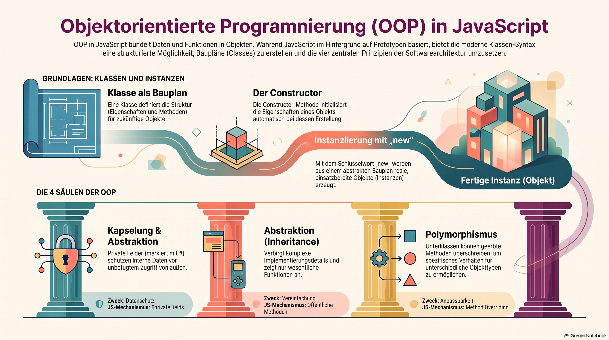
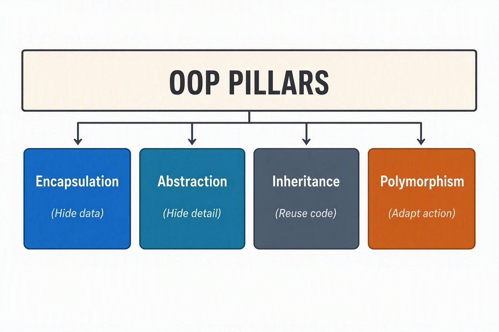

> [NOTE!]
> Dieser Text bietet eine fundierte Einführung in die **objektorientierte Programmierung (OOP)** innerhalb von JavaScript und erläutert deren Kernkonzepte. Der Text beschreibt **Klassen als Baupläne** für Objekte, während er gleichzeitig auf die zugrunde liegende **Prototypen-Struktur** der Sprache hinweist. Ein zentraler Fokus liegt auf den vier Säulen der OOP: **Kapselung** zum Schutz von Daten, **Abstraktion**, **Vererbung** zur Wiederverwendung von Code sowie **Polymorphismus** zur individuellen Anpassung von Methoden. Durch praxisnahe Codebeispiele, wie etwa Bankkonten oder geometrische Formen, wird die Anwendung von **privaten Feldern** und Klassenerweiterungen verdeutlicht. Insgesamt dient das Dokument als Leitfaden, um moderne **ES6-Syntax** für die Organisation komplexer Programmlogik effizient zu nutzen.


# Java Script Object-Oriented Programming

**Object-Oriented Programming (OOP)** is a paradigm built around **objects**—structures that combine related data (properties) and actions (methods) into a single blueprint.


In JavaScript, OOP is powered by **prototypes** under the hood, but modern JavaScript (ES6+) uses clean `class` syntax.


## Architecting Modern JavaScript: The Four Pillars of OOP



## 1. Classes and Instances

A **Class** is the blueprint; an **Instance** is the actual object created from that blueprint using the `new` keyword.

```JavaScript
class BankAccount {
  // Constructor initializes properties when an object is created
  constructor(owner, balance) {
    this.owner = owner;
    this.balance = balance;
  }

  // Method (action)
  deposit(amount) {
    this.balance += amount;
    console.log(`${this.owner} deposited $${amount}. New balance: $${this.balance}`);
  }
}

// Creating instances
const account1 = new BankAccount("Alice", 500);
const account2 = new BankAccount("Bob", 1000);

account1.deposit(200); // Alice deposited $200. New balance: $700
```

## 2. Encapsulation (Private Fields)

Encapsulation restricts direct access to internal data so it can't be modified accidentally or maliciously.

In modern JavaScript, prefixing a field with `#` makes it truly **private**.

```JavaScript
class Wallet {
  #balance; // Private field (cannot be accessed outside this class)

  constructor(initialBalance) {
    this.#balance = initialBalance;
  }

  // Getter: safe access to private data
  getBalance() {
    return this.#balance;
  }

  // Setter/Method: controlled modification
  withdraw(amount) {
    if (amount > this.#balance) {
      console.log("Insufficient funds!");
      return;
    }
    this.#balance -= amount;
    console.log(`Withdrew $${amount}. Remaining: $${this.#balance}`);
  }
}

const myWallet = new Wallet(100);
myWallet.withdraw(40); // Withdrew $40. Remaining: $60

// Direct access fails:
// console.log(myWallet.#balance); // SyntaxError: Private field '#balance' must be declared in an enclosing class
```

## 3. Inheritance (`extends` and `super`)

Inheritance allows a child class to inherit properties and methods from a parent class, eliminating repeated code.

```JavaScript
// Parent Class
class User {
  constructor(name, email) {
    this.name = name;
    this.email = email;
  }

  login() {
    console.log(`${this.name} logged in.`);
  }
}

// Child Class inherits from User
class Admin extends User {
  constructor(name, email, permissions) {
    // Call the parent class constructor
    super(name, email);
    this.permissions = permissions;
  }

  deleteUser(targetUser) {
    console.log(`${this.name} deleted user ${targetUser.name}`);
  }
}

const admin = new Admin("Sarah", "sarah@admin.com", ["read", "delete"]);
admin.login(); // Inherited: Sarah logged in.
admin.deleteUser({ name: "John" }); // Admin-specific action
```

## 4. Polymorphism (Method Overriding)

Polymorphism allows a child class to provide its own customized implementation of a method inherited from a parent class.

```JavaScript
class Shape {
  calculateArea() {
    return 0;
  }
}

class Circle extends Shape {
  constructor(radius) {
    super();
    this.radius = radius;
  }

  // Overriding calculateArea for Circle
  calculateArea() {
    return Math.PI * this.radius ** 2;
  }
}

class Rectangle extends Shape {
  constructor(width, height) {
    super();
    this.width = width;
    this.height = height;
  }

  // Overriding calculateArea for Rectangle
  calculateArea() {
    return this.width * this.height;
  }
}

const shapes = [new Circle(5), new Rectangle(4, 10)];

shapes.forEach((shape) => {
  // Same method call, different behavior based on object type
  console.log(`Area: ${shape.calculateArea().toFixed(2)}`);
});
```

## 5. Under the Hood: Prototypes

JavaScript is fundamentally prototype-based. When you write a `class`, JavaScript creates a prototype object behind the scenes.

``` JavaScript
// Equivalent using old prototype syntax:
function Person(name) {
  this.name = name;
}

Person.prototype.sayHello = function () {
  console.log(`Hi, I am ${this.name}`);
};

const person = new Person("Daisy");
person.sayHello(); // Hi, I am David
```

> [NOTE!]
> Feel free to follow the white rabbit 🐇: [JavaScript this keyword](./JavaScript_this_keyword.md)

