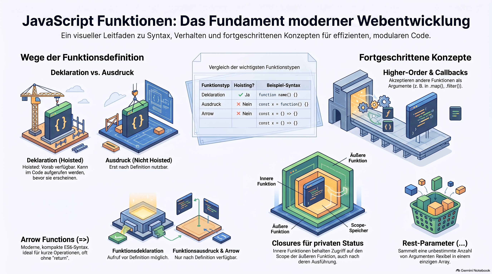

> [NOTE!]
> Dieser Text bietet einen umfassenden Überblick über **JavaScript-Funktionen**, die als zentrale Bausteine der Sprache dienen. Es werden **drei primäre Definitionstypen** erläutert: die klassische Deklaration, Funktionsausdrücke sowie die modernen, prägnanten Arrow-Functions. Ein besonderer Schwerpunkt liegt auf der flexiblen Handhabung von **Parametern und Rückgabewerten**, wobei Konzepte wie Standardwerte und Rest-Parameter vorgestellt werden. Darüber hinaus thematisiert die Quelle fortgeschrittene Programmiermuster, darunter **Higher-Order-Funktionen** und die Verwendung von Callbacks zur Datenverarbeitung. Abschließend werden technische Details wie der **Geltungsbereich von Variablen** und das Prinzip der Closures erklärt, um die Kapselung von Logik zu verdeutlichen. Eine tabellarische Zusammenfassung hilft zudem dabei, die Unterschiede in Bezug auf das **Hoisting und die Syntax** schnell zu erfassen.


# JavaScript Functions

Functions are the foundational building blocks of JavaScript. A **function** is a reusable block of code designed to perform a specific task when called (executed).


## 1. Defining Functions: 3 Ways

There are three primary ways to define functions in JavaScript:
```javascript

// 1. Function Declaration (Hoisted - can be called BEFORE it appears in code)
function multiplyDeclarative(a, b) {
  return a * b;
}

// 2. Function Expression (Not hoisted - must be defined before calling)
const multiplyExpression = function(a, b) {
  return a * b;
};

// 3. Arrow Function (Modern ES6 syntax - short & concise)
const multiplyArrow = (a, b) => a * b;
```

## 2. Parameters and Return Values

Functions take inputs called **parameters** and output a result using `return`.


### Default Parameters

You can provide fallback values if arguments aren't passed:

```javascript
function greet(name = "Guest", greeting = "Hello") {
  return `${greeting}, ${name}!`;
}

console.log(greet());               // "Hello, Guest!"
console.log(greet("Sarah"));        // "Hello, Sarah!"
console.log(greet("Alex", "Welcome")); // "Welcome, Alex!"
```

### Rest Parameters (`...`)

Gather an unknown number of incoming arguments into an array:


JavaScript

```
function sumAll(...numbers) {
  return numbers.reduce((total, num) => total + num, 0);
}

console.log(sumAll(5, 10, 15, 20)); // 50
```

## 3. Arrow Functions Deep-Dive

Arrow functions (`=>`) are widely used in modern JavaScript. They have two main syntax variations:


JavaScript

```
// Implicit Return (One line - automatically returns the value without 'return' keyword)
const double = (n) => n * 2;

// Explicit Return (Multi-line - requires curly braces {} and explicit 'return')
const processOrder = (price, tax) => {
  const total = price + (price * tax);
  return total.toFixed(2);
};
```

## 4. Higher-Order & Callback Functions

A **higher-order function** is a function that accepts another function as an argument or returns one. The function passed in is called a **callback**.


JavaScript

```
const numbers = [1, 2, 3, 4, 5];

// Array methods like map(), filter(), and forEach() use callbacks:
const squared = numbers.map((num) => num * num);
console.log(squared); // [1, 4, 9, 16, 25]

const evens = numbers.filter((num) => num % 2 === 0);
console.log(evens); // [2, 4]
```

## 5. Scope & Closures

### Scope

Variables declared inside a function cannot be accessed outside it.


JavaScript

```
function createSecret() {
  const secret = "SuperSecret123"; // Local scope
}

// console.log(secret); // ReferenceError: secret is not defined
```

### Closures

A **closure** gives an inner function access to an outer function's scope, even _after_ the outer function has finished executing.

JavaScript

```
function createCounter() {
  let count = 0; // Enclosed state

  return {
    increment: () => ++count,
    decrement: () => --count,
    getCount: () => count
  };
}

const counter = createCounter();
console.log(counter.increment()); // 1
console.log(counter.increment()); // 2
console.log(counter.getCount());   // 2
// 'count' remains private and accessible only via counter methods!
```

## Summary Comparison

| **Function Type** | **Syntax**                  | **this Binding**                    | **Hoisted?** |
| ----------------- | --------------------------- | ----------------------------------- | ------------ |
| **Declaration**   | `function foo() {}`         | Dynamic (based on context)          | Yes          |
| **Expression**    | `const foo = function() {}` | Dynamic (based on context)          | No           |
| **Arrow**         | `const foo = () => {}`      | Lexical (inherits from outer scope) | No           |
