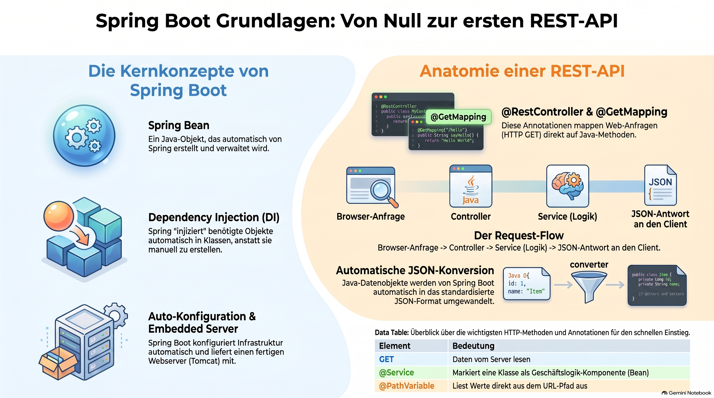

> [NOTE!]
> Dieses Tutorial bietet einen **fundamentalen Einstieg in Spring Boot**, ein Framework, das die Entwicklung von Java-Webanwendungen durch **automatisierte Konfigurationen** und eingebettete Server vereinfacht. Ein zentraler Fokus liegt auf der **Verwaltung von Objekten als Beans**, die durch **Dependency Injection** effizient miteinander verknüpft werden. Der Text erläutert praxisnah die Erstellung von **REST-Endpunkten** mittels Annotationen wie `@RestController` und `@GetMapping`. Zudem wird die Architektur einer Anwendung durch die Trennung von **Controllern, Services und Datenmodellen** veranschaulicht. Leser lernen Schritt für Schritt, wie Anfragen verarbeitet, **JSON-Daten** zurückgegeben und Parameter aus URLs ausgelesen werden. Abschließend vermittelt die Quelle die wichtigsten Fachbegriffe und skizziert einen **strukturierten Lernpfad** für angehende Entwickler.


# Absolute Beginner Spring Boot Tutorial

Absolutely! Let's start **from zero** and build up step by step.

The goal is not just to copy code. I want you to understand:

1. **What Spring Boot is**

2. **What happens when a Spring Boot application starts**

3. **How to create your first project**

4. **What `@SpringBootApplication` means**

5. **How to create a REST endpoint**

6. **What `@RestController` and `@GetMapping` do**

7. **How a browser or PowerShell communicates with your application**

8. **How Spring manages objects for you**

We'll build a small application as we go.

***

# 1. What is Spring Boot?

Imagine you want to create a Java web application.

Without Spring Boot, you might need to configure:

* a web server

* routing

* dependency injection

* JSON conversion

* application configuration

* many libraries

Spring Boot makes this much easier.

You write Java classes like this:

```java
@RestController
public class HelloController {

    @GetMapping("/hello")
    public String hello() {
        return "Hello World!";
    }
}
```

Then Spring Boot does a lot of work for you.

You can open:

```text
http://localhost:8080/hello
```

And receive:

```text
Hello World!
```

So, in a simplified form:

```text
Browser / PowerShell
        │
        │ HTTP Request
        ▼
┌───────────────────┐
│   Spring Boot     │
│                   │
│  Controller       │
│       │           │
│       ▼           │
│    Your Java      │
│      Code         │
└───────────────────┘
        │
        │ HTTP Response
        ▼
Browser / PowerShell
```

***

# 2. What is Spring?

Before understanding Spring Boot, we should understand **Spring**.

Spring is a Java framework.

One of its most important ideas is:

> **Spring manages your application objects.**

Normally, in Java, you create objects yourself.

For example:

```java
HelloService service = new HelloService();
```

You are responsible for creating the object.

With Spring, you can say:

> "Spring, please manage this object for me."

For example:

```java
@Service
public class HelloService {
}
```

Spring can create and manage an instance of this class.

Such a Spring-managed object is called a:

# Bean

***

## What is a Bean?

A **Spring Bean** is simply an object that is managed by Spring.

For example:

```java
@Service
public class GreetingService {
}
```

Spring sees the annotation:

```java
@Service
```

and understands:

> "This class should become a Spring-managed object."

Conceptually:

```text
Your Application
       │
       ▼
┌─────────────────────┐
│       Spring        │
│                     │
│  GreetingService    │
│         Object      │
│                     │
└─────────────────────┘
```

Instead of you creating the object:

```java
GreetingService service = new GreetingService();
```

Spring creates it.

***

# 3. What is Spring Boot then?

Spring existed before Spring Boot.

Traditional Spring applications often required a lot of configuration.

Spring Boot adds useful defaults.

For example, if you add the web dependency, Spring Boot can automatically configure a web application.

This idea is called:

# Auto-Configuration

Spring Boot looks at your project and says something like:

> "I see that this is a web application. I will configure the necessary web infrastructure."

So Spring Boot is essentially:

```text
Spring
   +
Automatic Configuration
   +
Useful Defaults
   +
Embedded Server
```

***

# 4. What is an embedded server?

Normally, a Java web application needed to be deployed to a server such as Tomcat.

With Spring Boot, Tomcat is usually included inside your application.

So you can run:

```text
YourApplication.java
```

And Spring Boot starts something like:

```text
Embedded Tomcat
       +
Your Spring Application
```

Your application becomes available at:

```text
http://localhost:8080
```

***

# 5. Create your first Spring Boot project

You can create a Spring Boot project using Spring Initializr.

[Spring Initializr](https://start.spring.io/?utm_source=chatgpt.com)

Choose:

| Setting     | Value                       |
| ----------- | --------------------------- |
| Project     | Maven                       |
| Language    | Java                        |
| Spring Boot | Default stable version      |
| Group       | `com.example`               |
| Artifact    | `hello`                     |
| Name        | `hello`                     |
| Packaging   | Jar                         |
| Java        | Your installed Java version |

For dependencies, select:

```text
Spring Web
```

Then generate and download the project.

***

# 6. Open the project in VS Code

After extracting the ZIP file, the project structure will look approximately like this:

```text
hello
│
├── src
│   ├── main
│   │   ├── java
│   │   │   └── com
│   │   │       └── example
│   │   │           └── hello
│   │   │               └── HelloApplication.java
│   │   │
│   │   └── resources
│   │       └── application.properties
│   │
│   └── test
│
├── pom.xml
│
└── mvnw
```

The most important file at the beginning is:

```text
HelloApplication.java
```

It will look similar to this:

```java
package com.example.hello;

import org.springframework.boot.SpringApplication;
import org.springframework.boot.autoconfigure.SpringBootApplication;

@SpringBootApplication
public class HelloApplication {

    public static void main(String[] args) {
        SpringApplication.run(HelloApplication.class, args);
    }
}
```

***

# 7. Understanding the `main()` method

Every normal Java application starts somewhere.

That starting point is usually:

```java
public static void main(String[] args)
```

For example:

```java
public class MyApplication {

    public static void main(String[] args) {
        System.out.println("Application started!");
    }
}
```

Spring Boot applications also start with a normal Java `main()` method:

```java
public static void main(String[] args) {
    SpringApplication.run(HelloApplication.class, args);
}
```

The important part is:

```java
SpringApplication.run(...)
```

This tells Spring Boot:

> "Start the Spring Boot application."

Conceptually:

```text
main()
   │
   ▼
SpringApplication.run()
   │
   ▼
Spring starts
   │
   ├── Finds Spring components
   │
   ├── Creates Beans
   │
   ├── Applies configuration
   │
   └── Starts the web server
```

***

# 8. What does `@SpringBootApplication` mean?

Your main class contains:

```java
@SpringBootApplication
```

This annotation is extremely important.

You can think of it as saying:

> "This is the main configuration class of my Spring Boot application."

It combines several important Spring features.

For now, you can think of it like this:

```text
@SpringBootApplication
        │
        ├── Find Spring components
        │
        ├── Configure Spring
        │
        └── Apply auto-configuration
```

One particularly important feature is **component scanning**.

***

# 9. What is Component Scanning?

Suppose you create this class:

```java
@RestController
public class HelloController {
}
```

Spring Boot needs to discover this class.

When your application starts, Spring scans your packages.

For example:

```text
com.example.hello
│
├── HelloApplication
│
├── HelloController
│
└── GreetingService
```

Spring sees:

```java
@RestController
```

and thinks:

> "This is a Spring component. I should manage it."

It sees:

```java
@Service
```

and thinks:

> "This should also be managed by Spring."

This automatic search is called:

# Component Scanning

***

# 10. Create your first Controller

Now let's create something useful.

Inside:

```text
src/main/java/com/example/hello
```

create:

```text
HelloController.java
```

Add:

```java
package com.example.hello;

import org.springframework.web.bind.annotation.GetMapping;
import org.springframework.web.bind.annotation.RestController;

@RestController
public class HelloController {

    @GetMapping("/hello")
    public String hello() {
        return "Hello World!";
    }
}
```

Let's understand this step by step.

***

# 11. What is `@RestController`?

This:

```java
@RestController
```

tells Spring:

> "This class handles HTTP requests."

For example:

```text
Browser
   │
   │ GET /hello
   ▼
HelloController
```

The controller receives the request and returns a response.

So:

```java
@RestController
public class HelloController {
}
```

means approximately:

```text
This class receives HTTP requests
and produces HTTP responses.
```

***

# 12. What is `@GetMapping`?

Inside the controller, we have:

```java
@GetMapping("/hello")
public String hello() {
    return "Hello World!";
}
```

This tells Spring:

> "When somebody sends a GET request to `/hello`, execute this method."

So:

```text
GET /hello
```

maps to:

```java
public String hello()
```

This is why it is called:

```text
@GetMapping
```

It maps an HTTP GET request to a Java method.

The complete flow is:

```text
GET http://localhost:8080/hello
                │
                ▼
       @GetMapping("/hello")
                │
                ▼
         hello() method
                │
                ▼
       "Hello World!"
                │
                ▼
          HTTP Response
```

***

# 13. Run the application

You can run the application from your terminal.

On Windows PowerShell:

```powershell
.\mvnw spring-boot:run
```

After a successful startup, you should see something similar to:

```text
Started HelloApplication
```

You can now open:

```text
http://localhost:8080/hello
```

You should see:

```text
Hello World!
```

Congratulations! 🎉

You have created your first Spring Boot REST endpoint.

***

# 14. Let's use PowerShell instead of the browser

Since a REST API communicates through HTTP, we can also call it from PowerShell.

Try:

```powershell
curl http://localhost:8080/hello
```

Depending on your PowerShell environment, you can also use:

```powershell
Invoke-WebRequest http://localhost:8080/hello
```

Or:

```powershell
Invoke-RestMethod http://localhost:8080/hello
```

You should receive:

```text
Hello World!
```

The request flow is:

```text
PowerShell
    │
    │ HTTP GET Request
    ▼
Spring Boot Application
    │
    ▼
HelloController
    │
    ▼
hello()
    │
    ▼
"Hello World!"
    │
    ▼
PowerShell
```

***

# 15. Add another endpoint

Let's add another method.

```java
@RestController
public class HelloController {

    @GetMapping("/hello")
    public String hello() {
        return "Hello World!";
    }

    @GetMapping("/goodbye")
    public String goodbye() {
        return "Goodbye!";
    }
}
```

Now you have two endpoints:

```text
GET /hello
```

and:

```text
GET /goodbye
```

Try:

```powershell
Invoke-RestMethod http://localhost:8080/hello
```

Result:

```text
Hello World!
```

Then:

```powershell
Invoke-RestMethod http://localhost:8080/goodbye
```

Result:

```text
Goodbye!
```

***

# 16. What is an API endpoint?

An **endpoint** is an address where your application provides a particular function or resource.

For example:

```text
http://localhost:8080/hello
```

The path:

```text
/hello
```

is the endpoint path.

You can imagine your application as a building:

```text
Spring Boot Application
│
├── /hello
│
├── /goodbye
│
└── /users
```

Each endpoint provides different functionality.

***

# 17. Understanding HTTP GET

HTTP defines different types of requests.

The most common are:

| HTTP Method | Meaning          |
| ----------- | ---------------- |
| GET         | Read something   |
| POST        | Create something |
| PUT         | Update something |
| DELETE      | Delete something |

For example:

```text
GET /users
```

means:

> "Give me the users."

Later you might have:

```text
POST /users
```

meaning:

> "Create a new user."

But for now, let's focus on GET.

***

# 18. Returning JSON

Most REST APIs return JSON.

Instead of returning:

```java
return "Hello World!";
```

we can return a Java object.

Create a new class:

```java
package com.example.hello;

public class Greeting {

    private String message;

    public Greeting(String message) {
        this.message = message;
    }

    public String getMessage() {
        return message;
    }
}
```

Now change the controller:

```java
@RestController
public class HelloController {

    @GetMapping("/hello")
    public Greeting hello() {
        return new Greeting("Hello World!");
    }
}
```

Spring Boot automatically converts the Java object:

```text
Greeting
```

into JSON:

```json
{
  "message": "Hello World!"
}
```

This conversion is one of the things Spring Boot makes convenient for us.

The flow is:

```text
Java Object
     │
     ▼
Spring Boot
     │
     ▼
JSON
     │
     ▼
HTTP Response
```

Try:

```powershell
Invoke-RestMethod http://localhost:8080/hello
```

***

# 19. Adding a Service

So far, our controller contains the logic directly:

```java
@RestController
public class HelloController {

    @GetMapping("/hello")
    public Greeting hello() {
        return new Greeting("Hello World!");
    }
}
```

In real applications, we usually separate responsibilities.

We might have:

```text
Controller
    │
    ▼
Service
    │
    ▼
Repository
```

Let's start with a service.

Create:

```text
GreetingService.java
```

```java
package com.example.hello;

import org.springframework.stereotype.Service;

@Service
public class GreetingService {

    public Greeting createGreeting() {
        return new Greeting("Hello from the service!");
    }
}
```

The important annotation is:

```java
@Service
```

This tells Spring:

> "Please manage this class as a Spring Bean."

***

# 20. Connect the Controller to the Service

Now the controller needs a `GreetingService`.

The recommended approach is **constructor injection**.

```java
@RestController
public class HelloController {

    private final GreetingService greetingService;

    public HelloController(GreetingService greetingService) {
        this.greetingService = greetingService;
    }

    @GetMapping("/hello")
    public Greeting hello() {
        return greetingService.createGreeting();
    }
}
```

Let's look at what happens.

The controller says:

```java
public HelloController(GreetingService greetingService)
```

This means:

> "To create a `HelloController`, I need a `GreetingService`."

Spring sees that it manages a:

```text
GreetingService
```

because of:

```java
@Service
```

So Spring creates both objects and connects them.

Conceptually:

```text
Spring
│
├── creates GreetingService
│
└── creates HelloController
          │
          │ needs
          ▼
     GreetingService
```

This is called:

# Dependency Injection

***

# 21. What is Dependency Injection?

Let's look at the word:

```text
Dependency
+
Injection
```

The controller depends on:

```text
GreetingService
```

Therefore:

```text
HelloController
      │
      │ depends on
      ▼
GreetingService
```

Instead of doing this:

```java
GreetingService service = new GreetingService();
```

inside the controller, we let Spring provide the service.

```java
public HelloController(GreetingService greetingService)
```

Spring **injects** the dependency.

So:

```text
Without Dependency Injection:

HelloController
       │
       └── new GreetingService()
```

With Dependency Injection:

```text
Spring
  │
  ├── creates GreetingService
  │
  └── gives it to HelloController
```

This makes applications easier to maintain and test.

***

# 22. Our application architecture so far

We now have:

```text
HTTP Request
      │
      ▼
┌─────────────────────┐
│   HelloController   │
└─────────────────────┘
          │
          ▼
┌─────────────────────┐
│   GreetingService   │
└─────────────────────┘
          │
          ▼
┌─────────────────────┐
│      Greeting       │
└─────────────────────┘
          │
          ▼
     JSON Response
```

This separation is very important.

The responsibilities are:

### Controller

Handles HTTP.

```java
@RestController
```

### Service

Contains application logic.

```java
@Service
```

### Model / Data Object

Represents data.

```java
public class Greeting
```

***

# 23. Add a path variable

Let's make the API more interesting.

We want this:

```text
GET /hello/Karl
```

to return:

```json
{
  "message": "Hello Karl!"
}
```

Change the controller:

```java
import org.springframework.web.bind.annotation.GetMapping;
import org.springframework.web.bind.annotation.PathVariable;
import org.springframework.web.bind.annotation.RestController;

@RestController
public class HelloController {

    @GetMapping("/hello/{name}")
    public Greeting hello(@PathVariable String name) {
        return new Greeting("Hello " + name + "!");
    }
}
```

Now try:

```powershell
Invoke-RestMethod http://localhost:8080/hello/Karl
```

You should receive something like:

```text
message
-------
Hello Karl!
```

The flow is:

```text
GET /hello/Karl
       │
       ▼
/hello/{name}
       │
       ▼
name = "Karl"
       │
       ▼
"Hello " + name + "!"
       │
       ▼
Hello Karl!
```

***

# 24. Add a query parameter

Another common technique is using query parameters.

For example:

```text
GET /hello?name=Karl
```

We can write:

```java
@GetMapping("/hello")
public Greeting hello(@RequestParam String name) {
    return new Greeting("Hello " + name + "!");
}
```

You will need:

```java
import org.springframework.web.bind.annotation.RequestParam;
```

Now call:

```powershell
Invoke-RestMethod "http://localhost:8080/hello?name=Karl"
```

The difference is:

### Path variable

```text
/hello/Karl
```

Code:

```java
@PathVariable String name
```

### Query parameter

```text
/hello?name=Karl
```

Code:

```java
@RequestParam String name
```

***

# 25. Your first mini-project: Greeting API

Your project could now look like this:

```text
src/main/java/com/example/hello
│
├── HelloApplication.java
│
├── HelloController.java
│
├── GreetingService.java
│
└── Greeting.java
```

The architecture:

```text
                 HTTP
                  │
                  ▼
           HelloController
                  │
                  ▼
           GreetingService
                  │
                  ▼
               Greeting
                  │
                  ▼
                JSON
```

A complete simple controller:

```java
package com.example.hello;

import org.springframework.web.bind.annotation.GetMapping;
import org.springframework.web.bind.annotation.PathVariable;
import org.springframework.web.bind.annotation.RestController;

@RestController
public class HelloController {

    private final GreetingService greetingService;

    public HelloController(GreetingService greetingService) {
        this.greetingService = greetingService;
    }

    @GetMapping("/hello/{name}")
    public Greeting hello(@PathVariable String name) {
        return greetingService.createGreeting(name);
    }
}
```

The service:

```java
package com.example.hello;

import org.springframework.stereotype.Service;

@Service
public class GreetingService {

    public Greeting createGreeting(String name) {
        return new Greeting("Hello " + name + "!");
    }
}
```

The data object:

```java
package com.example.hello;

public class Greeting {

    private final String message;

    public Greeting(String message) {
        this.message = message;
    }

    public String getMessage() {
        return message;
    }
}
```

Now:

```powershell
Invoke-RestMethod http://localhost:8080/hello/Karl
```

***

# 26. The most important concepts so far

Here is the entire tutorial condensed into one picture:

```text
                 USER
                   │
                   │ HTTP Request
                   ▼
          ┌────────────────┐
          │   Controller   │
          │                │
          │ @RestController│
          └────────────────┘
                   │
                   ▼
          ┌────────────────┐
          │    Service     │
          │                │
          │    @Service    │
          └────────────────┘
                   │
                   ▼
          ┌────────────────┐
          │      Data      │
          │     Object     │
          └────────────────┘
                   │
                   │ JSON
                   ▼
                 USER
```

And Spring is responsible for managing important objects:

```text
Spring Application Context
│
├── HelloController Bean
│
└── GreetingService Bean
```

***

# 27. Important vocabulary

| Term                 | Simple Meaning                                      |
| -------------------- | --------------------------------------------------- |
| Spring               | Java framework                                      |
| Spring Boot          | Makes Spring applications easier to create and run  |
| Bean                 | Object managed by Spring                            |
| Component Scanning   | Spring searches for classes it should manage        |
| Dependency           | An object another object needs                      |
| Dependency Injection | Spring provides an object that another object needs |
| Controller           | Handles HTTP requests                               |
| Service              | Contains application logic                          |
| Endpoint             | An API address such as `/hello`                     |
| GET                  | HTTP request for reading data                       |
| JSON                 | Common format for API data                          |
| `@RestController`    | Marks a class as an HTTP controller                 |
| `@GetMapping`        | Maps a GET request to a method                      |
| `@Service`           | Marks a class as a service managed by Spring        |
| `@PathVariable`      | Reads a value from the URL path                     |
| `@RequestParam`      | Reads a value from the query string                 |

***

# Where we go next

A good learning sequence for you would be:

### Lesson 1 — What you just learned

* Spring Boot project

* `@SpringBootApplication`

* Controller

* REST endpoint

* GET request

* JSON

### Lesson 2 — Dependency Injection

* Beans

* `@Component`

* `@Service`

* Constructor injection

* Application Context

### Lesson 3 — REST APIs

* GET

* POST

* PUT

* DELETE

* HTTP status codes

### Lesson 4 — Request and Response Bodies

* `@RequestBody`

* DTOs

* JSON

* Creating objects from HTTP requests

### Lesson 5 — Build a CRUD API

For example:

```text
GET    /users
GET    /users/{id}
POST   /users
PUT    /users/{id}
DELETE /users/{id}
```

### Lesson 6 — Database

* Spring Data JPA

* Entities

* Repositories

* H2 database

* PostgreSQL

### Lesson 7 — Error Handling

* Exceptions

* `@ControllerAdvice`

* HTTP error responses

### Lesson 8 — Testing

* Unit tests

* Spring Boot tests

* REST API tests

The best next step is **Lesson 2: Spring Beans and Dependency Injection**, because these are the central ideas that make Spring feel different from ordinary Java programming. We can go through that lesson slowly and visually, starting with the simple question: **"What exactly happens when Spring creates and injects an object?"**
