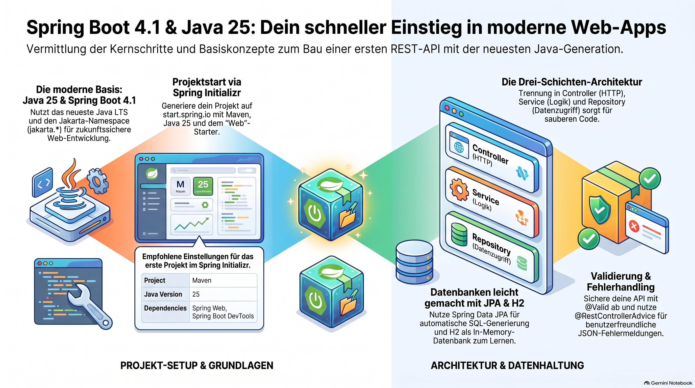

# Spring Boot Tutorial for Absolute Beginners — Spring Boot 4.1 & Java 25

> [NOTE!]
> Dieses Tutorial bietet eine praxisnahe Einführung in **Spring Boot 4.1** unter Verwendung von **Java 25**, die speziell für Programmier-Anfänger konzipiert wurde. Die Quelle erläutert grundlegende Konzepte wie die **automatische Konfiguration**, die Projekterstellung via **Spring Initializr** und den Aufbau einer **REST-API**. Schritt für Schritt werden fortgeschrittene Themen wie die **Drei-Schichten-Architektur**, Datenbankanbindungen mit **JPA und H2** sowie die Validierung von Daten behandelt. Zudem vermittelt der Text Wissen über **automatisierte Tests** und die Konfiguration über Properties-Dateien. Praktische Übungen in Form von **Dojo Katas** helfen dabei, das Gelernte durch die Entwicklung eigener Funktionen zu vertiefen. Insgesamt dient das Material als umfassender Leitfaden für den Einstieg in die moderne, professionelle **Java-Webentwicklung**.


A hands-on, beginner-friendly introduction to building your first web application with **Spring Boot 4.1** on **Java 25**. Written for a **coding dojo**: short explanations, lots of copy-paste-ready code, and a working REST API you build up step by step.

> **Versions used in this tutorial**
> - **Java:** 25 (LTS, released September 2025)
> - **Spring Boot:** 4.1.x (released June 2026, built on Spring Framework 7)
> - **Build tool:** Maven (Gradle notes included)
>
> **Good to know:** Spring Boot 4.1 runs on Java 17 as a minimum, but has first-class support for Java 25. We target Java 25 throughout. Spring Boot 4 uses the **Jakarta** namespace (`jakarta.*`), not the old `javax.*`.

---

## Table of Contents

1. [What Is Spring Boot? (and Why Beginners Love It)](#1-what-is-spring-boot-and-why-beginners-love-it)
2. [Prerequisites: Installing Java 25](#2-prerequisites-installing-java-25)
3. [Generating a Project with Spring Initializr](#3-generating-a-project-with-spring-initializr)
4. [Understanding the Project Structure](#4-understanding-the-project-structure)
5. [Running Your Application for the First Time](#5-running-your-application-for-the-first-time)
6. [Your First REST Endpoint](#6-your-first-rest-endpoint)
7. [Path Variables and Query Parameters](#7-path-variables-and-query-parameters)
8. [Returning JSON with Records](#8-returning-json-with-records)
9. [The Three-Layer Architecture: Controller → Service → Repository](#9-the-three-layer-architecture-controller--service--repository)
10. [Building a Full CRUD API (In-Memory)](#10-building-a-full-crud-api-in-memory)
11. [Adding a Real Database with Spring Data JPA and H2](#11-adding-a-real-database-with-spring-data-jpa-and-h2)
12. [Validation and Error Handling](#12-validation-and-error-handling)
13. [Writing Your First Test](#13-writing-your-first-test)
14. [Configuration with application.properties](#14-configuration-with-applicationproperties)
15. [Dojo Katas: Practice Challenges](#15-dojo-katas-practice-challenges)
16. [Next Steps and Resources](#16-next-steps-and-resources)

---

## 1. What Is Spring Boot? (and Why Beginners Love It)

**Spring** is a hugely popular Java framework for building applications. It is powerful but historically required a lot of manual configuration. **Spring Boot** sits on top of Spring and makes it dramatically easier by giving you:

- **Auto-configuration** — sensible defaults so things "just work."
- **Starter dependencies** — one dependency pulls in everything you need for a feature (e.g., `spring-boot-starter-web` for web apps).
- **An embedded web server** — Tomcat is built in, so you run your app as a plain Java program. No separate server to install.
- **Production-ready features** — health checks, metrics, and more via Actuator.

In short: you write a little code, and you get a running web application.

---

## 2. Prerequisites: Installing Java 25

You need a **JDK 25** (Java Development Kit). Spring Boot 4.1 needs at least Java 17, and we are targeting 25.

**Install a JDK 25** from any of these vendors (all are fine):

- Eclipse Temurin (Adoptium): <https://adoptium.net/temurin/releases/?version=25>
- Oracle JDK 25: <https://www.oracle.com/java/technologies/downloads/#java25>
- Microsoft Build of OpenJDK, Amazon Corretto, or Azul Zulu also work.

**Verify the installation** in a terminal:

```bash
java -version
```

You should see something like:

```
openjdk version "25" 2025-09-16
OpenJDK Runtime Environment (build 25+37)
OpenJDK 64-Bit Server VM (build 25+37, mixed mode, sharing)
```

> **Tip for the dojo:** If people have multiple JDKs installed, tools like **SDKMAN!** (macOS/Linux) or setting `JAVA_HOME` (Windows) help switch versions. On Windows, set `JAVA_HOME` to your JDK 25 folder and add `%JAVA_HOME%\bin` to `PATH`.

You do **not** need to install Maven separately — the generated project includes the **Maven Wrapper** (`mvnw`), which downloads the correct Maven version for you.

---

## 3. Generating a Project with Spring Initializr

The easiest way to start any Spring Boot project is **Spring Initializr**: <https://start.spring.io>

Fill in the form like this:

| Setting | Value |
|---|---|
| Project | **Maven** |
| Language | **Java** |
| Spring Boot | **4.1.x** (pick the latest 4.1 release, not a SNAPSHOT) |
| Group | `com.example` |
| Artifact | `dojo` |
| Name | `dojo` |
| Packaging | **Jar** |
| Java | **25** |

**Dependencies** (click "Add Dependencies"):

- **Spring Web** — build REST APIs and web apps.
- **Spring Boot DevTools** — automatic restarts while you code.

Click **Generate**, download the ZIP, and unzip it into your working folder (for the dojo, e.g. `D:\CodingDojo\dojo`).

> You will add more dependencies (JPA, H2, Validation) later in this tutorial by editing `pom.xml` directly — so you can see exactly what changes.

**Prefer the command line?** You can generate the same project with `curl`:

```bash
curl https://start.spring.io/starter.zip \
  -d type=maven-project \
  -d language=java \
  -d bootVersion=4.1.0 \
  -d javaVersion=25 \
  -d groupId=com.example \
  -d artifactId=dojo \
  -d name=dojo \
  -d packageName=com.example.dojo \
  -d dependencies=web,devtools \
  -o dojo.zip
```

---

## 4. Understanding the Project Structure

Open the project in your IDE (IntelliJ IDEA, VS Code with the Java extensions, or Eclipse). Here is what matters:

```
dojo/
├── pom.xml                      <- dependencies and build config
├── mvnw, mvnw.cmd               <- Maven Wrapper (run Maven without installing it)
└── src/
    ├── main/
    │   ├── java/com/example/dojo/
    │   │   └── DojoApplication.java   <- entry point (main method)
    │   └── resources/
    │       ├── application.properties <- configuration
    │       ├── static/                <- static files (css, js, images)
    │       └── templates/             <- server-rendered HTML (if used)
    └── test/
        └── java/com/example/dojo/
            └── DojoApplicationTests.java  <- tests
```

The **entry point** looks like this:

```java
package com.example.dojo;

import org.springframework.boot.SpringApplication;
import org.springframework.boot.autoconfigure.SpringBootApplication;

@SpringBootApplication
public class DojoApplication {

    public static void main(String[] args) {
        SpringApplication.run(DojoApplication.class, args);
    }
}
```

`@SpringBootApplication` is the magic annotation. It turns on auto-configuration, component scanning (finding your classes), and configuration support all at once.

Your `pom.xml` will reference Spring Boot 4.1 and Java 25 similar to this:

```xml
<parent>
    <groupId>org.springframework.boot</groupId>
    <artifactId>spring-boot-starter-parent</artifactId>
    <version>4.1.0</version>
    <relativePath/>
</parent>

<properties>
    <java.version>25</java.version>
</properties>

<dependencies>
    <dependency>
        <groupId>org.springframework.boot</groupId>
        <artifactId>spring-boot-starter-web</artifactId>
    </dependency>

    <dependency>
        <groupId>org.springframework.boot</groupId>
        <artifactId>spring-boot-devtools</artifactId>
        <scope>runtime</scope>
        <optional>true</optional>
    </dependency>

    <dependency>
        <groupId>org.springframework.boot</groupId>
        <artifactId>spring-boot-starter-test</artifactId>
        <scope>test</scope>
    </dependency>
</dependencies>
```

---

## 5. Running Your Application for the First Time

From the project root, use the Maven Wrapper.

On **macOS/Linux**:

```bash
./mvnw spring-boot:run
```

On **Windows** (PowerShell or cmd):

```powershell
.\mvnw.cmd spring-boot:run
```

Watch the console. Near the end you will see something like:

```
Tomcat started on port 8080 (http) with context path '/'
Started DojoApplication in 1.4 seconds
```

Your app is now running at **http://localhost:8080**. Right now there are no endpoints, so visiting it shows a default error page — that is expected. We fix that next.

> **Stop the app** with `Ctrl+C` in the terminal.

---

## 6. Your First REST Endpoint

Create a new file `HelloController.java` in `src/main/java/com/example/dojo/`:

```java
package com.example.dojo;

import org.springframework.web.bind.annotation.GetMapping;
import org.springframework.web.bind.annotation.RestController;

@RestController
public class HelloController {

    @GetMapping("/hello")
    public String hello() {
        return "Hello from Spring Boot 4.1 on Java 25!";
    }
}
```

What is happening:

- `@RestController` tells Spring this class handles web requests and returns data directly (not HTML views).
- `@GetMapping("/hello")` maps HTTP **GET** requests for `/hello` to this method.

Restart the app (DevTools may auto-restart when you save), then open <http://localhost:8080/hello> in a browser, or use `curl`:

```bash
curl http://localhost:8080/hello
```

You should see your greeting. Congratulations — you built a web API!

---

## 7. Path Variables and Query Parameters

Real APIs take input. Two common ways:

```java
package com.example.dojo;

import org.springframework.web.bind.annotation.GetMapping;
import org.springframework.web.bind.annotation.PathVariable;
import org.springframework.web.bind.annotation.RequestParam;
import org.springframework.web.bind.annotation.RestController;

@RestController
public class GreetingController {

    // Path variable: /greet/Ada  ->  "Hello, Ada!"
    @GetMapping("/greet/{name}")
    public String greetPath(@PathVariable String name) {
        return "Hello, " + name + "!";
    }

    // Query parameter: /welcome?name=Ada  ->  "Welcome, Ada!"
    // The "required = false" + default value makes it optional.
    @GetMapping("/welcome")
    public String greetQuery(@RequestParam(defaultValue = "friend") String name) {
        return "Welcome, " + name + "!";
    }
}
```

Try them:

```bash
curl http://localhost:8080/greet/Ada
curl "http://localhost:8080/welcome?name=Grace"
curl http://localhost:8080/welcome
```

- `@PathVariable` pulls a value out of the URL path.
- `@RequestParam` reads a `?key=value` query parameter.

---

## 8. Returning JSON with Records

APIs usually return JSON, not plain strings. In modern Java, a **record** is the perfect lightweight data holder. Spring Boot automatically converts objects to JSON (using Jackson).

Create `Book.java`:

```java
package com.example.dojo;

// A record is an immutable data carrier: concise and perfect for DTOs.
public record Book(Long id, String title, String author) {
}
```

Add an endpoint that returns one:

```java
package com.example.dojo;

import org.springframework.web.bind.annotation.GetMapping;
import org.springframework.web.bind.annotation.RestController;

import java.util.List;

@RestController
public class BookDemoController {

    @GetMapping("/demo-book")
    public Book demoBook() {
        return new Book(1L, "Clean Code", "Robert C. Martin");
    }

    @GetMapping("/demo-books")
    public List<Book> demoBooks() {
        return List.of(
            new Book(1L, "Clean Code", "Robert C. Martin"),
            new Book(2L, "The Pragmatic Programmer", "Hunt & Thomas")
        );
    }
}
```

Call it:

```bash
curl http://localhost:8080/demo-book
```

Response:

```json
{ "id": 1, "title": "Clean Code", "author": "Robert C. Martin" }
```

Spring Boot turned your record into JSON automatically. No extra code needed.

---

## 9. The Three-Layer Architecture: Controller → Service → Repository

As apps grow, we separate responsibilities into layers. This is a core professional pattern and a great dojo lesson:

- **Controller** — handles HTTP (URLs, request/response). Thin.
- **Service** — business logic. The brain.
- **Repository** — data access (database or, for now, memory).

```
HTTP request → Controller → Service → Repository → data
```

Spring wires these together with **dependency injection**: you declare what you need in a constructor, and Spring supplies it. You never call `new` on these components yourself.

We will build a real feature using these layers next.

---

## 10. Building a Full CRUD API (In-Memory)

Let's build a Book API with all four CRUD operations (Create, Read, Update, Delete) using an in-memory store first — no database yet, so we focus on the structure.

**The service** — `BookService.java`:

```java
package com.example.dojo;

import org.springframework.stereotype.Service;

import java.util.ArrayList;
import java.util.List;
import java.util.Optional;
import java.util.concurrent.atomic.AtomicLong;

@Service // marks this as a Spring-managed business-logic component
public class BookService {

    private final List<Book> books = new ArrayList<>();
    private final AtomicLong idGenerator = new AtomicLong(0);

    public List<Book> findAll() {
        return List.copyOf(books);
    }

    public Optional<Book> findById(Long id) {
        return books.stream().filter(b -> b.id().equals(id)).findFirst();
    }

    public Book create(String title, String author) {
        Book book = new Book(idGenerator.incrementAndGet(), title, author);
        books.add(book);
        return book;
    }

    public Optional<Book> update(Long id, String title, String author) {
        Optional<Book> existing = findById(id);
        existing.ifPresent(b -> {
            books.remove(b);
            books.add(new Book(id, title, author));
        });
        return findById(id);
    }

    public boolean delete(Long id) {
        return books.removeIf(b -> b.id().equals(id));
    }
}
```

**A request body type** for creating/updating — `BookRequest.java`:

```java
package com.example.dojo;

public record BookRequest(String title, String author) {
}
```

**The controller** — `BookController.java`:

```java
package com.example.dojo;

import org.springframework.http.ResponseEntity;
import org.springframework.web.bind.annotation.*;

import java.util.List;

@RestController
@RequestMapping("/api/books") // all endpoints here start with /api/books
public class BookController {

    private final BookService service;

    // Constructor injection: Spring passes in the BookService automatically.
    public BookController(BookService service) {
        this.service = service;
    }

    @GetMapping
    public List<Book> getAll() {
        return service.findAll();
    }

    @GetMapping("/{id}")
    public ResponseEntity<Book> getOne(@PathVariable Long id) {
        return service.findById(id)
                .map(ResponseEntity::ok)                 // 200 if found
                .orElse(ResponseEntity.notFound().build()); // 404 if not
    }

    @PostMapping
    public ResponseEntity<Book> create(@RequestBody BookRequest request) {
        Book created = service.create(request.title(), request.author());
        return ResponseEntity.status(201).body(created); // 201 Created
    }

    @PutMapping("/{id}")
    public ResponseEntity<Book> update(@PathVariable Long id, @RequestBody BookRequest request) {
        return service.update(id, request.title(), request.author())
                .map(ResponseEntity::ok)
                .orElse(ResponseEntity.notFound().build());
    }

    @DeleteMapping("/{id}")
    public ResponseEntity<Void> delete(@PathVariable Long id) {
        return service.delete(id)
                ? ResponseEntity.noContent().build()   // 204
                : ResponseEntity.notFound().build();    // 404
    }
}
```

**Try it out** (restart the app first):

```bash
# Create a book
curl -X POST http://localhost:8080/api/books \
  -H "Content-Type: application/json" \
  -d '{"title":"Effective Java","author":"Joshua Bloch"}'

# List all books
curl http://localhost:8080/api/books

# Get one (use an id you created)
curl http://localhost:8080/api/books/1

# Update it
curl -X PUT http://localhost:8080/api/books/1 \
  -H "Content-Type: application/json" \
  -d '{"title":"Effective Java, 3rd Ed","author":"Joshua Bloch"}'

# Delete it
curl -X DELETE http://localhost:8080/api/books/1
```

> On **Windows PowerShell**, `curl` is an alias for `Invoke-WebRequest` which behaves differently. Use `curl.exe` explicitly, or use the built-in `Invoke-RestMethod`:
> ```powershell
> Invoke-RestMethod -Method Post -Uri http://localhost:8080/api/books `
>   -ContentType "application/json" `
>   -Body '{"title":"Effective Java","author":"Joshua Bloch"}'
> ```

---

## 11. Adding a Real Database with Spring Data JPA and H2

Now let's persist data properly. **H2** is an in-memory database — perfect for learning because it needs zero installation.

**Step 1 — add dependencies** to `pom.xml`:

```xml
<dependency>
    <groupId>org.springframework.boot</groupId>
    <artifactId>spring-boot-starter-data-jpa</artifactId>
</dependency>

<dependency>
    <groupId>com.h2database</groupId>
    <artifactId>h2</artifactId>
    <scope>runtime</scope>
</dependency>
```

**Step 2 — configure H2** in `src/main/resources/application.properties`:

```properties
# In-memory H2 database named "dojo"
spring.datasource.url=jdbc:h2:mem:dojo
spring.datasource.username=sa
spring.datasource.password=

# Create/drop tables automatically from your entities (great for learning)
spring.jpa.hibernate.ddl-auto=update

# Enable the browser-based H2 console at /h2-console
spring.h2.console.enabled=true

# See the SQL Hibernate generates
spring.jpa.show-sql=true
```

**Step 3 — turn Book into an entity.** With JPA we use a class (not a record), because JPA needs a no-arg constructor and mutable fields. Create `BookEntity.java`:

```java
package com.example.dojo;

import jakarta.persistence.Entity;
import jakarta.persistence.GeneratedValue;
import jakarta.persistence.GenerationType;
import jakarta.persistence.Id;

@Entity // maps this class to a database table
public class BookEntity {

    @Id
    @GeneratedValue(strategy = GenerationType.IDENTITY) // auto-increment id
    private Long id;

    private String title;
    private String author;

    // JPA requires a no-argument constructor
    protected BookEntity() {
    }

    public BookEntity(String title, String author) {
        this.title = title;
        this.author = author;
    }

    public Long getId() { return id; }
    public String getTitle() { return title; }
    public String getAuthor() { return author; }

    public void setTitle(String title) { this.title = title; }
    public void setAuthor(String author) { this.author = author; }
}
```

> **Note the `jakarta.persistence` imports** — Spring Boot 4 uses the Jakarta namespace. If you find old tutorials using `javax.persistence`, that is the pre–Spring Boot 3 style and will not work here.

**Step 4 — create a repository.** This is the part beginners love: you write an *interface* and Spring implements it for you. Create `BookRepository.java`:

```java
package com.example.dojo;

import org.springframework.data.jpa.repository.JpaRepository;

import java.util.List;

// Extending JpaRepository gives you save, findAll, findById, deleteById, etc. for free.
public interface BookRepository extends JpaRepository<BookEntity, Long> {

    // Spring Data derives the query from the method name — no SQL needed!
    List<BookEntity> findByAuthor(String author);
}
```

**Step 5 — a controller that uses the database.** Create `JpaBookController.java`:

```java
package com.example.dojo;

import org.springframework.http.ResponseEntity;
import org.springframework.web.bind.annotation.*;

import java.util.List;

@RestController
@RequestMapping("/api/jpa/books")
public class JpaBookController {

    private final BookRepository repository;

    public JpaBookController(BookRepository repository) {
        this.repository = repository;
    }

    @GetMapping
    public List<BookEntity> all() {
        return repository.findAll();
    }

    @GetMapping("/{id}")
    public ResponseEntity<BookEntity> one(@PathVariable Long id) {
        return repository.findById(id)
                .map(ResponseEntity::ok)
                .orElse(ResponseEntity.notFound().build());
    }

    @GetMapping("/by-author")
    public List<BookEntity> byAuthor(@RequestParam String author) {
        return repository.findByAuthor(author);
    }

    @PostMapping
    public ResponseEntity<BookEntity> create(@RequestBody BookRequest request) {
        BookEntity saved = repository.save(new BookEntity(request.title(), request.author()));
        return ResponseEntity.status(201).body(saved);
    }

    @DeleteMapping("/{id}")
    public ResponseEntity<Void> delete(@PathVariable Long id) {
        if (!repository.existsById(id)) {
            return ResponseEntity.notFound().build();
        }
        repository.deleteById(id);
        return ResponseEntity.noContent().build();
    }
}
```

**Try it, then inspect the database.** Create a couple of books via POST, then open the **H2 console** at <http://localhost:8080/h2-console>. Use JDBC URL `jdbc:h2:mem:dojo`, user `sa`, no password. Run `SELECT * FROM BOOK_ENTITY;` and see your data.

---

## 12. Validation and Error Handling

Never trust incoming data. Add the validation starter to `pom.xml`:

```xml
<dependency>
    <groupId>org.springframework.boot</groupId>
    <artifactId>spring-boot-starter-validation</artifactId>
</dependency>
```

Add constraints to the request record using `jakarta.validation`:

```java
package com.example.dojo;

import jakarta.validation.constraints.NotBlank;
import jakarta.validation.constraints.Size;

public record ValidatedBookRequest(
        @NotBlank(message = "title is required")
        @Size(max = 200, message = "title must be at most 200 characters")
        String title,

        @NotBlank(message = "author is required")
        String author
) {
}
```

Use `@Valid` in the controller to trigger validation:

```java
package com.example.dojo;

import jakarta.validation.Valid;
import org.springframework.http.ResponseEntity;
import org.springframework.web.bind.annotation.*;

@RestController
@RequestMapping("/api/validated/books")
public class ValidatedBookController {

    private final BookRepository repository;

    public ValidatedBookController(BookRepository repository) {
        this.repository = repository;
    }

    @PostMapping
    public ResponseEntity<BookEntity> create(@Valid @RequestBody ValidatedBookRequest request) {
        BookEntity saved = repository.save(new BookEntity(request.title(), request.author()));
        return ResponseEntity.status(201).body(saved);
    }
}
```

Now send an invalid request:

```bash
curl -X POST http://localhost:8080/api/validated/books \
  -H "Content-Type: application/json" \
  -d '{"title":"","author":"Someone"}'
```

You will get a **400 Bad Request**. To return clean, friendly error messages, add a global handler using `@RestControllerAdvice`:

```java
package com.example.dojo;

import org.springframework.http.HttpStatus;
import org.springframework.http.ResponseEntity;
import org.springframework.web.bind.MethodArgumentNotValidException;
import org.springframework.web.bind.annotation.ExceptionHandler;
import org.springframework.web.bind.annotation.RestControllerAdvice;

import java.util.HashMap;
import java.util.Map;

@RestControllerAdvice // applies to all controllers
public class GlobalExceptionHandler {

    @ExceptionHandler(MethodArgumentNotValidException.class)
    public ResponseEntity<Map<String, String>> handleValidation(MethodArgumentNotValidException ex) {
        Map<String, String> errors = new HashMap<>();
        ex.getBindingResult().getFieldErrors().forEach(error ->
                errors.put(error.getField(), error.getDefaultMessage())
        );
        return ResponseEntity.status(HttpStatus.BAD_REQUEST).body(errors);
    }
}
```

Now the same invalid request returns readable JSON:

```json
{ "title": "title is required" }
```

---

## 13. Writing Your First Test

Testing is central to a dojo. Spring Boot's `spring-boot-starter-test` (already included) bundles JUnit 5, AssertJ, and Mockito.

A simple unit test for the in-memory service — `BookServiceTest.java` in `src/test/java/com/example/dojo/`:

```java
package com.example.dojo;

import org.junit.jupiter.api.Test;

import static org.assertj.core.api.Assertions.assertThat;

class BookServiceTest {

    @Test
    void createAssignsIdAndStoresBook() {
        BookService service = new BookService();

        Book created = service.create("Refactoring", "Martin Fowler");

        assertThat(created.id()).isNotNull();
        assertThat(created.title()).isEqualTo("Refactoring");
        assertThat(service.findAll()).hasSize(1);
    }

    @Test
    void deleteRemovesBook() {
        BookService service = new BookService();
        Book created = service.create("TDD by Example", "Kent Beck");

        boolean deleted = service.delete(created.id());

        assertThat(deleted).isTrue();
        assertThat(service.findAll()).isEmpty();
    }
}
```

A web-layer test that actually starts the app context and calls the endpoint — `HelloControllerTest.java`:

```java
package com.example.dojo;

import org.junit.jupiter.api.Test;
import org.springframework.beans.factory.annotation.Autowired;
import org.springframework.boot.test.autoconfigure.web.servlet.WebMvcTest;
import org.springframework.test.web.servlet.MockMvc;

import static org.springframework.test.web.servlet.request.MockMvcRequestBuilders.get;
import static org.springframework.test.web.servlet.result.MockMvcResultMatchers.content;
import static org.springframework.test.web.servlet.result.MockMvcResultMatchers.status;

@WebMvcTest(HelloController.class) // loads only the web layer for this controller
class HelloControllerTest {

    @Autowired
    private MockMvc mockMvc;

    @Test
    void helloReturnsGreeting() throws Exception {
        mockMvc.perform(get("/hello"))
                .andExpect(status().isOk())
                .andExpect(content().string("Hello from Spring Boot 4.1 on Java 25!"));
    }
}
```

Run all tests:

```bash
./mvnw test        # macOS/Linux
.\mvnw.cmd test    # Windows
```

Green tests mean your API behaves as expected.

---

## 14. Configuration with application.properties

`src/main/resources/application.properties` is where you tune your app without touching code. Handy beginner settings:

```properties
# Change the server port (default is 8080)
server.port=8081

# Set the logging level
logging.level.org.springframework.web=INFO
logging.level.com.example.dojo=DEBUG

# A custom property you can read in your own code
app.welcome-message=Welcome to the Coding Dojo!
```

Read your custom property anywhere with `@Value`:

```java
package com.example.dojo;

import org.springframework.beans.factory.annotation.Value;
import org.springframework.web.bind.annotation.GetMapping;
import org.springframework.web.bind.annotation.RestController;

@RestController
public class ConfigController {

    @Value("${app.welcome-message}")
    private String welcomeMessage;

    @GetMapping("/config-demo")
    public String welcome() {
        return welcomeMessage;
    }
}
```

> Spring Boot also supports `application.yml` (YAML) if you prefer that format. Properties files are the simplest starting point.

---

## 15. Dojo Katas: Practice Challenges

Work through these in pairs. Each builds on the API above.

1. **Kata 1 — Search.** Add `GET /api/jpa/books/search?title=xxx` that returns books whose title contains the given text. Hint: `findByTitleContainingIgnoreCase` in the repository.
2. **Kata 2 — Count.** Add `GET /api/jpa/books/count` returning the total number of books as JSON like `{ "count": 5 }`.
3. **Kata 3 — Publication year.** Add a `year` field to `BookEntity`, migrate the request records, and add validation that the year is between 1450 and the current year.
4. **Kata 4 — Not found is friendly.** Extend `GlobalExceptionHandler` so a missing book returns a JSON body like `{ "error": "Book 99 not found" }` with status 404 (throw a custom exception from the service).
5. **Kata 5 — Test the CRUD.** Write a `@WebMvcTest` for `BookController` that creates a book via POST and asserts a 201 response. Use `@MockitoBean` to mock the `BookService`.
6. **Kata 6 — Actuator.** Add `spring-boot-starter-actuator`, then hit `/actuator/health`. Explore what other endpoints you can enable.

---

## 16. Next Steps and Resources

You have built a validated, tested, database-backed REST API on Spring Boot 4.1 and Java 25 — the foundation of most Spring applications.

Where to go next:

- **Spring Security** — add authentication and authorization (`spring-boot-starter-security`).
- **Real databases** — swap H2 for PostgreSQL or MySQL by changing the dependency and `application.properties`.
- **Profiles** — use `application-dev.properties` / `application-prod.properties` for per-environment config.
- **Spring Boot Actuator** — production monitoring and metrics.
- **Building for deployment** — `./mvnw clean package` produces a runnable JAR in `target/`; run it with `java -jar target/dojo-0.0.1-SNAPSHOT.jar`.

Reference documentation:

- **Spring Boot reference (4.1):** <https://docs.spring.io/spring-boot/4.1/index.html>
- **Spring Boot guides:** <https://spring.io/guides>
- **Spring Initializr:** <https://start.spring.io>
- **Spring Framework 7 reference:** <https://docs.spring.io/spring-framework/reference/7.0/index.html>
- **Java 25 documentation:** <https://docs.oracle.com/en/java/javase/25/>

Happy coding at the dojo! 🥋
