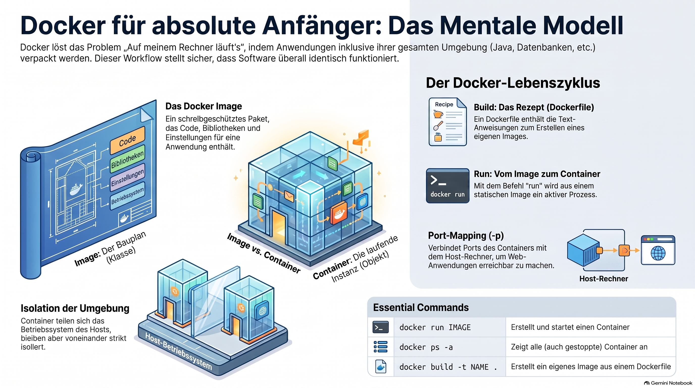

> [NOTE!]
> Dieser **Docker-Anfängerkurs** von Karl Schmitt vermittelt die grundlegenden Konzepte der Containerisierung für Einsteiger ohne Vorwissen. Der Text erläutert den entscheidenden Unterschied zwischen **Images als Baupläne** und **Containern als laufende Instanzen** von Software. Leser lernen praxisnah, wie man Umgebungen isoliert, um das Problem unterschiedlicher Systemkonfigurationen bei der Softwareentwicklung zu umgehen. Neben der Installation und den wichtigsten **Terminal-Befehlen** behandelt das Tutorial auch die Erstellung eigener Images mittels **Dockerfiles** sowie das Port-Mapping. Ziel des Leitfadens ist es, ein solides mentales Modell aufzubauen, das später die Integration von **Java und Spring Boot** in Docker-Umgebungen ermöglicht. Abschließend bietet die Quelle einen strukturierten Lernpfad, der von den Basisfunktionen bis hin zu komplexen Orchestrierungen mit **Docker Compose** führt.


Absolutely. Since you're learning Java/Spring Boot as well, I’ll make this **Docker Absolute Beginner Tutorial** practical and eventually connect Docker to **Java and Spring Boot**.

# 🐳 Docker Absolute Beginner Tutorial

We'll start from **zero Docker knowledge**.

The goal is not merely to memorize Docker commands. The goal is to understand the mental model:

> **What is Docker? Why does it exist? What is an image? What is a container? How do I create, start, stop, inspect, and connect containers?**

1. What is Docker?
2. Why does Docker exist?
3. What is an image?
4. What is a container?
5. How do I create a container?
6. How do I start a container?
7. How do I stop a containef?
8. How do I inspect a container?
9. How do I connect a container?

***

# 1. What problem does Docker solve?

Imagine you write a Java application.

On your computer you have:

```text
Windows 11
Java 21
Maven
Spring Boot
PostgreSQL
Redis
...
```

Your application works perfectly.

Then you give it to another developer.

They install:

```text
Java 17
PostgreSQL 16
...
```

Suddenly:

> "It works on my machine!"

Docker helps solve this problem.

Instead of saying:

> "Please install Java, PostgreSQL, Redis, and these exact versions..."

you can package software together with the environment it needs.

Conceptually:

```text
┌──────────────────────────────┐
│          Docker              │
│                              │
│  ┌────────────────────────┐  │
│  │ Your application       │  │
│  │ Java                   │  │
│  │ Libraries              │  │
│  │ Configuration          │  │
│  └────────────────────────┘  │
│                              │
└──────────────────────────────┘
```

That package can then run consistently on another machine.

***

# 2. What exactly is Docker?

Docker is a platform for **building, distributing, and running containers**.

The most important words are:

```text
Image
Container
Dockerfile
Registry
Volume
Network
```

Don't worry about all of them yet.

We'll learn them one by one.

***

# 3. Your first important mental model

Think about a **Java class**.

You write:

```java
public class Hello {
    public static void main(String[] args) {
        System.out.println("Hello!");
    }
}
```

You compile it.

You can then run the resulting program.

Docker has a similar distinction:

```text
Docker image
     ↓
Docker container
```

An **image** is a packaged blueprint.

A **container** is a running instance of that image.

A useful analogy is:

```text
Class       → Object
Image       → Container
```

For example:

```text
nginx image
     │
     ├── container 1
     │
     ├── container 2
     │
     └── container 3
```

One image can create many containers.

***

# 4. Docker Image

An image contains everything necessary to create a container.

For example:

```text
Ubuntu image
```

or:

```text
nginx image
```

or:

```text
postgres image
```

or eventually:

```text
my-spring-boot-app image
```

An image is **not normally something you manually construct file by file**.

Usually you obtain one from a **container registry**.

The most famous registry is Docker Hub.

***

# 5. Docker Container

A container is a running instance of an image.

For example:

```text
Image
  │
  ▼
nginx
  │
  ▼
Container
```

You can start the container:

```powershell
docker run nginx
```

Docker then:

1. checks whether the `nginx` image exists locally

2. downloads it if necessary

3. creates a container

4. starts the container

***

# 6. Install Docker

On Windows, the normal way for beginners is **Docker Desktop**.

After installation, open PowerShell and test:

```powershell
docker --version
```

You should see something similar to:

```text
Docker version 29.x.x
```

The exact version doesn't matter for this tutorial.

Then:

```powershell
docker info
```

This provides information about the Docker installation.

If that works, Docker is running.

***

# 7. Your first Docker command

Let's run something.

Execute:

```powershell
docker run hello-world
```

Docker may download the image first.

You should eventually see a message beginning approximately with:

```text
Hello from Docker!
```

🎉 Congratulations.

You have just:

```text
Docker client
     │
     ▼
Docker engine
     │
     ▼
Docker Hub
     │
     ▼
hello-world image
     │
     ▼
container
     │
     ▼
program executes
```

This tiny example is actually very important.

***

# 8. What happened?

When you typed:

```powershell
docker run hello-world
```

Docker interpreted:

```text
docker
```

as the Docker command-line client.

Then:

```text
run
```

means:

> Create and start a container.

And:

```text
hello-world
```

is the image name.

So:

```text
docker run IMAGE
```

means roughly:

> "Create a container from this image and start it."

***

# 9. Look at your containers

Now execute:

```powershell
docker ps
```

You may see:

```text
CONTAINER ID   IMAGE   COMMAND   CREATED   STATUS   PORTS   NAMES
```

But perhaps there is nothing there.

Why?

Because:

```powershell
docker ps
```

shows **currently running containers**.

Our `hello-world` container already finished.

***

# 10. Show all containers

Use:

```powershell
docker ps -a
```

Now you should see your `hello-world` container.

Something like:

```text
CONTAINER ID   IMAGE         STATUS
abc123         hello-world   Exited (0)
```

This teaches us something important:

> A container doesn't necessarily run forever.

A container runs its main process.

When that process finishes:

```text
container
    │
    ▼
process finishes
    │
    ▼
container stops
```

The container still exists, but it isn't running.

***

# 11. Images versus containers

This distinction is fundamental.

Run:

```powershell
docker images
```

You might see:

```text
REPOSITORY    TAG       IMAGE ID
hello-world   latest    ...
```

And:

```powershell
docker ps -a
```

shows containers.

So:

```text
docker images
        ↓
Images

docker ps
        ↓
Running containers

docker ps -a
        ↓
All containers
```

***

# 12. Your second container: nginx

Now let's do something more interesting.

Run:

```powershell
docker run nginx
```

Docker downloads the nginx image if necessary.

But something interesting happens:

**Your PowerShell appears to hang.**

It hasn't crashed.

The nginx container is running in the foreground.

Press:

```text
Ctrl + C
```

The container stops.

***

# 13. Run a container in the background

We usually don't want our terminal occupied by a server.

Docker provides:

```text
-d
```

which means:

> detached mode

Run:

```powershell
docker run -d nginx
```

You should get something like:

```text
8f4a3c...
```

That's the container ID.

Now:

```powershell
docker ps
```

You should see nginx running.

***

# 14. Give your container a name

Instead of allowing Docker to generate a name, we can choose one.

```powershell
docker run -d --name my-nginx nginx
```

Now:

```powershell
docker ps
```

might show:

```text
CONTAINER ID   IMAGE   STATUS         NAMES
abc123         nginx   Up 10 seconds  my-nginx
```

This is much easier to work with.

***

# 15. Stop a container

Run:

```powershell
docker stop my-nginx
```

Then:

```powershell
docker ps
```

It should no longer appear.

But:

```powershell
docker ps -a
```

will show it.

The container still exists.

It is simply stopped.

***

# 16. Start an existing container

You don't need to create another container.

You can start the existing one:

```powershell
docker start my-nginx
```

Then:

```powershell
docker ps
```

and it should be running again.

This distinction is important:

```text
docker run
    ↓
create + start a NEW container

docker start
    ↓
start an EXISTING container
```

***

# 17. Delete a container

Stop it:

```powershell
docker stop my-nginx
```

Then:

```powershell
docker rm my-nginx
```

Now:

```powershell
docker ps -a
```

It should be gone.

***

# 18. Delete an image

First see your images:

```powershell
docker images
```

Then you can remove an image:

```powershell
docker rmi hello-world
```

Important distinction:

```text
docker rm
    → removes container

docker rmi
    → removes image
```

***

# 19. The basic Docker lifecycle

You can now understand the basic lifecycle:

```text
             docker run
                 │
                 ▼
             ┌─────────┐
             │ Created │
             └────┬────┘
                  │
                  ▼
             ┌─────────┐
             │ Running │
             └────┬────┘
                  │
             docker stop
                  │
                  ▼
             ┌─────────┐
             │ Stopped │
             └────┬────┘
                  │
              docker rm
                  │
                  ▼
              Deleted
```

This is one of the most important things to understand as a Docker beginner.

***

# 20. Docker ports

Now we're going to do something very important for web development.

Suppose nginx runs inside a container.

Nginx listens on:

```text
port 80
```

But that's inside the container.

Your Windows machine has its own network.

We need to connect the two.

For example:

```text
Windows
localhost:8080
      │
      │
      ▼
Docker
      │
      ▼
Container
      │
      ▼
nginx :80
```

We can do this:

```powershell
docker run -d --name my-nginx -p 8080:80 nginx
```

The important part is:

```text
-p 8080:80
```

This means:

```text
HOST PORT : CONTAINER PORT
     8080 : 80
```

***

# 21. Open nginx in your browser

Open:

```text
http://localhost:8080
```

You should see the nginx welcome page.

Congratulations.

You've just connected:

```text
Chrome
   │
   ▼
localhost:8080
   │
   ▼
Docker
   │
   ▼
container:80
   │
   ▼
nginx
```

This concept becomes extremely important when running Spring Boot applications in Docker.

***

# 22. Why do we need port mapping?

Imagine your container has:

```text
nginx :80
```

Your Windows machine doesn't automatically expose that port.

The `-p` option creates the connection.

```text
-p 8080:80
   │    │
   │    └── container
   │
   └─────── host
```

Another example:

```powershell
docker run -d -p 9000:80 nginx
```

Then:

```text
localhost:9000
       ↓
container:80
```

You could therefore run:

```text
localhost:8080 → container A :80
localhost:9000 → container B :80
```

***

# 23. Dockerfile

So far we've used existing images.

Now we're going to create **our own image**.

This is where the `Dockerfile` comes in.

A Dockerfile is a text file containing instructions for building an image.

For example:

```dockerfile
FROM nginx

COPY index.html /usr/share/nginx/html/index.html
```

This says:

```text
FROM nginx
```

Start with the nginx image.

Then:

```text
COPY index.html ...
```

Copy our HTML file into the nginx web directory.

***

# 24. Your first Docker project

Create a directory:

```powershell
mkdir docker-hello
cd docker-hello
```

Create:

```text
index.html
```

with:

```html
<!DOCTYPE html>
<html>
<head>
    <title>Docker Hello</title>
</head>
<body>
    <h1>Hello from my Docker container!</h1>
</body>
</html>
```

Then create:

```text
Dockerfile
```

containing:

```dockerfile
FROM nginx

COPY index.html /usr/share/nginx/html/index.html
```

Your project now looks like:

```text
docker-hello/
│
├── Dockerfile
└── index.html
```

***

# 25. Build your image

From inside the directory:

```powershell
docker build -t my-web-app .
```

Let's understand this command:

```text
docker build
```

Build an image.

```text
-t my-web-app
```

Give the image the name:

```text
my-web-app
```

And:

```text
.
```

means:

> Use the current directory as the build context.

***

# 26. Look at your image

Run:

```powershell
docker images
```

You should see:

```text
my-web-app
nginx
...
```

You've just created your first Docker image.

***

# 27. Run your own image

Now:

```powershell
docker run -d --name my-web -p 8080:80 my-web-app
```

Open:

```text
http://localhost:8080
```

You should see:

```text
Hello from my Docker container!
```

🎉

You have now created:

```text
index.html
      │
      ▼
Dockerfile
      │
      ▼
docker build
      │
      ▼
Docker image
      │
      ▼
docker run
      │
      ▼
Docker container
      │
      ▼
nginx
      │
      ▼
Browser
```

That's the fundamental Docker workflow.

***

# 28. The Dockerfile mental model

Think of the Dockerfile as a recipe.

For example:

```dockerfile
FROM nginx

COPY index.html /usr/share/nginx/html/index.html
```

means:

```text
Recipe
  │
  ├── Start with nginx
  │
  └── Add my HTML
       │
       ▼
     Image
       │
       ▼
    Container
```

***

# 29. Important Docker commands

Here's your first Docker cheat sheet:

| Command               | Meaning                          |
| --------------------- | -------------------------------- |
| `docker --version`    | Show Docker version              |
| `docker info`         | Docker system information        |
| `docker images`       | Show images                      |
| `docker pull IMAGE`   | Download an image                |
| `docker run IMAGE`    | Create and start container       |
| `docker ps`           | Show running containers          |
| `docker ps -a`        | Show all containers              |
| `docker stop NAME`    | Stop container                   |
| `docker start NAME`   | Start existing container         |
| `docker restart NAME` | Restart container                |
| `docker rm NAME`      | Delete container                 |
| `docker rmi IMAGE`    | Delete image                     |
| `docker logs NAME`    | Show container logs              |
| `docker exec ...`     | Execute command inside container |
| `docker build ...`    | Build an image                   |

Don't try to memorize all of them.

You will naturally learn the frequently used ones.

***

# 30. One extremely important command: `docker logs`

Suppose you have:

```powershell
docker run -d --name my-nginx nginx
```

You can inspect its output:

```powershell
docker logs my-nginx
```

For a Spring Boot application, this becomes extremely useful:

```powershell
docker logs my-spring-app
```

You might see:

```text
Started Application in 3.2 seconds
Tomcat started on port 8080
```

***

# 31. Enter a running container

You can execute a command inside a container.

For example:

```powershell
docker exec -it my-nginx bash
```

Now you're inside the container.

You might see:

```text
root@abc123:/#
```

You can execute Linux commands:

```bash
ls
```

```bash
pwd
```

```bash
cat /etc/os-release
```

To leave:

```bash
exit
```

This is extremely useful when debugging.

***

# 32. Containers are isolated

Imagine your Windows machine:

```text
Windows
│
├── Java
├── Git
├── VS Code
├── Chrome
└── Docker
      │
      └── Container
           ├── Linux environment
           ├── nginx
           └── application
```

The container has its own filesystem and process environment.

This isolation is one of Docker's major strengths.

***

# 33. Docker containers are NOT virtual machines

This is an important beginner question.

A virtual machine looks roughly like:

```text
Computer
   │
   ├── Windows
   │
   └── VM
        │
        └── complete guest OS
```

Containers work differently.

Conceptually:

```text
Computer
   │
   └── Docker
        │
        ├── Container
        ├── Container
        └── Container
```

Containers share the host's underlying operating-system facilities rather than each carrying a complete traditional VM operating system.

This makes containers generally much lighter and faster to start than full VMs.

On Windows, Docker Desktop uses a Linux environment under the hood for Linux containers, commonly via WSL 2.

***

# 34. The next big concept: Volumes

Containers are usually treated as **disposable**.

Suppose a container contains:

```text
database data
```

Then you delete the container:

```powershell
docker rm database
```

You don't want your database data to disappear with it.

Docker provides **volumes**.

Conceptually:

```text
Container
   │
   │
   ▼
Volume
   │
   ▼
Persistent data
```

We'll explore this carefully later.

***

# 35. The next big concept: Networks

Suppose you have:

```text
Spring Boot
      │
      ▼
PostgreSQL
```

Both applications run in containers.

They need to communicate.

Docker provides networks:

```text
Docker Network
│
├── spring-container
│
└── postgres-container
```

Then the Spring application can communicate with PostgreSQL through Docker's internal network.

This is where Docker starts becoming particularly useful for backend development.

***

# 36. Docker Compose

Imagine your Spring Boot application needs:

```text
Spring Boot
PostgreSQL
Redis
Kafka
```

Starting all of them manually could become annoying.

Docker Compose lets you describe the whole environment.

For example:

```yaml
services:

  postgres:
    image: postgres

  redis:
    image: redis

  app:
    image: my-spring-app
```

Then:

```powershell
docker compose up
```

can start the environment.

This is a major Docker topic and deserves its own tutorial.

***

# 37. Docker + Spring Boot

Eventually we'll arrive at something like:

```text
                    Docker
┌────────────────────────────────────────────┐
│                                            │
│  ┌─────────────────┐                       │
│  │ Spring Boot     │                       │
│  │ Container       │                       │
│  │                 │                       │
│  │ Java             │                       │
│  │ Spring Boot      │                       │
│  └────────┬────────┘                       │
│           │                                │
│           │                                │
│  ┌────────▼────────┐                       │
│  │ PostgreSQL      │                       │
│  │ Container       │                       │
│  └─────────────────┘                       │
│                                            │
└────────────────────────────────────────────┘
```

And your Windows machine might access the application through:

```text
http://localhost:8080
```

This is the direction I'd recommend for you because it connects Docker directly to the Spring Boot work you're already doing.

***

# 38. Your Docker learning path

I recommend learning Docker in this order:

### Level 1 — Fundamentals

```text
☑ What is Docker?
☑ Image
☑ Container
☑ Docker Engine
☑ Docker Hub
☑ docker run
☑ docker ps
☑ docker stop
☑ docker rm
```

### Level 2 — Running applications

```text
☐ Ports
☐ Environment variables
☐ Logs
☐ docker exec
☐ Container lifecycle
```

### Level 3 — Building images

```text
☐ Dockerfile
☐ FROM
☐ COPY
☐ RUN
☐ CMD
☐ ENTRYPOINT
☐ EXPOSE
☐ .dockerignore
```

### Level 4 — Persistent data

```text
☐ Volumes
☐ Bind mounts
☐ Container filesystem
```

### Level 5 — Networking

```text
☐ Docker networks
☐ Container-to-container communication
☐ DNS inside Docker
☐ Port mapping
```

### Level 6 — Docker Compose

```text
☐ compose.yaml
☐ services
☐ networks
☐ volumes
☐ environment
☐ docker compose up
☐ docker compose down
```

### Level 7 — Java/Spring Boot

```text
☐ Dockerize a Java application
☐ Dockerize Spring Boot
☐ Multi-stage builds
☐ Spring Boot + PostgreSQL
☐ Spring Boot + Docker Compose
```

### Level 8 — Professional Docker

```text
☐ Image optimization
☐ Multi-stage builds
☐ Security
☐ Non-root containers
☐ Health checks
☐ Container registries
☐ CI/CD
☐ Production considerations
```

***

# 39. Your first practical exercise

I recommend **not** jumping immediately into Docker Compose or Kubernetes.

First make sure these commands feel comfortable:

```powershell
docker --version
```

```powershell
docker images
```

```powershell
docker ps
```

```powershell
docker ps -a
```

Then:

```powershell
docker run hello-world
```

Then:

```powershell
docker run -d --name my-nginx -p 8080:80 nginx
```

Open:

```text
http://localhost:8080
```

Then:

```powershell
docker logs my-nginx
```

Then:

```powershell
docker stop my-nginx
```

Then:

```powershell
docker start my-nginx
```

Finally:

```powershell
docker stop my-nginx
docker rm my-nginx
```

If you understand what happened during those commands, you already have the beginnings of a solid Docker mental model.

***

# 40. The five concepts I want you to remember

For now, don't try to remember 50 Docker commands.

Remember these five:

```text
                 Docker
                    │
        ┌───────────┼───────────┐
        │           │           │
      Image     Container    Dockerfile
        │           │
        │           │
     blueprint    running
                  instance
```

And:

```text
Image
  ↓
Container
  ↓
Application
```

while:

```text
Dockerfile
     ↓
docker build
     ↓
Image
     ↓
docker run
     ↓
Container
```

That is the **core Docker story**.

***

## 🐳 Recommended next lesson

For an absolute beginner, I'd continue with:

**Docker Absolute Beginner — Part 2: Containers in Depth**

where we would take one container apart and learn:

1. `docker run` in detail

2. container names and IDs

3. foreground vs. detached mode

4. ports and `-p`

5. environment variables with `-e`

6. `docker logs`

7. `docker exec`

8. `docker inspect`

9. container lifecycle

10. a small hands-on exercise

Then **Part 3** can be **Dockerfiles from Absolute Beginner to Java/Spring Boot**, which would be a particularly useful next step for you.
