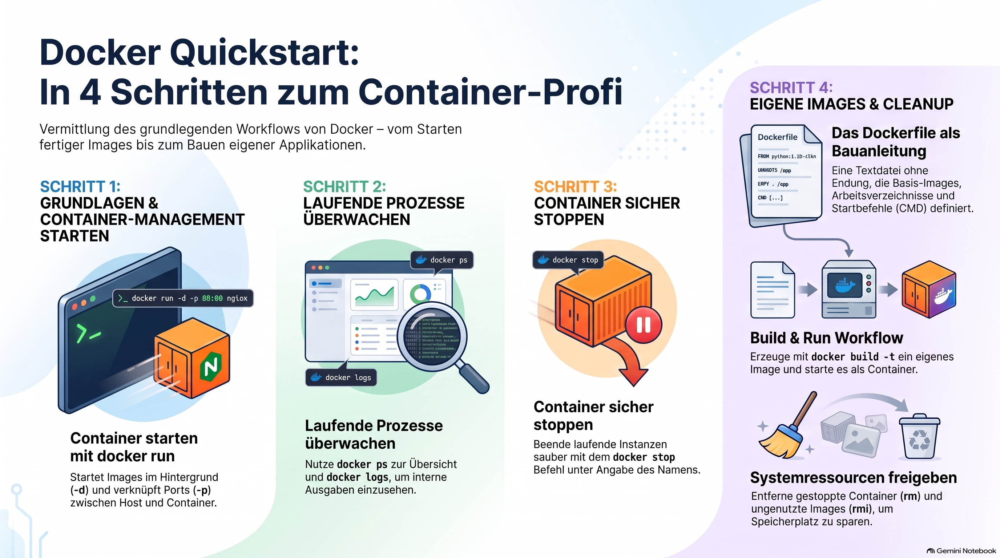
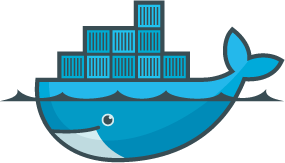

> [NOTE!]
> Diese Quelle bietet eine **praxisorientierte Einführung** in die Grundlagen von **Docker** für Einsteiger. Der Text leitet Nutzer zunächst durch die **Installation** und die Ausführung eines ersten **Nginx-Webservers** in einem Container. Ein wesentlicher Teil des Leitfadens erklärt das **Erstellen eigener Images** mithilfe eines Dockerfiles am Beispiel einer **Python-Anwendung**. Zudem werden wichtige Befehle zur **Verwaltung und Überwachung** laufender Prozesse sowie zur **Bereinigung des Systems** detailliert beschrieben. Ziel des Tutorials ist es, durch **direkte Anwendung** ein grundlegendes Verständnis für die **Containerisierung** von Software zu vermitteln. Damit dient das Dokument als kompakte **Schritt-für-Schritt-Anleitung** für die ersten eigenständigen Projekte in der Docker-Umgebung.



# 🐳Docker Step by Step Tutorial

Yes, here is a practical, step-by-step tutorial designed to give you instant hands-on experience with Docker fundamentals.

## Prerequisites

Before starting, ensure you have downloaded and installed [Docker Desktop](https://www.docker.com/101-tutorial/). Open your terminal (or Command Prompt) and verify the installation: \[1, 2]
```bash
docker --version
```
***

## Step 1: Run Your First Container

Docker containers are running instances of pre-packaged "images". Let's pull and run a lightweight web server (Nginx) directly from Docker Hub.

Run the following command:

```bash
docker run -d -p 8080:80 --name my-web-server nginx
```

What this command does:

* `docker run`: Tells Docker to create and start a container.
* `-d`: Runs the container in detached mode (in the background).
* `-p 8080:80`: Port binding. Maps port 8080 on your host computer to port 80 inside the container.
* `--name my-web-server`: Gives your container a memorable name.
* `nginx`: The image name to use. Docker downloads it automatically if you don't have it locally. \

Test it: Open your browser and navigate to `http://localhost:8080`. You will see the default "Welcome to nginx!" page.

***

## Step 2: Manage Your Container

Now that a container is running, use these commands to inspect and manage it:

1. List running containers:
   ```bash
   docker ps
   ```
2. View live container logs:
   ```bash
   docker logs my-web-server
   ```
3. Stop the container:
   ```bash
   docker stop my-web-server
   ```
   
***

## Step 3: Build Your Own Custom Docker Image

Instead of just using public images, you can containerize your own applications. Let's build a basic Python Flask web app.

1. Create a new directory and navigate into it:
   ```bash
   mkdir docker-demo && cd docker-demo
   ```
2. Create a file named `app.py` and add this code:
   ```python
   from flask import Flask
   app = Flask(__name__)

   @app.route('/')
   def home():
       return "Hello from your custom Docker container!"

   if __name__ == '__main__':
       app.run(host='0.0.0.0', port=5000)
   ```
3. Create a configuration file named `Dockerfile` (no file extension) in the same directory. This file provides the recipe for your image:
   ```dockerfile
   # Step 1: Use an official, lightweight Python runtime as a parent image
   FROM python:3.10-slim

   # Step 2: Set the working directory inside the container
   WORKDIR /app

   # Step 3: Install Flask directly
   RUN pip install flask

   # Step 4: Copy the current directory contents into the container at /app
   COPY . .

   # Step 5: Make port 5000 available to the world outside this container
   EXPOSE 5000

   # Step 6: Run app.py when the container launches
   CMD ["python", "app.py"]
   ```
4. Build the image using the `docker build` command (don't forget the trailing period `.`, which means "current directory"):
   ```bash
   docker build -t my-python-app .
   ```
5. Run your new custom container:
   ```bash
   docker run -d -p 5000:5000 --name running-app my-python-app
   ```

Test it: Visit `http://localhost:5000` in your web browser. You will see the custom message render seamlessly.

***

## Step 4: Clean Up Your Environment

To keep your computer clean, stop and remove the resources you just created.

```bash
# Stop and remove the Python container
docker stop running-app
docker rm running-app

# Remove the Nginx container you stopped earlier
docker rm my-web-server

# List local images to find your Image ID
docker images

# Delete your custom image
docker rmi my-python-app
```

Would you like to explore how to link multiple containers together (like a web app and a database) using Docker Compose, or would you prefer to learn about Docker Volumes for persisting data?

