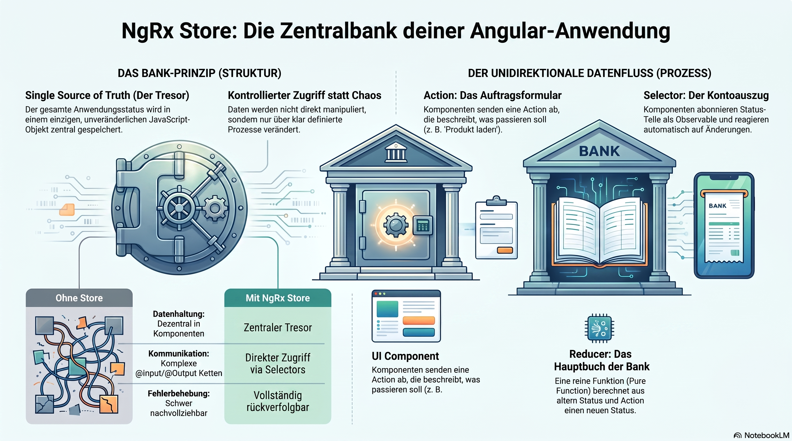

> [NOTE!]
> Der Text erläutert das **NgRx Store-Konzept** für Angular-Anwendungen anhand einer Banken-Analogie und technischer Details. Der Store fungiert als **zentrale Datenbank**, die den gesamten Zustand der Applikation in einem einzigen, unveränderlichen Objekt verwaltet. Durch einen **unidirektionalen Datenfluss** wird sichergestellt, dass Änderungen nur über definierte Aktionen und reine Funktionen, sogenannte **Reducer**, vorgenommen werden können. Komponenten greifen mittels **Selektoren** lesend auf diese Daten zu, was eine effiziente und reaktive Aktualisierung der Benutzeroberfläche ermöglicht. Diese Methode fördert die **Vorhersehbarkeit und Testbarkeit** des Codes, indem sie die Geschäftslogik von der Darstellung trennt. Insgesamt bietet das System eine **strukturierte Lösung**, um komplexe Datenströme in großen Softwareprojekten wartbar zu halten.


# Store

Let's break down what the NgRx "Store" is, from a simple analogy to a more technical explanation with code.

### The Simple Analogy: A Central Bank Vault for Your App's Data

Imagine your application is a big city. Different parts of the city (your components) need access to money (your application's data or "state").

*   **Without a Store:** Each component has its own little wallet. If one component needs to give data to another, it's like a person running across town to hand-deliver cash. It's messy, hard to track, and if the components are far apart in your app's structure, it becomes very complicated.

*   **With a Store:** The **Store** is the city's central, high-security bank vault.
    *   **Single Source of Truth:** All the application's important data (the "state") is held in this one, single vault. There's no confusion about where the "real" data is.
    *   **Controlled Access:** You can't just walk in and take money. You must go to a teller (dispatch an **Action**) and fill out a specific form saying what you want to do (e.g., "Withdraw $50 for User Login").
    *   **Secure Transactions:** The bank's ledger (the **Reducer**) takes your request form, verifies it, and calculates the new balance. It doesn't erase the old balance; it writes a new line in the ledger. This process is predictable and traceable.
    *   **Checking Your Balance:** To see how much money is in the vault, you look at a certified bank statement (use a **Selector**). This gives you a read-only view of the current state.

In short, the **NgRx Store is the centralized, in-memory database for your application's front-end state.**

---

### The Technical Explanation

The `Store` is the central piece of the NgRx library. It is an RxJS-powered global state management solution for Angular applications.

#### Core Responsibilities of the Store

1.  **Holds the complete application state** in a single, immutable JavaScript object.
2.  **Provides access to the state** via an observable stream. Components `select` slices of state and reactively update when that data changes.
3.  **Provides the only way to modify the state** by `dispatching` actions. You never modify the store directly.

The Store itself is conceptually simple. Its power comes from how it interacts with the other core NgRx concepts.

#### The Unidirectional Data Flow

The Store enforces a strict one-way data flow, which is the key to its predictability.


1.  **Component/Service:** An event happens (e.g., a user clicks a button).
2.  **Action:** The component `dispatches` an **Action**. An action is a simple object that describes the event (e.g., `{ type: '[Products Page] Load Products' }`). It's a command, not the implementation.
3.  **Reducer:** The Store passes the current state and the action to a **Reducer** function. The reducer is a *pure function* that takes the current state and the action and returns a **new state object**. This is the only place where state can change.
4.  **Store:** The Store saves the new state returned by the reducer.
5.  **Selector:** The Store emits the new state value through its observables. Components that are subscribed to this state (via **Selectors**) automatically receive the new data and update their views.

---

### A Simple Code Example

Let's imagine a simple counter application.

**1. Define the State**
This is the "shape" of the data in our store.

```typescript
// state/counter.reducer.ts
export interface CounterState {
  count: number;
}

export const initialState: CounterState = {
  count: 0,
};
```

**2. Define Actions**
These describe the events that can happen.

```typescript
// state/counter.actions.ts
import { createAction } from '@ngrx/store';

export const increment = createAction('[Counter Component] Increment');
export const decrement = createAction('[Counter Component] Decrement');
```

**3. Create the Reducer**
This pure function handles the actions and computes the new state.

```typescript
// state/counter.reducer.ts
import { createReducer, on } from '@ngrx/store';
import { increment, decrement } from './counter.actions';
import { initialState } from './counter.reducer';

export const counterReducer = createReducer(
  initialState,
  on(increment, (state) => ({ ...state, count: state.count + 1 })), // Returns a NEW object
  on(decrement, (state) => ({ ...state, count: state.count - 1 }))  // Returns a NEW object
);
```

**4. Using the Store in a Component**
Now, let's see how a component interacts with the Store.

```typescript
// counter.component.ts
import { Component } from '@angular/core';
import { Store } from '@ngrx/store';
import { Observable } from 'rxjs';
import { increment, decrement } from './state/counter.actions';
import { CounterState } from './state/counter.reducer';

@Component({
  selector: 'app-counter',
  template: `
    <button (click)="decrement()">-</button>
    <span>Current Count: {{ count$ | async }}</span>
    <button (click)="increment()">+</button>
  `,
})
export class CounterComponent {
  count$: Observable<number>;

  constructor(private store: Store<{ counter: CounterState }>) {
    // 4. SELECT: Get a read-only observable stream of the count
    this.count$ = this.store.select(state => state.counter.count);
  }

  increment() {
    // 1. DISPATCH: Send an action to the store to trigger a state change
    this.store.dispatch(increment());
  }

  decrement() {
    this.store.dispatch(decrement());
  }
}
```

### Why Bother Using a Store?

*   **Predictability:** The strict data flow makes it easy to understand how and why your state changed.
*   **Centralization:** No more passing data through endless `@Input()` and `@Output()` chains ("prop drilling"). Any component can access the state it needs directly from the store.
*   **Testability:** Reducers are pure functions, which are trivial to test. You give them an input state and an action, and assert that they return the expected output state.
*   **Tooling:** You get access to amazing debugging tools like the **Redux DevTools**, which let you see every action dispatched, inspect the state at any point in time, and even "time-travel" to debug issues.
*   **Maintainability:** State logic is decoupled from your components, making your components simpler and your business logic easier to manage.