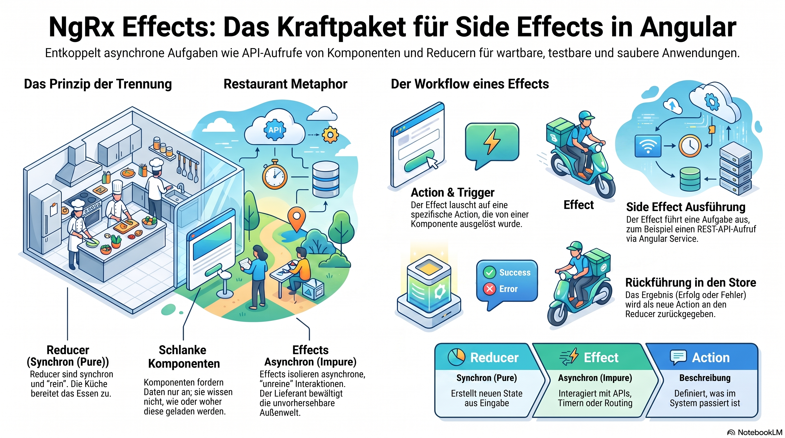

> [NOTE!]
> Die bereitgestellten Informationen erläutern die Rolle von **NgRx Effects** innerhalb der Architektur von Angular-Anwendungen. Diese Bibliothek dient dazu, **Seiteneffekte** wie API-Aufrufe oder Logging von der eigentlichen Logik der Komponenten und Reducer zu trennen. Während Reducer für **synchrone Zustandsänderungen** zuständig sind, verarbeiten Effects **asynchrone Aufgaben** und kommunizieren über neue Aktionen mit dem Store. Dieser Ansatz nutzt **RxJS-Streams**, um externe Interaktionen sauber zu kapseln und die Vorhersehbarkeit des Codes zu erhöhen. Durch diese **Aufgabentrennung** bleiben Komponenten schlank und Reducer als „reine Funktionen“ frei von unvorhersehbaren äußeren Einflüssen. Zusammenfassend ermöglichen Effects eine strukturierte Verwaltung aller Prozesse, die über die interne Zustandsverwaltung hinausgehen.


# Effects

In NgRx, **Effects** is a library that manages **side effects**. 
It is designed to move "external" interactions (like API calls, logging, or navigation) out of your components and reducers, keeping your application logic clean and predictable.

If Reducers are for **synchronous** state changes, Effects are for **asynchronous** logic.

---

### 1. Why do we need Effects?
To understand Effects, you must understand the rules of the other NgRx parts:
*   **Components** should be "lean": They should only focus on displaying data and capturing user events. They shouldn't care *how* data is fetched.
*   **Reducers** must be "pure functions": They take an action and the current state and return a new state. They **cannot** perform asynchronous tasks (like `http.get`) because a reducer must return a value immediately.

**Effects bridge this gap.** They listen for actions, perform a task (like calling a database), and then tell the Store the result.

---

### 2. How the Flow Works
The typical lifecycle of an Effect looks like this:

1.  **Action Dispatched:** A component dispatches an action (e.g., `[Product Page] Load Products`).
2.  **Effect Triggers:** The Effect is "listening" for that specific action type.
3.  **Side Effect Executes:** The Effect calls an Angular Service to fetch data from a REST API.
4.  **New Action Dispatched:** Once the API responds, the Effect dispatches a *new* action containing the data (e.g., `[Product API] Load Success`) or an error (e.g., `[Product API] Load Failure`).
5.  **Reducer Updates:** The Reducer listens for the `Success` action and updates the state with the new data.

---

### 3. Key Characteristics
*   **RxJS Powered:** Effects are built entirely on RxJS streams. You treat actions as a continuous stream of events.
*   **Decoupling:** The component doesn't know there is an API. It just says "I need products," and the Effect handles the heavy lifting.
*   **Long-lived:** Effects run as long as the application is running (or as long as the feature module is loaded).

---

### 4. A Practical Code Example

Imagine you want to log a user in.

**The Effect Class:**
```typescript
@Injectable()
export class AuthEffects {
  constructor(
    private actions$: Actions, // This is a stream of all actions
    private authService: AuthService
  ) {}

  login$ = createEffect(() =>
    this.actions$.pipe(
      ofType(AuthActions.login), // 1. Only listen for the 'login' action
      exhaustMap((action) =>
        this.authService.login(action.credentials).pipe( // 2. Call the API
          map((user) => AuthActions.loginSuccess({ user })), // 3. On success, return Success action
          catchError((error) => of(AuthActions.loginFailure({ error }))) // 4. On error, return Failure action
        )
      )
    )
  );
}
```

---

### 5. Common Use Cases for Effects
1.  **Data Fetching:** The most common use case (calling an HTTP service).
2.  **Navigation:** Listening for a "Logout" action and then telling the Angular Router to redirect the user to the Login page.
3.  **Logging/Analytics:** Sending a "Button Clicked" action to an external analytics service like Google Analytics.
4.  **Notifications:** Listening for a "Save Success" action and showing a Toast notification or Snackbar.
5.  **WebSockets:** Managing the connection and streaming incoming data into actions.

### 6. The "Non-Dispatching" Effect
Sometimes you want an Effect to do something but **not** send a new action back to the store (e.g., logging to the console or redirecting). You do this by adding `{ dispatch: false }`.

```typescript
logActions$ = createEffect(
  () => this.actions$.pipe(
    tap(action => console.log('Action Dispatched:', action))
  ),
  { dispatch: false }
);
```

# Side Effects

The name **"Effects"** is derived directly from the concept of **"Side Effects"** in Computer Science and Functional Programming.

In NgRx, the architecture is designed to keep your application logic "pure." To understand why they are called Effects, you have to look at the difference between **Pure Functions** and **Side Effects**.

### 1. The Pure Part: Reducers
The core of NgRx is the **Reducer**. A Reducer is a "Pure Function," meaning:
*   It only cares about its input (the current state and the action).
*   It always produces the exact same output for the same input.
*   **It does not touch the outside world.** It doesn't call APIs, it doesn't log to the console, and it doesn't change global variables.

### 2. The "Dirty" Part: Side Effects
In programming, a **Side Effect** is anything a function does that affects something *outside* of its own local scope. Common side effects include:
*   Making an HTTP request to a server.
*   Saving data to `localStorage`.
*   Changing the URL in the browser (routing).
*   Setting a timer (`setTimeout`).
*   Logging to the console.

If you put an HTTP call inside a Reducer, the Reducer would no longer be "pure." It would become unpredictable (the API might be down) and impossible to test easily.

### 3. The "Effects" Library
The NgRx team created the **@ngrx/effects** library as a dedicated place to put all those "Side Effects." 

The name was chosen to signify: **"This is the place where the side effects happen."**

By naming them "Effects," the architecture creates a clear boundary:
1.  **Actions:** Describe *what* happened.
2.  **Reducers:** Handle the **pure** state changes.
3.  **Effects:** Handle the **impure** interactions with the outside world.

### The "Side Effect" Metaphor
Think of a restaurant:
*   **The Customer (Component)** places an order (**Action**).
*   **The Kitchen (Reducer)** takes the ingredients and follows a strict recipe to produce a dish (**State change**). The kitchen is a controlled environment.
*   **The Delivery Driver (Effect)** has to go out into the "outside world" (traffic, weather, different addresses) to get the food to the customer. 

The delivery driver deals with the unpredictable "side effects" of the world outside the kitchen. In NgRx, that driver is an **Effect**.

### Historical Context
The term was also heavily influenced by the **Elm Architecture** (which inspired Redux). In Elm, external interactions are explicitly called `Cmd` (Commands) or "Effects." When the Angular community built NgRx, they adopted this terminology to align with functional programming standards.

### Summary
*   **Store/Reducer:** Synchronous state management.
*   **Effects:** Asynchronous side-effect management (APIs, timers, etc.).
*   **Result:** A clean separation of concerns where components stay simple and the "outside world" is handled in one organized place.