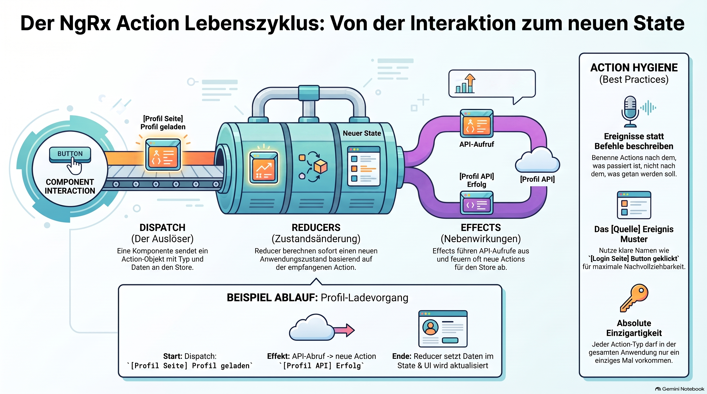

> [NOTE!]
> Dieser Text erläutert den strukturierten **Lebenszyklus von Actions** innerhalb des NgRx-Frameworks für Angular-Anwendungen. Der Prozess beginnt mit dem **Dispatching**, bei dem eine Nachricht als Auslöser für eine Zustandsänderung in das System gesendet wird. Anschließend übernehmen **Reducer** die Aufgabe, basierend auf diesen Informationen einen neuen Anwendungszustand zu berechnen, während **Effects** notwendige externe Operationen wie API-Abrufe steuern. Ein praxisnahes Beispiel verdeutlicht den kreislaufförmigen Ablauf von der Nutzerinteraktion bis zur finalen Datenanzeige. Abschließend betont der Autor die Bedeutung der **Action-Hygiene**, um durch klare Benennungen und ereignisorientierte Beschreibungen eine wartbare Architektur zu gewährleisten. Diese Übersicht dient somit als Leitfaden für die **vorhersehbare Zustandsverwaltung** in komplexen Webprojekten.

# Lebenszyklus

Der Lebenszyklus einer NgRx Action lässt sich als ein strukturierter Prozess verstehen, der sicherstellt, dass Zustandsänderungen in einer Angular-Anwendung vorhersehbar und nachvollziehbar bleiben. Hier ist der Ablauf für Anfänger erklärt:

### 1. Was ist eine Action?

Bevor der Prozess startet, muss eine Action definiert sein. Sie ist im Grunde ein einfaches Objekt, das als **"Bote"** fungiert. Sie besteht aus einem eindeutigen **`type`** (der beschreibt, was passiert ist) und optionalen **`props`** (den Daten, die für dieses Ereignis wichtig sind).

### 2. Der Lebenszyklus Schritt für Schritt

Sobald eine Action "abgefeuert" wird, durchläuft sie folgende Phasen:

* **Dispatch (Der Auslöser):** Eine Komponente oder ein Service stellt fest, dass etwas passiert ist (z. B. ein Klick auf einen Login-Button). Durch den Aufruf von `store.dispatch(Action)` wird die Nachricht in das System gesendet.
* **Reducers (Zustand aktualisieren):** Der Store leitet die Action sofort an die **Reducer** weiter. Ein Reducer hört auf bestimmte Actions. Wenn er die Action erkennt, nutzt er deren Daten, um einen **neuen Zustand (State)** für die Anwendung zu berechnen.
* **Effects (Nebenwirkungen ausführen):** Gleichzeitig wird die Action an die **Effects** gesendet. Effects sind für Aufgaben zuständig, die außerhalb des eigentlichen Zustands liegen, wie zum Beispiel **API-Aufrufe**. Ein Effect führt die Aufgabe aus und sendet am Ende oft eine _neue_ Action (z. B. "Daten erfolgreich geladen") zurück an den Store, wodurch der Kreislauf für diese neue Action von vorn beginnt.

### 3. Ein praktisches Beispiel

Stell dir vor, ein Nutzer klickt auf ein Profil:

1. **Dispatch:** Die Komponente sendet `[Profil Seite] Profil geladen`.
2. **Reducer:** Ein Reducer sieht die Action und setzt vielleicht einen "Lade-Status" auf `true`.
3. **Effect:** Ein Effect sieht die Action, ruft die Profildaten von einem Server ab und sendet nach Erfolg eine neue Action `[Profil API] Profil erfolgreich geladen`.
4. **Reducer:** Der Reducer nimmt die neuen Profildaten aus der zweiten Action auf und aktualisiert den State, damit die Komponente die Daten anzeigen kann.

### Wichtige Grundregeln ("Action Hygiene")

Damit dieser Lebenszyklus sauber bleibt, gibt es bewährte Praktiken:

* **Beschreibende Namen:** Nutze das Muster `[Quelle] Ereignis` (z. B. `[Login Seite] Login Button geklickt`).
* **Events statt Befehle:** Beschreibe, **was passiert ist** (Ereignis), nicht, was der Reducer tun soll (Befehl).
* **Einzigartigkeit:** Jeder Action-Typ muss in der gesamten Anwendung absolut einzigartig sein.
