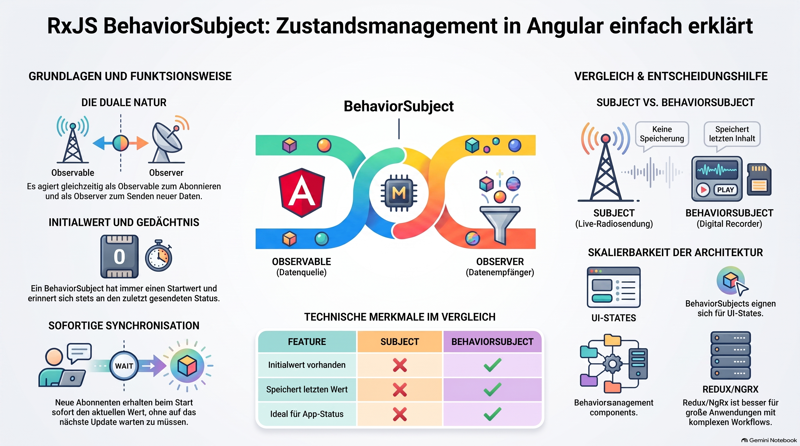

> [NOTE!]
> In diesem Text wird das Konzept des **BehaviorSubject** innerhalb von **Angular** und **RxJS** als Werkzeug zur **Zustandsverwaltung** erläutert. Im Gegensatz zu einfachen Variablen ermöglicht dieser Ansatz eine **automatische Aktualisierung** aller abhängigen Komponenten, sobald sich Daten ändern. Ein wesentliches Merkmal ist, dass ein **BehaviorSubject** stets den **aktuellsten Wert speichert** und diesen sofort an neue Abonnenten übermittelt. Während sich diese Methode hervorragend für **kleine bis mittlere Anwendungen** eignet, vergleicht der Autor sie auch mit komplexeren Lösungen wie **Redux oder NgRx**. Letztere bieten durch **explizite Aktionen** mehr Struktur, während das **BehaviorSubject** eine leichtgewichtige und flexible Alternative für den **einfachen Datenaustausch** darstellt. Insgesamt dient die Quelle als Leitfaden, um die passende Strategie für die Synchronisierung von **Applikationszuständen** zu wählen.


# BehaviorSubject

A **`BehaviorSubject`** is an RxJS class that represents both:

* an **Observable** (other code can subscribe to it), and

* an **Observer** (you can push new values into it).

It is one of the most common ways to share state between Angular services and components.

***

# Why not just use a variable?

Suppose you have a cart service.

Without RxJS:

```ts
export class CartService {
  items: Product[] = [];
}
```

A component can read the items once:

```ts
const items = this.cartService.items;
```

But if another component adds an item later, this component won't know about it automatically.

***

# Using a BehaviorSubject

Instead:

```ts
import { BehaviorSubject } from 'rxjs';

export class CartService {

  private itemsSubject = new BehaviorSubject<Product[]>([]);

  items$ = this.itemsSubject.asObservable();

}
```

Let's examine this.

### The BehaviorSubject

```ts
private itemsSubject =
    new BehaviorSubject<Product[]>([]);
```

It stores the current value.

Initially:

```text
[]
```

Unlike a normal `Subject`, a `BehaviorSubject` **always has a current value**.

***

# Updating the value

Suppose the user adds a product.

```ts
addItem(product: Product) {

    const current = this.itemsSubject.value;

    this.itemsSubject.next([
        ...current,
        product
    ]);

}
```

Calling

```ts
.next(...)
```

publishes a new value.

Every subscriber immediately receives it.

***

# Components subscribe

```ts
export class CartComponent {

    items$ = this.cartService.items$;

}
```

Template:

```html
<li *ngFor="let item of items$ | async">
    {{ item.name }}
</li>
```

Notice there is **no manual refresh**.

When `next()` is called:

```text
BehaviorSubject

↓

new value

↓

Observable

↓

Component

↓

Angular updates UI
```

***

# Why is it called "Behavior"Subject?

A regular `Subject` behaves like a live radio broadcast.

If you tune in late, you miss everything that was already broadcast.

Example:

```text
Subject

send: A

send: B

subscribe

send: C

You receive:

C
```

***

A `BehaviorSubject` always remembers the latest value.

```text
BehaviorSubject

current value = B

subscribe

Immediately receive:

B

then

C

then

D
```

Every new subscriber instantly gets the current state.

This makes it ideal for representing application state.

***

# Comparison

| Feature                               | Subject | BehaviorSubject |
| ------------------------------------- | ------- | --------------- |
| Has initial value                     | ❌       | ✅               |
| Remembers latest value                | ❌       | ✅               |
| New subscribers receive current value | ❌       | ✅               |
| Good for events                       | ✅       | ✅               |
| Good for application state            | ❌       | ✅               |

***

# BehaviorSubject vs. Redux Store

A simple Angular application often uses a service with a `BehaviorSubject` as its store:

```text
Component A
        │
        ▼
CartService
        │
BehaviorSubject
        │
        ▼
Component B
```

The service owns the state and pushes updates to all interested components.

With Redux (or NgRx), the flow is more structured:

```text
Component
      │
dispatch(Action)
      │
      ▼
Store
      │
Reducer
      │
New State
      │
Selector
      │
      ▼
Component
```

The key difference is **who is allowed to change the state**:

* With a `BehaviorSubject`, the service can call `.next()` whenever it wants. If not carefully designed, state updates can become scattered across the application.

* With Redux, state changes must go through **actions** and **reducers**, making every change explicit and predictable.

***

# When should you use a BehaviorSubject?

A `BehaviorSubject` is a great choice for:

* Small to medium Angular applications.

* Sharing state between a few components.

* UI state (current theme, selected tab, login status).

* Simple data caches.

For large applications with many shared state slices, complex asynchronous workflows, or the need for advanced debugging, a Redux-style solution such as **NgRx** usually scales better.

As a rule of thumb:

* **BehaviorSubject** = simple shared state managed by a service.

* **Redux/NgRx** = centralized, predictable application state with explicit state transitions.

Many Angular developers start with `BehaviorSubject` and adopt NgRx only when the application's complexity justifies it.
