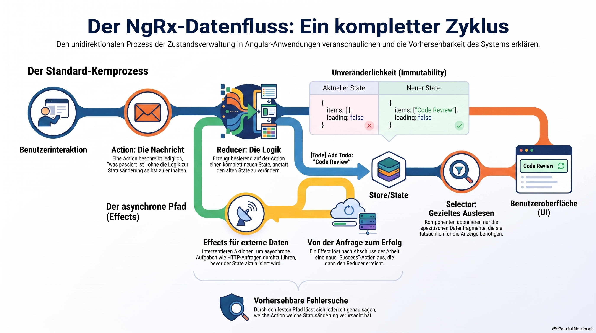

> [NOTE!]
> Der bereitgestellte Text erläutert den **unidirektionalen Datenfluss** innerhalb des **NgRx-Frameworks** für Angular-Anwendungen. Der Prozess beginnt mit einer **Aktion**, die ein Ereignis beschreibt und entweder direkt an einen **Reducer** oder über einen asynchronen **Effect** weitergeleitet wird. Der Reducer erzeugt daraufhin einen vollständig **neuen Zustand**, ohne die bestehenden Daten direkt zu verändern. Mithilfe von **Selectoren** rufen Komponenten gezielt Informationen aus diesem zentralen Speicher ab und abonnieren die Änderungen. Durch diese **festgelegte Struktur** wird die Entwicklung vorhersehbarer, da jede Zustandsänderung klar nachvollziehbar und leicht zu testen ist. Schließlich sorgt Angular für die automatische **Aktualisierung der Benutzeroberfläche**, sobald neue Daten über den Store verfügbar sind.


# Complete Data Flow

The **NgRx data flow** is the heart of how NgRx works. 
Once you understand this flow, the individual concepts—actions, reducers, selectors, and effects—fit together naturally.

Let's walk through the complete cycle using a simple example.

***

# The Big Picture

Imagine a Todo application. The user clicks an **"Add Todo"** button.

The data flows in **one direction only**:

```text
User
  │
  ▼
Component
  │
  ▼
Dispatch Action
  │
  ▼
Effect (optional)
  │
  ▼
Reducer
  │
  ▼
Store
  │
  ▼
Selector
  │
  ▼
Component
  │
  ▼
Updated UI
```

Notice that the data **never flows backwards**. This is called **unidirectional data flow**.

***

# Step 1 – The User Performs an Action

The user clicks a button.

```text
+------------------+
|  Add Todo Button |
+------------------+

        Click
```

At this point, nothing has changed in the application's state.

***

# Step 2 – The Component Dispatches an Action

The component doesn't modify the store directly.

Instead, it announces **what happened**:

```typescript
this.store.dispatch(
  addTodo({ text: 'Learn NgRx' })
);
```

Think of an action as a message.

```text
Action

"I want to add a todo."
```

An action **does not** contain the logic for updating the state. It simply describes an event.

***

# Step 3 – Does the Action Need an HTTP Request?

Now ask:

> **Can the state be updated immediately, or do we need data from somewhere else?**

There are two possible paths.

## Path A: No HTTP Request Needed

Suppose the todo only needs to be added locally.

The action goes directly to the reducer.

```text
Action
   │
   ▼
Reducer
```

***

## Path B: HTTP Request Needed

Suppose the todo must first be saved on a server.

The action is intercepted by an **Effect**.

```text
Action
   │
   ▼
Effect
```

The effect performs the asynchronous work:

```text
HTTP POST

↓

Server saves todo

↓

Server responds
```

The effect then dispatches another action:

```typescript
addTodoSuccess({
    todo: savedTodo
});
```

Notice something important:

The original action did **not** change the store.

Instead:

```text
Action

↓

Effect

↓

HTTP

↓

Success Action
```

The **success action** is what eventually reaches the reducer.

***

# Step 4 – The Reducer Creates a New State

The reducer receives two things:

```text
Current State

+

Action
```

Suppose the current state is:

```typescript
{
  todos: [
    "Buy milk"
  ]
}
```

The reducer returns:

```typescript
{
  todos: [
    "Buy milk",
    "Learn NgRx"
  ]
}
```

Notice that the reducer creates a **new state object** rather than changing the existing one.

```text
Old State

↓

Reducer

↓

New State
```

The old state remains unchanged.

***

# Step 5 – The Store Replaces the Old State

The store now updates its current state.

Before:

```text
Store

todos

Buy milk
```

After:

```text
Store

todos

Buy milk
Learn NgRx
```

The store now contains the new state.

***

# Step 6 – Selectors Read the Updated State

Components don't read the store directly.

Instead, they use selectors.

```typescript
todos$ = this.store.select(selectTodos);
```

A selector simply says:

> "Give me the todo list."

```text
Store

↓

Selector

↓

Todo List
```

Selectors can also compute derived values. For example:

```typescript
selectCompletedTodos

selectRemainingTodos

selectTodoCount
```

Each selector returns only the data a component needs.

***

# Step 7 – Components Receive the Updated Data

Because `store.select(...)` returns an **Observable**, components automatically receive new values when the store changes.

```text
Store changed

↓

Selector emits

↓

Observable emits

↓

Component receives new value
```

No manual synchronization is required.

***

# Step 8 – Angular Updates the UI

Finally, Angular updates the view.

Before:

```text
Todos

✓ Buy milk
```

After:

```text
Todos

✓ Buy milk
□ Learn NgRx
```

The user now sees the updated list.

***

# The Complete Flow (Without HTTP)

```text
User clicks button
        │
        ▼
Component
        │
dispatch(addTodo())
        │
        ▼
Action
        │
        ▼
Reducer
        │
Creates new state
        │
        ▼
Store updated
        │
        ▼
Selector emits
        │
        ▼
Component receives new data
        │
        ▼
Angular updates UI
```

***

# The Complete Flow (With HTTP)

```text
User clicks button
        │
        ▼
Component
        │
dispatch(loadTodos())
        │
        ▼
Action
        │
        ▼
Effect
        │
HTTP GET
        │
        ▼
Server
        │
Returns todos
        │
        ▼
loadTodosSuccess()
        │
        ▼
Reducer
        │
Creates new state
        │
        ▼
Store updated
        │
        ▼
Selector emits
        │
        ▼
Component updates
```

***

# Why Is This Flow So Predictable?

Every state change follows the same sequence:

1. **Something happens** (user interaction, timer, route change, etc.).

2. An **action** describes what happened.

3. An **effect** optionally performs asynchronous work.

4. A **reducer** computes a new state.

5. The **store** replaces the old state.

6. **Selectors** expose the updated data.

7. **Components** automatically receive the new values and Angular refreshes the UI.

Because there is only **one path** for changing state, you can always answer questions like:

* _Why did the state change?_ → Look at the dispatched action.

* _How was the new state computed?_ → Look at the reducer.

* _Where did the data come from?_ → Look at the effect (if one was involved).

This predictable, one-way flow is one of the biggest advantages of NgRx. It makes complex applications easier to reason about, debug, and test because every state transition follows the same well-defined lifecycle.

# Unidirektionale Datenfluss

Der **unidirektionale Datenfluss** ist das Herzstück von NgRx und bedeutet, dass Daten sich immer nur in **eine einzige Richtung** durch die Anwendung bewegen und niemals rückwärts fließen. Dieser Kreislauf sorgt dafür, dass Zustandsänderungen vorhersehbar und leicht nachvollziehbar sind.

Hier ist der Ablauf Schritt für Schritt für Anfänger erklärt:

### 1. Die Aktion (Action)

Alles beginnt mit einem Ereignis, zum Beispiel wenn ein Benutzer auf einen Button klickt. Die Komponente ändert den Zustand jedoch nicht direkt, sondern versendet eine **Action**. Eine Action ist wie eine Nachricht, die beschreibt, **was passiert ist** (z. B. „Add Todo“), aber sie enthält noch keine Logik zur Änderung der Daten.

### 2. Effekte (Effects) – optional

Falls Daten von einem Server geladen werden müssen (asynchrone Arbeit), tritt ein **Effect** auf den Plan. Er fängt die ursprüngliche Action ab, führt zum Beispiel einen HTTP-Request aus und versendet danach eine **neue Action** (z. B. „Todo erfolgreich gespeichert“), sobald die Daten bereitstehen.

### 3. Der Reducer

Der **Reducer** ist der Ort, an dem die eigentliche Logik stattfindet. Er erhält zwei Informationen:

* Den **aktuellen Zustand** (State).
* Die **Action**.

Wichtig ist: Der Reducer verändert den alten Zustand nicht einfach. Stattdessen berechnet er einen **komplett neuen Zustand** und gibt diesen zurück. Der alte Zustand bleibt unverändert.

### 4. Der Store

Der **Store** nimmt diesen neuen Zustand vom Reducer entgegen und ersetzt damit den alten. Er dient als die einzige „Quelle der Wahrheit“ (Single Source of Truth) für die gesamte Anwendung.

### 5. Selektoren (Selectors)

Komponenten lesen die Daten nicht direkt aus dem Store, sondern nutzen **Selectors**. Man kann sie sich wie einen Filter oder eine Abfrage vorstellen (z. B. „Gib mir nur die Liste der Todos“). Selektoren können auch Daten transformieren oder Werte berechnen, bevor sie an die Komponente geliefert werden.

### 6. Die Komponente und das UI

Da Selektoren sogenannte **Observables** zurückgeben, wird die Komponente automatisch informiert, sobald sich die Daten im Store ändern. Angular aktualisiert daraufhin die Benutzeroberfläche, und der Benutzer sieht die neuen Informationen.

### Warum ist dieser Fluss so vorteilhaft?

Da es nur **einen festen Pfad** für Datenänderungen gibt, lässt sich jede Änderung leicht debuggen:

* **Warum** hat sich der Zustand geändert? Schau dir die Action an.
* **Wie** wurde der neue Zustand berechnet? Schau dir den Reducer an.
* **Woher** kamen die Daten? Schau dir den Effekt an.

# Actions or State thats here the Question

In NgRx erfüllen **Actions** und der **State** grundlegend unterschiedliche Aufgaben innerhalb des Datenflusses. Während eine Action ein Ereignis beschreibt, repräsentiert der State die tatsächlichen Daten der Anwendung zu einem bestimmten Zeitpunkt.

### Actions: Die Beschreibung eines Ereignisses

Eine **Action** fungiert als eine Art Nachricht oder Ankündigung, die beschreibt, **was in der Anwendung passiert ist**.

* **Zweck:** Sie dient als Auslöser für eine Zustandsänderung, enthält aber selbst **keine Logik** zur Aktualisierung der Daten.
* **Inhalt:** Sie beschreibt lediglich ein Ereignis, wie zum Beispiel „Benutzer hat auf den 'Add Todo'-Button geklickt“.
* **Versand:** Actions werden von Komponenten versendet (dispatched), wenn eine Interaktion stattfindet, oder von Effekten nach Abschluss asynchroner Aufgaben.

### State: Der aktuelle Zustand der Daten

Der **State** stellt die **eigentlichen Informationen** dar, die die Anwendung zu einem gegebenen Zeitpunkt hält.

* **Zweck:** Er ist die „Quelle der Wahrheit“ für die Benutzeroberfläche. Ein Beispiel für einen State wäre eine Liste von Todo-Einträgen: `todos: [{ id: 1, text: 'Lernen' }]`.
* **Unveränderlichkeit:** Der State wird niemals direkt bearbeitet. Stattdessen nimmt ein Reducer den alten State und eine Action entgegen, um daraus einen **komplett neuen State** zu berechnen.
* **Aufbewahrung:** Der aktuelle State wird im **Store** gespeichert und ersetzt dort bei jeder Änderung das vorherige State-Objekt.

### Die wichtigsten Unterschiede im Überblick

| Merkmal    | Action                                               | State                                                  |
| :--------- | :--------------------------------------------------- | :----------------------------------------------------- |
| **Rolle**  | Der Auslöser / Die Nachricht                         | Das Ergebnis / Die Datenbasis                          |
| **Inhalt** | Beschreibung eines Ereignisses („Was ist passiert?“) | Aktuelle Werte der Anwendung („Wie sieht es aus?“)     |
| **Logik**  | Enthält keine Logik                                  | Wird durch Logik im Reducer erzeugt                    |
| **Fluss**  | Startet den Kreislauf                                | Wird am Ende des Kreislaufs aktualisiert und angezeigt |

Zusammenfassend lässt sich sagen: Wenn ein Benutzer etwas tut, wird eine **Action** versendet, um das System zu informieren. Diese Action führt (über einen Reducer) dazu, dass ein neuer **State** erstellt wird, der dann die aktualisierte Ansicht für den Benutzer bestimmt.
