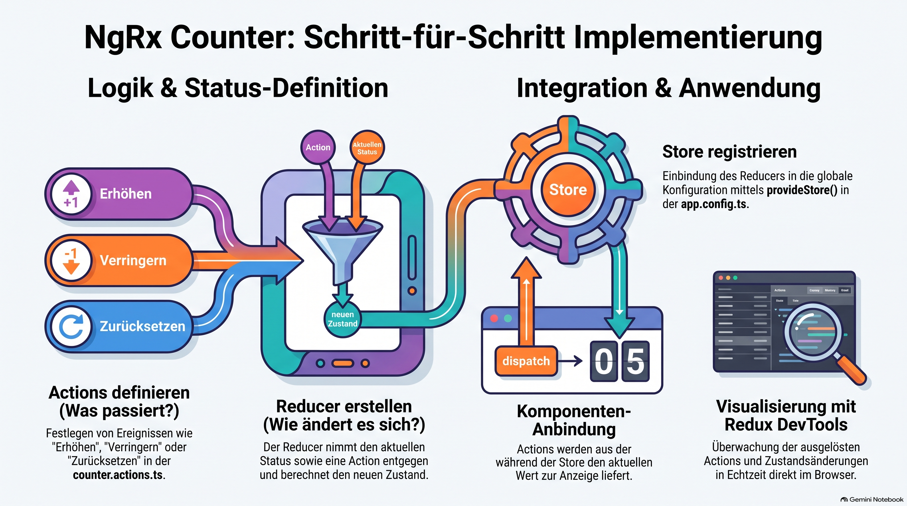

> [NOTE!]
> Dieser Text erläutert die **strukturierte Implementierung** eines einfachen Zählers unter Verwendung des **NgRx-State-Managements** in Angular. Der Prozess beginnt mit der Definition von **Actions**, die eintretende Ereignisse beschreiben, und führt über zur Erstellung von **Reducern**, welche die logische Zustandsänderung festlegen. Nach der zentralen **Registrierung im Store** wird erklärt, wie Komponenten diese Aktionen auslösen und Daten über die Benutzeroberfläche konsumieren. Zusätzlich gibt der Autor hilfreiche Tipps zur Nutzung von **Entwickler-Tools** und automatisierten Generatoren, um den Programmieraufwand zu minimieren. Die Anleitung dient somit als präziser Leitfaden für die Trennung von **Logik und Darstellung** in modernen Webanwendungen.

# Counter mit Actions und Reducern

Um einen einfachen Counter mit NgRx zu erstellen, folgst du einem strukturierten Prozess, bei dem du die Logik in Actions und Reducer aufteilst. Gemäß den Quellen sind dies die notwendigen Schritte:

### 1. Vorbereitung

Feel free to create an Angular project using this Link: [Create an Angular project using Vite](./Create an Angular project using Vite.md)

Erstelle zunächst einen Ordner namens `src/app/state`, in dem du die folgenden Dateien verwaltest.

### 2. Actions definieren (`counter.actions.ts`)

Actions sind dazu da, zu beschreiben, **was passiert ist**. Für einen Counter wären das typischerweise Ereignisse wie "Erhöhen", "Verringern" oder "Zurücksetzen". In dieser Datei legst du fest, welche Aktionen deine Anwendung auslösen kann.

### 3. Den Reducer erstellen (`counter.reducer.ts`)

Der Reducer ist das Herzstück der Logik. Er definiert, **wie sich der Zustand ändert**, wenn eine bestimmte Action eintritt.

* Er nimmt den aktuellen Stand des Counters (z. B. 0) und eine Action entgegen.
* Basierend auf der Action gibt er einen neuen Zustand zurück (z. B. 1 nach einem "Erhöhen"-Event).

### 4. Den Store registrieren

Damit Angular den Counter-Zustand erkennt, musst du den Store in der Datei `src/app/app.config.ts` registrieren.

* Dort nutzt du die Funktion `provideStore()`, die normalerweise automatisch durch NgRx-Schematics hinzugefügt wird.
* Du musst diese Konfiguration so aktualisieren, dass sie deinen spezifischen Counter-Reducer enthält.

### 5. Integration in die Komponente

In der Datei `src/app/app.component.ts` (oder einer anderen Komponente) kannst du den Store nun nutzen:

* Du **dispatchst** (versendest) Actions, um Änderungen anzustoßen.
* Du greifst auf den aktuellen Wert des Counters zu, um ihn in der Benutzeroberfläche anzuzeigen.

### Nützliche Tipps für den Einstieg

* **CLI-Generatoren nutzen:** Anstatt alle Dateien manuell zu erstellen, kannst du die **NgRx Schematics** verwenden, um den notwendigen Boilerplate-Code automatisch zu generieren.
* **Visualisierung:** Nutze die **Redux DevTools** im Browser. Damit kannst du in Echtzeit beobachten, wie Actions ausgelöst werden und wie sich der Zustand deines Counters bei jedem Klick verändert.
* **Erweiterung:** Sobald die Basis funktioniert, kannst du **Selectors** hinzufügen, um beispielsweise berechnete Werte (wie "Ist die Zahl gerade?") direkt aus dem Store abzurufen.
