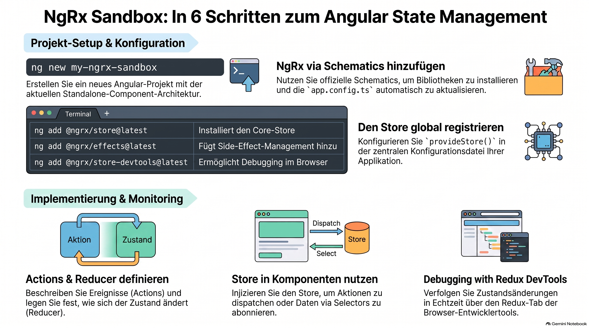

> [NOTE!]
> Dieser Leitfaden von Karl Schmitt erläutert die **Einrichtung eines Angular-Projekts**, das speziell für die Nutzung von **NgRx** optimiert ist. Der Prozess beginnt mit der Erstellung einer modernen Applikation auf Basis von **Standalone-Komponenten** und der Installation notwendiger Bibliotheken. Ein praxisnahes **Zähler-Beispiel** dient dazu, die grundlegenden Konzepte von **Actions, Reducern und dem globalen Store** zu verdeutlichen. Zudem wird die Integration der **Redux DevTools** hervorgehoben, um Zustandsänderungen im Browser in Echtzeit verfolgen zu können. Fortgeschrittene Themen wie **Selectors, Effects und Signals** bieten abschließend Möglichkeiten, die Architektur weiter zu vertiefen. Die Anleitung kombiniert somit technische Befehle mit **architektonischen Best Practices** für die moderne Webentwicklung.


# How to create an Angular project for NgRx?

To experiment with NgRx effectively, it is best to set up a clean Angular project using the latest **Standalone Component** architecture (standard since Angular 17+).

Here is a step-by-step guide to creating a "Sandbox" project with NgRx, including the essential Redux DevTools.

---

### 1. Create a new Angular Project

Open your terminal and run:

```bash
ng new ngrx-experiment --routing --style scss
cd ngrx-experiment
```

> [NOTE!]
>  Also feel free to create an Angular project using this Link: [Create an Angular project using Vite](./Create an Angular project using Vite.md)

### 2. Add NgRx Libraries

The easiest way to set up NgRx is using their official schematics, which automatically update your `app.config.ts`.

Run these three commands:

```bash
# 1. Install the Core Store
ng add @ngrx/store@latest

# 2. Install Effects (for side effects like API calls)
ng add @ngrx/effects@latest

# 3. Install DevTools (to see your state in the browser)
ng add @ngrx/store-devtools@latest
```

---

### 3. Create a Simple Feature (Counter Example)
To experiment, let’s build a simple counter. Create a folder `src/app/state` and add these files:

#### A. The Actions (`counter.actions.ts`)
Actions describe **what happened**.
```typescript
import { createActionGroup, emptyProps, props } from '@ngrx/store';

export const CounterActions = createActionGroup({
  source: 'Counter Component',
  events: {
    'Increment': emptyProps(),
    'Decrement': emptyProps(),
    'Reset': emptyProps(),
  },
});
```

#### B. The Reducer (`counter.reducer.ts`)
Reducers define **how the state changes**.
```typescript
import { createReducer, on } from '@ngrx/store';
import { CounterActions } from './counter.actions';

export const initialState = 0;

export const counterReducer = createReducer(
  initialState,
  on(CounterActions.increment, (state) => state + 1),
  on(CounterActions.decrement, (state) => state - 1),
  on(CounterActions.reset, () => 0)
);
```

---

### 4. Register the Store
Open `src/app/app.config.ts`. The schematics should have added `provideStore()`. Update it to include your counter:

```typescript
import { provideStore } from '@ngrx/store';
import { counterReducer } from './state/counter.reducer';

export const appConfig: ApplicationConfig = {
  providers: [
    provideStore({ count: counterReducer }), // Register 'count' feature
    // ... provideEffects, provideStoreDevtools etc.
  ]
};
```

---

### 5. Use the Store in a Component
Open `src/app/app.component.ts`:

```typescript
import { Component, inject } from '@angular/core';
import { Store } from '@ngrx/store';
import { map, Observable } from 'rxjs';
import { CounterActions } from './state/counter.actions';
import { AsyncPipe } from '@angular/common';

@Component({
  selector: 'app-root',
  standalone: true,
  imports: [AsyncPipe],
  template: `
    <h1>Count: {{ count$ | async }}</h1>
    <button (click)="increment()">Increment</button>
    <button (click)="decrement()">Decrement</button>
    <button (click)="reset()">Reset</button>
  `
})
export class AppComponent {
  private store = inject(Store);
  
  // Select the count from state
  count$: Observable<number> = this.store.select((state: any) => state.count);

  increment() {
    this.store.dispatch(CounterActions.increment());
  }

  decrement() {
    this.store.dispatch(CounterActions.decrement());
  }

  reset() {
    this.store.dispatch(CounterActions.reset());
  }
}
```

---

### 6. Essential Tool: Redux DevTools
To truly experiment with NgRx, you need to see the state moving.
1.  Install the **Redux DevTools** extension in Chrome or Firefox.
2.  Run your app: `ng serve`.
3.  Open Browser DevTools (F12) and click the **Redux** tab.
4.  As you click the buttons, you will see the actions being dispatched and the state changing in real-time.

---

### 7. Next Steps for Experimentation
Once you have the counter working, try adding these advanced NgRx features:

1.  **Selectors:** Create a `counter.selectors.ts` file using `createSelector` to calculate "double count" or "is even".
2.  **Effects:** Use `createEffect` to save the counter value to `localStorage` every time it changes.
3.  **Entity:** Use `@ngrx/entity` if you want to experiment with managing collections of data (like a list of Users).
4.  **NgRx Signals (Optional):** If you prefer the new Angular Signals, look into `@ngrx/signals`, which is a lightweight alternative to the global Store.

### Pro-Tip: Use the CLI Generator
Instead of creating files manually, use the NgRx schematics to generate boilerplate:
```bash
ng generate @ngrx/store:feature state/User --module app.config.ts
```

# Grundlagen von NgRx

NgRx ist ein Framework zur **Zustandsverwaltung** in Angular-Anwendungen, das besonders in komplexen Projekten hilft, den Überblick über die Datenflüsse zu behalten. Für den Einstieg ist es hilfreich, NgRx in einem sauberen "Sandbox"-Projekt mit der modernen **Standalone Component** Architektur zu testen.

Die Grundlagen von NgRx basieren auf diesen zentralen Konzepten:

* **Actions (Aktionen):** Sie beschreiben in Textform, **was passiert** ist (z. B. "Zähler erhöhen").
* **Reducers (Reducer):** Diese definieren, **wie sich der Zustand ändert**, wenn eine bestimmte Aktion eintritt. Sie nehmen den aktuellen Zustand und die Aktion entgegen und geben einen neuen Zustand zurück.
* **Store (Speicher):** Dies ist der zentrale Ort, an dem der gesamte Zustand der Anwendung verwaltet wird. Er muss in der Anwendungskonfiguration (z. B. `app.config.ts`) mit `provideStore()` registriert werden.
* **Selectors (Selektoren):** Mit Selektoren kannst du gezielt Daten aus dem Store abrufen oder daraus neue Werte berechnen, wie zum Beispiel, ob eine Zahl gerade oder ungerade ist.
* **Effects (Effekte):** Diese werden für "Seiteneffekte" genutzt, die außerhalb des eigentlichen Zustands passieren, wie etwa das Speichern von Daten im `localStorage` nach einer Änderung.

### Ein wichtiges Hilfsmittel: Redux DevTools

Um NgRx wirklich zu verstehen, ist die Installation der **Redux DevTools** (Browser-Erweiterung) unerlässlich. Damit kannst du in Echtzeit sehen, welche Aktionen ausgelöst werden und wie sich der Zustand deiner Applikation Schritt für Schritt verändert.

### Fortgeschrittene Konzepte für den nächsten Schritt

Wenn du die Grundlagen beherrschst, kannst du dich mit weiteren Modulen beschäftigen:

* **NgRx Entity:** Erleichtert die Verwaltung von Datensammlungen (z. B. Listen von Benutzern).
* **NgRx Signals:** Eine modernere, leichtgewichtige Alternative zum globalen Store, die auf den neuen Angular Signals basiert.

Um Zeit beim Schreiben von Code zu sparen, empfiehlt es sich, die **NgRx Schematics** (CLI-Generatoren) zu nutzen, anstatt alle Dateien manuell anzulegen.

