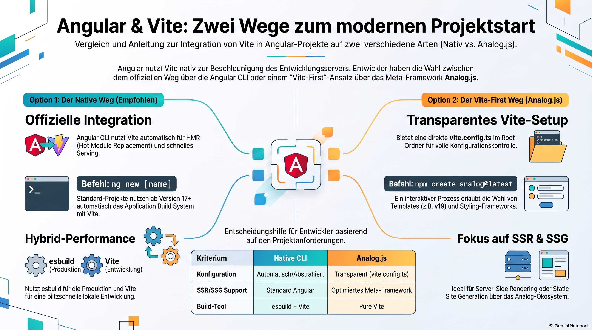

> {NOTE!}
> Dieser Quelltext beschreibt zwei primäre Methoden, um **Vite** innerhalb der **Angular-Entwicklung** für eine gesteigerte Performance zu nutzen. Der empfohlene Weg ist die Verwendung des offiziellen **Angular CLI**, welches Vite automatisch als lokalen Entwicklungsserver integriert und dabei auf das moderne **Application Build System** setzt. Alternativ wird das Meta-Framework **Analog.js** vorgestellt, das eine **Vite-zentrierte Architektur** bietet und sich durch eine transparente Konfiguration näher an klassischen Vite-Projekten orientiert. Während die native Option eine vertraute Umgebung mit **schnellem Hot Module Replacement** schafft, eignet sich der Analog-Ansatz besonders für Entwickler, die explizite Kontrolle über die **Vite-Pipeline** oder Funktionen wie statische Seitengenerierung benötigen. Zusammenfassend bieten die Quellen eine praxisnahe Anleitung zur Modernisierung des **Build-Prozesses** für Angular-Anwendungen.


# Create an Angular project using Vite

The standard and official way to use Vite in Angular is to _let the Angular CLI manage Vite automatically using the Application Build System_. Angular natively integrates Vite under the hood to power its high-performance development server. \[1, 2, 3]

If you prefer a completely Vite-first project setup without the classic Angular CLI architecture, you should use Analog.js (the Meta-framework for Angular powered by Vite). \[4, 5, 6]

Below are the two ways to create your project.

***

## Option 1: The Native Angular Way (Recommended)

This approach leverages the official [Angular CLI](https://angular.dev/tools/cli/build-system-migration). It creates a standard application that defaults to an `esbuild` production bundler and a Vite-powered development server for lightning-fast hot module replacement (HMR). \[1, 2, 7, 8]

1. Create the application using the standard CLI command:
   ```bash
   npx @angular/cli@latest new my-angular-app
   ```
2. Navigate into your project folder:
   ```bash
   cd my-angular-app
   ```
3. Start the development server:
   ```bash
   npm start
   ```
   _Note: If you look closely at your build logs, Angular is natively routing this through Vite in memory to serve your application instantly._ \[1, 9, 10, 11, 12]

***

## Option 2: The Vite-First Way (Using Analog.js)

If you want a structure closer to a traditional Vite application (like a React/Vite app with a `vite.config.ts` file in the root folder), the Angular team officially recognizes the [AnalogJS Vite plugin](https://angular.dev/ecosystem/custom-build-pipeline). \[4, 13]

1. Scaffold the project using the Analog.js initializer:
   ```bash
   npm create analog@latest
   ```

2. Follow the interactive prompts in your terminal:

   * Enter your project name.
   * Select Template (Choose `angular-v19` or the latest available version).
   * Choose your preferred styling framework (e.g., Tailwind CSS or none). \[14, 15, 16]

3. Install the project dependencies:
   ```bash
   cd your-project-name
   npm install
   ```
   \[17, 18, 19]

4. Launch your Vite server:
   ```bash
   npm run dev
   ```
   _This completely replaces Webpack/CLI abstractions with a transparent, pure-Vite configuration._ \[4, 8]

***

💡 If you aren't sure which one to pick, let me know:

* Do you want features like Server-Side Rendering (SSR) or Static Site Generation (SSG)?
* Do you plan on migrating an existing Angular project over to Vite? \[17]

I can guide you on the exact configurations or test runners (like Vitest) to use! \[20]


\[1] [https://angular.dev](https://angular.dev/tools/cli/build-system-migration)

\[2] [https://www.youtube.com](https://www.youtube.com/watch?v=f_-kxARj6fo\&t=483)

\[3] [https://www.geeksforgeeks.org](https://www.geeksforgeeks.org/angular-js/how-to-use-vite-with-angular/)

\[4] [https://angular.dev](https://angular.dev/ecosystem/custom-build-pipeline)

\[5] [https://analogjs.org](https://analogjs.org/docs/guides/libraries)

\[6] [https://dev.to](https://dev.to/dalenguyen/building-production-ready-ssr-applications-with-analogjs-lessons-from-techleadpilot-142a)

\[7] [https://medium.com](https://medium.com/@manpreetkaur6311062/vite-a-speedier-development-experience-for-angular-ff25bbff5e5e)

\[8] [https://www.youtube.com](https://www.youtube.com/watch?v=P9vcLPsW9lQ)

\[9] [https://wisdom.gitbook.io](https://wisdom.gitbook.io/gyan/angular/creating-an-angular-project-using-npx-without-installing-it-globally)

\[10] [https://help.sap.com](https://help.sap.com/docs/SAP_BUSINESS_ONE_WEB_CLIENT/e6ac71d18c7543828bd4463f77d67ff7/bcaf2e831c954ed5aef5677a7c61d6a0.html)

\[11] [https://www.dhiwise.com](https://www.dhiwise.com/post/vite-vs-create-react-app-which-is-the-better-choice)

\[12] [https://medium.com](https://medium.com/@robinviktorsson/complete-guide-to-setting-up-react-with-typescript-and-vite-2025-468f6556aaf2)

\[13] [https://reliasoftware.com](https://reliasoftware.com/blog/how-to-create-react-app-using-vite)

\[14] [https://tiwariashutosh.medium.com](https://tiwariashutosh.medium.com/how-to-build-a-react-ui-component-library-a-step-by-step-guide-using-shadcn-ui-vite-tailwind-36c1b89e2113)

\[15] [https://www.krishangtechnolab.com](https://www.krishangtechnolab.com/blog/how-to-build-react-apps-with-vite/)

\[16] [https://www.tftus.com](https://www.tftus.com/blog/how-to-start-a-reactjs-project)

\[17] [https://norato-felipe.medium.com](https://norato-felipe.medium.com/configuring-storybook-with-angular-vite-esbuild-68c627ff9d71)

\[18] [https://dev.to](https://dev.to/codeparrot/a-beginner-guide-to-using-vite-with-react-dh2)

\[19] [https://www.youtube.com](https://www.youtube.com/watch?v=qe3mrBmeno8\&vl=en\&t=356)

\[20] [https://angular.dev](https://angular.dev/guide/testing/migrating-to-vitest)
