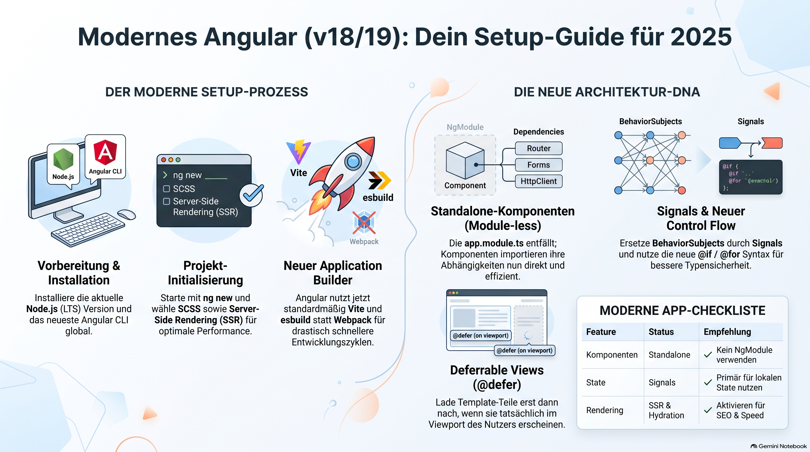

> [NOTE!]
> Dieser Text bietet eine umfassende Anleitung zur Erstellung von **Angular-Projekten nach modernsten Standards** der Versionen 18 und 19. Der Autor erläutert den grundlegenden Wandel hin zu einer **modullosen Architektur**, bei der Standalone-Komponenten und eine zentrale Konfigurationsdatei das veraltete Modulsystem ersetzen. Wichtige technologische Neuerungen wie der **Vite-basierte Application Builder** und die Integration von **Server-Side Rendering** stehen dabei im Fokus für eine optimierte Performance. Zudem werden innovative Funktionen wie **Signals für das Zustandsmanagement** sowie die neue Kontrollfluss-Syntax detailliert beschrieben. Abschließend empfiehlt die Quelle ergänzende Werkzeuge wie **Tailwind CSS und Angular Query**, um professionelle Webanwendungen auf dem aktuellen Stand der Technik zu entwickeln.


# Create an Angular Project

As of late 2024 and early 2025 (Angular 18/19), the "modern way" to build Angular apps has shifted significantly. The framework is now faster, lighter, and much more functional.

Here is the step-by-step guide to creating a modern Angular project.

---

### 1. Prerequisites

Ensure you have the latest **Node.js (LTS)** version installed. Then, install the latest Angular CLI globally:

```bash
npm install -g @angular/cli
```

### 2. Create the Project

Run the following command to start the interactive setup:

```bash
ng new my-modern-app
```

**Choose these modern defaults when prompted:**
*   **Styles:** SCSS (or CSS if you prefer simplicity).
*   **Server-Side Rendering (SSR):** **Yes.** (Modern Angular defaults to SSR for better SEO and performance using the new "Hydration" engine).

> [NOTE!]
> Also feel free to create an Angular project using this Link: [Create an Angular project using Vite](./Create an Angular project using Vite.md)

---

### 3. What Makes it "Modern"?
If you haven't used Angular in a year or two, you will notice several major changes in a new project:

#### A. Standalone Components (No `app.module.ts`)
The modern way is **Module-less**. You will no longer find an `NgModule`. Everything is a standalone component.
*   Components, Directives, and Pipes now import their dependencies directly.
*   **Result:** Smaller bundles and easier-to-trace code.

#### B. The `app.config.ts` File
Instead of a root module, global configuration (Providers, Routing, Animations, Client Hydration) happens in `src/app/app.config.ts`:

```typescript
export const appConfig: ApplicationConfig = {
  providers: [
    provideRouter(routes),
    provideClientHydration(), // Enables modern non-destructive hydration
    provideHttpClient(withFetch()), // Uses the modern Fetch API
  ]
};
```

#### C. The New Application Builder
Angular now uses a **Vite-based** dev server and **esbuild** for production. It is significantly faster than the old Webpack-based system. This is automatically configured in `angular.json` under `"builder": "@angular-devkit/build-angular:application"`.

---

### 4. Essential Modern Features to Use

Once your project is created, ensure you are using these "Modern Angular" patterns:

#### 1. Signals (State Management)
Stop relying solely on `BehaviorSubject` for local state. Signals are the new way to handle reactivity.

```typescript
import { signal, computed } from '@angular/core';

export class AppComponent {
  count = signal(0); // A reactive value
  doubleCount = computed(() => this.count() * 2);

  increment() {
    this.count.update(v => v + 1);
  }
}
```

#### 2. New Control Flow
Forget `*ngIf` and `*ngFor`. Use the new built-in syntax for better performance and type safety:

```html
@if (isLoggedIn) {
  <p>Welcome back!</p>
} @else {
  <button>Log In</button>
}

@for (item of items; track item.id) {
  <li>{{ item.name }}</li>
} @empty {
  <p>No items found.</p>
}
```

#### 3. Deferrable Views (`@defer`)
This is perhaps the most powerful modern feature. You can lazy-load parts of a component template based on conditions (like when a component enters the viewport).

```html
@defer (on viewport) {
  <large-chart-component />
} @placeholder {
  <div>Loading chart...</div>
}
```

---

### 5. Recommended Modern Stack

To make your project truly professional in 2025, consider adding these:

1.  **Tailwind CSS:** Still the industry standard for styling.
    *   `npm install -D tailwindcss postcss autoprefixer && npx tailwindcss init`
2.  **Angular Query (TanStack):** For server state management (replacing manual Observable/Pipe logic for API calls).
3.  **Lucide Angular:** For lightweight, modern icons.
4.  **Prettier:** Use the `prettier-plugin-tailwindcss` and `prettier-plugin-organize-attributes` for clean code.

---

### Summary Checklist for a "Modern" App:
- [ ] **Angular 18/19+**
- [ ] **Standalone Components** (No `NgModule`)
- [ ] **Signals** for state
- [ ] **Built-in Control Flow** (`@if`, `@for`)
- [ ] **SSR & Hydration** enabled
- [ ] **Application Builder** (Vite/esbuild)
- [ ] **provideHttpClient(withFetch())** instead of the old XHR backend.

# Signals

In modernen Angular-Versionen (18/19) stellen **Signals** und der neue **Control Flow** wesentliche technologische Sprünge dar, um Anwendungen schneller und wartungsfreundlicher zu machen.

### Signals (State Management)

Signals sind die neue Art, **Reaktivität** in Angular-Anwendungen zu handhaben.

* **Zweck:** Sie dienen primär dem Management des lokalen Zustands (State Management).
* **Vorteil:** Entwickler sollten sich nicht mehr ausschließlich auf `BehaviorSubject` verlassen, um reaktive Datenflüsse zu steuern. Signals bieten eine effizientere und modernere Alternative.
* **Einordnung:** Sie sind ein fester Bestandteil der Checkliste für moderne Angular-Apps, da sie das Framework funktionaler machen.

### Der neue Control Flow

Der integrierte Control Flow ersetzt die bisherigen strukturellen Direktiven durch eine neue, eingebaute Syntax.

* **Syntax:** Anstelle von `*ngIf` und `*ngFor` wird nun eine Syntax mit **`@if`** und **`@for`** verwendet.
* **Performance:** Diese neue Syntax ist direkt in das Framework integriert, was zu einer **besseren Performance** führt.
* **Typsicherheit:** Ein entscheidender Vorteil gegenüber der alten Methode ist die erhöhte **Typsicherheit** innerhalb der Templates.
* **Zusatzfunktion:** Ergänzend dazu gibt es die **@defer**-Blöcke, die es erlauben, Teile eines Templates verzögert zu laden (Lazy Loading), zum Beispiel wenn sie im Viewport erscheinen.

Diese Neuerungen arbeiten Hand in Hand mit dem neuen **Application Builder** (basierend auf Vite und esbuild), um die Entwicklung und Ausführung von Angular-Anwendungen signifikant zu beschleunigen.
