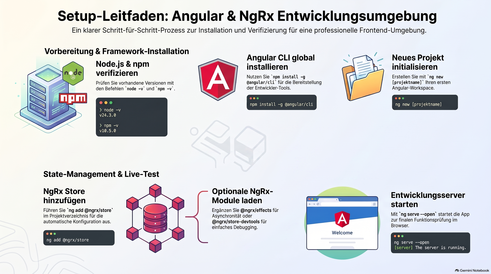
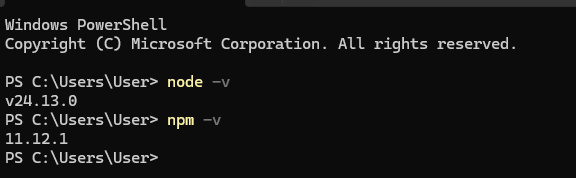
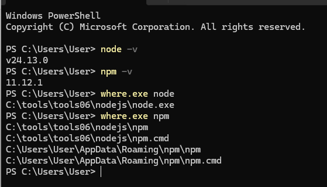
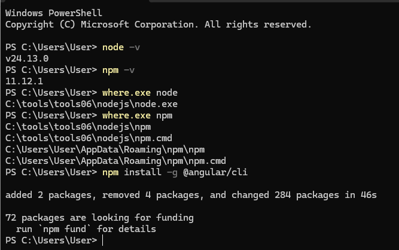
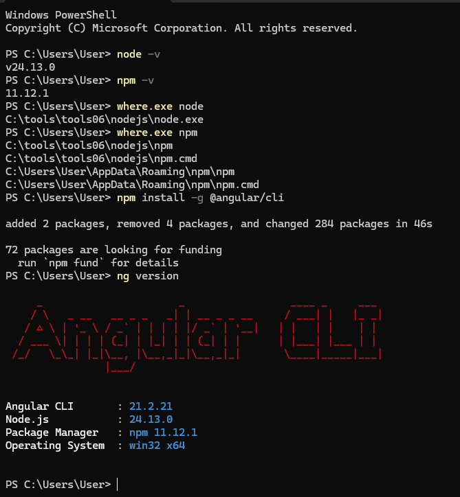
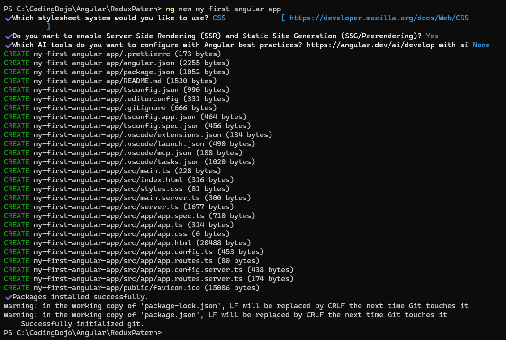
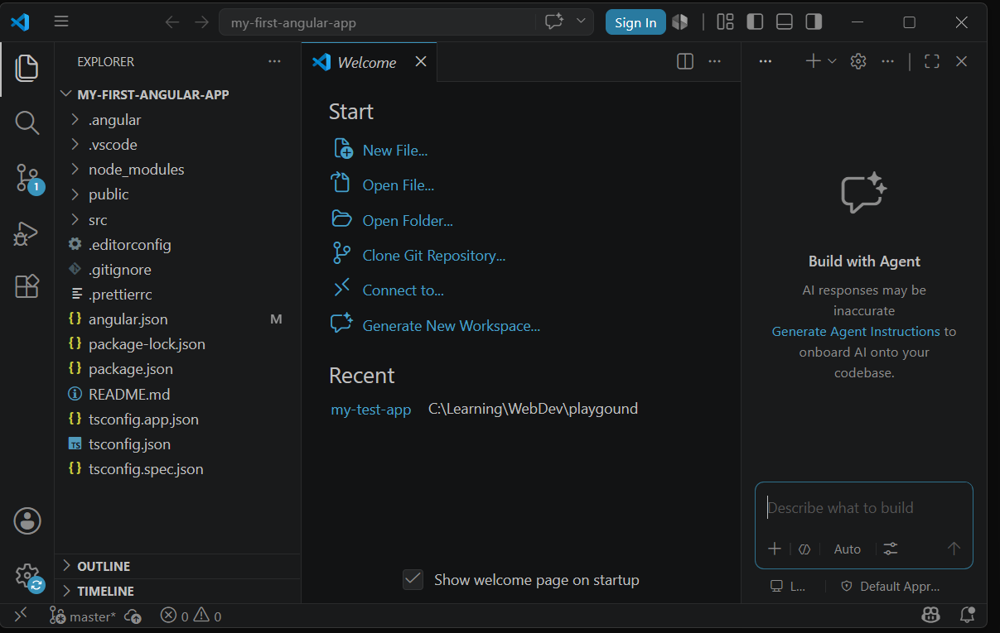
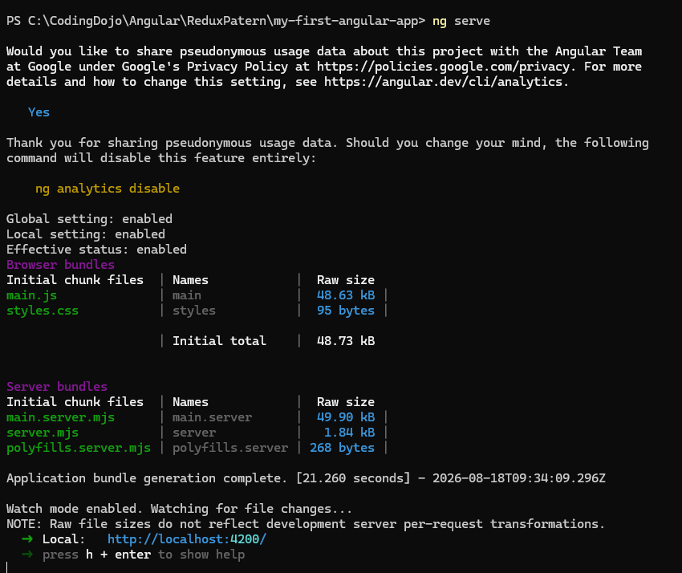
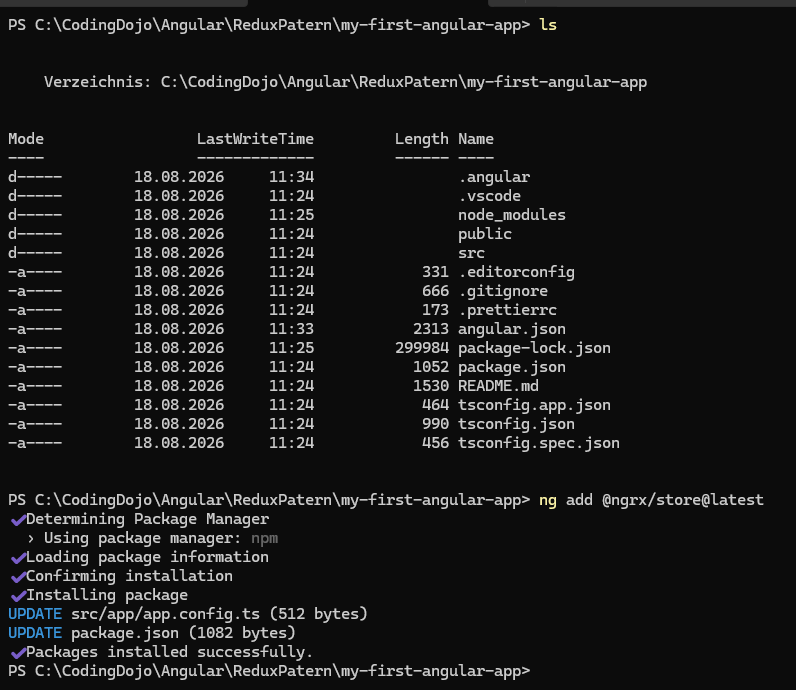

> [NOTE!]
> Dieser Text bietet eine umfassende Anleitung zur Einrichtung einer modernen Web-Entwicklungsumgebung mit **Node.js**, dem **Angular CLI** und **NgRx**. Zunächst wird erläutert, wie man die Installation von **Node.js** und **npm** über das Terminal überprüft oder diese bei Bedarf plattformübergreifend neu installiert. Anschließend beschreibt die Quelle den globalen Installationsprozess des **Angular Frameworks** sowie die Erstellung und den Start eines neuen Projekts. Ein weiterer Schwerpunkt liegt auf der Integration von **NgRx** für das **State-Management**, wobei sowohl die automatisierte Installation über Schematics als auch die manuelle Konfiguration behandelt werden. Abschließend wird ein **minimales Beispielprojekt** bereitgestellt, das die korrekte Funktionsweise von Actions, Reducern und Selectoren praktisch demonstriert. Damit dient das Dokument als strukturierter Leitfaden für Entwickler, um eine funktionale **Architektur** für skalierbare Frontend-Anwendungen aufzubauen.


# Install Angular CLI and NgRx

You’ll need:

* Node.js (you already used Node.js 👍)

## How to check that node.js is already installed?

To check if Node.js and npm are already installed, _open your terminal or command prompt and run the version check commands_.

### 1. Quick Verification Commands

Open your terminal (macOS/Linux) or Command Prompt/PowerShell (Windows) and type the following:

* Check Node.js:
  ```bash
  node -v
  ```
  _(Alternative: `node --version`)_
* Check npm:
  ```bash
  npm -v
  ```
  _(Alternative: `npm --version`)_

  

### 2. How to Interpret the Results

* Success: If installed, the terminal will return the active version numbers (e.g., `v24.3.0` and `10.5.0`).
* Failure: If you see an error like `command not found` or `'node' is not recognized`, they are not installed or your system's PATH variable is misconfigured.

### 3. Find the Installation Location (Optional)

If you want to know exactly where they are installed on your hard drive, run:

* Windows:
  ```cmd
  where node
  where npm
  ```

  
* macOS / Linux:
  ```bash
  which node
  which npm
  ```

If you find that they are missing or outdated, you can download the correct packages directly from the official Node.js Downloads page, or use a version manager like [nvm (Node Version Manager)](https://docs.npmjs.com/downloading-and-installing-node-js-and-npm/) to install them. 

Would you like help updating them to the latest version, or are you trying to troubleshoot a "command not found" error?


## How to install node.js and verify the installation?


To install Node.js and verify that it works correctly, _download the installer from the official website or use a package manager, then run the version check commands in your terminal_.

### 1. Step-by-Step Installation

#### Option A: Official Installer (Recommended for Beginners) 

1. Visit the official Node.js Downloads page.
2. Download the LTS (Long Term Support) version for your operating system (Windows or macOS).
3. Run the downloaded installer file.
4. Follow the setup wizard prompts, leaving the default settings selected. 

#### Option B: macOS (Using Homebrew)

If you use the Homebrew package manager, open your Terminal and run: 

```bash
brew install node
```

#### Option C: Linux (Ubuntu/Debian) \[15]

Open your terminal and run the following commands to install Node.js from the official NodeSource repository:

```bash
sudo apt update
sudo apt install nodejs npm -y
```

***

### 2. Verify the Installation

After the installation is complete, close any open terminal windows and open a new one. Run these commands to verify that Node.js and its package manager (npm) are active:

* Verify Node.js:
  ```bash
  node -v
  ```
  _Expected output:_ A version number starting with "v" (e.g., `v24.3.0`).
* Verify npm:
  ```bash
  npm -v
  ```
  _Expected output:_ A version number (e.g., `10.5.0`).

***

### 3. Run a Quick Test

To ensure Node.js is executing code correctly, you can run a one-line test directly from your command line:

```bash
node -e "console.log('Node.js is working perfectly!')"
```

If you see the message "Node.js is working perfectly!" printed in your terminal, your installation is complete and ready for development.

Are you planning to use Node.js for a frontend framework (like React or Vue) or for building a backend server (like Express)? I can help you set up your first project.


## How to install Angular?

To install Angular, install the Angular CLI (Command Line Interface) globally on your computer using npm.

Because you already verified your Node.js and npm installation in the previous steps, you have everything required to begin.

### 1. Prerequisites Check

Before running the installer, ensure your terminal recognizes npm by verifying you have an active version:

```bash
npm -v
```

### 2. Install the Angular CLI

Open your terminal or command prompt and run the following installation command:

```bash
npm install -g @angular/cli
```

* Note: macOS and Linux users may need to prefix this command with `sudo` (`sudo npm install -g @angular/cli`) if they run into permission errors.



### 3. Verify the Installation

Once the installation finishes, restart your terminal and run the version command to verify it was successful:

```bash
ng version
```

This command will display an ASCII art Angular logo along with the specific versions of the Angular CLI, Node.js, and your operating system.



### 4. Create Your First Angular Project

Now that the CLI is installed, you can generate a new workspace and start your development server with these commands: 

1. Initialize the project:
   ```bash
   ng new my-first-angular-app
   ```
   _(The CLI will ask you to choose a stylesheet format like CSS or Sass and enable Server-Side Rendering. You can press Enter to accept the defaults)._


   
1. Navigate into the directory:
   ```bash
   cd my-first-angular-app
   ```
   For editing your project files, popular development environments like [Microsoft Visual Studio Code](https://code.visualstudio.com/) are highly recommended by the community.

   

   To start the Visual Studio Code editor just type:

   ````powershell
   code .
    ````
    

   
3. Launch the development server:

   ```bash
   ng serve --open
   ```
   The `--open` flag automatically launches your default web browser to `http://localhost:4200`, where you will see the default Angular welcome page.



Would you like to learn how to generate components using the CLI, or do you need help configuring routing for your new application?


## How to install NgRx?

To install NgRx, _add the core store package to your existing Angular project using the Angular CLI `ng add` schematic_. This approach automatically installs the necessary dependencies and updates your project configuration files. 

### 1. Prerequisites Check

Make sure you are inside your Angular project's root directory (the folder containing your `package.json` file) before running the installation command. 

### 2. Install the Core NgRx Store

Open your terminal and run the following command to install the primary global state management library:

```bash
ng add @ngrx/store@latest
```


* What this does: It installs the packages, registers the `StoreModule` or configures the functional `provideStore()` providers in your application, and updates your configurations automatically. 

### 3. Install Common NgRx Extensions (Optional)

Most enterprise Angular applications require additional NgRx libraries to handle asynchronous side effects, debugging tools, or entity management. You can add them using the same schematic approach:

* For Asynchronous Side Effects (Effects):
  ```bash
  ng add @ngrx/effects@latest
  ```
* For Redux DevTools Integration (Debugging):
  ```bash
  ng add @ngrx/store-devtools@latest
  ```
* For Route Integration (Router Store):
  ```bash
  ng add @ngrx/router-store@latest
  ```


### 4. Alternative: Using npm directly

If you prefer a manual setup without the Angular CLI schematic modifying your files automatically, you can pull the packages directly from npm:

```bash
npm install @ngrx/store @ngrx/effects @ngrx/store-devtools
```

### 5. Verify the Installation

Open your project's `package.json` file and look inside the `dependencies` object. You should see the package entries listed along with their version numbers: 

```json
"dependencies": {
  "@ngrx/effects": "^19.0.0",
  "@ngrx/store": "^19.0.0",
  "@ngrx/store-devtools": "^19.0.0"
}
```

Are you working with a [standalone components](./Angular-standalone-component.md) architecture (Angular 15+) or a traditional NgModule-based architecture? 
I can show you how to register your first [actions](./Angular-NgRx-Actions.md), [reducers](./Angular-NgRx-Reducer.md), and [selectors](./Angular-NgRx-Selector.md) for your specific structure.

>[NOTE!]
> In case you want to review the Redux data flow the white rabbit: [Link](./state-management-cycle.md)

# Minimal Verification Project

Here is a complete, minimal verification project using Angular ([Standalone Components](./Angular-standalone-component.md)) and NgRx. 
This project implements a Counter to verify that your NgRx [Actions](./Angular-NgRx-Actions.md), [Reducers](./Angular-NgRx-Reducer.md), and [Selectors](./Angular-NgRx-Selector.md) are wiring up and managing [state](./NgRx-State.md) correctly.

## 1. Set Up the Project Files

Create or update these three files in your Angular project's `src/app/` directory.

## `app.config.ts` (Application Configuration)

This file initializes the NgRx [Store](./Angular-NgRx-Store.md) using the modern `provideStore` API.

```typescript
import { ApplicationConfig } from '@angular/core';
import { provideStore } from '@ngrx/store';
import { counterReducer } from './counter.reducer';

export const appConfig: ApplicationConfig = {
  providers: [
    provideStore({ counter: counterReducer })
  ]
};
```

## `counter.reducer.ts` (Actions & Reducer)

This file defines the [actions](./Angular-NgRx-Actions.md) (`increment`, `decrement`, `reset`) and the logic to transition the [state](./NgRx-State.md).

```typescript
import { createAction, createReducer, on } from '@ngrx/store';

// 1. Actions
export const increment = createAction('[Counter] Increment');
export const decrement = createAction('[Counter] Decrement');
export const reset = createAction('[Counter] Reset');

// 2. Initial State
export const initialState = 0;

// 3. Reducer
export const counterReducer = createReducer(
  initialState,
  on(increment, (state) => state + 1),
  on(decrement, (state) => state - 1),
  on(reset, () => initialState)
);
```

## `app.component.ts` (The View Component)

This component reads the state using a [selector](./Angular-NgRx-Selector.md) and [dispatches actions](./Dispatch-Action.md) when buttons are clicked.

```typescript
import { Component } from '@angular/core';
import { CommonModule } from '@angular/common';
import { Store } from '@ngrx/store';
import { Observable } from 'rxjs';
import { increment, decrement, reset } from './counter.reducer';

@Component({
  selector: 'app-root',
  standalone: true,
  imports: [CommonModule],
  template: `
    <div style="text-align: center; margin-top: 50px; font-family: sans-serif;">
      <h1>NgRx Verification Counter</h1>
      
      <!-- Async pipe automatically subscribes/unsubscribes -->
      <h2 style="font-size: 3rem; color: #3f51b5;">{{ count$ | async }}</h2>

      <div style="display: flex; gap: 10px; justify-content: center;">
        <button (click)="onIncrement()" style="padding: 10px 20px;">Increment</button>
        <button (click)="onDecrement()" style="padding: 10px 20px;">Decrement</button>
        <button (click)="onReset()" style="padding: 10px 20px; background-color: #f44336; color: white; border: none; border-radius: 4px;">Reset</button>
      </div>
    </div>
  `
})
export class AppComponent {
  // Select the 'counter' slice from global state
  count$: Observable<number>;

  constructor(private store: Store<{ counter: number }>) {
    this.count$ = store.select('counter');
  }

  onIncrement() {
    this.store.dispatch(increment());
  }

  onDecrement() {
    this.store.dispatch(decrement());
  }

  onReset() {
    this.store.dispatch(reset());
  }
}
```

***

## 2. Verify Your `main.ts`

Ensure your standard entrypoint bootstrap file matches the config injection:

```typescript
import { bootstrapApplication } from '@angular/platform-browser';
import { AppComponent } from './app/app.component';
import { appConfig } from './app/app.config';

bootstrapApplication(AppComponent, appConfig)
  .catch((err) => console.error(err));
```

***

## 3. Run and Verify

1. Launch your application:
   ```bash
   ng serve
   ```
2. Open `http://localhost:4200` in your web browser.
3. Click Increment and Decrement. If the number changes on your screen, your NgRx architecture is fully functional.

Would you like to extend this verification project to test NgRx Effects using a mock HTTP service call, or install Redux DevTools to visually track these state changes?


