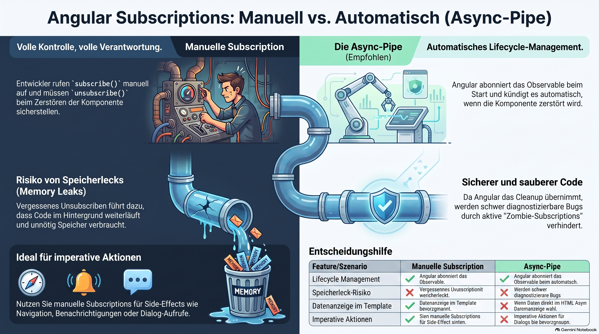

>[NOTE!]
>Dieser Text erläutert die wesentlichen Unterschiede zwischen **manuellen und automatischen Abonnements** in Angular-Anwendungen. Während Entwickler bei einem **manuellen Abonnement** selbst für den Aufruf von **subscribe** und die spätere Bereinigung zuständig sind, übernimmt die **Async-Pipe** diese Aufgaben im Template vollautomatisch. Die Nutzung der Async-Pipe wird ausdrücklich empfohlen, um **Speicherlecks und unnötigen Code-Ausführungen** vorzubeugen, die durch vergessene Kündigungen entstehen könnten. Dennoch bleiben manuelle Abonnements für **imperative Aktionen**, wie etwa die Navigation oder das Auslösen von Benachrichtigungen, ein notwendiges Werkzeug. Zusammenfassend liefert die Quelle eine klare Richtlinie, wann welche Methode für eine **effiziente Datenverarbeitung** und Fehlervermeidung einzusetzen ist.


# Manual Subscription

A **manual subscription** is when **you explicitly call `subscribe()` in your component code and are responsible for managing the subscription yourself**.

Let's compare it with Angular's recommended approach.

***

# Manual Subscription

Suppose your service exposes an Observable:

```ts
items$ = this.cartService.items$;
```

In your component, you subscribe manually:

```ts
export class CartComponent implements OnInit, OnDestroy {

  items: Product[] = [];

  private subscription?: Subscription;

  ngOnInit() {
    this.subscription = this.cartService.items$
      .subscribe(items => {
        this.items = items;
      });
  }

  ngOnDestroy() {
    this.subscription?.unsubscribe();
  }
}
```

Notice two things:

1. You call `subscribe()`.

2. You must remember to call `unsubscribe()`.

That's why it's called a **manual subscription**—you're managing its lifecycle yourself.

***

# Automatic Subscription with the `async` Pipe

Instead, you can expose the Observable directly:

```ts
items$ = this.cartService.items$;
```

Then use it in the template:

```html
<li *ngFor="let item of items$ | async">
  {{ item.name }}
</li>
```

Angular automatically:

* subscribes when the component is created,

* updates the view when new values arrive,

* unsubscribes when the component is destroyed.

You don't write any subscription code yourself.

***

# Why prefer the `async` pipe?

Imagine you forget to unsubscribe:

```ts
ngOnInit() {
  this.cartService.items$
    .subscribe(items => {
      this.items = items;
    });
}
```

Now the user navigates away from the page.

The component is destroyed, but the subscription may still exist (depending on the Observable), so it continues receiving updates.

That can lead to:

* unnecessary memory usage,

* code running after the component is gone,

* difficult-to-diagnose bugs.

Using the `async` pipe avoids this class of problems because Angular cleans up the subscription automatically.

***

# When is a manual subscription appropriate?

Manual subscriptions are still useful when you need to **perform an action** rather than simply display data.

For example:

```ts
this.authService.login$
  .subscribe(user => {
    this.router.navigate(['/dashboard']);
  });
```

Here, you're reacting to a login event by navigating to another page. This isn't something you can do in a template, so a manual subscription makes sense.

Another example is showing a notification:

```ts
this.orderService.orderCreated$
  .subscribe(() => {
    this.snackBar.open('Order created!');
  });
```

Again, you're triggering a side effect, not rendering data.

***

# Rule of Thumb

| Situation                                                              | Recommended Approach                                                                               |
| ---------------------------------------------------------------------- | -------------------------------------------------------------------------------------------------- |
| Display data in a template                                             | Use the `async` pipe                                                                               |
| Perform an action (navigate, log, show a dialog, call another service) | Use a manual subscription                                                                          |
| Long-lived manual subscription                                         | Ensure it's cleaned up (e.g., by unsubscribing or using Angular/RxJS patterns such as `takeUntil`) |

## Summary

* **Manual subscription** = you call `subscribe()` and manage the subscription yourself.

* **Automatic subscription** = Angular's `async` pipe calls `subscribe()` and `unsubscribe()` for you.

* For data shown in templates, the `async` pipe is generally the preferred approach.

* For imperative actions in component or service code, manual subscriptions are often appropriate.
