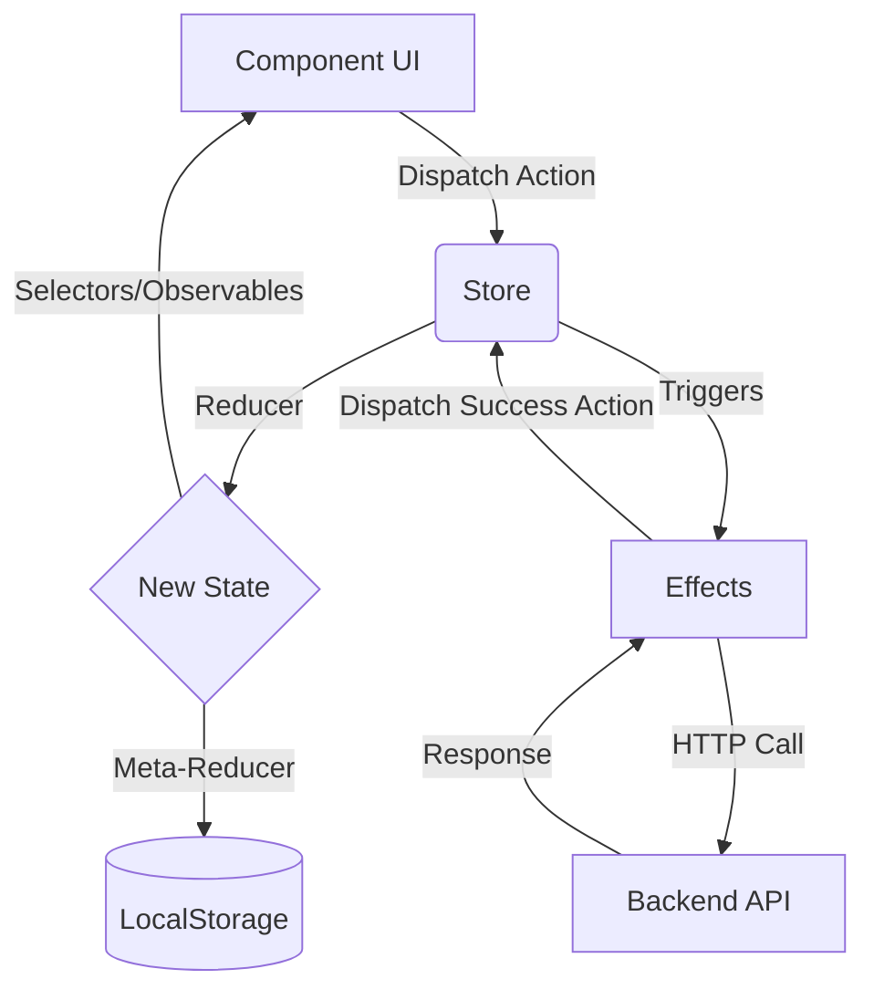

In the context of NgRx, "synchronization" usually refers to one of three things: keeping the **UI in sync with the State**, keeping the **State in sync with a Backend (API)**, or keeping the **State in sync with Local Storage/Tabs**.

Here is a breakdown of how synchronization works in NgRx across those three layers.

---

### 1. UI Synchronization (The "Reactive" Flow)
NgRx uses a **Unidirectional Data Flow**. Synchronization between the store and your components is handled via **Observables**.

*   **The Single Source of Truth:** The Store holds the entire state of your application.
*   **Selectors:** Components subscribe to specific slices of state using Selectors.
*   **Automatic Updates:** Because selectors return Observables, any time a reducer updates the state, the Store emits a new value. Angular’s `async` pipe (or signals) detects this change and updates the DOM automatically.
*   **Immutability:** Synchronization works reliably because state is **immutable**. NgRx doesn't change the old state object; it replaces it with a new one. This makes change detection highly efficient (reference check vs. deep equality check).

---

### 2. Backend Synchronization (NgRx Effects)
To sync your local state with a server (database), NgRx uses **Effects**. This is the bridge between synchronous state changes and asynchronous external APIs.

The "Sync" cycle looks like this:
1.  **Dispatch:** A component dispatches an action (e.g., `[User Page] Load Data`).
2.  **Effect:** An Effect listens for that specific action. It performs an HTTP call.
3.  **Action Dispatch:** Once the server responds, the Effect dispatches a *new* action (e.g., `[User API] Load Data Success`).
4.  **Reducer:** The reducer catches the "Success" action and updates the Store with the fresh data from the server.
5.  **UI:** The selectors emit the new data to the components.

**Optimistic vs. Pessimistic Sync:**
*   **Pessimistic:** You wait for the server to say "Success" before updating the UI.
*   **Optimistic:** You update the local Store immediately (assuming the server call will work). If the server returns an error, the Effect dispatches a "Failure" action to roll back the state.

---

### 3. Persistence Synchronization (LocalStorage/SessionStorage)
By default, the NgRx Store is kept in memory. If the user refreshes the page, the state is wiped. To sync state with `localStorage`, you use **Meta-Reducers**.

*   **Meta-Reducers:** These are "hooks" that sit between the action and the reducer.
*   **The Flow:** Every time *any* action is dispatched, a Meta-Reducer can intercept the resulting state and save it to `localStorage.setItem()`.
*   **Rehydration:** When the app first loads, the Meta-Reducer reads from `localStorage` and provides that data as the `initialState` for the store.

*Popular library for this: `ngrx-store-localstorage`.*

---

### 4. Cross-Tab Synchronization
If a user has your app open in two browser tabs, changing state in Tab A won't naturally update Tab B. To synchronize these, you usually use the **Storage Event** or a **Broadcast Channel**.

1.  **Action in Tab A:** Updates the store and writes to `localStorage`.
2.  **Event in Tab B:** The browser fires a `storage` event because `localStorage` changed.
3.  **Sync:** An Effect or Meta-Reducer in Tab B listens for that event and dispatches an action to update Tab B's store with the new data.

---

### Summary Diagram

### Key Takeaway
Synchronization in NgRx is **event-driven**. You never manually tell a component to update; you update the **State**, and the **reactive stream** ensures that everything else (UI, Storage, Backend) reacts to that change in a predictable sequence.