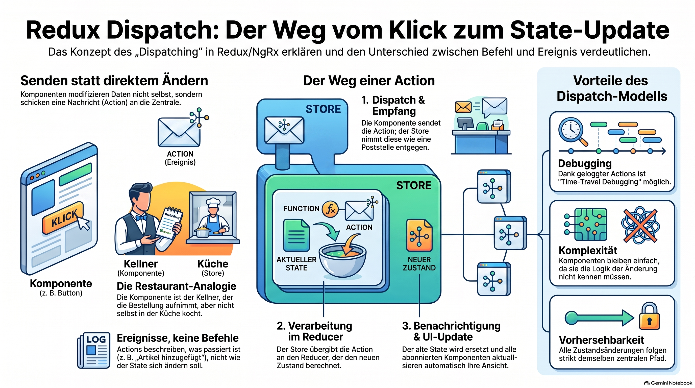

> [NOTE!]
> Der bereitgestellte Text erläutert den **State Management Cycle** in Angular-Anwendungen unter Verwendung von **NgRx**. Dieser Prozess beschreibt einen **kreisförmigen Datenfluss**, bei dem Komponenten niemals den Zustand direkt ändern, sondern stattdessen **Actions** aussenden, um Ereignisse zu melden. Ein **Reducer** verarbeitet diese Signale, um einen vollständig **neuen Status** zu berechnen, ohne den alten zu manipulieren. Über **Selectors** fließen die aktualisierten Informationen zurück an die Benutzeroberfläche, wodurch eine **automatische Synchronisation** der Anzeige erfolgt. Für asynchrone Aufgaben wie API-Aufrufe werden **Effects** eingesetzt, die den reinen Logikfluss des Reducers nicht unterbrechen. Dieses System garantiert eine **hohe Vorhersehbarkeit** und erleichtert die Fehlersuche durch klar definierte Zustandsübergänge.


# State Management Cycle

In **NgRx**, the **state management cycle** (also called the **state lifecycle** or **Redux data flow**) describes **the complete journey of data from a user action to an updated UI**.

It is called a **cycle** because the same sequence repeats every time something happens in your application.

Let's walk through it step by step.

***

## The State Management Cycle

```text
         User clicks button
                 │
                 ▼
          Component dispatches
               an Action
                 │
                 ▼
               Store
                 │
                 ▼
              Reducer
                 │
                 ▼
            New Application State
                 │
                 ▼
             Store is updated
                 │
                 ▼
              Selectors emit
                 │
                 ▼
          Components receive data
                 │
                 ▼
             UI is re-rendered
```

Then the cycle starts again when the next action occurs.

***

# Step 1 – User Interaction

Everything begins with an event.

Examples:

* User clicks **Login**

* User adds a product

* User deletes an order

* Timer expires

* HTTP request completes

Example:

```text
User clicks

"Add to Cart"
```

***

# Step 2 – Component Dispatches an Action

The component doesn't change the state.

Instead it reports what happened.

```ts
this.store.dispatch(
  addItem({ product })
);
```

Think of it as saying:

> "Dear Store, the user added an item."

***

# Step 3 – Store Receives the Action

The Store receives the action.

```text
Action

↓

Store
```

The Store doesn't decide how to change the state.

It simply forwards the action.

***

# Step 4 – Reducer Calculates the New State

The reducer receives:

```text
Current State

+

Action
```

Example:

Current state:

```text
Cart

Laptop
Mouse
```

Action:

```text
Add Keyboard
```

Reducer returns:

```text
Cart

Laptop
Mouse
Keyboard
```

Notice:

The reducer creates a **new state object**.

It never modifies the old one.

***

# Step 5 – Store Replaces the State

Before:

```text
Store

↓

State A
```

After:

```text
Store

↓

State B
```

The Store now points to the new snapshot.

***

# Step 6 – Selectors Emit New Values

Components don't usually read the Store directly.

They use selectors.

```ts
cart$ =
    this.store.select(selectCart);
```

When the Store changes:

```text
Store

↓

Selector

↓

Observable emits
```

***

# Step 7 – Angular Updates the UI

The component uses the `async` pipe.

```html
<li *ngFor="let item of cart$ | async">
```

The selector emits a new cart.

Angular automatically redraws the page.

No refresh button.

No manual synchronization.

***

# The Cycle Repeats

Suppose the user removes an item.

Exactly the same sequence happens.

```text
User

↓

Action

↓

Store

↓

Reducer

↓

New State

↓

Selector

↓

UI
```

Every change follows this identical path.

***

# What about HTTP Requests?

Reducers must stay pure.

So asynchronous work is handled by **Effects**.

The cycle becomes:

```text
User

↓

Dispatch Action

↓

Effect

↓

HTTP Request

↓

Server responds

↓

Dispatch Success Action

↓

Reducer

↓

New State

↓

Store

↓

Selector

↓

UI
```

Notice that even after the HTTP request completes, **the reducer still doesn't talk to the server**. Instead, the effect dispatches another action (such as `loadProductsSuccess`), and the reducer responds to that action.

***

# A Real Example

Imagine you're building an online shop.

### Initial State

```text
Cart

Laptop
```

***

### User clicks

```text
Add Mouse
```

***

### Component

```ts
this.store.dispatch(
    addItem({ product: mouse })
);
```

***

### Reducer

```text
Old State

Laptop
```

↓

Creates

```text
New State

Laptop
Mouse
```

***

### Store

Replaces the old state.

***

### Selector

Emits:

```text
Laptop
Mouse
```

***

### Component

Receives the updated cart.

***

### UI

Now displays:

```text
Laptop

Mouse
```

The entire process typically happens in milliseconds.

***

# Why is this called a "cycle"?

Because after one update finishes, the application waits for the next event.

```text
User clicks

↓

State changes

↓

UI updates

↓

User clicks again

↓

State changes

↓

UI updates

↓

User clicks again

↓

...
```

The application continuously repeats the same flow.

***

# Why is this useful?

Every state change follows exactly the same path.

That means:

* You always know **where** state changes happen (reducers).

* You always know **what** caused the change (actions).

* You can log every action.

* You can replay actions to reproduce bugs.

* State changes are predictable and easy to test.

***

## An analogy: a bank transaction

Imagine depositing money into a bank account.

```text
Customer
    │
    ▼
Deposit Slip (Action)
    │
    ▼
Bank Teller (Store)
    │
    ▼
Accounting Rules (Reducer)
    │
    ▼
Updated Account Balance (New State)
    │
    ▼
Statement Printed (Selector/UI)
```

The customer never edits the bank's records directly. They submit a request, the bank processes it according to its rules, updates the official record, and then everyone sees the new balance.

NgRx follows the same principle: **components request changes by dispatching actions, reducers compute the next state, the store publishes that state, and the UI reacts automatically.**
