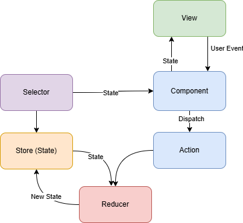
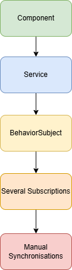
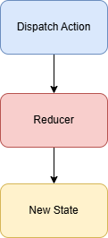

# First Redux Patern Tutorial

The **Redux pattern** is one of the most important architectural patterns for managing state in Angular applications. Even if you later use **NgRx**, understanding the underlying Redux concepts makes the library much easier to learn.

***

## Overview




Before coding, understand the four pillars:
1.  [**Store:**](./Atoms/Angular-NgRx-Store.md) The single source of truth (a global object).
2.  [**Actions:**](./Atoms/Angular-NgRx-Actions.md) Plain objects that describe *what* happened (e.g., "[Counter] Increment").
3.  [**Reducers:**](./Atoms/Angular-NgRx-Reducer.md) [Pure functions](./Atoms/Angular-NgRx-Pure-Funktion.md) that take the **current state** + **action** and return a **new state**.
4.  [**Selectors:**](./Atoms/Angular-NgRx-Selector.md) Functions used to grab specific pieces of state from the store.

# Redux PatterRedux Pattern Tutorialn ./Tutorial for Angular Developers

## Learning Objectives

By the end of this tutorial you'll understand:

* Why [state management](./Atoms/state-management-cycle.md) is needed

* What [Redux](./Atoms/What_Problem_does_Redux_solve.md) solves ➡️ «Data Flow»

    * [Redux Pattern Tutorial](./Second Redux Pattern Tutorial.md)

* [The three Redux principles](./Atoms/The_three_Redux__principles.md)

    * Single Source of Truth ➡️ _»Central Bank»_
    * **State** is Read-Only and **State** can only change through **Actions**
    * Changes are made by **Pure Functions**

* [Store](./Atoms/Angular-NgRx-Store.md) ➡️ 

* [Actions](./Atoms/Angular-NgRx-Actions.md) ➡️ 

* [Reducers](./Atoms/Angular-NgRx-Reducer.md) ➡️ 

* [Selectors](./Atoms/Angular-NgRx-Selector.md) ➡️ 

* [Effects](./Atoms/Angular_NgRx_Effects.md) (NgRx extension)

* [Complete data flow](./Atoms/Complete_Data_Flow.md)

* [How Redux maps to Angular](./Atoms/How_Redux_maps_to_Angular.md)

***

# 1. Why do we need Redux?

Imagine a medium-sized Angular application.

```
App
 ├── Header
 ├── Navigation
 ├── Product List
 ├── Shopping Cart
 └── Checkout
```

Now suppose the user adds a product to the cart.

Several components need to know:

* Cart icon

* Checkout page

* Product list

* Total price

* Header badge

Without Redux:

```
Component
      ↓
Service
      ↓
BehaviorSubject
      ↓
Several subscriptions
      ↓
Manual synchronization
```



1. [Standalone Component](./Atoms/Angular-standalone-component.md)
2. [Angular Service](./Atoms/Angular-Service.md)
3. [BehaviorSubject](./Atoms/BehaviorSubject.md)
4. [Subscriptions](./Atoms/Subscription.md)
5. [Manual Synchronisations](./Atoms/Manual-Synchronization.md)

As the application grows:

* [state](./Atoms/NgRx-State.md) gets duplicated

* [synchronization](./Atoms/NgRx-Synchronization.md) becomes difficult

* bugs increase

* [debugging](./Atoms/NgRx-Debugging.md) becomes harder

Redux solves this.

***

# 2. The Core Idea

Instead of every component owning data:

```
Component A

Component B

Component C
```

All application state lives in **one central store**.

```
          STORE
     ----------------
     cart
     products
     user
     settings
     orders
     ----------------

      ↑   ↑   ↑
      │   │   │
Components read state
```

Components never modify state directly.

***

# 3. The Three Redux Principles

## Principle 1

### Single Source of Truth

One Store

```
Store
{
    cart,
    products,
    user,
    settings
}
```

Everything comes from there.

***

## Principle 2

[State](./Atoms/NgRx-State.md) is Read-Only

Wrong:

```ts
store.cart.items.push(product);
```

Correct:

```
Dispatch Action
↓

Reducer

↓

New State
```

[State](./Atoms/NgRx-State.md) can only change through **Actions**.



> [NOTE!]
> See also:
>  [Dispatch Action](./Atoms/Dispatch-Action.md).
> [Reducer](./Atoms/NgRx-Reducer.md)
> [New State](./Atoms/New-State.md)

***

## Principle 3

Changes are made by [Pure Functions](./Atoms/Angular-NgRx-Pure-Funktion.md)

[Reducers](./Atoms/Angular-NgRx-Reducer.md) are pure.

Input

```
Current State

Action
```

Output

```
New State
```
> [NOTE!]
> See also:
> [State](.Atoms/NgRx-State.md)
> [New State](./Atoms/New-State.md)


Nothing else.

No HTTP.

No timers.

No DOM.

No randomness.

***

# 4. What is State?

[State](./Atoms/NgRx-State.md) is simply data.

Example:

```ts
interface AppState {

    user: User;

    cart: Cart;

    products: Product[];

    loading: boolean;

}
```

Think of [state](./Atoms/NgRx-State.md) as the application's memory.

***

# 5. Store

The [Store](./Atoms/Angular-NgRx-Store.md) contains the entire application state.

```
Store

{
   user

   cart

   orders

   settings
}
```

Components subscribe to the [Store](./Atoms/Angular-NgRx-Store.md).

```ts
cart$ = this.store.select(selectCart);
```

Notice:

No mutable variables.

No [BehaviorSubjects](./Atoms/BehaviorSubject.md).

No event emitters.

***

# 6. Actions

Actions describe **what happened**.

Examples

```
User Logged In

Product Added

Item Removed

Load Products

Logout

Save Order
```

An Action is just an object.

```ts
{
    type: '[Cart] Add Item',
    product: product
}
```

NgRx example:

```ts
export const addItem = createAction(
    '[Cart] Add Item',
    props<{ product: Product }>()
);
```

Notice:

Actions describe events.

They don't contain business logic.

***

# 7. Dispatching Actions

Components [dispatch actions](./Atoms/Dispatch-Action.md).

```ts
this.store.dispatch(
    addItem({ product })
);
```

Think:

"I'm not changing the cart."

Instead:

"I'm announcing that something happened."

***

# 8. Reducers

[Reducers](./Atoms/Angular-NgRx-Reducer.md) calculate the next [state](./Atoms/NgRx-State.md).

Example:

Current state

```
Cart

2 items
```

Action

```
Add Laptop
```

Reducer

↓

New State

```
3 items
```

Example:

```ts
export const cartReducer = createReducer(

    initialState,

    on(addItem, (state, action) => ({

        ...state,

        items: [...state.items, action.product]

    }))
);
```

Important:

Never mutate.

Wrong

```ts
state.items.push(product);
```

Correct

```ts
items: [...state.items, product]
```

Always create new objects.

***

# 9. Immutable State

Why?

Angular + NgRx can detect changes efficiently.

Bad:

```
Same object

↓

Modified
```

Good:

```
Old Object

↓

New Object
```

Example:

```ts
const newState = {

    ...state,

    loading: true

};
```

***

# 10. Selectors

Components shouldn't know the [store](./Atoms/Angular-NgRx-Store.md) structure.

Instead they use [selectors](./Atoms/Angular-NgRx-Selector.md).

Example:

```ts
export const selectCart =
    createFeatureSelector<CartState>('cart');
```

Another selector:

```ts
export const selectTotalPrice =
    createSelector(

        selectCart,

        cart =>
            cart.items.reduce(
                (sum, item) => sum + item.price,
                0
            )
    );
```

Component:

```ts
total$ =
    this.store.select(selectTotalPrice);
```

Benefits:

* reusable

* memoized

* testable

***

# 11. Effects (NgRx)

[Reducers](./Atoms/Angular-NgRx-Reducer.md) must stay pure.

So where do HTTP requests go?

Into [Effects](./Atoms/Angular_NgRx_Effects.md).

```
Dispatch Load Products

↓

Effect

↓

HTTP Request

↓

Success

↓

Dispatch Success Action

↓

Reducer

↓

Store Updated
```

Example:

```ts
loadProducts$ = createEffect(() =>
  this.actions$.pipe(
    ofType(loadProducts),
    switchMap(() =>
      this.productService.getProducts().pipe(
        map(products =>
          loadProductsSuccess({ products })
        )
      )
    )
  )
);
```

[Reducers](./Atoms/Angular-NgRx-Reducer.md) stay free of side effects.

***

# 12. Complete Redux Flow

```
User clicks button

↓

Component

↓

Dispatch Action

↓

Store

↓

Reducer

↓

New State

↓

Selectors

↓

Component Updates

```

If HTTP is involved:

```
Component

↓

Action

↓

Effect

↓

HTTP

↓

Success Action

↓

Reducer

↓

Store

↓

Selector

↓

UI
```

***

# 13. Angular vs Redux

Traditional Angular:

```
Component

↓

Service

↓

BehaviorSubject

↓

Component
```

Redux:

```
Component

↓

Action

↓

Reducer

↓

Store

↓

Selector

↓

Component
```

The data flow is always one-way.

***

# 14. Advantages

* Predictable state changes

* Easier debugging

* Excellent DevTools support

* Time-travel debugging

* Easier testing

* No hidden side effects

* Better scalability for large applications

***

# 15. Common Beginner Mistakes

### ❌ Mutating state

```ts
state.items.push(item);
```

Always return a new state object instead.

### ❌ Putting HTTP calls in reducers

Reducers should only compute the next state.

### ❌ Putting business logic in components

Keep components thin. They should dispatch actions and select state.

### ❌ Selecting the whole store

```ts
this.store.select(state => state);
```

Prefer focused selectors.

### ❌ Too many actions

Actions should represent meaningful domain events, such as `addItem`, `removeItem`, or `checkoutStarted`.

***

# 16. A Small Example: Todo App

Suppose the user clicks **Add Todo**.

1. Component dispatches:

```ts
this.store.dispatch(addTodo({ text: 'Learn Redux' }));
```

2. Reducer handles the action:

```ts
on(addTodo, (state, { text }) => ({
  ...state,
  todos: [
    ...state.todos,
    { id: Date.now(), text, completed: false }
  ]
}));
```

3. Selector exposes the updated list:

```ts
todos$ = this.store.select(selectTodos);
```

4. Template updates automatically:

```html
<li *ngFor="let todo of todos$ | async">
  {{ todo.text }}
</li>
```

No component directly modifies the list. Everything flows through actions and reducers.

***

# 17. When Should You Use Redux?

Redux (and NgRx) is a good fit when your application has:

* Many components sharing the same state.

* Complex workflows (authentication, shopping carts, dashboards).

* Asynchronous operations that affect shared state.

* A need for predictable state changes and easy debugging.

For smaller applications with mostly local component state, Angular services and signals may be simpler and perfectly adequate.

***

# Next Steps

Since you're learning Angular, a good progression is:

1. **Master the Redux concepts** ( [store](./Atoms/Angular-NgRx-Store.md), [actions](./Atoms/Angular-NgRx-Actions.md), [reducers](./Atoms/Angular-NgRx-Reducer.md), [selectors](./Atoms/Angular-NgRx-Selector.md), [immutable state](./Atoms/Redux_Pattern_Immutable_State.md) ).

2. **Learn RxJS fundamentals**, as NgRx builds heavily on [observables](./Atoms/Angular_RxJS_Observables.md).
 
3. **Study NgRx**, Angular's most popular Redux-inspired state management library.

4. Build a small project (such as a Todo app or Shopping Cart) using NgRx to reinforce the concepts.

5. Continue with the [second Redux pattern tutorial](./Second Redux Pattern Tutorial.md).

Once you're comfortable with this pattern, you'll find that NgRx is primarily a set of Angular-friendly tools that implement these same Redux ideas rather than an entirely new concept.
