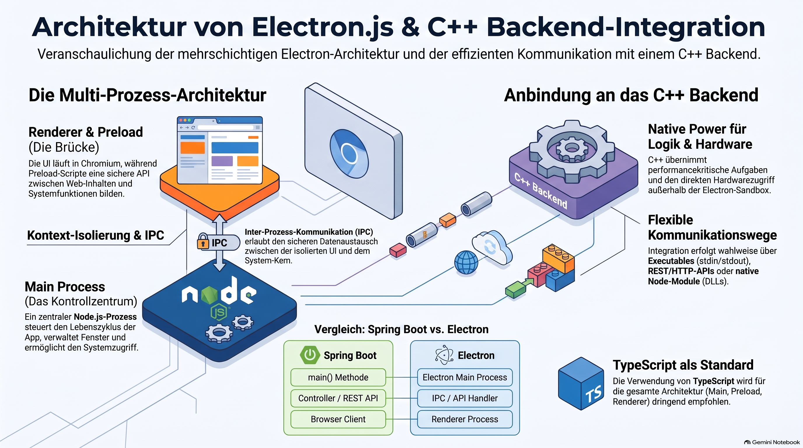

> [NOTE!]
> Diese Quellen bieten eine fundierte Einführung in die Entwicklung von Desktop-Anwendungen mit **Electron.js** unter besonderer Berücksichtigung von **TypeScript** und **C++-Backends**. Im Mittelpunkt steht das **Prozessmodell**, das strikt zwischen dem **Main-Prozess** für Systemaufgaben und dem **Renderer-Prozess** für die Benutzeroberfläche trennt. Ein sicherer Datenaustausch wird dabei durch **Preload-Skripte** und die sogenannte **Inter-Prozess-Kommunikation (IPC)** gewährleistet. Der Text erläutert zudem verschiedene Strategien, wie eine grafische Oberfläche effektiv mit performanten **C++-Diensten** verknüpft werden kann. Ein strukturierter **Lernplan** unterstützt Entwickler dabei, diese komplexen Technologien schrittweise zu meistern und professionelle Software-Architekturen aufzubauen. Damit dient das Material als praxisnaher Leitfaden für den Übergang von der Web- zur modernen Desktop-Entwicklung.


# Electron.js — Building Desktop Applications with Web Technologies


Absolutely — and **yes, Electron works very well with TypeScript**. In fact, for a professional application with a C++ backend, I would strongly recommend **Electron + TypeScript** rather than plain JavaScript.

And your new project is actually a very interesting architecture:

```text
┌──────────────────────────────────────────────┐
│              Electron Application            │
│                                              │
│   ┌──────────────────────────────────────┐   │
│   │        Renderer / UI                 │   │
│   │   HTML + CSS + TypeScript            │   │
│   │   (possibly React / Angular / etc.)  │   │
│   └──────────────────┬───────────────────┘   │
│                      │ IPC                    │
│   ┌──────────────────▼───────────────────┐   │
│   │        Preload / Bridge              │   │
│   │        TypeScript                    │   │
│   └──────────────────┬───────────────────┘   │
│                      │ IPC                    │
│   ┌──────────────────▼───────────────────┐   │
│   │        Electron Main Process         │   │
│   │        Node.js + Electron APIs       │   │
│   └──────────────────┬───────────────────┘   │
└──────────────────────┼───────────────────────┘
                       │
                       │ process / IPC / API
                       ▼
              ┌───────────────────┐
              │   C++ Backend     │
              │                   │
              │ native application│
              │ / service / DLL   │
              └───────────────────┘
```

That is a very useful architecture for you to learn because it combines **TypeScript, web development, Node.js, desktop development and native C++**.

Electron itself embeds Chromium and Node.js and provides the desktop application framework. ([GitHub](https://github.com/electron/electron/blob/main/docs/tutorial/introduction.md?utm_source=chatgpt.com "electron/docs/tutorial/introduction.md at main · electron/electron · GitHub"))

***

# Electron Tutorial — From Beginner to Practical

Since you're coming from **Java/Spring Boot and now C++**, I would _not_ approach Electron as "learn a giant JavaScript framework."

Instead, learn it in layers:

```text
JavaScript
   ↓
TypeScript
   ↓
HTML / CSS
   ↓
Node.js basics
   ↓
Electron
   ↓
IPC
   ↓
C++ ↔ Electron communication
   ↓
Production Electron application
```

The most important new concept is going to be **Electron's process model**.

***

# 1. What exactly is Electron?

Electron lets you build a desktop application using web technologies:

```text
HTML
CSS
JavaScript / TypeScript
        │
        ▼
     Electron
        │
   ┌────┴─────┐
   │          │
Chromium    Node.js
   │          │
   └────┬─────┘
        ▼
 Windows / macOS / Linux
```

So you can build something like:

```text
MyApplication.exe
```

while the user interface is essentially a web application.

Electron applications can run on Windows, macOS and Linux. ([GitHub](https://github.com/electron/electron/blob/main/docs/tutorial/introduction.md?utm_source=chatgpt.com "electron/docs/tutorial/introduction.md at main · electron/electron · GitHub"))

***

# 2. The most important Electron concept

Electron isn't simply:

```text
HTML
  +
JavaScript
  =
Desktop application
```

Instead, an Electron application normally consists of **different processes**.

The two most important are:

```text
Main Process
     │
     │ creates/manages
     ▼
BrowserWindow
     │
     ▼
Renderer Process
```

Electron's official documentation describes the main and renderer processes as the two fundamental process types. ([Electron](https://www.electronjs.org/docs/latest/tutorial/process-model?utm_source=chatgpt.com "Process Model | Electron"))

***

# 3. The Main Process

The **main process** is the heart of your Electron application.

For example:

```typescript
import { app, BrowserWindow } from "electron";

function createWindow() {

    const window = new BrowserWindow({
        width: 1000,
        height: 700
    });

    window.loadFile("index.html");
}

app.whenReady().then(() => {
    createWindow();
});
```

The main process can:

* create windows

* access the filesystem

* interact with the operating system

* create menus

* communicate with native processes

* use Node.js APIs

* communicate with renderer processes

Electron's main process runs in a Node.js environment and therefore has access to Node.js APIs. ([Electron](https://www.electronjs.org/docs/latest/tutorial/process-model?utm_source=chatgpt.com "Process Model | Electron"))

Think of it somewhat like:

```text
Spring Boot Application
       │
       ├── controls application
       ├── manages services
       └── provides infrastructure
```

It isn't exactly the same thing, but that mental model is useful.

***

# 4. The Renderer Process

The renderer is where your UI lives.

For example:

```html
<!DOCTYPE html>
<html>

<head>
    <title>My Electron App</title>
</head>

<body>

    <h1>Hello Electron!</h1>

    <button id="helloButton">
        Click me
    </button>

    <script src="renderer.js"></script>

</body>

</html>
```

And:

```typescript
const button = document.getElementById("helloButton");

button?.addEventListener("click", () => {

    console.log("Hello from Electron!");

});
```

This should look very familiar if you've been learning JavaScript and TypeScript.

The renderer is essentially a web page running inside Electron's Chromium environment.

***

# 5. The third important piece: Preload

This is where Electron becomes interesting.

You generally don't want your renderer to have unrestricted access to Node.js or Electron APIs.

Instead:

```text
Renderer
   │
   │
   ▼
Preload
   │
   │
   ▼
Main
```

The **preload script is the bridge**.

Electron's documentation specifically recommends using preload scripts and `contextBridge` to expose narrowly defined APIs to the renderer. ([Electron](https://www.electronjs.org/docs/latest/tutorial/tutorial-preload?utm_source=chatgpt.com "Using Preload Scripts | Electron"))

For example:

```typescript
// preload.ts

import { contextBridge } from "electron";

contextBridge.exposeInMainWorld(
    "myApi",
    {
        hello: () => "Hello from Electron!"
    }
);
```

Then your renderer can do:

```typescript
const message = window.myApi.hello();

console.log(message);
```

Conceptually:

```text
             Electron
                │
        ┌───────┴────────┐
        │                │
     Main             Renderer
        │                │
        │             window.myApi
        │                ▲
        │                │
        └── Preload ─────┘
```

***

# 6. Why does Electron need this?

This is primarily about **security and isolation**.

Imagine if arbitrary webpage code could simply do:

```javascript
require("fs");
```

and then:

```javascript
fs.rmSync("C:\\...");
```

That would be dangerous.

Modern Electron applications therefore use **context isolation** and carefully expose APIs through `contextBridge`. Context isolation is enabled by default in modern Electron. ([Electron](https://www.electronjs.org/docs/latest/tutorial/context-isolation?utm_source=chatgpt.com "Context Isolation | Electron"))

So instead of:

```text
Renderer
   │
   │ unrestricted access
   ▼
Operating System
```

you want:

```text
Renderer
   │
   │ specific API
   ▼
Preload
   │
   │ controlled IPC
   ▼
Main
   │
   ▼
Operating System
```

This is one of the **most important concepts to understand** before working on a production Electron application.

***

# 7. IPC — Inter-Process Communication

Now we get to another key Electron term:

**IPC = Inter-Process Communication**

Suppose the renderer wants the main process to perform an operation.

You can have:

```text
Renderer
   │
   │ "Please do X"
   ▼
Preload
   │
   │ IPC
   ▼
Main
   │
   │
   ▼
Operating System
```

Electron provides `ipcRenderer` and `ipcMain` for this. ([Electron](https://www.electronjs.org/docs/latest/tutorial/ipc?utm_source=chatgpt.com "Inter-Process Communication | Electron"))

For example:

### Main

```typescript
import { ipcMain } from "electron";

ipcMain.handle("get-version", () => {

    return "1.0.0";

});
```

### Preload

```typescript
import {
    contextBridge,
    ipcRenderer
} from "electron";

contextBridge.exposeInMainWorld("api", {

    getVersion: () =>
        ipcRenderer.invoke("get-version")

});
```

### Renderer

```typescript
const version = await window.api.getVersion();

console.log(version);
```

The flow is:

```text
renderer.ts

    │
    │ window.api.getVersion()
    ▼

preload.ts

    │
    │ ipcRenderer.invoke("get-version")
    ▼

main.ts

    │
    │ ipcMain.handle(...)
    ▼

return result

    │
    ▼

renderer.ts
```

Electron's documentation specifically recommends wrapping IPC calls in controlled functions rather than exposing the entire `ipcRenderer` object to the renderer. ([Electron](https://www.electronjs.org/docs/latest/tutorial/tutorial-preload?utm_source=chatgpt.com "Using Preload Scripts | Electron"))

***

# 8. And now your C++ backend enters the picture

This is the part I'd pay particular attention to in your new job.

You might have:

```text
┌──────────────────────────────┐
│ Electron                     │
│                              │
│  TypeScript UI               │
│       │                      │
│       ▼                      │
│  preload.ts                  │
│       │                      │
│       ▼                      │
│  Electron main process       │
│       │                      │
└───────┼──────────────────────┘
        │
        │ communication
        ▼
┌──────────────────────────────┐
│ C++ Backend                  │
│                              │
│ business logic               │
│ hardware access              │
│ native functionality         │
│ performance-critical code    │
└──────────────────────────────┘
```

There are several ways to connect Electron to C++.

For example:

### Option A — C++ executable

Electron starts:

```text
backend.exe
```

and communicates with it through:

```text
stdin/stdout
```

or:

```text
TCP
```

or:

```text
WebSocket
```

or:

```text
named pipes
```

***

### Option B — REST/HTTP

The C++ backend could expose:

```text
GET  /api/status
POST /api/command
GET  /api/configuration
```

and Electron calls it.

For example:

```typescript
const response = await fetch(
    "http://localhost:8080/api/status"
);

const status = await response.json();
```

***

### Option C — Native library

The C++ code could be packaged as a native library:

```text
backend.dll
```

and Electron/Node can communicate with native code through an appropriate native integration mechanism.

***

### Option D — Your company may already have a custom IPC mechanism

This is very important.

Don't assume your new project uses HTTP.

You might discover something like:

```text
Electron
   │
   │ IPC
   ▼
Node native module
   │
   ▼
C++
```

or:

```text
Electron
   │
   │ WebSocket
   ▼
C++ service
```

or:

```text
Electron
   │
   │ named pipe
   ▼
C++ process
```

Understanding **which architecture your project uses** will probably be one of your first important tasks.

***

# 9. Yes — Electron + TypeScript

Definitely.

You can have:

```text
main.ts
preload.ts
renderer.ts
```

instead of:

```text
main.js
preload.js
renderer.js
```

Electron Forge also supports TypeScript configuration, and current Forge versions can load `forge.config.ts` directly. ([Electron Forge](https://www.electronforge.io/config/typescript-configuration?utm_source=chatgpt.com "TypeScript Setup | Electron Forge"))

For a professional project, I would recommend:

```text
Electron
+
TypeScript
+
ES modules
+
a modern frontend toolchain
```

rather than starting a new large application in plain JavaScript.

***

# 10. A small TypeScript Electron project

Let's imagine:

```text
electron-demo/
│
├── package.json
├── tsconfig.json
│
└── src/
    │
    ├── main.ts
    ├── preload.ts
    │
    └── renderer/
        ├── index.html
        └── renderer.ts
```

This gives us:

```text
main.ts
   │
   │ creates
   ▼
BrowserWindow
   │
   ▼
index.html
   │
   ▼
renderer.ts
```

with:

```text
preload.ts
```

between the renderer and Electron APIs.

***

# 11. Creating an Electron application

Since you're on Windows 11, I'd start with Node.js/npm and Electron Forge.

Check:

```powershell
node --version
npm --version
```

Then you can create an Electron application with the official Forge tooling.

Electron's documentation recommends Electron Forge for getting started with a new application and for packaging/distribution. ([Electron](https://www.electronjs.org/docs/latest/tutorial/forge-overview?utm_source=chatgpt.com "Distributing Apps With Electron Forge | Electron"))

A typical starting point is:

```powershell
npx create-electron-app@latest electron-demo
```

Then:

```powershell
cd electron-demo
```

and:

```powershell
npm start
```

The exact generated structure depends on the selected template, so **don't worry if your company's project looks different**.

That's actually one of the things we'll want to learn.

***

# 12. Electron compared with Spring Boot

Since you're coming from Spring Boot, here's a useful analogy.

| Spring Boot          | Electron                         |
| -------------------- | -------------------------------- |
| `main()`             | Electron main process            |
| Controller           | IPC/API handler                  |
| Service              | Application/service logic        |
| REST API             | IPC / HTTP                       |
| Browser client       | Renderer                         |
| JSON DTO             | TypeScript interface/type        |
| Dependency injection | npm/modules/framework mechanisms |
| application.yml      | Electron/config files            |
| Maven                | npm                              |
| Java                 | JavaScript/TypeScript            |
| JVM                  | Node.js + Chromium               |
| native library       | C++ backend                      |

Not everything maps directly, but this gives you a useful starting mental model.

***

# 13. Electron vs a normal web application

This distinction is important.

A normal web application looks like:

```text
Browser
   │
   │ HTTP
   ▼
Server
```

An Electron application looks more like:

```text
Electron
│
├── Chromium
│      │
│      └── UI
│
├── Node.js
│      │
│      └── desktop functionality
│
└── IPC
       │
       ▼
     C++ backend
```

Electron gives your application access to the **desktop environment**.

***

# 14. Where React or Angular could fit

You asked specifically about Electron and TypeScript.

You can absolutely also use:

```text
Electron
+
TypeScript
+
React
```

or:

```text
Electron
+
TypeScript
+
Angular
```

or simply:

```text
Electron
+
TypeScript
+
HTML/CSS
```

For example:

```text
Electron
│
├── Main Process
│     TypeScript
│
├── Preload
│     TypeScript
│
└── Renderer
      │
      ├── React
      └── TypeScript
```

Given that you've been learning Angular and React, this is where those skills can become useful.

***

# 15. But I recommend learning Electron without React first

For your situation, I would deliberately **not** start with:

```text
Electron
+
React
+
TypeScript
+
Redux
+
Vite
+
C++
```

😂

That's too many new concepts simultaneously.

Instead:

### Stage 1

```text
HTML
CSS
JavaScript
```

↓

### Stage 2

```text
TypeScript
```

↓

### Stage 3

```text
Electron
```

↓

### Stage 4

```text
Main
Renderer
Preload
IPC
```

↓

### Stage 5

```text
Electron
+
C++
```

↓

### Stage 6

```text
React/Angular
```

This will make debugging **much easier**.

***

# 16. Your Electron learning roadmap

For you, I'd use this roadmap:

## Week 1 — Electron fundamentals

Learn:

* What Electron is

* Node.js + Chromium

* `BrowserWindow`

* `app`

* main process

* renderer process

* application lifecycle

* loading HTML

* DevTools

Build:

```text
Hello Electron
```

***

## Week 2 — TypeScript + Electron

Learn:

* `main.ts`

* `preload.ts`

* `renderer.ts`

* TypeScript interfaces

* `window` typing

* `tsconfig.json`

* npm scripts

Build:

```text
Electron + TypeScript
```

***

## Week 3 — Preload + security

Learn:

* preload scripts

* context isolation

* `contextBridge`

* secure API exposure

* why not to expose `ipcRenderer`

* sandboxing

Build:

```text
window.electronAPI.getVersion()
```

Electron's security model makes this week particularly important. ([Electron](https://www.electronjs.org/docs/latest/tutorial/tutorial-preload?utm_source=chatgpt.com "Using Preload Scripts | Electron"))

***

# Week 4 — IPC

Learn:

```text
ipcMain
ipcRenderer
ipcMain.handle
ipcRenderer.invoke
```

Build:

```text
Renderer
    ↓
Preload
    ↓
Main
    ↓
Result
    ↓
Renderer
```

Then build:

```text
File Open
```

and:

```text
File Save
```

Electron's IPC documentation has dedicated examples for exactly these kinds of interactions. ([Electron](https://www.electronjs.org/docs/latest/tutorial/ipc?utm_source=chatgpt.com "Inter-Process Communication | Electron"))

***

# Week 5 — Desktop APIs

Learn:

* filesystem

* dialogs

* menus

* notifications

* application paths

* environment information

* window management

Build:

```text
Mini Desktop Application
```

***

# Week 6 — Electron + C++

This is the week most relevant to your new job.

Learn:

```text
Electron
    │
    ├── child_process
    │
    ├── HTTP
    │
    ├── WebSocket
    │
    ├── named pipes
    │
    └── native modules
```

Then build:

```text
Electron UI
      │
      ▼
Electron Main
      │
      ▼
C++ Backend
```

***

# Week 7 — Production architecture

Learn:

* project structure

* configuration

* logging

* error handling

* security

* IPC API design

* TypeScript types

* testing

***

# Week 8 — Packaging

Learn:

```text
npm
  ↓
Electron Forge
  ↓
package
  ↓
installer
  ↓
Windows application
```

Electron Forge handles packaging, making installers, and publishing workflows. ([Electron](https://www.electronjs.org/docs/latest/tutorial/forge-overview?utm_source=chatgpt.com "Distributing Apps With Electron Forge | Electron"))

***

# 17. One concept I especially want you to remember

When you look at your new project, don't initially think:

> "This is a JavaScript application."

Think:

> **"This is a multi-process desktop application whose UI happens to be implemented with web technology."**

That mental model will make Electron much easier.

The architecture is roughly:

```text
                    ELECTRON
        ┌─────────────────────────────┐
        │                             │
        │       MAIN PROCESS          │
        │       TypeScript            │
        │            │                │
        │            │ IPC            │
        │            ▼                │
        │       PRELOAD               │
        │       TypeScript            │
        │            │                │
        │            │ API            │
        │            ▼                │
        │       RENDERER              │
        │       TypeScript            │
        │       HTML/CSS              │
        │                             │
        └──────────────┬──────────────┘
                       │
                       │ IPC / HTTP /
                       │ native interface
                       ▼
              ┌─────────────────┐
              │                 │
              │  C++ BACKEND    │
              │                 │
              └─────────────────┘
```

And **that** is probably the most important architecture for you to understand in your new project.

***

## A particularly good next step for you

Because you've just switched projects, I would suggest we do a **hands-on "Electron + TypeScript + C++ Backend Bootcamp"** rather than just a generic Electron tutorial.

We could build this progressively:

```text
01  Hello Electron
        ↓
02  Electron + TypeScript
        ↓
03  Main / Renderer
        ↓
04  Preload
        ↓
05  contextBridge
        ↓
06  IPC
        ↓
07  TypeScript IPC API
        ↓
08  Start a C++ executable
        ↓
09  Electron ↔ C++ communication
        ↓
10  Error handling
        ↓
11  Logging
        ↓
12  Packaging Windows .exe
```

That would map **very closely to what you're likely to encounter at work**.

And yes: **your existing TypeScript learning is absolutely not wasted.** Quite the opposite — TypeScript is an excellent choice for the Electron side of a C++/Electron application. Electron's own documentation even shows how to properly type APIs exposed from a TypeScript preload script onto `window`. ([Electron](https://www.electronjs.org/docs/latest/tutorial/context-isolation?utm_source=chatgpt.com "Context Isolation | Electron"))

[Official Electron documentation](https://www.electronjs.org/docs/latest/?utm_source=chatgpt.com)

[Electron process model](https://www.electronjs.org/docs/latest/tutorial/process-model?utm_source=chatgpt.com)

[Electron IPC guide](https://www.electronjs.org/docs/latest/tutorial/ipc?utm_source=chatgpt.com)

[Electron Forge](https://www.electronforge.io/?utm_source=chatgpt.com)
