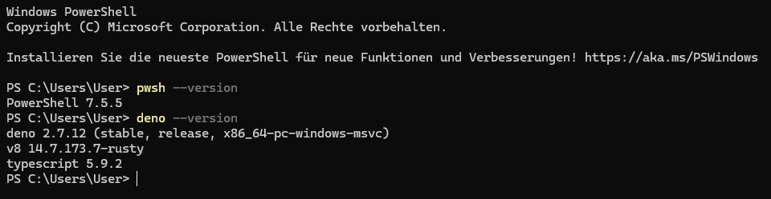
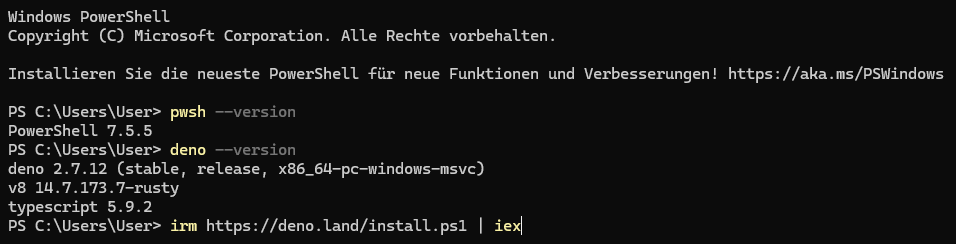
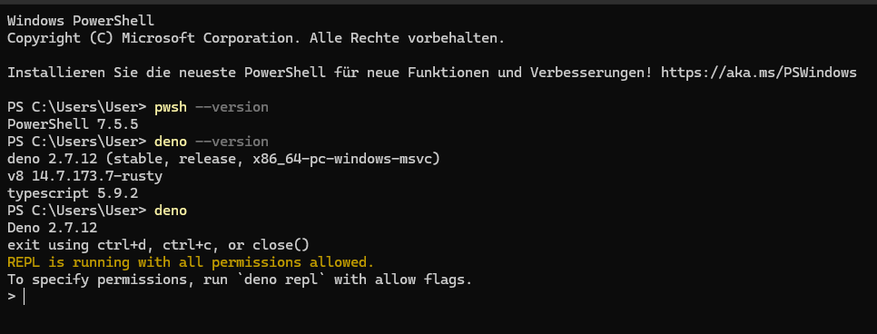

# How to Master the JavaScript Prerequisites using Deno?


[Deno](https://deno.com/) is an excellent tool for mastering JavaScript prerequisites because it supports modern features (ES6+) and TypeScript out of the box with zero configuration. It also has a built-in "Top-level Await," which makes practicing API calls much easier than in Node.js.

Here is how to master the JS prerequisites using [**Deno**](https://deno.com/).


---

### 1. Set Up the Deno Environment
First, ensure Deno is installed. Open your terminal and type:
```pwsh
deno --version
```


If not installed, run: `curl -fsSL https://deno.land/install.sh | sh` (macOS/Linux) 
or `irm https://deno.land/install.ps1 | iex` (Windows).

```pwsh
irm https://deno.land/install.ps1 | iex
```


---

### 2. Method A: The Deno REPL (Interactive Practice)

The REPL is perfect for testing small snippets like Arrow Functions or Destructuring. Just type `deno` in your terminal.

[What is a REPL](./What_is_a_REPL-.md)

```javascript
// Type 'deno' in your terminal to start
> const user = { name: "Deno", age: 4 };
> const { name } = user; // Destructuring
> console.log(name); 
// Deno
```


*To exit, press `Ctrl + D` or `Ctrl + C`  twice.*


If you want to get your feet wet:

1. [JavaScript Prerequisite](./Mastering_the_JavaScript_Prerequisites_for React.md)
2. [7-Day Bootcamp](./A_7_Day_JavaScript_for_React-Bootcamp.md)
3. [30-Day Mastery Plan](./A_30-Day_JavaScript_for_React_Mastery_Plan.md)

---

### 3. Method B: Scripting (The Real Way to Learn)
Create a file named `prerequisites.js` (or `.ts` if you want to practice TypeScript) and run it with `deno run prerequisites.js`.

#### The "React-Ready" JS Tutorial in Deno:

```javascript
// --- 1. Arrow Functions & Template Literals ---
const greet = (name) => `Hello, ${name}! Welcome to Deno.`;
console.log(greet("Developer"));

// --- 2. Object & Array Destructuring ---
const hardware = ["Keyboard", "Mouse", "Monitor"];
const [key, ...rest] = hardware; // Destructuring + Rest operator
console.log(key); // "Keyboard"
console.log(rest); // ["Mouse", "Monitor"]

const laptop = { brand: "Apple", chip: "M3", ram: "16GB" };
const { brand, chip } = laptop;
console.log(`${brand} uses the ${chip} chip.`);

// --- 3. Spread Operator (Immutable Data) ---
// Essential for React state!
const baseConfig = { port: 3000, debug: true };
const prodConfig = { ...baseConfig, debug: false, env: "production" };
console.log(prodConfig); 

// --- 4. Array Methods (.map & .filter) ---
const items = [
  { id: 1, name: "Book", price: 20 },
  { id: 2, name: "Pen", price: 5 },
  { id: 3, name: "Desk", price: 100 },
];

// .map is used in React to render lists
const itemNames = items.map(item => item.name);
console.log("Names:", itemNames);

// .filter is used to remove items (like deleting a Todo)
const expensiveItems = items.filter(item => item.price > 10);
console.log("Expensive:", expensiveItems);
```

**To run this:**
```bash
deno run prerequisites.js
```

---

### 4. Practicing `fetch` with Top-Level Await
In Deno, you don't need to wrap `fetch` in an `async` function. This makes practicing API logic (needed for React's `useEffect`) very clean.

Create `api_practice.js`:
```javascript
// Deno has 'fetch' built-in, exactly like the browser
const response = await fetch("https://jsonplaceholder.typicode.com/users/1");
const user = await response.json();

const { name, email, company: { name: companyName } } = user;

console.log(`User: ${name}`);
console.log(`Works at: ${companyName}`);
```

**To run this (Deno requires network permission):**
```bash
deno run --allow-net api_practice.js
```

---

### 5. Practicing ES Modules (Import/Export)
Deno uses URL imports or local file imports, which mimics how modern React apps handle components.

**File: `math.js`**
```javascript
export const add = (a, b) => a + b;
export const subtract = (a, b) => a - b;
```

**File: `main.js`**
```javascript
import { add, subtract } from "./math.js";

console.log(add(10, 5));      // 15
console.log(subtract(10, 5)); // 5
```

---

### Your "Deno Graduation" Challenge

Try to write a single Deno script that:
1.  Defines an **array of objects** representing products.
2.  Uses **`.filter()`** to find products under $50.
3.  Uses **`.map()`** and **Template Literals** to format those products into a string: `"Product: [Name] costs $[Price]"`.
4.  Uses **Destructuring** to pull the `name` and `price` out of the object inside the map.

**Why this matters:** When you move to React, the `.map()` you just wrote in Deno will be the exact same logic you use to display a list of products on a webpage. 

**Next Step:** Once you are comfortable running these scripts in Deno, go back to the **Vite** setup I provided earlier. The transition will be seamless!