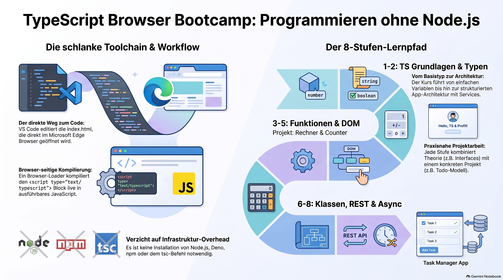

> [NOTE!]
>  Die vorliegende Quelle beschreibt ein strukturiertes **Bootcamp**, das die Nutzung von **TypeScript** direkt im **Webbrowser** vermittelt, ohne auf externe Laufzeitumgebungen wie **Node.js** oder **Deno** angewiesen zu sein. Durch den Einsatz eines **Inline-Compilers** innerhalb einer **HTML-Datei** können Entwickler Code schreiben, der vom Browser in ausführbares **JavaScript** umgewandelt wird. Der Kurs ist in **acht Phasen** unterteilt, die von den Grundlagen der **Variablen und Typen** bis hin zu komplexen Themen wie **Schnittstellen**, **Klassen** und **asynchronen API-Abfragen** führen. Ein besonderer Fokus liegt auf der **DOM-Programmierung**, wodurch interaktive Anwendungen wie ein **Taschenrechner** oder eine **Aufgabenverwaltung** entstehen. Das Ziel ist ein effizienter **Arbeitsablauf**, der lediglich aus **Visual Studio Code**, einem modernen **Browser** und grundlegenden **Skript-Befehlen** besteht. Abschließend zeigt der Leitfaden auf, wie sich dieses **Frontend-Wissen** nahtlos in eine bestehende Architektur mit **Spring Boot** integrieren lässt.

# Zero-Toolchain Development Guide

Yes. If by **“inline compiler”** you mean the browser-based approach where an HTML page loads the TypeScript compiler and compiles `<script type="text/typescript">` directly in the browser, we can build a bootcamp around exactly that.

One important distinction: this is **different from `tsc`**. The TypeScript compiler runs inside the browser itself. That means your workflow can be:

```text
Visual Studio Code
       │
       │ edit
       ▼
   index.html
       │
       │ open
       ▼
   Microsoft Edge
       │
       ├── TypeScript compiler
       │
       ▼
   JavaScript execution
```

So: **no Node.js, no Deno, no npm, no `tsc` command.**

# TypeScript Browser Bootcamp

### TypeScript + HTML + Edge + VS Code + PowerShell

***

## 0. What we're going to build

We'll start with a tiny HTML file and gradually turn it into a small TypeScript application.

The bootcamp has **8 stages**:

| Stage | Topic                     | Project            |
| ----- | ------------------------- | ------------------ |
| 1     | TypeScript in the browser | Hello TypeScript   |
| 2     | Types & variables         | Personal profile   |
| 3     | Functions & arrays        | Calculator         |
| 4     | Interfaces & objects      | Todo model         |
| 5     | DOM & events              | Counter            |
| 6     | Classes & modules         | Task manager       |
| 7     | Fetch & REST              | API client         |
| 8     | Final project             | TypeScript web app |

***

# Stage 1 — TypeScript directly inside HTML

## 1. Create the project

PowerShell:

```powershell
mkdir TypeScriptBrowserBootcamp
cd TypeScriptBrowserBootcamp
code .
```

Create:

```text
TypeScriptBrowserBootcamp
│
└── index.html
```

***

# 2. The browser TypeScript compiler

There are several browser-based approaches for compiling TypeScript directly in an HTML page.

The classic approach uses the TypeScript compiler library together with a small browser-side loader such as **typescript.js / typescriptServices** or a TypeScript-in-browser helper.

The conceptual HTML looks like this:

```html
<script src="typescript.js"></script>

<script type="text/typescript">

    let message: string = "Hello TypeScript!";

    console.log(message);

</script>
```

The important part is:

```html
<script type="text/typescript">
```

instead of:

```html
<script>
```

The browser-side compiler finds the TypeScript code, compiles it to JavaScript, and executes the generated JavaScript.

***

# 3. Your first browser TypeScript application

For the bootcamp, let's establish the basic structure:

```html
<!DOCTYPE html>
<html lang="en">

<head>
    <meta charset="UTF-8">

    <title>TypeScript Bootcamp</title>

    <!-- TypeScript compiler/helper -->
    <script src="typescript.js"></script>
</head>

<body>

    <h1>TypeScript Bootcamp</h1>

    <script type="text/typescript">

        let message: string = "Hello TypeScript!";

        console.log(message);

    </script>

</body>

</html>
```

The important conceptual difference is:

```text
HTML
 │
 ├── normal JavaScript
 │
 └── TypeScript
       │
       ▼
   browser compiler
       │
       ▼
   JavaScript
       │
       ▼
     Edge
```

***

# 4. Open it in Edge

From PowerShell:

```powershell
start .\index.html
```

Edge opens the page.

Press:

```text
F12
```

and select:

```text
Console
```

You should see:

```text
Hello TypeScript!
```

🎉 You have now run TypeScript **without Node.js or Deno**.

***

# Stage 1 Exercise — Variables

Change your TypeScript:

```typescript
let firstName: string = "Karl";
let age: number = 42;
let developer: boolean = true;

console.log(firstName);
console.log(age);
console.log(developer);
```

Experiment with:

```typescript
age = 43;
```

Then deliberately try:

```typescript
age = "forty-three";
```

Observe what happens.

This leads to one of the fundamental ideas of TypeScript:

> **Types describe what kind of values a variable can contain.**

***

# Stage 2 — TypeScript fundamentals

Now create a small profile.

```typescript
let firstName: string = "Karl";
let lastName: string = "Schmitt";
let age: number = 42;
let learningTypeScript: boolean = true;

console.log(firstName);
console.log(lastName);
console.log(age);
console.log(learningTypeScript);
```

## Your challenge

Add:

```text
city
job
programmingLanguage
```

with appropriate types.

For example:

```typescript
let programmingLanguage: string = "TypeScript";
```

***

# Stage 2 Exercise — Arrays

Create:

```typescript
let languages: string[] = [
    "Java",
    "TypeScript",
    "JavaScript"
];
```

Print the first element:

```typescript
console.log(languages[0]);
```

Add another:

```typescript
languages.push("C++");
```

Print the array:

```typescript
console.log(languages);
```

***

# Stage 2 Exercise — Objects

Create:

```typescript
let person = {
    name: "Karl",
    age: 42,
    language: "Java"
};
```

Then:

```typescript
console.log(person.name);
console.log(person.age);
```

***

# Stage 3 — Functions

Create:

```typescript
function greet(name: string): string {

    return "Hello " + name;
}
```

Use it:

```typescript
console.log(greet("Karl"));
```

Notice the two types:

```typescript
name: string
```

and:

```typescript
): string
```

The first is the parameter type.

The second is the return type.

***

# Stage 3 Project — Calculator

Now build a calculator.

Start with:

```typescript
function add(a: number, b: number): number {
    return a + b;
}

function subtract(a: number, b: number): number {
    return a - b;
}

function multiply(a: number, b: number): number {
    return a * b;
}

function divide(a: number, b: number): number {
    return a / b;
}
```

Test:

```typescript
console.log(add(10, 5));
console.log(subtract(10, 5));
console.log(multiply(10, 5));
console.log(divide(10, 5));
```

Expected:

```text
15
5
50
2
```

***

# Stage 4 — Interfaces

Now we start getting into the really interesting part of TypeScript.

Create:

```typescript
interface Person {

    name: string;
    age: number;
    programmingLanguage: string;
}
```

Then:

```typescript
const person: Person = {
    name: "Karl",
    age: 42,
    programmingLanguage: "Java"
};
```

Now TypeScript understands the shape:

```text
Person
│
├── name → string
├── age → number
└── programmingLanguage → string
```

***

# Stage 4 Project — Todo model

Create:

```typescript
interface Todo {

    id: number;
    title: string;
    completed: boolean;
}
```

Create several todos:

```typescript
const todos: Todo[] = [

    {
        id: 1,
        title: "Learn TypeScript",
        completed: false
    },

    {
        id: 2,
        title: "Build a browser application",
        completed: false
    },

    {
        id: 3,
        title: "Learn TypeScript interfaces",
        completed: true
    }
];
```

Print them:

```typescript
console.log(todos);
```

***

# Stage 5 — DOM programming

Now we're leaving the console and interacting with HTML.

HTML:

```html
<h1 id="title">Hello</h1>

<button id="button">
    Click me
</button>

<p id="message"></p>
```

TypeScript:

```typescript
const title = document.getElementById("title");

const button = document.getElementById("button");

const message = document.getElementById("message");
```

Change the title:

```typescript
if (title) {
    title.textContent = "Hello TypeScript!";
}
```

***

# Stage 5 Project — Counter

HTML:

```html
<h1>Counter</h1>

<p id="counter">0</p>

<button id="increase">
    +
</button>

<button id="decrease">
    -
</button>

<button id="reset">
    Reset
</button>
```

TypeScript:

```typescript
let counter: number = 0;

const counterElement =
    document.getElementById("counter");

const increaseButton =
    document.getElementById("increase");

const decreaseButton =
    document.getElementById("decrease");

const resetButton =
    document.getElementById("reset");
```

Increase:

```typescript
increaseButton?.addEventListener("click", () => {

    counter++;

    if (counterElement) {
        counterElement.textContent =
            counter.toString();
    }

});
```

Decrease:

```typescript
decreaseButton?.addEventListener("click", () => {

    counter--;

    if (counterElement) {
        counterElement.textContent =
            counter.toString();
    }

});
```

Reset:

```typescript
resetButton?.addEventListener("click", () => {

    counter = 0;

    if (counterElement) {
        counterElement.textContent =
            counter.toString();
    }

});
```

You have now built a real interactive TypeScript browser application.

***

# Stage 6 — Classes

Create:

```typescript
class TodoItem {

    constructor(
        public id: number,
        public title: string,
        public completed: boolean
    ) {}

    complete(): void {
        this.completed = true;
    }
}
```

Create an object:

```typescript
const todo = new TodoItem(
    1,
    "Learn TypeScript",
    false
);
```

Complete it:

```typescript
todo.complete();
```

Inspect it:

```typescript
console.log(todo);
```

***

# Stage 6 Project — Todo application

Now combine:

```text
interface
class
array
DOM
events
```

Your architecture becomes:

```text
                 Todo Application
                       │
          ┌────────────┼────────────┐
          ▼            ▼            ▼
       TodoItem      Todo[]        DOM
          │            │            │
          └────────────┴────────────┘
                       │
                       ▼
                     Edge
```

This is a very good exercise because it makes TypeScript feel less like a collection of isolated syntax features.

***

# Stage 7 — Fetch

Now we're going to communicate with a REST API.

The browser already provides:

```typescript
fetch()
```

No Node.js is necessary.

Example:

```typescript
async function loadTodo(): Promise<void> {

    const response =
        await fetch(
            "https://jsonplaceholder.typicode.com/todos/1"
        );

    const data =
        await response.json();

    console.log(data);
}

loadTodo();
```

This gives you a browser-side HTTP client.

***

# Stage 7 — Type the response

Create:

```typescript
interface TodoResponse {

    userId: number;
    id: number;
    title: string;
    completed: boolean;
}
```

Then:

```typescript
async function loadTodo(): Promise<void> {

    const response =
        await fetch(
            "https://jsonplaceholder.typicode.com/todos/1"
        );

    const todo: TodoResponse =
        await response.json();

    console.log(todo.title);
    console.log(todo.completed);
}
```

Now TypeScript understands the expected JSON structure.

***

# Stage 7 Project — REST API viewer

Build a page:

```text
┌────────────────────────────────────┐
│ TypeScript REST Client             │
│                                    │
│ [ Load Todo ]                      │
│                                    │
│ ID: 1                              │
│ Title: Learn TypeScript            │
│ Completed: false                   │
└────────────────────────────────────┘
```

The flow:

```text
Button
   │
   ▼
TypeScript
   │
   │ fetch()
   ▼
REST API
   │
   │ JSON
   ▼
TypeScript
   │
   ▼
DOM
   │
   ▼
Edge
```

***

# Stage 8 — Your final project

I'd make the final bootcamp project a:

# TypeScript Task Manager

It should contain:

```text
┌──────────────────────────────────────────┐
│ TypeScript Task Manager                  │
├──────────────────────────────────────────┤
│                                          │
│ New task: [________________] [Add]       │
│                                          │
│ ☐ Learn TypeScript                       │
│ ☑ Learn interfaces                       │
│ ☐ Build REST client                      │
│                                          │
│ [Clear completed]                        │
│                                          │
└──────────────────────────────────────────┘
```

Your TypeScript architecture:

```text
src
│
├── models
│   └── Todo.ts
│
├── services
│   └── TodoService.ts
│
├── ui
│   └── TodoView.ts
│
└── main.ts
```

Even without Node.js, you can learn proper TypeScript application structure.

***

# Your 14-Day Bootcamp

## Day 1 — TypeScript in HTML

Learn:

```text
<script type="text/typescript">
variables
console.log()
```

Exercise:

**Hello TypeScript**

***

## Day 2 — Types

Learn:

```text
string
number
boolean
arrays
objects
```

Exercise:

**Personal Profile**

***

## Day 3 — Functions

Learn:

```text
parameters
return types
arrow functions
optional parameters
```

Exercise:

**Calculator**

***

## Day 4 — Arrays & Objects

Learn:

```text
map()
filter()
find()
forEach()
```

Exercise:

**Employee list**

***

## Day 5 — Interfaces

Learn:

```text
interface
optional properties
readonly
nested objects
```

Exercise:

**Todo model**

***

## Day 6 — Union & Type aliases

Learn:

```text
type
|
&
literal types
```

Exercise:

**Task status model**

***

## Day 7 — DOM

Learn:

```text
document
getElementById()
querySelector()
textContent
```

Exercise:

**Dynamic webpage**

***

## Day 8 — Events

Learn:

```text
click
input
change
submit
```

Exercise:

**Counter**

***

## Day 9 — Classes

Learn:

```text
class
constructor
methods
public
private
```

Exercise:

**Todo class**

***

## Day 10 — Generics

Learn:

```text
<T>
generic functions
generic interfaces
```

Exercise:

**Generic repository**

***

## Day 11 — Async TypeScript

Learn:

```text
Promise
async
await
try
catch
```

Exercise:

**Async data loader**

***

## Day 12 — HTTP

Learn:

```text
fetch()
HTTP
JSON
REST
```

Exercise:

**REST API client**

***

## Day 13 — Browser application architecture

Learn:

```text
models
services
UI
modules
```

Exercise:

**Task Manager**

***

## Day 14 — Final project

Build the complete:

> **TypeScript Browser Task Manager**

with:

```text
✓ TypeScript
✓ Interfaces
✓ Classes
✓ Generics
✓ DOM
✓ Events
✓ Modules
✓ Fetch
✓ REST
✓ JSON
✓ async/await
```

***

# Your toolchain

The beautiful part of this bootcamp is that your development environment stays extremely small:

```text
┌─────────────────────────────┐
│ Visual Studio Code          │
│                             │
│   index.html                │
│   TypeScript                │
└──────────────┬──────────────┘
               │
               ▼
┌─────────────────────────────┐
│ Microsoft Edge              │
│                             │
│ TypeScript browser compiler │
│          ↓                  │
│       JavaScript            │
│          ↓                  │
│       Application           │
└─────────────────────────────┘
               ▲
               │
        PowerShell
```

**No Node.js.**

**No Deno.**

**No npm.**

**No Vite.**

**No Webpack.**

**No Postman.**

And because you are coming from Java/Spring Boot, I'd eventually make the final exercise:

```text
       TypeScript
          │
          │ HTTP / JSON
          ▼
    Spring Boot REST API
          │
          ▼
       PostgreSQL
```

That would give you a very practical **TypeScript frontend + Spring Boot backend** learning path while respecting your organization's restriction on Node.js/Deno.
