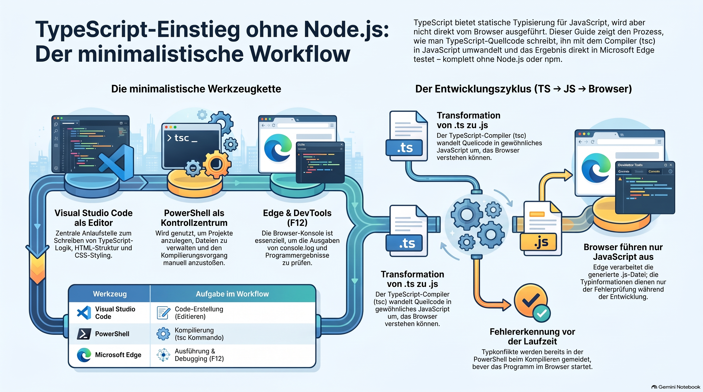

# A Minimalist Browser Development Guide Using TypeScript

> [NOTE!]
>  Dieser Leitfaden erklärt, wie man die Programmiersprache **TypeScript** effizient erlernt, ohne auf komplexe Werkzeuge wie **Node.js** oder **Deno** angewiesen zu sein. Der Fokus liegt auf einem minimalistischen Arbeitsablauf, der lediglich **Visual Studio Code**, die **PowerShell** und den **Microsoft Edge** Browser nutzt. Es wird verdeutlicht, dass TypeScript als statisch typisierte Erweiterung von JavaScript dient und vor der Ausführung im Browser in gewöhnliches JavaScript **kompiliert** werden muss. Neben grundlegenden Konzepten wie **Interfaces**, **Generics** und **Modulen** behandelt der Text auch die Interaktion mit der **DOM-API** zur Erstellung interaktiver Webanwendungen. Abschließend zeigt die Quelle auf, wie sich TypeScript ideal als Frontend für ein **Spring Boot Backend** in einer professionellen Architektur einsetzen lässt.


**You can learn a lot of TypeScript without Node.js or Deno**. You can use TypeScript as a language that compiles to ordinary JavaScript, then run the resulting JavaScript directly in **Microsoft Edge**.

The important distinction is:

> **TypeScript is not executed by Edge. JavaScript is.**\
> You use a TypeScript compiler somewhere to transform `.ts` → `.js`, and Edge executes the `.js`.

Below is a practical beginner tutorial designed specifically for your constraints: **Visual Studio Code + PowerShell + Microsoft Edge**, with **no Node.js and no Deno**.

# TypeScript Absolute Beginner Tutorial

### TypeScript + VS Code + PowerShell + Edge

***

## 1. What are we going to build?

We will start with extremely small programs and gradually build toward a browser application.

Our learning path:

```text
TypeScript
   │
   ▼
.ts source file
   │
   │ TypeScript compiler
   ▼
.js JavaScript
   │
   ▼
HTML
   │
   ▼
Microsoft Edge
```

For example:

```text
hello.ts
   │
   ▼
hello.js
   │
   ▼
index.html
   │
   ▼
Edge
```

No Node.js is required to **run the application**.

In case you are using the inline compiler the JavaScript file is not needed.

> [IMPORTANT!]
> You can usre browser-based inline compilation: [Embedded Compiler](../Atomics/TypeScript_in_HTML_through_embedded_compiler.md)

***

# 2. What is TypeScript?

TypeScript is a programming language based on JavaScript.

For example, JavaScript:

```javascript
let age = 42;
```

TypeScript can tell JavaScript what type `age` should have:

```typescript
let age: number = 42;
```

The important addition is:

```typescript
: number
```

This says:

> `age` is a number.

***

# 3. TypeScript versus JavaScript

Think about the relationship like this:

```text
              TypeScript
                  │
                  │ compiler
                  ▼
              JavaScript
                  │
                  ▼
                Edge
```

> [IMPORTANT!]
> You can usre browser-based inline compilation: [Embedded Compiler](../Atomics/TypeScript_in_HTML_through_embedded_compiler.md)

TypeScript adds features such as:

* static types

* interfaces

* type aliases

* generics

* enums

* better tooling

* compile-time error detection

But browsers understand:

```text
JavaScript
```

not:

```text
TypeScript
```

Therefore:

```text
hello.ts
```

must eventually become:

```text
hello.js
```

***

# 4. Your three tools

Your environment is:

### Visual Studio Code

Used for:

```text
writing TypeScript
writing HTML
writing CSS
```

### PowerShell

Used for:

```text
creating files
running commands
compiling TypeScript
inspecting files
```

### Microsoft Edge

Used for:

```text
running the resulting web application
```

And deliberately **not**:

```text
Node.js
Deno
npm
Express
Vite
Webpack
```

That's actually a very good environment for learning the fundamentals.

***

# 5. Create your first project

Open PowerShell.

Create a directory:

```powershell
mkdir TypeScriptTutorial
cd TypeScriptTutorial
```

Create three files:

```powershell
New-Item index.html
New-Item hello.ts
New-Item hello.js
```

Your project should look like:

```text
TypeScriptTutorial
│
├── index.html
├── hello.ts
└── hello.js
```

Open the directory in VS Code:

```powershell
code .
```

***

# 6. Your first TypeScript program

> [IMPORTANT!]
> You can usre browser-based inline compilation: [Embedded Compiler](../Atomics/TypeScript_in_HTML_through_embedded_compiler.md)

Open:

```text
hello.ts
```

Enter:

```typescript
let message: string = "Hello TypeScript!";

console.log(message);
```

We have:

```typescript
let message
```

which creates a variable.

Then:

```typescript
: string
```

specifies its type.

And:

```typescript
"Hello TypeScript!"
```

is the value.

***

# 7. But how do we compile TypeScript?

This is the important part.

Normally people install the TypeScript compiler through npm:

```text
npm install typescript
```

But you explicitly cannot use Node.js/npm.

So we need to separate two concepts:

```text
TypeScript language
        +
TypeScript compiler
```

The language itself doesn't require Node.js.

The compiler is simply a program that transforms:

```text
.ts
```

into:

```text
.js
```
> [IMPORTANT!]
> You can usre browser-based inline compilation: [Embedded Compiler](../Atomics/TypeScript_in_HTML_through_embedded_compiler.md)


If your organization provides the standalone TypeScript compiler (`tsc`), you can use it directly from PowerShell.

Test:

```powershell
tsc --version
```

If you get something such as:

```text
Version 5.x.x
```

you're ready.

If PowerShell says:

```text
tsc : The term 'tsc' is not recognized...
```

then **don't install Node.js**. We can instead configure a standalone TypeScript compiler appropriate to your organization's restrictions.

***

# 8. Compile your first TypeScript program

Assuming `tsc` is available:

```powershell
tsc hello.ts
```

You should now have:

```text
TypeScriptTutorial
│
├── index.html
├── hello.ts
└── hello.js
```

Open `hello.js`.

You will see something similar to:

```javascript
var message = "Hello TypeScript!";
console.log(message);
```

Notice something interesting:

Your TypeScript:

```typescript
let message: string = "Hello TypeScript!";
```

became JavaScript.

The type:

```typescript
: string
```

is gone.

That's because the type information is primarily used during compilation.

***

# 9. TypeScript's fundamental idea

This is one of the most important concepts to understand:

```text
TypeScript
    │
    │ compile
    ▼
JavaScript
    │
    │ execute
    ▼
Edge
```

The browser doesn't know that you wrote:

```typescript
let age: number = 42;
```

It receives JavaScript.

***

# 10. Create an HTML page

Put this into `index.html`:

```html
<!DOCTYPE html>
<html lang="en">

<head>
    <meta charset="UTF-8">
    <title>TypeScript Tutorial</title>
</head>

<body>

    <h1>TypeScript Tutorial</h1>

    <script src="hello.js"></script>

</body>

</html>
```

Now open:

```text
index.html
```

with Microsoft Edge.

The page displays:

```text
TypeScript Tutorial
```

***

# 11. Where did our message go?

Our TypeScript program contains:

```typescript
console.log(message);
```

That doesn't display text on the page.

It writes to the browser's developer console.

In Edge press:

```text
F12
```

or:

```text
Ctrl + Shift + I
```

Then select:

```text
Console
```

You should see:

```text
Hello TypeScript!
```

Congratulations.

You have just executed your first TypeScript-generated JavaScript in Edge. 🎉

***

# 12. Your first type error

Now deliberately make a mistake.

Change:

```typescript
let message: string = "Hello TypeScript!";
```

to:

```typescript
let message: string = 42;
```

Now compile:

```powershell
tsc hello.ts
```

TypeScript should complain.

Something similar to:

```text
Type 'number' is not assignable to type 'string'.
```

This is one of the major reasons TypeScript exists.

JavaScript might allow many things that cause problems later.

TypeScript tries to detect certain problems **before your program runs**.

***

# 13. Basic TypeScript types

Let's learn the fundamental types.

## string

```typescript
let name: string = "Karl";
```

## number

```typescript
let age: number = 42;
```

## boolean

```typescript
let developer: boolean = true;
```

## array

```typescript
let numbers: number[] = [1, 2, 3, 4, 5];
```

Another syntax:

```typescript
let numbers: Array<number> = [1, 2, 3, 4, 5];
```

## any

```typescript
let value: any = "hello";
```

Be careful with `any`.

It essentially tells TypeScript:

> Don't worry about checking this value.

As a beginner, learn `any`, but don't use it everywhere.

***

# 14. Multiple variables

Create:

```typescript
let firstName: string = "Karl";
let age: number = 42;
let isDeveloper: boolean = true;

console.log(firstName);
console.log(age);
console.log(isDeveloper);
```

Compile:

```powershell
tsc hello.ts
```

Refresh Edge.

***

# 15. Type inference

TypeScript doesn't always need you to explicitly specify the type.

For example:

```typescript
let name = "Karl";
```

TypeScript understands:

```text
name → string
```

And:

```typescript
let age = 42;
```

means:

```text
age → number
```

So this:

```typescript
let name: string = "Karl";
```

can often simply be:

```typescript
let name = "Karl";
```

This is called:

> **type inference**

***

# 16. Functions

TypeScript allows us to specify parameter types.

```typescript
function greet(name: string): string {
    return "Hello " + name;
}
```

The parameter:

```typescript
name: string
```

means:

```text
name must be a string
```

The:

```typescript
): string
```

means:

```text
the function returns a string
```

Use it:

```typescript
let result = greet("Karl");

console.log(result);
```

***

# 17. Functions with numbers

```typescript
function add(a: number, b: number): number {
    return a + b;
}

let result = add(10, 20);

console.log(result);
```

Result:

```text
30
```

But:

```typescript
add("10", "20");
```

produces a TypeScript error.

***

# 18. Arrays

```typescript
let names: string[] = [
    "Karl",
    "Alice",
    "Bob"
];

console.log(names);
```

Access an element:

```typescript
console.log(names[0]);
```

Result:

```text
Karl
```

Add an element:

```typescript
names.push("Charlie");
```

***

# 19. Objects

JavaScript objects are extremely important.

Example:

```typescript
let person = {
    name: "Karl",
    age: 42
};
```

TypeScript understands the structure.

You can access:

```typescript
console.log(person.name);
console.log(person.age);
```

***

# 20. Interfaces

Now we get into one of TypeScript's most useful features.

Create an interface:

```typescript
interface Person {
    name: string;
    age: number;
}
```

Then:

```typescript
let person: Person = {
    name: "Karl",
    age: 42
};
```

The interface describes the shape:

```text
Person
│
├── name → string
└── age  → number
```

***

# 21. Interface error

Try:

```typescript
let person: Person = {
    name: "Karl",
    age: "42"
};
```

TypeScript complains because:

```text
age
```

must be:

```text
number
```

not:

```text
string
```

***

# 22. Optional properties

You can make a property optional:

```typescript
interface Person {
    name: string;
    age: number;
    email?: string;
}
```

Now this is valid:

```typescript
let person: Person = {
    name: "Karl",
    age: 42
};
```

And this is also valid:

```typescript
let person: Person = {
    name: "Karl",
    age: 42,
    email: "karl@example.com"
};
```

***

# 23. Type aliases

Another useful TypeScript feature:

```typescript
type UserId = number;
```

Now:

```typescript
let id: UserId = 123;
```

You can also create more complex types:

```typescript
type Person = {
    name: string;
    age: number;
};
```

Then:

```typescript
let person: Person = {
    name: "Karl",
    age: 42
};
```

***

# 24. Union types

One of the really nice TypeScript features is the union type.

For example:

```typescript
let id: number | string;
```

Now both are allowed:

```typescript
id = 123;
```

and:

```typescript
id = "ABC123";
```

But:

```typescript
id = true;
```

is not allowed.

Think:

```text
number OR string
```

***

# 25. Literal types

You can make a type extremely specific:

```typescript
let direction: "left" | "right";
```

Allowed:

```typescript
direction = "left";
direction = "right";
```

Not allowed:

```typescript
direction = "up";
```

***

# 26. TypeScript and the DOM

Now we move from pure TypeScript into browser programming.

Remember:

```text
TypeScript
     ↓
JavaScript
     ↓
Browser
```

The browser provides APIs such as:

```text
document
window
console
fetch
localStorage
```

TypeScript can understand these APIs.

***

# 27. Access an HTML element

Change your HTML:

```html
<h1 id="title">Hello</h1>
```

Then TypeScript:

```typescript
const title = document.getElementById("title");

console.log(title);
```

Compile:

```powershell
tsc hello.ts
```

Refresh Edge.

***

# 28. Change HTML with TypeScript

We can modify the page:

```typescript
const title = document.getElementById("title");

if (title) {
    title.textContent = "Hello from TypeScript!";
}
```

Now Edge displays:

```text
Hello from TypeScript!
```

This is where TypeScript starts becoming really interesting.

***

# 29. Buttons

HTML:

```html
<button id="button">Click me</button>

<p id="message"></p>
```

TypeScript:

```typescript
const button = document.getElementById("button");
const message = document.getElementById("message");

button?.addEventListener("click", () => {

    if (message) {
        message.textContent = "Button clicked!";
    }

});
```

Compile:

```powershell
tsc hello.ts
```

Refresh Edge.

Click the button.

***

# 30. A complete little application

Let's build a tiny counter.

HTML:

```html
<!DOCTYPE html>
<html lang="en">

<head>
    <meta charset="UTF-8">
    <title>TypeScript Counter</title>
</head>

<body>

    <h1>TypeScript Counter</h1>

    <p id="counter">0</p>

    <button id="increase">Increase</button>
    <button id="decrease">Decrease</button>

    <script src="hello.js"></script>

</body>

</html>
```

TypeScript:

```typescript
let counter: number = 0;

const counterElement = document.getElementById("counter");
const increaseButton = document.getElementById("increase");
const decreaseButton = document.getElementById("decrease");

increaseButton?.addEventListener("click", () => {

    counter++;

    if (counterElement) {
        counterElement.textContent = counter.toString();
    }

});

decreaseButton?.addEventListener("click", () => {

    counter--;

    if (counterElement) {
        counterElement.textContent = counter.toString();
    }

});
```

Compile:

```powershell
tsc hello.ts
```

Then open/refresh:

```text
index.html
```

You now have a real browser application.

***

# 31. Why `?.`?

You will frequently see:

```typescript
button?.addEventListener(...)
```

The:

```text
?.
```

is called **optional chaining**.

It essentially means:

> Only perform this operation if the value isn't `null` or `undefined`.

This is particularly useful with:

```typescript
document.getElementById(...)
```

because the element might not exist.

***

# 32. TypeScript configuration

Eventually you don't want to type:

```powershell
tsc hello.ts
```

for every file.

TypeScript supports a configuration file:

```text
tsconfig.json
```

Example:

```json
{
    "compilerOptions": {
        "target": "ES2020",
        "strict": true,
        "outDir": "dist"
    },
    "include": [
        "*.ts"
    ]
}
```

Now your project can look like:

```text
TypeScriptTutorial
│
├── index.html
├── tsconfig.json
│
├── src
│   └── app.ts
│
└── dist
    └── app.js
```

Compile with:

```powershell
tsc
```

TypeScript reads:

```text
tsconfig.json
```

automatically.

***

# 33. What does `strict` mean?

This:

```json
"strict": true
```

asks TypeScript to perform much stronger type checking.

For learning TypeScript, I strongly recommend becoming comfortable with strict mode.

It forces you to understand things like:

```text
null
undefined
types
function parameters
return values
objects
```

rather than hiding problems.

***

# 34. TypeScript modules

As applications grow, you don't want one enormous `.ts` file.

You can create:

```text
src
│
├── main.ts
├── math.ts
└── person.ts
```

`math.ts`:

```typescript
export function add(a: number, b: number): number {
    return a + b;
}
```

`main.ts`:

```typescript
import { add } from "./math.js";

const result = add(10, 20);

console.log(result);
```

This introduces an important browser/TypeScript topic:

> **ES modules**

Your HTML needs:

```html
<script type="module" src="dist/main.js"></script>
```

Notice:

```text
type="module"
```

This is important.

***

# 35. TypeScript classes

TypeScript also supports classes.

```typescript
class Person {

    constructor(
        public name: string,
        public age: number
    ) {}

    greet(): string {
        return `Hello, my name is ${this.name}`;
    }
}
```

Use it:

```typescript
const person = new Person("Karl", 42);

console.log(person.greet());
```

***

# 36. Access modifiers

TypeScript provides:

```typescript
public
private
protected
```

Example:

```typescript
class BankAccount {

    private balance: number = 0;

    deposit(amount: number): void {
        this.balance += amount;
    }

    getBalance(): number {
        return this.balance;
    }
}
```

You cannot directly do:

```typescript
account.balance
```

because:

```text
balance
```

is private.

***

# 37. Generics

Generics are one of the most important advanced TypeScript concepts.

Consider:

```typescript
function identity(value: number): number {
    return value;
}
```

This works for numbers.

But:

```typescript
function identity(value: string): string {
    return value;
}
```

duplicates the function.

A generic can solve this:

```typescript
function identity<T>(value: T): T {
    return value;
}
```

Now:

```typescript
const numberResult = identity<number>(42);

const stringResult = identity<string>("Hello");
```

The `T` represents a type.

Think:

```text
T = type placeholder
```

***

# 38. Fetching data from a web API

This is where your browser environment becomes very powerful.

You don't need Node.js to make HTTP requests.

The browser provides:

```typescript
fetch()
```

Example:

```typescript
async function loadData(): Promise<void> {

    const response = await fetch(
        "https://jsonplaceholder.typicode.com/todos/1"
    );

    const data = await response.json();

    console.log(data);
}

loadData();
```

This is genuine browser TypeScript.

No:

```text
Node.js
```

No:

```text
Deno
```

No:

```text
Express
```

***

# 39. Typing API responses

We can improve it.

```typescript
interface Todo {
    userId: number;
    id: number;
    title: string;
    completed: boolean;
}
```

Then:

```typescript
async function loadTodo(): Promise<void> {

    const response = await fetch(
        "https://jsonplaceholder.typicode.com/todos/1"
    );

    const todo: Todo = await response.json();

    console.log(todo.title);
    console.log(todo.completed);
}

loadTodo();
```

Now TypeScript knows the expected structure.

***

# 40. A very important limitation

There is one thing you should understand early.

With your tool restrictions, you can build excellent **browser-side TypeScript applications**.

You can learn:

```text
TypeScript
JavaScript
HTML
CSS
DOM
Events
Modules
Classes
Interfaces
Generics
Fetch
REST APIs
JSON
Async/await
Browser storage
Web APIs
```

But TypeScript alone does **not** give you a server.

For example:

```text
Browser
   │
   │ HTTP
   ▼
Spring Boot
```

is perfectly possible.

In fact, given your Java/Spring Boot background, this is a particularly useful direction.

You could eventually build:

```text
┌─────────────────────────┐
│ Microsoft Edge          │
│                         │
│ HTML                    │
│ CSS                     │
│ TypeScript → JavaScript │
└───────────┬─────────────┘
            │
            │ HTTP/JSON
            ▼
┌─────────────────────────┐
│ Spring Boot             │
│                         │
│ REST API                │
└─────────────────────────┘
```

That gives you a very realistic enterprise architecture **without Node.js or Deno**.

***

# 41. Your TypeScript learning roadmap

I would recommend learning it in this order.

### Level 1 — JavaScript foundation

```text
Variables
Strings
Numbers
Boolean
Arrays
Objects
Functions
if
for
while
```

### Level 2 — TypeScript fundamentals

```text
Type annotations
Type inference
string
number
boolean
arrays
objects
any
unknown
null
undefined
```

### Level 3 — Functions

```text
parameter types
return types
optional parameters
default parameters
arrow functions
callbacks
```

### Level 4 — Type system

```text
union types
intersection types
literal types
type aliases
interfaces
type narrowing
```

### Level 5 — Object-oriented TypeScript

```text
classes
constructors
properties
methods
public
private
protected
inheritance
abstract classes
```

### Level 6 — Advanced TypeScript

```text
generics
generic interfaces
generic functions
utility types
keyof
typeof
mapped types
conditional types
```

### Level 7 — Browser TypeScript

```text
DOM
events
forms
buttons
HTML manipulation
CSS manipulation
localStorage
sessionStorage
fetch
JSON
Promises
async/await
```

### Level 8 — Real applications

```text
modules
project structure
tsconfig.json
REST APIs
error handling
loading states
forms
validation
CRUD
```

***

# 42. Recommended project sequence

Instead of only reading tutorials, I'd build these projects.

### Project 1 — Hello TypeScript

```text
TypeScript → JavaScript → Edge
```

### Project 2 — Calculator

```text
+
-
*
/
```

### Project 3 — Celsius/Fahrenheit converter

For example:

```text
Celsius
   ↓
Fahrenheit
```

### Project 4 — Counter

```text
Increase
Decrease
Reset
```

### Project 5 — To-do list

Learn:

```text
arrays
objects
DOM
events
```

### Project 6 — Shopping list

Learn:

```text
interfaces
classes
DOM
localStorage
```

### Project 7 — REST API client

Learn:

```text
fetch
JSON
async/await
interfaces
error handling
```

### Project 8 — Spring Boot + TypeScript

Finally:

```text
TypeScript frontend
       │
       │ HTTP/JSON
       ▼
Spring Boot REST API
       │
       ▼
PostgreSQL
```

That would make an excellent bridge between your **Java/Spring Boot** knowledge and TypeScript.

***

# 43. Your daily development cycle

With your restrictions, your normal workflow can simply be:

```text
1. Open VS Code

2. Edit .ts

3. Save

4. Open PowerShell

5. Run tsc

6. Open/refresh Edge

7. Press F12

8. Inspect Console

9. Fix TypeScript

10. Repeat
```

Conceptually:

```text
              VS Code
                 │
                 │ edit
                 ▼
             app.ts
                 │
                 │ tsc
                 ▼
             app.js
                 │
                 │
                 ▼
              Edge
                 │
          ┌──────┴──────┐
          │             │
        HTML          Console
```

That's enough to learn the **actual TypeScript language**.

You don't need a JavaScript framework to understand TypeScript.

***

# 44. One important point about your environment

Your restriction actually gives us an opportunity to learn the fundamentals properly.

Modern JavaScript development often introduces:

```text
Node.js
npm
Vite
Webpack
React
Angular
libraries
frameworks
build tools
package managers
```

very early.

That can hide what's really happening.

Your environment forces us to understand the underlying pipeline:

```text
TypeScript
    ↓
Compiler
    ↓
JavaScript
    ↓
HTML
    ↓
Browser
```

Once you understand that, tools such as Angular, React, Vite, and Node.js become **additional tooling**, rather than mysterious infrastructure.

And since you're already working with Java/Spring Boot, this fundamental understanding will transfer very well to a TypeScript frontend talking to a Spring Boot backend.
