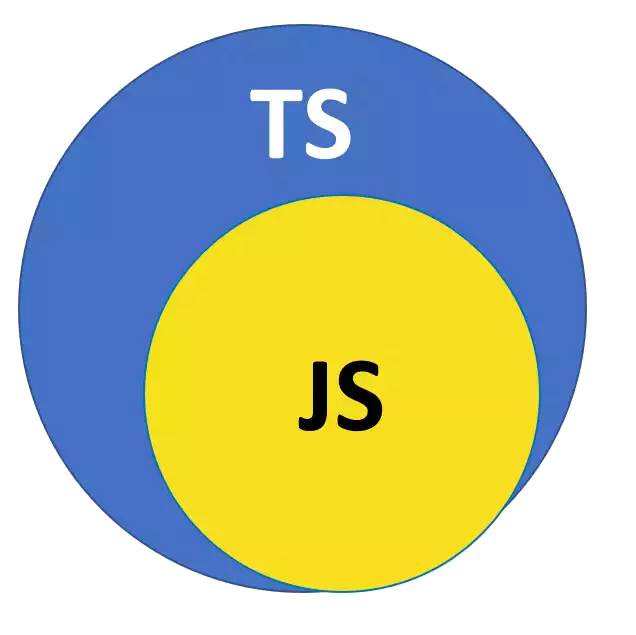

# TypeScript and Vanilla JavaScript

## Vanilla JavaScript


1. [Let's jump right into JavaScript](./Vanilla-JavaScript/Learning-Vanilla-JavaScript.md)

## TypeScript


1. [Installing, Compiling and running TypeScript](./tsc_and_ts-node.md)
2. [Playing with TypeScript](./CompilingAndRunning.md)
3. [Starting with TypeScript using Deno](./How_learn_type_script_using_deno.md)
4. [TypeScript Deep Dive](./Atomics/TypeScript_Deep_Dive_using-Deno.md)

To understand **TypeScript**, the best way to think of it is as **"JavaScript with a safety net."**

Developed by Microsoft, TypeScript is a programming language that builds on top of JavaScript by adding **static type definitions.**

Here is a breakdown of what it is and how it relates to JavaScript:

---

### 1. The "Superset" Relationship

The most important technical concept is that **TypeScript is a strict syntactical superset of JavaScript.**

*   **Everything that is valid JavaScript is also valid TypeScript.** You can take a `.js` file, change the extension to `.ts`, and it will work perfectly.
*   **The reverse is NOT true.** TypeScript adds new syntax (like `: string` or `interface`) that a standard web browser or JavaScript engine cannot understand.

**Visualizing the relationship:**
Imagine a small circle labeled "JavaScript" inside a larger circle labeled "TypeScript." TypeScript contains everything in JavaScript plus more features.



---

### 2. Key Differences: Static vs. Dynamic
The primary difference lies in **Type Checking**.

*   **JavaScript is Dynamically Typed:** Variables can change types at runtime.
    ```javascript
    let score = 10;    // It's a number
    score = "ten";     // Now it's a string (No error, but might crash your app later)
    ```
*   **TypeScript is Statically Typed:** You define what a variable is supposed to be. If you try to change it, TypeScript catches the error **before** you run the code.
    ```typescript
    let score: number = 10;
    score = "ten";    // Error: Type 'string' is not assignable to type 'number'.
    ```

---

### 3. How TypeScript becomes JavaScript
Browsers (like Chrome) and runtimes (like Node.js) cannot run TypeScript directly.

1.  **Writing:** You write code in `.ts` files.
2.  **Transpilation:** You use a compiler (like `tsc`) to convert the TypeScript code into plain JavaScript.
3.  **Execution:** The resulting JavaScript file is what actually runs in the browser or on the server.

*Note: Runtimes like **Deno** and **Bun** make this seamless by handling the transpilation step internally, allowing you to "run" TypeScript files directly.*

---

### 4. Why use TypeScript? (The Benefits)

#### A. Catching Errors Early
In JavaScript, you often find bugs only when the user clicks a button and the app crashes. TypeScript finds those bugs while you are writing the code.

#### B. Better Tooling and Autocomplete
Because TypeScript knows exactly what your data looks like, your IDE (like VS Code) can provide perfect suggestions. If you have a `user` object, typing `user.` will show you exactly which properties (`name`, `email`, etc.) exist.

#### C. Documentation
In JavaScript, it’s hard to tell what kind of data a function expects.
*   **JS:** `function saveUser(user) { ... }` (What is inside "user"?)
*   **TS:** `function saveUser(user: { id: number, name: string }) { ... }` (The code explains itself).

---

### 5. Code Comparison

**JavaScript (The "Wild West"):**
```javascript
function greet(person) {
  return "Hello, " + person.name;
}

// If I forget the name property, this returns "Hello, undefined"
console.log(greet({ age: 25 })); 
```

**TypeScript (The "Checked" Version):**
```typescript
interface User {
  name: string;
  age: number;
}

function greet(person: User) {
  return "Hello, " + person.name;
}

// This will show a red underline in your editor immediately:
// "Property 'name' is missing in type '{ age: number; }'"
greet({ age: 25 }); 
```

### Summary
*   **JavaScript** is the engine that runs the web.
*   **TypeScript** is a layer on top that helps developers write more predictable, bug-free code.
*   **In the context of Hono and Deno:** Using TypeScript is highly recommended because both tools were built specifically to take advantage of TypeScript’s features.
