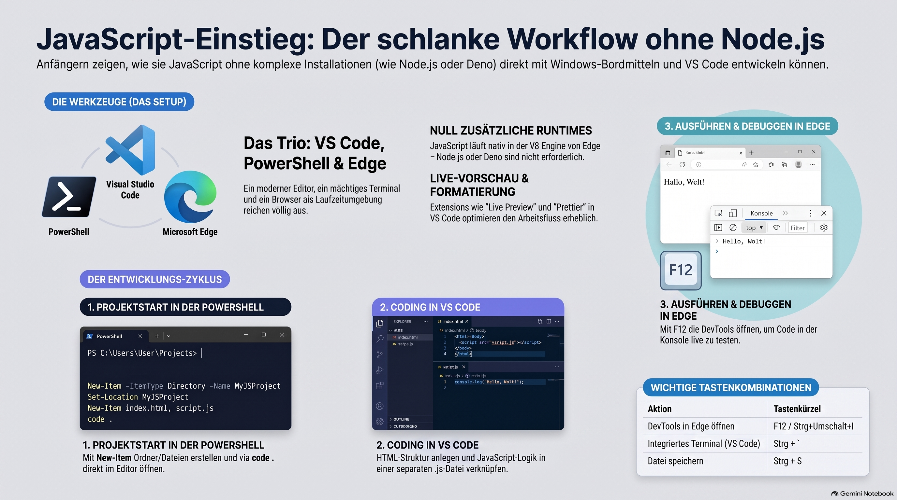

> [NOTE!]
> Dieses Tutorial bietet einen **anfängerfreundlichen Einstieg** in die JavaScript-Programmierung unter ausschließlicher Verwendung von **Visual Studio Code, PowerShell und Microsoft Edge**. Im Gegensatz zu vielen modernen Kursen verzichtet diese Anleitung komplett auf externe Laufzeitumgebungen wie **Node.js oder Deno**, da der Code direkt im Browser ausgeführt wird. Die Quelle erläutert praxisnah die **Einrichtung des Arbeitsbereichs**, grundlegende Sprachkonzepte sowie die **Manipulation des DOM**, um Webseiten interaktiv zu gestalten. Zudem lernen Anwender, wie sie die integrierten **DevTools zur Fehlersuche** nutzen und kleine Projekte wie einen Klick-Zähler umsetzen. Durch die Kombination von **PowerShell-Befehlen** und Browser-Technologien wird ein schlanker, effizienter Workflow für die Webentwicklung vermittelt. Abschließend gibt der Text Ausblicke auf fortgeschrittene Themen wie **APIs und lokale Speicherung**, um das Gelernte zu vertiefen.


# JavaScript Tutorial — Using Only VS Code, PowerShell, and Edge

A beginner-friendly JavaScript tutorial that requires **no Node.js and no Deno**. Everything runs in the browser (Microsoft Edge), is written in Visual Studio Code, and is orchestrated from PowerShell.

> **Toolset for this tutorial**
> - **Editor:** Visual Studio Code
> - **Terminal / Shell:** PowerShell
> - **Runtime:** Microsoft Edge (the browser's built-in JavaScript engine)
>
> **Not used:** Node.js, Deno, or any other standalone JS runtime.

---

## Table of Contents

1. [How JavaScript Runs Without Node.js](#1-how-javascript-runs-without-nodejs)
2. [Setting Up Your Workspace with PowerShell](#2-setting-up-your-workspace-with-powershell)
3. [Configuring Visual Studio Code](#3-configuring-visual-studio-code)
4. [Your First Script: The Edge DevTools Console](#4-your-first-script-the-edge-devtools-console)
5. [Running JavaScript from an HTML File](#5-running-javascript-from-an-html-file)
6. [JavaScript Language Basics](#6-javascript-language-basics)
7. [Functions](#7-functions)
8. [Arrays and Objects](#8-arrays-and-objects)
9. [The DOM: Making Web Pages Interactive](#9-the-dom-making-web-pages-interactive)
10. [Debugging in Edge DevTools](#10-debugging-in-edge-devtools)
11. [A Small Project: Click Counter](#11-a-small-project-click-counter)
12. [Next Steps](#12-next-steps)

---

## 1. How JavaScript Runs Without Node.js

JavaScript was born in the browser. Every modern browser ships with a JavaScript engine — Microsoft Edge uses **V8** (the same engine inside Node.js, but here it lives inside the browser).

That means you do **not** need to install a separate runtime. You have two ways to run JS:

1. **The DevTools Console** — type JavaScript directly and see results instantly.
2. **An HTML file** — load a `.html` page that includes your JavaScript, then open it in Edge.

This tutorial uses both. PowerShell handles files and folders; VS Code is where you write code; Edge is where the code runs.

---

## 2. Setting Up Your Workspace with PowerShell

Open **PowerShell** (press the Windows key, type `PowerShell`, press Enter).

Create a project folder and move into it:

```powershell
# Create a folder for the tutorial project
New-Item -ItemType Directory -Path "D:\CodingDojo\JsPractice" -Force

# Move into it
Set-Location "D:\CodingDojo\JsPractice"

# Confirm where you are
Get-Location
```

Create the starter files:

```powershell
# Create an HTML file and a JavaScript file
New-Item -ItemType File -Name "index.html" -Force
New-Item -ItemType File -Name "app.js" -Force

# List the contents of the folder
Get-ChildItem
```

Open the whole folder in VS Code straight from PowerShell:

```powershell
code .
```

> **Tip:** If `code` is not recognized, open VS Code manually, press `Ctrl+Shift+P`, run **"Shell Command: Install 'code' command in PATH"**, then reopen PowerShell.

Launch a file in Microsoft Edge from PowerShell:

```powershell
# Opens the file in your default browser; use this to force Edge:
Start-Process msedge "D:\CodingDojo\JsPractice\index.html"
```

---

## 3. Configuring Visual Studio Code

A few settings and extensions make life easier — none of them require Node.js.

**Recommended extensions** (install from the Extensions panel, `Ctrl+Shift+X`):

- **Live Preview** (Microsoft) — serves your HTML with auto-refresh, opens in a browser.
- **Prettier** — formats your JavaScript automatically.

**Enable format-on-save** (optional). Open Settings (`Ctrl+,`), search for `format on save`, and tick the box. Or edit `settings.json`:

```json
{
  "editor.formatOnSave": true,
  "editor.defaultFormatter": "esbenp.prettier-vscode"
}
```

**Useful shortcuts:**

| Action | Shortcut |
|---|---|
| Open integrated PowerShell terminal | `` Ctrl+` `` |
| Command Palette | `Ctrl+Shift+P` |
| Save file | `Ctrl+S` |
| Toggle comment | `Ctrl+/` |

---

## 4. Your First Script: The Edge DevTools Console

You can run JavaScript without any files at all.

1. Open **Microsoft Edge**.
2. Press `F12` (or `Ctrl+Shift+I`) to open **DevTools**.
3. Click the **Console** tab.
4. Type this and press Enter:

```javascript
console.log("Hello from JavaScript!");
```

Try some math and expressions — the console prints the result of each line:

```javascript
2 + 2;
"JavaScript".length;
Math.max(4, 9, 1);
```

The Console is your instant playground. Use it throughout this tutorial to test snippets.

---

## 5. Running JavaScript from an HTML File

Now let's run JS from a file. In VS Code, open `index.html` and paste:

```html
<!DOCTYPE html>
<html lang="en">
<head>
  <meta charset="UTF-8" />
  <title>JS Practice</title>
</head>
<body>
  <h1>Open DevTools (F12) and check the Console</h1>

  <!-- Link the external JavaScript file -->
  <script src="app.js"></script>
</body>
</html>
```

Open `app.js` and add:

```javascript
console.log("app.js is running in Edge!");
```

Save both files (`Ctrl+S`). Then open the page in Edge from PowerShell:

```powershell
Start-Process msedge "D:\CodingDojo\JsPractice\index.html"
```

Press `F12` in Edge and open the **Console** — you'll see the message from `app.js`.

> **Faster workflow:** With the **Live Preview** extension, right-click `index.html` in VS Code and choose **"Show Preview"**. The page reloads automatically every time you save.

---

## 6. JavaScript Language Basics

Put these examples in `app.js` and reload Edge (or paste them into the Console).

### Variables

```javascript
let score = 10;        // can be reassigned
const name = "Ada";    // cannot be reassigned
var old = "avoid var"; // legacy; prefer let/const

score = 20;            // OK
// name = "Bob";       // Error: assignment to constant
```

### Data Types

```javascript
const text = "a string";
const number = 42;
const decimal = 3.14;
const isReady = true;      // boolean
const nothing = null;
let notSet;                // undefined

console.log(typeof text, typeof number, typeof isReady);
```

### Strings and Template Literals

```javascript
const first = "Grace";
const last = "Hopper";

// Template literal using backticks
const full = `${first} ${last}`;
console.log(full);                 // Grace Hopper
console.log(full.toUpperCase());   // GRACE HOPPER
console.log(full.length);          // 12
```

### Conditionals

```javascript
const hour = 14;

if (hour < 12) {
  console.log("Good morning");
} else if (hour < 18) {
  console.log("Good afternoon");
} else {
  console.log("Good evening");
}
```

### Loops

```javascript
// for loop
for (let i = 1; i <= 3; i++) {
  console.log("Count:", i);
}

// while loop
let n = 3;
while (n > 0) {
  console.log("Countdown:", n);
  n--;
}
```

---

## 7. Functions

```javascript
// Function declaration
function add(a, b) {
  return a + b;
}

// Arrow function (modern, compact)
const multiply = (a, b) => a * b;

console.log(add(2, 3));       // 5
console.log(multiply(4, 5));  // 20

// Default parameters
function greet(name = "friend") {
  return `Hello, ${name}!`;
}

console.log(greet());         // Hello, friend!
console.log(greet("Edge"));   // Hello, Edge!
```

---

## 8. Arrays and Objects

### Arrays

```javascript
const fruits = ["apple", "banana", "cherry"];

console.log(fruits[0]);      // apple
console.log(fruits.length);  // 3

fruits.push("date");         // add to end
fruits.pop();                // remove from end

// Iterate
fruits.forEach((fruit, index) => {
  console.log(index, fruit);
});

// Transform with map
const upper = fruits.map(f => f.toUpperCase());
console.log(upper);

// Filter
const longNames = fruits.filter(f => f.length > 5);
console.log(longNames);
```

### Objects

```javascript
const person = {
  name: "Linus",
  age: 30,
  greet() {
    return `Hi, I'm ${this.name}`;
  }
};

console.log(person.name);      // Linus
console.log(person["age"]);    // 30
console.log(person.greet());   // Hi, I'm Linus

// Add / update properties
person.city = "Helsinki";
person.age = 31;
```

---

## 9. The DOM: Making Web Pages Interactive

The **DOM** (Document Object Model) lets JavaScript read and change the page. This is where the browser shines — no runtime needed.

Update `index.html`:

```html
<!DOCTYPE html>
<html lang="en">
<head>
  <meta charset="UTF-8" />
  <title>DOM Demo</title>
</head>
<body>
  <h1 id="title">Original Title</h1>
  <button id="changeBtn">Change the title</button>
  <p id="output"></p>

  <script src="app.js"></script>
</body>
</html>
```

Update `app.js`:

```javascript
// Grab elements by their id
const title = document.getElementById("title");
const button = document.getElementById("changeBtn");
const output = document.getElementById("output");

// Respond to a click
button.addEventListener("click", () => {
  title.textContent = "Title changed by JavaScript!";
  output.textContent = "You clicked the button.";
});
```

Save and reload in Edge. Click the button — the text changes instantly.

---

## 10. Debugging in Edge DevTools

Edge DevTools is a full debugger and works seamlessly with VS Code files.

**Console logging** — the simplest tool:

```javascript
console.log("value is", someVariable);
console.warn("this is a warning");
console.error("something went wrong");
console.table(["a", "b", "c"]);
```

**Breakpoints:**

1. In Edge, press `F12` → **Sources** tab.
2. Open `app.js` from the file tree on the left.
3. Click a line number to set a **breakpoint** (a blue marker appears).
4. Reload the page or trigger the code. Execution pauses at the breakpoint.
5. Hover over variables to inspect their values; use **Step over** (`F10`) and **Step into** (`F11`) to walk through the code.

**The `debugger` statement** pauses execution when DevTools is open:

```javascript
function buggy(x) {
  debugger; // Edge will pause here
  return x * 2;
}
buggy(5);
```

---

## 11. A Small Project: Click Counter

Let's combine everything into one mini app.

First, set up the files with PowerShell:

```powershell
Set-Location "D:\CodingDojo\JsPractice"
New-Item -ItemType File -Name "counter.html" -Force
New-Item -ItemType File -Name "counter.js" -Force
```

`counter.html`:

```html
<!DOCTYPE html>
<html lang="en">
<head>
  <meta charset="UTF-8" />
  <title>Click Counter</title>
  <style>
    body { font-family: sans-serif; text-align: center; margin-top: 60px; }
    #count { font-size: 3rem; margin: 20px; }
    button { font-size: 1rem; padding: 8px 16px; margin: 4px; }
  </style>
</head>
<body>
  <h1>Click Counter</h1>
  <div id="count">0</div>
  <button id="inc">+1</button>
  <button id="dec">-1</button>
  <button id="reset">Reset</button>

  <script src="counter.js"></script>
</body>
</html>
```

`counter.js`:

```javascript
let count = 0;

const countDisplay = document.getElementById("count");
const incBtn = document.getElementById("inc");
const decBtn = document.getElementById("dec");
const resetBtn = document.getElementById("reset");

function render() {
  countDisplay.textContent = count;
}

incBtn.addEventListener("click", () => {
  count++;
  render();
});

decBtn.addEventListener("click", () => {
  count--;
  render();
});

resetBtn.addEventListener("click", () => {
  count = 0;
  render();
});

render(); // show the starting value
```

Open it in Edge:

```powershell
Start-Process msedge "D:\CodingDojo\JsPractice\counter.html"
```

Click the buttons and watch the number change. Open DevTools (`F12`) and type `count` in the Console to inspect the current value live.

---

## 12. Next Steps

You now have a complete browser-only JavaScript workflow: **write in VS Code, orchestrate with PowerShell, run and debug in Edge.**

Ideas to keep learning:

- **`localStorage`** — save the counter value so it survives page reloads.
- **`fetch`** — request data from public APIs and display it in the page.
- **Events** — try `mouseover`, `keydown`, and `input` listeners.
- **CSS classes** — use `element.classList.add()` / `.remove()` to style dynamically.
- **Modules** — split code across files with `<script type="module">` and `import` / `export`.

Reference documentation:

- **MDN Web Docs** — the definitive JavaScript reference: <https://developer.mozilla.org/en-US/docs/Web/JavaScript>
- **Edge DevTools guide:** <https://learn.microsoft.com/en-us/microsoft-edge/devtools-guide-chromium/>

Happy coding — all inside VS Code, PowerShell, and Edge!
