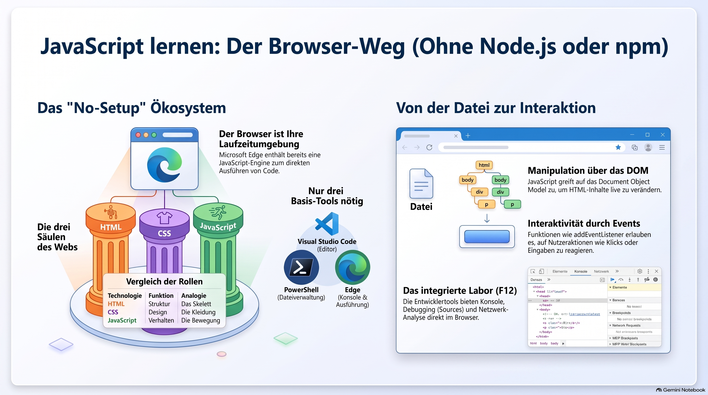
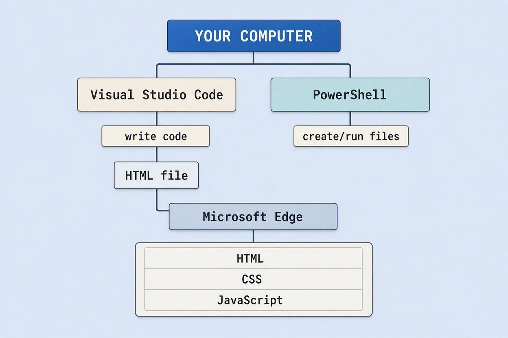
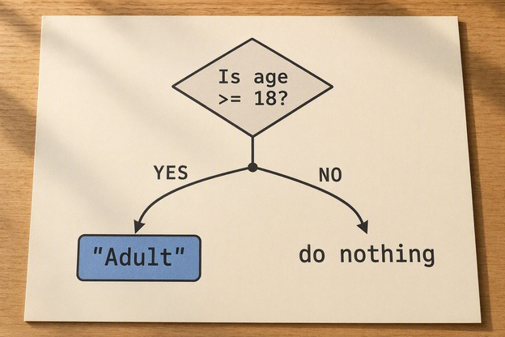
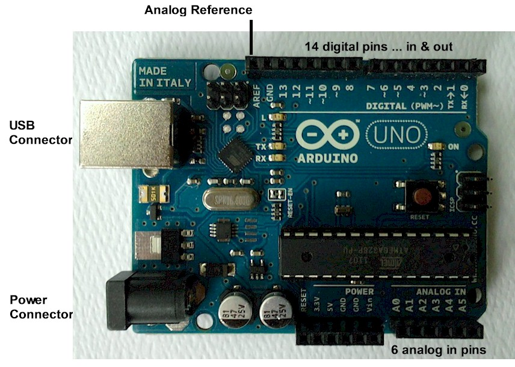
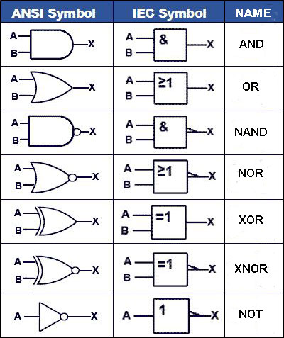
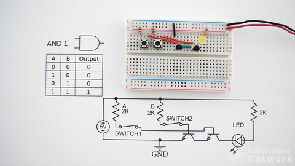
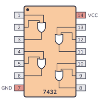
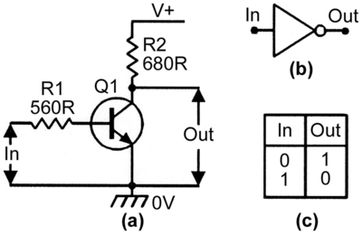

> [NOTE!]
> Diese Anleitung zeigt auf, wie man eine **solide JavaScript-Basis** aufbauen kann, ohne auf externe Laufzeitumgebungen wie **Node.js** oder **Deno** angewiesen zu sein. Durch die Nutzung bereits vorhandener Werkzeuge wie **Microsoft Edge**, **Visual Studio Code** und der **PowerShell** können Einsteiger die Kernsprache direkt im Browser erlernen. Der Text strukturiert den Lernprozess in logische Phasen, die von grundlegenden **Variablen und Datentypen** bis hin zur **DOM-Manipulation** und asynchronen **API-Abfragen** reichen. Besonders für Entwickler mit Java-Hintergrund wird erklärt, wie JavaScript zur Gestaltung interaktiver Oberflächen und zur Kommunikation mit **Spring Boot-Backends** eingesetzt wird. Ein praxisorientierter **Projektplan** motiviert dazu, das Wissen schrittweise durch den Bau kleiner Anwendungen wie Konverter oder Aufgabenlisten zu festigen. Letztlich verdeutlicht die Quelle, dass moderne Webentwicklung auch unter **restriktiven IT-Bedingungen** durch die konsequente Nutzung nativer Browser-Funktionen erfolgreich möglich ist.

**You are not doomed at all**. 😄

In fact, JavaScript was originally designed to run inside a browser. **Node.js and Deno are not required to learn JavaScript itself.** They are JavaScript runtimes that add server-side capabilities.

With your restrictions, you can build a very solid JavaScript foundation using only:

* 🟦 **Microsoft Edge** — browser + JavaScript Console

* 🟪 **Visual Studio Code** — editor

* 🟩 **PowerShell** — creating files, folders, and starting your web pages

* 🌐 **HTML + CSS** — the environment in which browser JavaScript operates

No Node.js.\
No Deno.\
No npm.\
No package managers.\
No build tools.\
No frameworks.

And actually, this is an excellent way to learn the **core language** first.

# Browser-only JavaScript 

JavaScript Absolute Beginner Tutorial with Edge + VS Code + PowerShell

***

# 1. What exactly are we going to learn?

Think of your environment like this:



The important part is:


> **Edge contains a JavaScript engine.**

Therefore you already have a JavaScript runtime.

You don't need Node.js to execute:
```javascript
console.log("Hello JavaScript!");
```
Edge can execute it.

***

# 2. Your first JavaScript program

Open **Microsoft Edge**.

Press:

```text
F12
```

or:

```text
Ctrl + Shift + I
```

The Developer Tools appear.

Select:

```text
Console
```

Now type:

```javascript
console.log("Hello JavaScript!");
```

Press Enter.

You should see:

```text
Hello JavaScript!
```

Congratulations. 🎉

You have just executed JavaScript.

No Node.js.

No Deno.

No npm.

***

# 3. Your first important mental model

There are three different things here:

### HTML

HTML describes the structure.

```html
<h1>Hello</h1>
<p>This is a paragraph.</p>
```

### CSS

CSS describes appearance.

```css
h1 {
    color: blue;
}
```

### JavaScript

JavaScript describes behavior.

```javascript
console.log("Hello!");
```

A useful mental model is:

```text
HTML        → structure
CSS         → appearance
JavaScript  → behavior
```

For example:


***

# 4. Create your first project

Let's create a completely browser-based JavaScript project.

Open PowerShell.

```powershell
mkdir JavaScriptBeginner
cd JavaScriptBeginner
```

Create three files:

```powershell
New-Item index.html
New-Item script.js
New-Item style.css
```

You now have:

```text
JavaScriptBeginner
│
├── index.html
├── script.js
└── style.css
```

Open the directory in VS Code:

```powershell
code .
```

***

# 5. Your first HTML page

Put this into `index.html`:

```html
<!DOCTYPE html>
<html lang="en">
<head>
    <meta charset="UTF-8">

    <title>My First JavaScript App</title>

    <link rel="stylesheet" href="style.css">
</head>

<body>

    <h1>My First JavaScript App</h1>

    <p id="message">
        JavaScript will change this text.
    </p>

    <script src="script.js"></script>

</body>
</html>
```

Notice this line:

```html
<script src="script.js"></script>
```

This tells the browser:

> Load and execute my JavaScript file.

***

# 6. Your first external [JavaScript](./JavaScript_from_ground_up.md)

Put this into `script.js`:

```javascript
console.log("JavaScript is running!");
```

Save everything.

Now open `index.html` in Edge.

You can do this from PowerShell:

```powershell
start .\index.html
```

Edge should open your page.

Now press:

```text
F12
```

and open:

```text
Console
```

You should see:

```text
JavaScript is running!
```

🎉

You have created your first browser JavaScript application.

***

# 7. Variables

Now we start learning JavaScript itself.

A variable is a named place where we store a value.

```javascript
let name = "Karl";
```

Think:

```text
name
 │
 ▼
"Karl"
```

You can read the value:

```javascript
console.log(name);
```

Output:

```text
Karl
```

***

# 8. `let`

Use `let` when a value can change.

```javascript
let age = 25;

console.log(age);

age = 26;

console.log(age);
```

Output:

```text
25
26
```

The variable changed.

***

# 9. `const`

Use `const` when the variable should not be reassigned.

```javascript
const country = "Germany";

console.log(country);
```

You cannot do:

```javascript
country = "France";
```

That produces an error.

As a beginner, a good rule is:

> **Use `const` by default. Use `let` when you need to change the variable.**

***

# 10. `var`

You will encounter this:

```javascript
var name = "Karl";
```

But for modern JavaScript, don't use `var` for your new code.

Learn:

```javascript
const
let
```

first.

***

# 11. JavaScript data types

JavaScript has several important data types.

## String

Text:

```javascript
const name = "Karl";
```

## Number

Numbers:

```javascript
const age = 50;
const temperature = 21.5;
```

## Boolean

True or false:

```javascript
const isLearning = true;
```

## Undefined

A variable without a value:

```javascript
let result;

console.log(result);
```

Result:

```text
undefined
```

## Null

Explicitly no value:

```javascript
const user = null;
```

***

# 12. Checking a type

JavaScript provides:

```javascript
typeof
```

Example:

```javascript
console.log(typeof "Hello");
console.log(typeof 42);
console.log(typeof true);
```

Output:

```text
string
number
boolean
```

This is very useful when debugging.

***

# 13. Strings

You can write strings using:

```javascript
const a = "Hello";
const b = 'Hello';
```

Modern JavaScript also supports template literals:

```javascript
const name = "Karl";

const message = `Hello ${name}!`;

console.log(message);
```

Output:

```text
Hello Karl!
```

This is extremely useful.

***

# 14. String concatenation

You can also do:

```javascript
const firstName = "Karl";
const lastName = "Schmitt";

const fullName = firstName + " " + lastName;

console.log(fullName);
```

Output:

```text
Karl Schmitt
```

But template literals are usually easier to read:

```javascript
const fullName = `${firstName} ${lastName}`;
```

***

# 15. Numbers

JavaScript supports normal arithmetic:

```javascript
const a = 10;
const b = 5;

console.log(a + b);
console.log(a - b);
console.log(a * b);
console.log(a / b);
```

Output:

```text
15
5
50
2
```

You also have:

```javascript
%
```

which means remainder:

```javascript
console.log(10 % 3);
```

Result:

```text
1
```

***

# 16. Comparisons

JavaScript provides:

```javascript
>
<
>=
<=
===
!==
```

Example:

```javascript
const age = 20;

console.log(age >= 18);
```

Result:

```text
true
```

***

# 17. `===` versus `==`

This is an important [JavaScript](../JavaScript/Tripple_===_Operator.md) topic.

Prefer:

```javascript
===
```

instead of:

```javascript
==
```

Example:

```javascript
console.log(5 === 5);
```

Result:

```text
true
```

But:

```javascript
console.log(5 === "5");
```

Result:

```text
false
```

Why?

Because:

```text
5       → number
"5"     → string
```

They aren't the same type.

***

# 18. `if`

Now JavaScript becomes interesting.
```**javascript**
const age = 20;

if (age >= 18) {
    console.log("Adult");
}
```

The program asks:



***

# 19. `else`

```javascript
const age = 16;

if (age >= 18) {
    console.log("Adult");
} else {
    console.log("Minor");
}
```

***

# 20. `else if`

```javascript
const temperature = 25;

if (temperature < 0) {
    console.log("Freezing");
} else if (temperature < 20) {
    console.log("Cold");
} else if (temperature < 30) {
    console.log("Comfortable");
} else {
    console.log("Hot");
}
```

***


# 21. Logical operators




You will frequently use:
```javascript
&&
||
!
```

### AND


```javascript
const age = 25;
const hasTicket = true;

if (age >= 18 && hasTicket) {
    console.log("You may enter.");
}
```

Both conditions must be true.

### OR


```javascript
if (age >= 18 || hasPermission) {
    console.log("Allowed");
}
```

At least one condition must be true.

### NOT


```javascript
const loggedIn = false;

if (!loggedIn) {
    console.log("Please log in.");
}
```

***

# 22. Functions

Functions are one of the most important concepts in programming.

A function is a reusable piece of logic.

```javascript
function greet() {
    console.log("Hello!");
}
```

Define:

```javascript
function greet() {
    console.log("Hello!");
}
```

Call:

```javascript
greet();
```

Output:

```text
Hello!
```

***

# 23. Function parameters

```javascript
function greet(name) {
    console.log(`Hello ${name}!`);
}
```

Call:

```javascript
greet("Karl");
greet("Alice");
```

Output:

```text
Hello Karl!
Hello Alice!
```

The parameter is:

```text
name
```

The argument is:

```text
"Karl"
```

***

# 24. Returning values

Functions can return values.

```javascript
function add(a, b) {
    return a + b;
}
```

Now:

```javascript
const result = add(10, 20);

console.log(result);
```

Result:

```text
30
```

Think:

```text
10 ─────┐
        │
        ▼
     add()
        │
        ▼
       30
        │
        ▼
      result
```

***

# 25. Arrow functions

You will eventually encounter:

```javascript
const add = (a, b) => {
    return a + b;
};
```

Or the shorter form:

```javascript
const add = (a, b) => a + b;
```

For now, don't worry if this looks strange.

First master:

```javascript
function add(a, b) {
    return a + b;
}
```

Then learn arrow functions.

***

# 26. Arrays

An array stores multiple values.

```javascript
const fruits = [
    "Apple",
    "Banana",
    "Orange"
];
```

You can access elements by index:

```javascript
console.log(fruits[0]);
```

Output:

```text
Apple
```

Remember:

> [JavaScript](./JavaScript_from_ground_up.md) arrays start at **0**.

Therefore:

```text
index 0 → Apple
index 1 → Banana
index 2 → Orange
```

***

# 27. Array methods

Add something:

```javascript
fruits.push("Mango");
```

Remove the last item:

```javascript
fruits.pop();
```

Find the number of elements:

```javascript
console.log(fruits.length);
```

***

# 28. Looping through arrays

The traditional loop:

```javascript
for (let i = 0; i < fruits.length; i++) {
    console.log(fruits[i]);
}
```

A simpler modern form:

```javascript
for (const fruit of fruits) {
    console.log(fruit);
}
```

You'll use this one a lot.

***

# 29. Objects

Objects are extremely important in [JavaScript](./JavaScript_from_ground_up.md).

```javascript
const person = {
    name: "Karl",
    age: 50,
    country: "Germany"
};
```

Access properties:

```javascript
console.log(person.name);
console.log(person.age);
```

Output:

```text
Karl
50
```

***

# 30. Objects are everywhere

This is especially important for your future work.

A [JavaScript](./JavaScript_from_ground_up.md) object might represent:

```javascript
const customer = {
    id: 123,
    name: "Alice",
    email: "alice@example.com"
};
```

This is very similar to the JSON you encounter in backend development.

For example:

```json
{
    "id": 123,
    "name": "Alice",
    "email": "alice@example.com"
}
```

This connection will become very useful when you work with HTTP APIs.

***

# 31. The DOM

Now we move from **[JavaScript](./JavaScript_from_ground_up.md) language** to **browser [JavaScript](./JavaScript_from_ground_up.md)**.

DOM means:

> **Document Object Model**

Your HTML:

```html
<h1>Hello</h1>
```

becomes an object structure that [JavaScript](./JavaScript_from_ground_up.md) can access.

Conceptually:

```text
document
   │
   └── html
        │
        ├── head
        │
        └── body
             │
             └── h1
                  │
                  └── "Hello"
```

[JavaScript](./JavaScript_from_ground_up.md) can manipulate this structure.

***

# 32. `document`

In browser [JavaScript](./JavaScript_from_ground_up.md) you have a global object called:

```javascript
document
```

Try in Edge Console:

```javascript
console.log(document);
```

You will see the current web document.

***

# 33. Finding an HTML element

Suppose your HTML contains:

```html
<p id="message">
    Hello
</p>
```

[JavaScript](./JavaScript_from_ground_up.md) can find it:

```javascript
const message = document.getElementById("message");
```

Now:

```javascript
console.log(message);
```

***

# 34. Changing HTML

You can change the text:

```javascript
message.textContent = "Hello from [JavaScript](./JavaScript_from_ground_up.md)!";
```

The browser immediately changes the page.

This is a major moment:

```text
[JavaScript](./JavaScript_from_ground_up.md)
     │
     ▼
 DOM
     │
     ▼
Browser page changes
```

***

# 35. Buttons

Let's create something interactive.

`index.html`:

```html
<!DOCTYPE html>
<html lang="en">
<head>
    <meta charset="UTF-8">
    <title>[JavaScript](./JavaScript_from_ground_up.md) Button</title>
</head>

<body>

    <h1>[JavaScript](./JavaScript_from_ground_up.md) Demo</h1>

    <p id="message">
        Nothing happened yet.
    </p>

    <button id="helloButton">
        Click me
    </button>

    <script src="script.js"></script>

</body>
</html>
```

`script.js`:

```javascript
const button = document.getElementById("helloButton");
const message = document.getElementById("message");

button.addEventListener("click", function () {
    message.textContent = "Hello from [JavaScript](./JavaScript_from_ground_up.md)!";
});
```

Now click the button.

Boom. 💥

You've created an interactive web application.

***

# 36. Events

The browser produces events.

Examples:

```text
click
input
change
submit
keydown
keyup
mouseover
load
```

[JavaScript](./JavaScript_from_ground_up.md) can listen for them.

For example:

```javascript
button.addEventListener("click", function () {
    console.log("Button clicked!");
});
```

Think:

```text
User clicks
     │
     ▼
  "click"
   event
     │
     ▼
[JavaScript](./JavaScript_from_ground_up.md) handler
     │
     ▼
execute code
```

This event model is **fundamental to frontend development**.

***

# 37. Reading user input

HTML:

```html
<input id="nameInput" type="text">

<button id="greetButton">
    Greet
</button>

<p id="result"></p>
```

[JavaScript](./JavaScript_from_ground_up.md):

```javascript
const input = document.getElementById("nameInput");
const button = document.getElementById("greetButton");
const result = document.getElementById("result");

button.addEventListener("click", function () {

    const name = input.value;

    result.textContent = `Hello ${name}!`;
});
```

Now you have:

```text
User
 │
 │ types name
 ▼
<input>
 │
 │ click
 ▼
<button>
 │
 ▼
[JavaScript](./JavaScript_from_ground_up.md)
 │
 ▼
<p>
```

***

# 38. A first real mini-project

Let's build a **Celsius → Fahrenheit converter**.

You can do this entirely with your three permitted tools.

HTML:

```html
<!DOCTYPE html>
<html lang="en">

<head>
    <meta charset="UTF-8">
    <title>Celsius Converter</title>
</head>

<body>

    <h1>Celsius → Fahrenheit</h1>

    <label for="celsius">
        Celsius:
    </label>

    <input id="celsius" type="number">

    <button id="convert">
        Convert
    </button>

    <p id="result"></p>

    <script src="script.js"></script>

</body>

</html>
```

[JavaScript](./JavaScript_from_ground_up.md):

```javascript
const input = document.getElementById("celsius");
const button = document.getElementById("convert");
const result = document.getElementById("result");

button.addEventListener("click", function () {

    const celsius = Number(input.value);

    const fahrenheit = celsius * 9 / 5 + 32;

    result.textContent =
        `${celsius} °C = ${fahrenheit} °F`;
});
```

Try:

```text
0
```

You should get:

```text
0 °C = 32 °F
```

Try:

```text
100
```

You get:

```text
100 °C = 212 °F
```

This tiny application teaches you:

* variables

* constants

* numbers

* functions/logic

* DOM

* events

* input

* output

* type conversion

* arithmetic

That's already a lot.

***

# 39. `Number()`

There is an important detail here.

An HTML input returns text.

For example:

```javascript
const value = input.value;
```

Even if the user types:

```text
25
```

the value is initially a string.

We convert it:

```javascript
const celsius = Number(input.value);
```

So:

```text
"25"
 │
 │ Number()
 ▼
25
```

Now we have a [JavaScript](./JavaScript_from_ground_up.md) number.

***

# 40. Browser Developer Tools = your laboratory

Because you don't have Node.js or Deno, **Edge Developer Tools become your laboratory**.

You should become comfortable with:

```text
F12
```

especially:

```text
Console
Elements
Sources
Network
```

These four tabs are going to be incredibly valuable.

***

# 41. Console

Use Console for experiments:

```javascript
2 + 2
```

```javascript
"Hello".toUpperCase()
```

```javascript
[1, 2, 3]
```

```javascript
typeof 42
```

```javascript
Math.random()
```

Don't be afraid of experimenting.

The browser console is your [JavaScript](./JavaScript_from_ground_up.md) playground.

***

# 42. Sources

The **Sources** tab lets you inspect your [JavaScript](./JavaScript_from_ground_up.md) source.

You can put a breakpoint here:

```javascript
const fahrenheit = celsius * 9 / 5 + 32;
```

Then execute the program.

The browser can stop there.

You can inspect:

```text
celsius
fahrenheit
input
button
result
```

This is how you learn debugging.

***

# 43. Network

This becomes particularly interesting later.

Your browser can make HTTP requests.

[JavaScript](./JavaScript_from_ground_up.md) can use:

```javascript
fetch()
```

For example:

```javascript
fetch("https://example.com")
    .then(response => response.text())
    .then(data => console.log(data));
```

And this works **without Node.js**.

This is where your Java backend knowledge will start connecting beautifully with browser [JavaScript](./JavaScript_from_ground_up.md).

***

# 44. JSON

[JavaScript](./JavaScript_from_ground_up.md) and JSON are extremely closely related.

Example:

```javascript
const user = {
    name: "Alice",
    age: 30
};
```

Convert an object to JSON:

```javascript
const json = JSON.stringify(user);

console.log(json);
```

Result:

```json
{"name":"Alice","age":30}
```

Convert JSON back:

```javascript
const userAgain = JSON.parse(json);
```

***

# 45. HTTP with `fetch`

Here's a browser-only API call:

```javascript
fetch("https://api.example.com/users")
    .then(response => response.json())
    .then(users => {
        console.log(users);
    })
    .catch(error => {
        console.error(error);
    });
```

The architecture becomes:

```text
             Edge
               │
          [JavaScript](./JavaScript_from_ground_up.md)
               │
             fetch
               │
               ▼
             HTTP
               │
               ▼
       Spring Boot API
               │
               ▼
           Database
```

This is especially useful for you as a Java/Spring Boot developer.

***

# 46. Promises

When you use:

```javascript
fetch(...)
```

you encounter something called a **Promise**.

Don't panic. 😄

A Promise represents a result that will become available later.

Conceptually:

```text
[JavaScript](./JavaScript_from_ground_up.md) asks for something
          │
          ▼
       Promise
          │
          │ waiting...
          ▼
      HTTP response
          │
          ▼
       result
```

You will eventually learn:

```javascript
.then()
.catch()
```

and later:

```javascript
async
await
```

***

# 47. `async` / `await`

Modern [JavaScript](./JavaScript_from_ground_up.md) often looks like:

```javascript
async function loadUsers() {

    const response =
        await fetch("https://api.example.com/users");

    const users =
        await response.json();

    console.log(users);
}
```

This style will probably feel familiar to you as a backend developer.

***

# 48. Classes

[JavaScript](./JavaScript_from_ground_up.md) also supports classes:

```javascript
class Person {

    constructor(name, age) {
        this.name = name;
        this.age = age;
    }

    greet() {
        console.log(`Hello, I'm ${this.name}`);
    }
}
```

Create an object:

```javascript
const person = new Person("Karl", 50);
```

Call:

```javascript
person.greet();
```

You'll notice similarities with Java:

```java
public class Person {

    private String name;
    private int age;

    public Person(String name, int age) {
        this.name = name;
        this.age = age;
    }
}
```

But **[JavaScript](./JavaScript_from_ground_up.md) classes are not simply Java classes with different syntax**. [JavaScript](./JavaScript_from_ground_up.md)'s object model is prototype-based underneath.

We'll learn that later.

***

# 49. A learning path specifically for you

I would recommend **not** trying to learn all of [JavaScript](./JavaScript_from_ground_up.md) at once.

Instead:

## Phase 1 — [JavaScript](./JavaScript_from_ground_up.md) fundamentals

### Week 1

```text
Day 1
Variables
const
let
console.log

Day 2
Data types
Strings
Numbers
Booleans

Day 3
Operators
Comparisons
===
!==

Day 4
if / else
Logical operators

Day 5
Loops
for
while
for...of

Day 6
Functions

Day 7
Exercises
```

***

# Phase 2 — Data structures

### Week 2

```text
Arrays
Objects
Array methods
Object properties
Nested objects
Destructuring
Spread operator
```

Exercises:

```text
Shopping list
Todo list
Address book
Student database
Movie collection
```

***

# Phase 3 — Browser [JavaScript](./JavaScript_from_ground_up.md)

### Week 3

```text
DOM
document
getElementById
querySelector
textContent
innerHTML
classList
```

Then:

```text
Events
click
input
change
submit
keydown
```

Projects:

```text
Counter
Todo List
Calculator
Temperature Converter
Digital Clock
```

***

# Phase 4 — Modern [JavaScript](./JavaScript_from_ground_up.md)

### Week 4

```text
Arrow functions
map()
filter()
find()
reduce()
some()
every()

Destructuring
Spread
Rest
Template literals
Optional chaining
Nullish coalescing
```

***

# Phase 5 — Asynchronous [JavaScript](./JavaScript_from_ground_up.md)

### Week 5

```text
Callbacks
Promises
.then()
.catch()
async
await
fetch()
JSON
```

Project:

```text
Browser API Client
```

***

# Phase 6 — HTTP and APIs

This is where your Java/Spring background becomes extremely useful.

### Week 6

Learn:

```text
HTTP
GET
POST
PUT
DELETE

Request
Response
Headers
Status codes
JSON

fetch()
```

Then create your own Spring Boot REST API and communicate with it from browser [JavaScript](./JavaScript_from_ground_up.md).

For example:

```text
Edge
  │
  │ GET /api/products
  ▼
Spring Boot
  │
  ▼
PostgreSQL
```

And back:

```text
Spring Boot
     │
     │ JSON
     ▼
   Edge
     │
     ▼
 [JavaScript](./JavaScript_from_ground_up.md)
     │
     ▼
    DOM
```

That's a fantastic learning project for you.

***

# Phase 7 — Advanced [JavaScript](./JavaScript_from_ground_up.md)

After the basics:

```text
Scope
Closures
this
Prototypes
Classes
Modules
ES modules
Error handling
Debugging
Event loop
Microtasks
Macrotasks
```

Then:

```text
Web Storage
localStorage
sessionStorage
URL API
FormData
Web APIs
```

***

# 50. Your first 10 projects

I would strongly recommend learning through projects.

### Project 1 — Hello [JavaScript](./JavaScript_from_ground_up.md)

```text
Button → change text
```

### Project 2 — Counter

```text
[ - ]  0  [ + ]
```

### Project 3 — Celsius/Fahrenheit Converter

```text
Celsius
   ↓
Fahrenheit
```

### Project 4 — Calculator

```text
7 + 5 = 12
```

### Project 5 — Todo List

```text
[ Learn [JavaScript](./JavaScript_from_ground_up.md) ] [Add]

☐ Learn variables
☐ Learn functions
☐ Learn DOM
```

### Project 6 — Digital Clock

```text
21:42:15
```

### Project 7 — Quiz

```text
What does === mean?

○ Assignment
● Strict equality
○ Addition
```

### Project 8 — Shopping List

```text
Milk
Bread
Apples
```

### Project 9 — JSON Explorer

Paste JSON and display it.

### Project 10 — REST API Client

```text
        Edge
          │
       fetch()
          │
          ▼
    Spring Boot API
          │
          ▼
        JSON
          │
          ▼
    [JavaScript](./JavaScript_from_ground_up.md) UI
```

That final project connects **[JavaScript](./JavaScript_from_ground_up.md) + HTTP + JSON + Spring Boot**.

***

# 51. Your "forbidden tools" are actually not a problem

This is perhaps the most important thing I want you to take away.

You said:

> "Because any other tools like Node.js and Deno are not allowed in my organisation :-( Please help."

Absolutely.

Your environment is enough:

```text
┌────────────────────────────────────────────┐
│          YOUR JAVASCRIPT LAB                │
│                                            │
│  Visual Studio Code                        │
│       │                                    │
│       │ writes                             │
│       ▼                                    │
│     HTML + CSS + [JavaScript](./JavaScript_from_ground_up.md)                │
│       │                                    │
│       ▼                                    │
│   Microsoft Edge                           │
│       │                                    │
│       ├── Console                           │
│       ├── Sources                           │
│       ├── Elements                          │
│       └── Network                           │
│                                            │
│  PowerShell                                │
│       │                                    │
│       └── project/file management          │
│                                            │
└────────────────────────────────────────────┘
```

And later:

```text
Edge
 │
 │ HTTP
 ▼
Spring Boot
 │
 │ JDBC/JPA
 ▼
Database
```

You don't need Node.js or Deno for that.

***

# 52. One very important distinction

Eventually you will learn:

```text
[JavaScript](./JavaScript_from_ground_up.md) language
        │
        ├── Browser
        │     ├── DOM
        │     ├── fetch
        │     ├── localStorage
        │     └── Web APIs
        │
        ├── Node.js
        │     ├── filesystem
        │     ├── servers
        │     └── npm ecosystem
        │
        └── Deno
              ├── filesystem
              ├── servers
              └── web APIs
```

The **[JavaScript](./JavaScript_from_ground_up.md) language itself is the common foundation**.

So your current restriction doesn't prevent you from learning [JavaScript](./JavaScript_from_ground_up.md).

It simply means:

> **You're learning browser-side [JavaScript](./JavaScript_from_ground_up.md) rather than server-side [JavaScript](./JavaScript_from_ground_up.md).**

And that's actually a very clean way to start.

***

# 53. Your first exercise

Create:

```text
[JavaScript](./JavaScript_from_ground_up.md)Beginner/
│
├── index.html
├── script.js
└── style.css
```

Your page should contain:

```text
[JavaScript](./JavaScript_from_ground_up.md) Beginner
-------------------

Name: [____________]

[ Say Hello ]

Hello, ______!
```

Requirements:

1. Create an `<input>`.

2. Create a `<button>`.

3. Create a `<p>`.

4. When the user clicks the button, read the input.

5. Display:

```text
Hello Karl!
```

6. Use `addEventListener()`.

7. Use `textContent`.

8. Don't use any framework.

9. Don't use Node.js.

10. Don't use Deno.

Use only:

```text
PowerShell
VS Code
Edge
HTML
CSS
[JavaScript](./JavaScript_from_ground_up.md)
```

And **don't worry if you get stuck**. That's exactly what the exercise is for. 😊

If you follow this path, I would actually recommend calling the whole learning project something like:

> **[JavaScript](./JavaScript_from_ground_up.md) Browser-Only Bootcamp — From Zero to REST API**

It would fit particularly well with your Zettelkasten because every week can become a collection of small, connected notes rather than one enormous [JavaScript](./JavaScript_from_ground_up.md) document.
