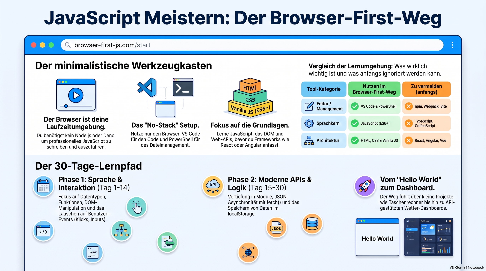
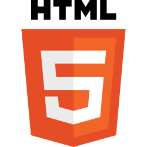

> [NOTE!]
> Dieser Leitfaden führt Anfänger in die Grundlagen der **JavaScript-Programmierung** ein, wobei lediglich die Standardwerkzeuge **PowerShell, VS Code und der Edge-Browser** genutzt werden. Die Lektionen decken essenzielle Konzepte wie **Variablen, Datentypen, mathematische Operatoren** und die Steuerung des Programmflusses durch **If-Statements sowie Schleifen** ab. Fortgeschrittene Themen wie die Erstellung von **wiederverwendbaren Funktionen, Arrays und Objekten** vermitteln ein tieferes Verständnis für die Strukturierung von Code. Ein besonderer Fokus liegt auf der **DOM-Manipulation**, mit der Lernende interaktive Elemente wie Button-Klicks und dynamische Textänderungen auf Webseiten umsetzen können. Ein strukturierter **Vier-Wochen-Lernplan** sowie praktische Übungsprojekte wie ein Klick-Zähler runden das Tutorial ab. Ziel des Kurses ist es, auch ohne komplexe Softwareumgebungen fundierte Kenntnisse in der **Frontend-Entwicklung** aufzubauen.

# The Absolute Beginner’s Guide to Browser JavaScript

Since you're restricted to **PowerShell, VS Code, and Edge**,
let's embrace that setup and learn **browser JavaScript**, 
which is how JavaScript was originally used.


## JavaScript for Absolute Beginners: Using Only PowerShell, VS Code, and Edge

### What you will learn ...

By the end of this tutorial, you'll be able to:

* Write JavaScript code
* Run it in Edge
* Change web pages with JavaScript
* Respond to button clicks
* Build simple interactive web apps

***

## Lesson 1: Your First JavaScript Program 🌍

Create a folder anywhere you like.


Open PowerShell:
```powershell
mkdir JS-Learning

cd JS-Learning

code .
```



Create a [HTML](https://en.wikipedia.org/wiki/HTML) file named:

```powershell
ni index.html 
```

Paste the following [HTML](https://en.wikipedia.org/wiki/HTML) code into ```index.html```:

```html
<!DOCTYPE html>
<html lang="de">
<head>
    <meta charset="UTF-8">
    <title>JavaScript Alert Demo</title>
</head>

<body>
    <h1>JavaScript Alert Demo</h1>
    <script>
        alert("Cindy oh Cindy dein Herz muß traurig sein.");
    </script>
</body>
</html>
```

Save the file.

Open it in Edge using the ```start``` command and you'll see a popup.

```powershell
start index.html
```

✅ Congratulations! You've run your first JavaScript program.

***

## Lesson 2: The Browser Console

The browser console is your best friend.

Open your [HTML](https://en.wikipedia.org/wiki/HTML) page in Edge.

1. Press: **F12**
2. Click: **Console**
3. Type: **2 + 2**
4. Result: **4**
5. Try: ```console.log("Hello Cindy") ```
6. Output: **Hello Cindy**
7. You'll use `console.log()` constantly.

***

## Lesson 3: Variables 🪶

> [NOTE!]
> Variables store data in memory not on disk.

A variable in JavaScript is a labeled container used to store data values in memory so your code can reference, 
use, and update them later. 
You can read more about them on the MDN Web Docs on JavaScript Variables.

### The Storage Box Analogy 📦

* The Label (Name): The unique name you give the variable so you can find it later (like writing "score" on a cardboard box).
* The Value (Data): The actual item you put inside the box (like the number 10 or the text "Hello").
* The Equal Sign (=): The assignment operator used to put a value into that container.

### The Three Keywords 🔑

JavaScript uses **three** keywords to create variables, though you will mostly use the first two today:

* let: Creates a variable whose value can be changed (reassigned) later in the code. Use this when you expect the data to change (like a game score or user input).
* const: Creates a constant variable whose value cannot be changed once it is set. Use this for fixed values that should remain the same (like a website URL or a maximum limit).
* var: The older way to declare variables. It works similarly to let, but has confusing rules about scope (where the variable is accessible), so modern JavaScript code avoids using it.

### How to Use Variables

   1. Declare and Assign:
   
   let score = 10; // Creates 'score' and puts 10 inside
   
   2. Read the Value:
   
   console.log(score); // Outputs 10 to the console
   
   3. Update the Value (for let):
   
   score = 15; // Changes the value inside 'score' to 15
   
   
If you'd like, let me know if you want to explore variable naming rules or learn about different data types like strings and numbers.

Open an editor:
```powershell
nvim variables.html
```
And add the following [HTML](https://en.wikipedia.org/wiki/HTML) code to ```variables.html```
```html
<!DOCTYPE html>
<html lang="en">
<head>
    <meta charset="UTF-8">
    <meta name="viewport" content="width=device-width, initial-scale=1.0">
    <title>JavaScript Playground</title>
</head>
<body>
    <h1 id="title">JavaScript Playground\</h1>
    <script>
        // Write your JavaScript here :-)
        let name = "Hellow Daisy!";
        console.log(name);
    </script>
</body>
</html>
```

Save the file.

Open it in Edge using the ```start``` command and you'll see a popup.
```powershell
start variables.html
```
Press **F12** and navigate to the **Console** output.
You shouls see^: ```Hellow Daisy!```

Another example:
```html
<!DOCTYPE html>
<html lang="en">
<head>
    <meta charset="UTF-8">
    <meta name="viewport" content="width=device-width, initial-scale=1.0">
    <title>JavaScript Playground</title>
</head>
<body>
    <h1 id="title">JavaScript Playground\</h1>
    <script>
        // Write your JavaScript here :-)
        let age = 25;
        console.log(age);
    </script>
</body>
</html>
```

***

## Types of Data

#### Text

let city = "Berlin";

#### Numbers

let temperature = 22;

#### True/False

let isSunny = true;

```html
<!DOCTYPE html>
<html lang="de">
<head>
    <meta charset="UTF-8">
    <title>JavaScript Alert Demo</title>
</head>

<body>
    <h1>JavaScript Alert Demo</h1>
    <script>
        let city = "Berlin";
        let temperature = 22;
        let isSunny = true;
        console.log(city);
        console.log(temperature);
        console.log(isSunny);
    </script>
</body>
</html>
```


***

## Exercise

Study the following JavaScript code:
```javascript
let firstName = "Emily";

let age = 21;

console.log(firstName);

console.log(age);

```
Place into an [HTML](https://en.wikipedia.org/wiki/HTML) file named **emily.html** and open it in Edge using the ```start``` command:

```html
<!DOCTYPE html>
<html lang="en">
<head>
    <meta charset="UTF-8">
    <meta name="viewport" content="width=device-width, initial-scale=1.0">
    <title>JavaScript Emily Playground</title>
</head>
<body>
    <h1 id="title">JavaScript Playground\</h1>
    <script>
        // Write your JavaScript here :-)
        let firstName = "Emily";
        let age = 21;
        console.log(firstName);
        console.log(age);
    </script>
</body>
</html>
```
***

## Lesson 4: Math

> [NOTE!]
> JavaScript can calculate using operators.

Operators in JavaScript are special symbols or keywords used to perform operations on values and variables,
such as math calculations, comparing items, or checking true/false logic. 
You can learn more details from the [MDN Expressions and Operators Guide](https://developer.mozilla.org/en-US/docs/Web/JavaScript/Guide/Expressions_and_operators).

## Arithmetic Operators (Math)

These symbols do basic math on numbers:

* Addition (+): Adds two numbers together. Example: 5 + 3 results in 8.
* Subtraction (-): Subtracts one number from another. Example: 10 - 4 results in 6.
* Multiplication (*): Multiplies numbers. Example: 4 * 2 results in 8.
* Division (/): Divides numbers. Example: 20 / 5 results in 4.

### Assignment Operators (Storing Values)

These symbols assign values to variables:

* Assignment (=): Puts a value into a variable. Example: let x = 10;.
* Add and Assign (+=): Adds a number to the current variable value and saves it. Example: x += 5; is the same as x = x + 5;.

### Comparison Operators (Comparing Values)

These symbols compare two things and give a true or false answer:

* Equal value and type (===): Checks if two values are completely identical. Example: 5 === 5 is true.
* Not equal (!==): Checks if two values are different. Example: 5 !== 3 is true.
* Greater than (>): Checks if the left side is larger. Example: 10 > 5 is true.
* Less than (<): Checks if the left side is smaller. Example: 3 < 5 is true.

### Logical Operators (Combining Rules)

These symbols combine multiple true/false checks:

* AND (&&): Returns true only if both sides are true. Example: true && false is false.
* OR (||): Returns true if at least one side is true. Example: true || false is true.
* NOT (!): Flips a true/false value. Example: !true is false.


Please place the following code into an [HTML](https://en.wikipedia.org/wiki/HTML) file named **math.html** and open it in Edge using the ```start``` command:

```html
<!DOCTYPE html>
<html lang="en">
<head>
    <meta charset="UTF-8">
    <meta name="viewport" content="width=device-width, initial-scale=1.0">
    <title>JavaScript Playground</title>
</head>
<body>
    <h1 id="title">JavaScript Playground\</h1>
    <script>
        // Write your JavaScript here :-)
        
        console.log(5 + 3);

        console.log(10 - 2);

        console.log(4 \* 5);

        console.log(20 / 4);

    </script>
</body>
</html>
```
***

Operator precedence in JavaScript is the set of rules that decides which operation happens first when an expression contains multiple operators, much like the traditional math rule PEMDAS. You can review the full priority table on the [MDN Operator Precedence Guide](https://developer.mozilla.org/en-US/docs/Web/JavaScript/Reference/Operators/Operator_precedence).
JavaScript does not always read a line of code strictly from left to right. Instead, it looks at the operators and gives priority to certain symbols over others.

## The Golden Rule: Parentheses First (())

* Overrides everything: Parentheses have the highest priority of all.
* Forces order: You can use parentheses to force JavaScript to calculate a lower-priority part first.
* Example: (2 + 3) * 4 results in 20 because the addition inside the parentheses happens before the multiplication. Without parentheses, 2 + 3 * 4 results in 14.

## Common Order of Priority (High to Low)

When you mix different types of operators, JavaScript evaluates them in this general order:

* Grouping (()): Evaluated first.
* Math Multiplication and Division (*, /, %): Evaluated before addition and subtraction.
* Math Addition and Subtraction (+, -): Evaluated after multiplication and division.
* Comparisons (>, <, ===, !==): Evaluated after standard math operations.
* Logical AND (&&): Evaluated before logical OR.
* Logical OR (||): Evaluated after logical AND.
* Assignment (=): Evaluated last, after the right side of the equals sign is fully calculated.

## A Clear Code Example

Consider this simple math expression in JavaScript:

let result = 10 + 5 * 2;


* The outcome: result becomes 20, not 30.
* Why: JavaScript spots the multiplication operator (*) and knows it has higher precedence than addition (+). It calculates 5 * 2 first to get 10, and then adds the initial 10 to get 20.

## Associativity (Tie-Breakers)

When two operators have the same priority level, JavaScript uses associativity to decide the direction:

* Left-to-Right: Most operators like +, -, *, and / evaluate from left to right.
* Right-to-Left: Assignment operators like = evaluate from right to left (which is why x = y = 5 assigns 5 to y first, then to x).

If you'd like, let me know if you want to see how these rules change inside an if statement condition or look at a complex example combining math and logical operators.


Create variables:

Place the following code into an HTML file named **variabels.html** and open it in Edge using the ```start``` command:

```html
<!DOCTYPE html>
<html lang="en">
<head>
    <meta charset="UTF-8">
    <meta name="viewport" content="width=device-width, initial-scale=1.0">
    <title>JavaScript Playground</title>
</head>
<body>
    <h1 id="title">JavaScript Playground\</h1>
    <script>
        // Write your JavaScript here :-)
        let a = 10;
        let b = 5;
        let c = 2
        console.log( a + b * c );
    </script>
</body>
</html>
```

Output: **50**

***

## Lesson 5: If Statements


An if statement in JavaScript is a conditional control structure that executes a specific block of code only when a given condition evaluates to true.
You can read the official documentation on the [MDN If...Else Guide](https://developer.mozilla.org/en-US/docs/Web/JavaScript/Reference/Statements/if...else).

## The Basic Structure

An if statement looks like a simple question: "If this condition is true, do the action."

* The Keyword (if): Tells JavaScript a conditional check is starting.
* The Condition ((...)): Contains an expression that turns into a true or false value.
* The Code Block ({...}): Holds the code that runs if the condition is true.

```javascript
let score = 85;
if (score >= 50) {
    console.log("You passed!");
}
```

## Expanding with else

When you want to provide a backup plan for when the condition is false, you add an else block.

```javascript
let score = 30;
if (score >= 50) {
    console.log("You passed!");
} else {
    console.log("You failed.");
}
```

## Handling Multiple Choices with else if

If you need to check multiple different conditions in sequence, use else if between the main if and the final else.

```javascript
let score = 75;
if (score >= 90) {
    console.log("Grade: A");
} else if (score >= 75) {
    console.log("Grade: B");
} else {
    console.log("Grade: Needs improvement");
}
```


> [NODE!]
> Computers make decisions.

```javascript

let age = 18;

if (age >= 18) {

    console.log("Adult");

}
```

Place this code into an [HTML](https://en.wikipedia.org/wiki/HTML) file named **eighteen.html** and open it in Edge using the ```start``` command:
```html
<!DOCTYPE html>
<html lang="de">
<head>
    <meta charset="UTF-8">
    <title>JavaScript First Decision Demo</title>
</head>

<body>
    <h1>JavaScript First Decision Demo</h1>
    <script>
        // Write your JavaScript here :-)
        let age = 18;
        if (age >= 18) {
            console.log("Adult");
        }
    </script>
</body>
</html>
```

***

#### The «if» statement with an alternative path:

Place this code into an [HTML](https://en.wikipedia.org/wiki/HTML) file named **choice.html** and open it in Edge using the ```start``` command.
```html
<!DOCTYPE html>
<html lang="de">
<head>
    <meta charset="UTF-8">
    <title>JavaScript Second Decision Demo</title>
</head>

<body>
    <h1>JavaScript Second Decision Demo</h1>
    <script>
       // Write your JavaScript here :-)
        let age = 15;
        if (age >= 18) {
            console.log("Adult");
        }
        else {
            console.log("Minor");
        }
    </script>
</body>
</html>
```

***

## Exercise

Place this code into an [HTML](https://en.wikipedia.org/wiki/HTML) file named **eighteen.html** and open it in Edge using the ```start``` 
command.
```html
<!DOCTYPE html>
<html lang="de">
<head>
    <meta charset="UTF-8">
    <title>JavaScript Exercise Demo</title>
</head>

<body>
    <h1>JavaScript Exercise Demo</h1>
    <script>
        // Write your JavaScript here :-)
        let score = 75;
        if (score >= 50) {
            console.log("Pass");
        }
        else {
            console.log("Fail");
        }
   </script>
</body>
</html>
```

***

## Lesson 6: Loops

A loop in JavaScript is a programming structure used to repeat a specific block of code multiple times until a defined condition is met.
You can explore the official details on the [MDN Loops and Iteration Guide](https://developer.mozilla.org/en-US/docs/Web/JavaScript/Guide/Loops_and_iteration).
Loops save time and keep your code clean by preventing you from writing the same lines over and over again.

### Common Types of Loops

JavaScript provides different types of loops depending on how you want to control the repetition:

* for loop: Repeats code a specific number of times. It tracks a counter, a condition, and a change per step inside parentheses.
* while loop: Repeats code as long as a condition remains true. It checks the condition before running the code block each time.
* do...while loop: Runs the code block once before checking the condition, and then repeats as long as the condition is true.
* for...of loop: Loops easily through items inside a list or array without managing a manual index number.

### The for Loop Example

This classic loop prints numbers from 0 up to 4 in the console:

```javascript
for (let i = 0; i < 5; i++) {
    console.log("The current number is: " + i);
}
```

* Initialization (let i = 0): Creates a counter variable named i starting at zero.
* Condition (i < 5): Checks if i is less than 5 before every loop. If true, the code runs.
* Increment (i++): Increases i by 1 after each loop cycle finishes.

### The while Loop Example

This loop runs as long as a variable meets the criteria:

```javascript
let count = 3;
while (count > 0) {
    console.log("Countdown: " + count);
    count--; // Decreases count by 1
}
```

If you'd like, let me know if you want to learn how to use break and continue to stop or skip steps inside a loop,
or see a practical example of looping through an array!

Loops repeat work.

Place this code into an [HTML](https://en.wikipedia.org/wiki/HTML) file named **loop.html** and open it in Edge using the ```start``` 
command.
```html
<!DOCTYPE html>
<html lang="de">
<head>
    <meta charset="UTF-8">
    <title>JavaScript Loop Demo</title>
</head>

<body>
    <h1>JavaScript Loop Demo</h1>
    <script>
        // Write your JavaScript here :-)
        for (let i = 1; i <= 5; i++) {
            console.log(i);
        }
    </script>
</body>
</html>
```

Output:
```text
1
2
3
4
5
```

***

Just another example:

```javascript
for (let i = 1; i <= 10; i++) {

    console.log("Hello");

}
```
Place this code into an [HTML](https://en.wikipedia.org/wiki/HTML) file named **loop.html** and open it in Edge using the ```start``` 
command.
```html
<!DOCTYPE html>
<html lang="de">
<head>
    <meta charset="UTF-8">
    <title>JavaScript Another Loop Demo</title>
</head>

<body>
    <h1>JavaScript Another Loop Demo</h1>
    <script>
        // Write your JavaScript here :-)
        for (let i = 1; i <= 10; i++) {
            console.log("Hello");
        }
    </script>
</body>
</html>
```

***

# Lesson 7: Functions


A function in JavaScript is a reusable block of code designed to perform a specific task,
which executes only when it is called (invoked). 
You can read more about them on the [MDN Web Docs on JavaScript Functions](https://developer.mozilla.org/en-US/docs/Web/JavaScript/Guide/Functions).

## The Recipe Analogy

> [NOTE!]
> Think of a function like a recipe in a cookbook:

* Writing the function is like writing down the recipe. It doesn't cook the food; it just stores the instructions.
* Calling the function is like actually cooking. The kitchen follows the instructions and produces a result whenever you need it.

------------------------------

## The Three Core Parts of a Function

* 1. Parameters (Inputs): The variable place-holders listed inside the function's parentheses. They accept data passed into the function.
* 2. The Body (Action): The actual code inside the curly braces {} that processes the inputs.
* 3. Return Value (Output): The final result the function sends back to where it was called using the return keyword.

------------------------------

## How to Create and Use a Function

Here is a simple example of a function that adds two numbers together:

```javascript
    // 1. Defining the functionfunction 
    addNumbers(a, b) {
        let sum = a + b;
        return sum; // Sends the result back
    }

    // 2. Calling the function and saving the result
    let result = addNumbers(5, 10);
    console.log(result); 
    // Outputs on the Console: 15
```

## Why Use Functions?

* Code Reusability: You can write code once and use it thousands of times with different numbers or pieces of information.
* Organization: They break large, confusing programs into small, easy-to-read sections.

> [NOTE!]
> Functions are reusable blocks of code.

```javascript
    function greet() {

        console.log("Hello");

    }
    greet();
```
Place this code into an [HTML](https://en.wikipedia.org/wiki/HTML) file named **function.html** and open it in Edge using the ```start``` command. 
```html
<!DOCTYPE html>
<html lang="de">
<head>
    <meta charset="UTF-8">
    <title>JavaScript Function Demo</title>
</head>

<body>
    <h1>JavaScript Function Demo</h1>
    <script>
        // Write your JavaScript here :-)
        function greet() {

            console.log("Hello");

        }
        greet();
   </script>
</body>
</html>
```

***

## Arrow functions:

An arrow function in JavaScript is a shorter, cleaner syntax for writing regular functions using the => (fat arrow) symbol. 
You can review the official syntax and details on the [MDN Arrow Functions Guide](https://developer.mozilla.org/en-US/docs/Web/JavaScript/Reference/Functions/Arrow_functions).
Arrow functions were introduced in modern JavaScript to make code shorter and easier to read, especially when passing small functions into other functions.

### Traditional Function vs. Arrow Function

Here is how a simple greeting function looks in both styles:
Traditional Function:

function sayHello(name) {
    return "Hello, " + name;
}

Arrow Function:

const sayHello = (name) => {
    return "Hello, " + name;
};


* No function keyword: You skip writing the word function.
* Arrow =>: Placed between the parameters () and the code block {}.
* Stored in a variable: They are usually assigned to a const variable.

------------------------------

### The Short-Cut: Implicit Return

If your arrow function only does one single task and returns a value, you can remove the curly braces {} and the return keyword completely. JavaScript will return the result automatically.

// Super short arrow function

const add = (a, b) => a + b;
console.log(add(5, 3)); // Outputs: 8


* One parameter shortcut: If your function takes only one parameter, you can even skip the parentheses () around the input.

const double = n => n * 2;


------------------------------

### A Major Difference: The this Keyword
Beyond just being shorter, arrow functions handle the special word this differently than regular functions.

* Regular functions create their own this value depending on how they are called.
* Arrow functions do not create their own this. They simply inherit this from the surrounding code block (lexical scoping), which prevents common bugs in complex code.


### Arrow Function Example:

```javascript
const greet = (name) => {

    console.log("Hello " + name);

}
greet("Fiona");
```
Place this code into an [HTML](https://en.wikipedia.org/wiki/HTML) file named **parameters.html** and open it in Edge using the ```start``` command.
```html
<!DOCTYPE html>
<html lang="de">
<head>
    <meta charset="UTF-8">
    <title>JavaScript Function Parameters Demo</title>
</head>

<body>
    <h1>JavaScript Function Parameters Demo</h1>
    <script>
        // Write your JavaScript here :-)
        const  greet = (name) => {

            console.log("Hello " + name);

        }
        greet("Fiona");
   </script>
</body>
</html>
```

Console Output:
```text
    Hello Fiona 
```

***

# Lesson 8: Arrays


An array in JavaScript is an ordered list container used to store multiple pieces of data under a single variable name.
You can explore the official details and methods on the [MDN Web Docs on JavaScript Arrays](https://developer.mozilla.org/en-US/docs/Web/JavaScript/Reference/Global_Objects/Array).

### The Egg Carton Analogy

Think of an array like an egg carton:

* The Carton: The single variable holding everything.
* The Slots: Numbered compartments where individual items sit.
* The Indexes: The address of each slot, starting exactly at 0 for the first item.

------------------------------

### How to Create and Access an Array

You create an array by putting comma-separated values inside square brackets [].

```javascript
    // 1. Creating an array of fruitsconst fruits = ["Apple", "Banana", "Cherry"];
    // 2. Accessing items using their index (Starts at 0!)
    console.log(fruits[0]); // Outputs: Apple
    console.log(fruits[1]); // Outputs: Banana
    // 3. Finding out how many items are inside
    console.log(fruits.length); // Outputs: 3
```

------------------------------

### Modifying and Updating Items

Arrays are flexible. You can change specific items or add completely new items to the list.

```javascript
    const fruits = ["Apple", "Banana", "Cherry"];
    // Change an existing item
    fruits[1] = "Blueberry"; 
    console.log(fruits); // Outputs: ["Apple", "Blueberry", "Cherry"]
    // Add a new item to the very end
    fruits.push("Date");
    console.log(fruits); // Outputs: ["Apple", "Blueberry", "Cherry", "Date"]
```

### Common Array Methods

JavaScript provides built-in tools to manipulate arrays easily:

* push(): Adds an item to the end of the array.
* pop(): Removes the very last item from the array.
* shift(): Removes the very first item from the array.
* unshift(): Adds a new item to the beginning of the array.

> [NOTE!]
> Arrays hold many values.

Get the first item:

```javascript
    let fruits = ["Apple", "Banana", "Orange"];
    console.log(fruits[0]);
```
Place this code into an [HTML](https://en.wikipedia.org/wiki/HTML) file named **array.html** and open it in Edge using the ```start```  command.
```html
<!DOCTYPE html>
<html lang="de">
<head>
    <meta charset="UTF-8">
    <title>JavaScript Array Demo</title>
</head>

<body>
    <h1>JavaScript Array Demo</h1>
    <script>
        // Write your JavaScript here :-)
        let fruits = ["Apple", "Banana", "Orange"];

        console.log("Get the first item:")

        console.log(fruits\[0]);
    </script>
</body>
</html>
```

The result visible on the console **F12**:
``` text
Apple
```
***

Loop through all fruits items:
```javascript
let fruits = ["Apple", "Banana", "Orange"];

for (let fruit of fruits) {

    console.log(fruit);

}
```
Place this code into an [HTML](https://en.wikipedia.org/wiki/HTML) file named **array_and_loop.html** and open it in Edge using the ```start```  command.

````html`
<!DOCTYPE html>
<html lang="de">
<head>
    <meta charset="UTF-8">
    <title>JavaScript Loop Demo</title>
</head>

<body>
    <h1>JavaScript Loop Demo</h1>
    <script>
        // Write your JavaScript here :-)
        let fruits = ["Apple", "Banana", "Orange"];
        for (let fruit of fruits) {
            console.log(fruit);
        }
    </script>
</body>
</html>
```

***

## Lesson 9: Objects and OOP

An object in JavaScript is a collection of related data and behaviors stored as key-value pairs, 
while Object-Oriented Programming (OOP) is a style of coding that organizes software design around these interacting objects. 
You can read more on the [MDN Guide to Working with Objects](https://developer.mozilla.org/en-US/docs/Web/JavaScript/Guide/Working_with_objects).

### What is an Object?

Think of an object like a real-world thing, such as a car:

* Properties (Data): The characteristics or attributes of the object (like color, brand, and model).
* Methods (Behaviors): The actions the object can perform (like starting the engine or driving).

Instead of keeping a car's color in one variable and its driving action in a separate function, an object puts them together inside one container.

### Creating a Simple Object

You create an object using curly braces {} with key-value pairs separated by colons:

```javascript
const car = {
    brand: "Toyota",
    color: "blue",
    startEngine: function() {
        console.log("Vroom! Engine started.");
    }
};
// Accessing properties and methods
console.log(car.brand); // Outputs: Toyota
car.startEngine();      // Outputs: Vroom! Engine started.
```

------------------------------

### What is Object-Oriented Programming (OOP)?

OOP is a broader programming concept. It helps you build large applications by creating blueprints and modeling real-world entities.

* Reusability: You write code once and create many individual objects from it.
* Organization: Related logic stays grouped inside the specific object it belongs to.

### How JavaScript Handles OOP: Classes

In modern JavaScript, you use the class keyword as a blueprint to create multiple objects with the same properties and methods. 
You can learn more details from the [MDN Classes Guide](https://developer.mozilla.org/en-US/docs/Web/JavaScript/Reference/Classes).

```javascript
// 1. Defining a class blueprint
class User {
    constructor(name, email) {
        this.name = name;
        this.email = email;
    }

    login() {
        console.log(this.name + " has logged in.");
    }
}
```

// 2. Creating specific objects (instances) from the blueprintconst user1 = new User("Alice", "alice@example.com");const user2 = new User("Bob", "bob@example.com");

user1.login(); // Outputs: Alice has logged in.

### Prototype-Based Nature

Under the hood, JavaScript is a prototype-based language rather than a classical one. 
This means objects can inherit properties and methods directly from other objects through an internal link called a prototype chain, 
even though the class syntax makes it look like traditional languages like Java or C++.

> [NOTE!]
> Objects store related information.

```javascript
let person = {
    name: "Sarah",
    age: 25
};
```

Access values:

```javascript
console.log(person.name);

console.log(person.age);
```
Place this code into an [HTML](https://en.wikipedia.org/wiki/HTML) file named **object.html** and open it in Edge using the ```start```  command.
```html
<!DOCTYPE html>
<html lang="de">
<head>
    <meta charset="UTF-8">
    <title>JavaScript Objects Demo</title>
</head>

<body>
    <h1>JavaScript Objects Demo</h1>
    <script>
        // Write your JavaScript here :-)
        let person = {

            name: "Gema",

            age: 25

        };
        console.log(person.name);
        console.log(person.age);
    </script>
</body>
</html>
```
***

## Lesson 10: Real Web Page Interaction

Here is a simple example of a JavaScript alert message triggered by a single button click. 
You can implement this in two common ways: using an event listener (recommended for clean code) or using the inline onclick attribute. [1] 

### Method 1: Using an Event Listener (Recommended)

This approach keeps your HTML structure and JavaScript logic completely separate, which is best practice. 

Place this code into an [HTML](https://en.wikipedia.org/wiki/HTML) file named **button.html** and open it in Edge using the ```start```  command.
```html
<!DOCTYPE html>
<html lang="en">
<head>
    <meta charset="UTF-8">
    <title>First JavaScript Alert Example</title>
</head>
<body>

    <!-- The Button element -->
    <button id="myButton" type="button">Click Me!</button>

    <script>
        // 1. Select the button using its ID
        const button = document.getElementById("myButton");

        // 2. Add a click event listener to the button
        button.addEventListener("click", function() {
            // 3. Display the alert popup message
            alert("Salut! You clicked the button.");
        });
    </script>

</body>
</html>
```

### Method 2: Using the Inline onclick Attribute

This is the quickest approach where the JavaScript function is called directly from the HTML tag.

Place this code into an [HTML](https://en.wikipedia.org/wiki/HTML) file named **onclick.html** and open it in Edge using the ```start``` command. 
```html
<!DOCTYPE html>
<html lang="en">
<head>
    <meta charset="UTF-8">
    <title>Second JavaScript Alert Example</title>
</head>
<body>

    <!-- The Button triggers the function directly -->
    <button onclick="showAlert()" type="button">Click Me!</button>

    <script>
        // Define the function that runs on click
        function showAlert() {
            alert("Hola! You clicked the button.");
        }
    </script>

</body>
</html>
```

### How to test this code:

   1. Copy both code blocks above.
   2. Paste it into text files and save it as ```message-one.html``` and ```message-two.html```.
   3. Use thw ```start``` command ond the PowerShell console to start the browsers. 


🎉 You just created an interactive web page.

***

### Lesson 11: Changing the Page

DOM manipulation in JavaScript is the process of using code to find, change, add, or remove HTML elements and styles on a live webpage.
You can read the official overview on the [MDN Introduction to the DOM](https://developer.mozilla.org/en-US/docs/Web/API/Document_Object_Model/Introduction).
When a web browser loads an HTML file, it builds a tree-like model of the page called the Document Object Model (DOM). 
JavaScript can access this tree to update what users see and do in real time without refreshing the browser window.

### Selecting Elements

Before you can change an element, you must find it in the DOM tree using selection methods provided by the document object.

* document.getElementById(): Finds a single element using its unique ID attribute.
* document.querySelector(): Finds the first element that matches a CSS selector like a class name or tag name.
* document.querySelectorAll(): Finds all elements that match a specific CSS selector and returns them as a list.

// Selecting an element by its IDconst heading = document.getElementById("main-title");
// Selecting an element by a classconst button = document.querySelector(".submit-btn");

### Changing Content and Attributes

Once you select an element, you can modify its text, HTML structure, or attributes immediately.

* textContent: Changes or reads the plain text inside an element.
* innerHTML: Changes or reads the HTML markup inside an element.
* setAttribute(): Changes or adds an HTML attribute like an image source or link destination.

const heading = document.getElementById("main-title");
// Change the text inside the heading
heading.textContent = "Welcome to My Updated Page!";
// Change the text color using the style property
heading.style.color = "blue";

### Creating and Removing Elements

JavaScript can also build brand new HTML elements from scratch or delete existing ones from the page.

* document.createElement(): Generates a new HTML element in memory.
* appendChild(): Inserts the new element inside a parent container on the page.
* remove(): Deletes an element from the DOM entirely.

```javascript
// 1. Create a new paragraph elementconst newPara = document.createElement("p");
// 2. Add text to it
newPara.textContent = "This paragraph was created with JavaScript.";
// 3. Find a parent container and add the new paragraph to it
const container = document.getElementById("content-box");
container.appendChild(newPara);
```

### Example:

Place this code into an [HTML](https://en.wikipedia.org/wiki/HTML) file named **title.html** and open it in Edge using the ```start``` command. 
```html
<!DOCTYPE html>
<html lang="de">
<head>
    <meta charset="UTF-8">
    <title>JavaScript New Title Demo</title>
</head>
<body>
    <h1 id="title">Original Text\</h1>
    <button id="changeButton">Change Text</button>
    <script>
        // Write your JavaScript here :-)
        document.getElementById("changeButton").addEventListener("click", function() {
            document.getElementById("title").textContent = "New New Title";
        });
    </script>
</body>
</html>
```

When clicked, the heading changes.

> [NOTE!]
> This is called **DOM manipulation**.

***

## Lesson 12: A Mini Project

### Build a Click Counter.


Here is a complete, single-page HTML and JavaScript click counter example.
It uses a button to increment the counter and updates the text displayed on the screen instantly.

Place this code into an [HTML](https://en.wikipedia.org/wiki/HTML) file named **counter.html** and open it in Edge using the ```start`` command.` 
```html
<!DOCTYPE html>
<html lang="en">
<head>
    <meta charset="UTF-8">
    <meta name="viewport" content="width=device-width, initial-scale=1.0">
    <title>Simple Click Counter</title>
    <style>
        /* Optional basic styling to make it look clean */
        body {
            font-family: Arial, sans-serif;
            text-align: center;
            margin-top: 50px;
        }
        #counter-display {
            font-size: 3rem;
            font-weight: bold;
            color: #333;
            margin-bottom: 20px;
        }
        button {
            padding: 10px 25px;
            font-size: 1.2rem;
            cursor: pointer;
            background-color: #007BFF;
            color: white;
            border: none;
            border-radius: 5px;
        }
        button:hover {
            background-color: #0056b3;
        }
    </style>
</head>
<body>

    <!-- 1. The Counter Display -->
    <div id="counter-display">0</div>

    <!-- 2. The Click Button -->
    <button id="counter-btn" type="button">Click Me!</button>

    <!-- 3. The JavaScript Logic -->
    <script>
        // Initialize the count variable
        let count = 0;

        // Select the HTML elements
        const display = document.getElementById("counter-display");
        const button = document.getElementById("counter-btn");

        // Add click event listener to the button
        button.addEventListener("click", function() {
            // Increment the count by 1
            count++;
            
            // Update the display text
            display.textContent = count;
        });
    </script>

</body>
</html>
```

### How to use this:

   1. Copy the code above.
   2. Paste it into a blank text file and save it as counter.html.
   3. Open counter.html using the ```start``` comand in the PowerShell cosole to open the web browser and start clicking.

Would you like to expand this by adding a reset button or saving the count so it stays the same even if you refresh the page?

Every click increases the number.

***

# Daily Practice Plan

## Week 1

Learn:

* Variables
* Numbers
* Strings
* Booleans
* Math

Practice 20 minutes daily.

***

## Week 2

Learn:

* if
* else
* loops

Build:

* Grade checker
* Multiplication table

***

## Week 3

Learn:

* Functions
* Arrays
* Objects

Build:

* Contact list
* Shopping list

***

## Week 4

Learn:

* Buttons
* Events
* DOM manipulation

Build:

* Counter
* To-do list
* Calculator

***

# The One Habit That Will Make You Learn Fast

Every day:

1. Create one small HTML file.
2. Put JavaScript inside `<script>` tags.
3. Open it in **Edge** using the ```start``` command in PowerShell.
4. Press **F12** to enter the browser console.
5. Use `console.log()` everywhere.

That's exactly how many professional frontend developers experiment and debug browser code.

With your restrictions, you can still learn roughly **80-90% of beginner and intermediate JavaScript** without Node.js, Deno, or any additional software.

Follow the Deno 🦖:

1. [JavaScript Bootcamp Week 1](../JavaScript/7-day_JavaScript_Bootcamp_with_Deno.md)
2. [JavaScript Bootcamp Week 2](../JavaScript/JavaScript_Bootcamp_Week2.md)
3. [JavaScript Bootcamp Week 3](../JavaScript/JavaSript_Bootcamp_week3.md) 

