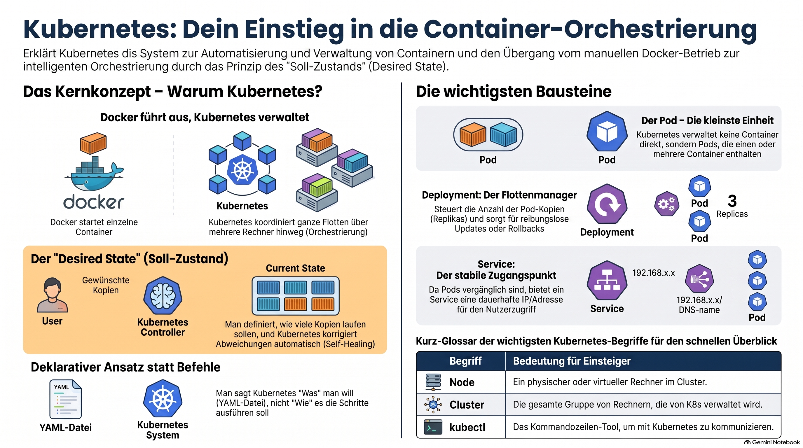

> [NOTE!]
> Dieser Text bietet eine fundierte **Einführung in Kubernetes** für Einsteiger, die bereits über Grundkenntnisse in **Docker und Java** verfügen. Er erklärt den Übergang vom Betrieb einzelner Container zur **Orchestrierung komplexer Systeme**, um Ausfallsicherheit und Skalierbarkeit zu gewährleisten. Zentrale Konzepte wie **Nodes, Pods und Deployments** werden anhand praktischer Beispiele und einfacher Analogien verständlich aufbereitet. Ein besonderer Fokus liegt auf dem **deklarativen Modell**, bei dem Kubernetes kontinuierlich versucht, einen definierten **Soll-Zustand** aufrechtzuerhalten. Zudem erhalten Lernende wertvolle Tipps zur Nutzung des Kommandozeilenwerkzeugs **kubectl** sowie einen strukturierten **Fahrplan für die weitere Ausbildung**. Damit dient die Quelle als ideale Vorbereitung für den Betrieb moderner **Spring-Boot-Anwendungen** in einer Container-Umgebung.


Absolutely. Since you’re already learning **Docker, Java, and Spring Boot**, Kubernetes is a very natural next step. The key is **not to start with YAML**. First understand the Kubernetes ideas, then the commands, and only afterward the configuration files.

# ☸️ Kubernetes — Absolute Beginner Tutorial

## 1. What is Kubernetes?

Let's start with the problem Kubernetes solves.

Imagine you have a Spring Boot application:

```text
Spring Boot application
        ↓
     Docker
        ↓
   Docker container
```

You can start it with:

```powershell
docker run my-spring-app
```

That's great for **one container**.

But imagine your application becomes popular:

```text
             Users
               │
               ▼
        ┌──────────────┐
        │ Spring Boot  │
        │  application  │
        └──────────────┘
```

You might want:

```text
             Users
               │
               ▼
        ┌───────────────┐
        │ Load Balancer │
        └───────┬───────┘
                │
       ┌────────┼────────┐
       ▼        ▼        ▼
   ┌───────┐ ┌───────┐ ┌───────┐
   │ App 1 │ │ App 2 │ │ App 3 │
   └───────┘ └───────┘ └───────┘
```

Now you have problems:

* How do I start all three?

* What happens if App 2 crashes?

* How do I replace it?

* How do I scale from 3 instances to 10?

* How do the users find the applications?

* How do I deploy a new version?

* How do I roll back if the new version is broken?

**Kubernetes automates these kinds of tasks.**

***

# 2. Kubernetes in one sentence

A good beginner definition is:

> **Kubernetes is a system for running and managing containers across one or more computers.**

Or even simpler:

> **Docker runs containers. Kubernetes manages containers.**

That's not the complete technical definition, but it's an excellent starting point.

***

# 3. Docker vs Kubernetes

This distinction is extremely important.

Think about a restaurant.

### Docker

Docker gives you the ability to create and run individual containers:

```text
Docker
  │
  ├── Container
  ├── Container
  └── Container
```

### Kubernetes

Kubernetes manages many containers and makes sure they are running as desired:

```text
                 Kubernetes
                     │
        ┌────────────┼────────────┐
        ▼            ▼            ▼
    Container    Container    Container
```

So:

```text
Docker       → container technology
Kubernetes   → container orchestration
```

The word **orchestration** means coordinating many things.

***

# 4. What does Kubernetes actually do?

Suppose you tell Kubernetes:

> "I want 3 copies of my Spring Boot application running."

Kubernetes continuously tries to make reality match that desired state.

You say:

```text
Desired state:

3 application instances
```

Kubernetes observes:

```text
Current state:

2 application instances
```

Kubernetes reacts:

```text
Start another instance
```

Now:

```text
Desired state: 3
Current state: 3
```

This idea of **desired state** is fundamental to Kubernetes.

***

# 5. The most important Kubernetes concept

You will encounter this idea everywhere:

```text
You describe WHAT you want.
Kubernetes figures out HOW to achieve it.
```

For example:

```text
"I want 3 copies of my application."
```

You don't normally tell Kubernetes:

```text
Start container A
Start container B
Start container C
```

Instead you declare:

```text
replicas: 3
```

Kubernetes takes care of the details.

This is called a **declarative approach**.

***

# 6. What is a Kubernetes Cluster?

A **Kubernetes cluster** is a group of machines managed by Kubernetes.

At a very high level:

```text
             Kubernetes Cluster
                    │
        ┌───────────┴───────────┐
        │                       │
   Control Plane             Worker
                              Node
```

Usually there are multiple worker nodes:

```text
             Kubernetes Cluster
                     │
       ┌─────────────┼─────────────┐
       │             │             │
       ▼             ▼             ▼
   Worker 1      Worker 2      Worker 3
```

***

# 7. What is a Node?

A **Node** is a machine that runs workloads.

It can be:

* a physical computer

* a virtual machine

* a cloud VM

For example:

```text
Node
 │
 ├── container
 ├── container
 └── container
```

A Kubernetes cluster can therefore contain several nodes.

***

# 8. Control Plane vs Worker Node

This is another important concept.

A Kubernetes cluster has two broad roles.

### Control Plane

The control plane is responsible for **managing the cluster**.

Think:

```text
                 Control Plane
                      │
          "What should the cluster look like?"
                      │
        ┌─────────────┼─────────────┐
        ▼             ▼             ▼
     Worker 1      Worker 2      Worker 3
```

### Worker Node

Worker nodes actually run your workloads.

```text
Worker Node
    │
    ├── Pod
    ├── Pod
    └── Pod
```

Don't worry about the internal components yet.

For an absolute beginner, remember:

```text
Control Plane → manages the cluster

Worker Node   → runs applications
```

***

# 9. What is a Pod?

Now we reach one of Kubernetes' most important concepts.

You might initially think:

> "Kubernetes runs containers."

Technically, Kubernetes normally runs **Pods**, and Pods contain containers.

The basic relationship is:

```text
Kubernetes
    │
   Pod
    │
 Container
```

A Pod is the **smallest deployable unit in Kubernetes**.

For a beginner, you can initially think of:

```text
Pod ≈ container
```

This is not exactly correct, but it's a useful mental model.

A simple Pod might contain one container:

```text
┌─────────────────────┐
│        Pod          │
│                     │
│  ┌───────────────┐  │
│  │   Container   │  │
│  │ Spring Boot   │  │
│  └───────────────┘  │
└─────────────────────┘
```

***

# 10. Why does Kubernetes have Pods?

You might ask:

> Why doesn't Kubernetes simply manage containers?

Because a Pod provides a small execution environment around one or more containers.

Containers inside the same Pod can share things such as:

* networking

* storage

* lifecycle

For now, though, use this mental model:

```text
Pod
 │
 └── usually one application container
```

Later we'll discuss multi-container Pods.

***

# 11. Your first Kubernetes application

Let's create a very simple example.

Suppose you have a Docker image:

```text
my-spring-app:1.0
```

We want Kubernetes to run it.

Conceptually:

```text
Kubernetes Cluster
       │
       ▼
      Pod
       │
       ▼
my-spring-app:1.0
```

***

# 12. Installing Kubernetes locally

You don't need a cloud account to learn Kubernetes.

For learning on Windows, a good option is **Docker Desktop**, which can provide a local Kubernetes cluster.

Since you're learning Docker at the moment, this is particularly convenient.

Another popular option is **Minikube**.

You can think of the options like this:

```text
Docker Desktop Kubernetes
        │
        └── easiest if you already use Docker Desktop

Minikube
        │
        └── dedicated local Kubernetes learning environment
```

For this tutorial, I'll use **Docker Desktop Kubernetes concepts**, but the Kubernetes commands we'll learn are largely the same elsewhere.

***

# 13. The Kubernetes command-line tool: kubectl

The main command-line tool is:

```text
kubectl
```

Pronounced roughly:

> "cube control"

or simply:

> "kubectl"

You use it to communicate with Kubernetes.

For example:

```powershell
kubectl get pods
```

means:

> "Kubernetes, show me the Pods."

***

# 14. Your first Kubernetes command

After Kubernetes is running:

```powershell
kubectl get nodes
```

You might see something like:

```text
NAME             STATUS   ROLES           AGE   VERSION
docker-desktop   Ready    control-plane   10m   ...
```

The important word is:

```text
Ready
```

You have a Kubernetes cluster!

***

# 15. Kubernetes resources

Kubernetes contains many kinds of objects/resources.

Some of the most important are:

```text
Pod
Deployment
Service
ConfigMap
Secret
Namespace
Volume
```

Don't try to learn all of them at once.

For the beginning, concentrate on:

```text
Pod
 ↓
Deployment
 ↓
Service
```

These three concepts will form the foundation of your Kubernetes understanding.

***

# 16. Creating a Pod

You can create a Pod with:

```powershell
kubectl run hello --image=nginx
```

This tells Kubernetes:

```text
Create a Pod
    │
    └── using the nginx image
```

Now:

```powershell
kubectl get pods
```

You should see something similar to:

```text
NAME    READY   STATUS    RESTARTS   AGE
hello   1/1     Running   0          10s
```

Congratulations.

You have just created your first Kubernetes workload.

***

# 17. Looking inside the Pod

You can ask Kubernetes for more information:

```powershell
kubectl describe pod hello
```

This gives you considerably more information.

For example:

* Pod name

* Node

* container

* image

* IP address

* events

* status

For now, don't worry about understanding every line.

***

# 18. Logs

You can see the container's logs with:

```powershell
kubectl logs hello
```

This is very useful for debugging applications.

For example, later with Spring Boot:

```powershell
kubectl logs my-spring-app
```

will show your application's logs.

***

# 19. Deleting a Pod

You can delete it:

```powershell
kubectl delete pod hello
```

Then:

```powershell
kubectl get pods
```

The Pod is gone.

And this reveals something very important.

A Pod is generally **not something you manually manage individually**.

Instead, Kubernetes usually manages Pods through higher-level resources.

That brings us to Deployments.

***

# 20. What is a Deployment?

A **Deployment** tells Kubernetes something like:

> "I want this application running, with this many copies."

For example:

```text
Deployment
     │
     ├── Pod
     ├── Pod
     └── Pod
```

If you say:

```text
3 replicas
```

Kubernetes tries to maintain:

```text
Pod 1
Pod 2
Pod 3
```

***

# 21. Creating a Deployment

For example:

```powershell
kubectl create deployment hello \
  --image=nginx
```

In PowerShell, however, the line-continuation syntax is different. To keep things simple, use one line:

```powershell
kubectl create deployment hello --image=nginx
```

Now:

```powershell
kubectl get deployments
```

You might see:

```text
NAME    READY   UP-TO-DATE   AVAILABLE
hello   1/1     1            1
```

And:

```powershell
kubectl get pods
```

might show:

```text
hello-7d8f6c...
```

Notice something interesting:

You asked for a Deployment called:

```text
hello
```

but the Pod has a generated name:

```text
hello-7d8f6c...
```

The Deployment manages that Pod.

***

# 22. Scaling

Now we get to one of Kubernetes' superpowers.

Tell Kubernetes:

```powershell
kubectl scale deployment hello --replicas=3
```

Then:

```powershell
kubectl get pods
```

You should now see approximately:

```text
hello-abc123   Running
hello-def456   Running
hello-ghi789   Running
```

You now have:

```text
                 Deployment
                     │
          ┌──────────┼──────────┐
          ▼          ▼          ▼
        Pod 1      Pod 2      Pod 3
```

***

# 23. What happens when a Pod dies?

This is where Kubernetes becomes really interesting.

Suppose you have:

```text
Deployment
    │
    ├── Pod 1
    ├── Pod 2
    └── Pod 3
```

You delete one:

```powershell
kubectl delete pod <pod-name>
```

Then immediately run:

```powershell
kubectl get pods
```

You may see:

```text
Pod 1     Running
Pod 2     Running
Pod 3     Terminating
Pod 4     Running
```

Why?

Because you told Kubernetes:

```text
I want 3 replicas.
```

Kubernetes noticed:

```text
Current: 2
Desired: 3
```

So it created another Pod.

This is the **desired-state model** in action.

***

# 24. Scaling down

You can go from 3 replicas back to 1:

```powershell
kubectl scale deployment hello --replicas=1
```

Then:

```powershell
kubectl get pods
```

Eventually:

```text
hello-abc123   Running
```

***

# 25. But how do users access the Pods?

This is a major Kubernetes question.

Pods have IP addresses, but Pods are considered relatively ephemeral.

You generally don't want users connecting directly to individual Pods.

Instead Kubernetes provides another important resource:

# Service

A **Service** provides a stable way of accessing Pods.

Think:

```text
             Client
                │
                ▼
           ┌─────────┐
           │ Service │
           └────┬────┘
                │
        ┌───────┼───────┐
        ▼       ▼       ▼
      Pod 1   Pod 2   Pod 3
```

The Service can distribute traffic among the Pods.

***

# 26. Why do we need a Service?

Imagine:

```text
Pod 1 → 10.1.0.5
Pod 2 → 10.1.0.6
Pod 3 → 10.1.0.7
```

Pod 2 could disappear.

A replacement might get:

```text
10.1.0.8
```

So clients shouldn't depend on:

```text
10.1.0.6
```

Instead:

```text
Client
   │
   ▼
Service
   │
   ├── Pod 1
   ├── Pod 2
   └── Pod 3
```

The Service provides a stable abstraction.

***

# 27. Creating a Service

For our `hello` Deployment:

```powershell
kubectl expose deployment hello --port=80
```

Now:

```powershell
kubectl get services
```

You might see:

```text
NAME    TYPE        CLUSTER-IP      PORT(S)
hello   ClusterIP   10.x.x.x        80/TCP
```

There is an important detail here.

A normal `ClusterIP` Service is accessible **inside the Kubernetes cluster**.

Your Windows browser cannot necessarily access it directly.

We'll deal with external access shortly.

***

# 28. Port forwarding

For local development, Kubernetes provides a very convenient feature:

```powershell
kubectl port-forward service/hello 8080:80
```

Now you can open:

```text
http://localhost:8080
```

The traffic flows approximately like this:

```text
Chrome
  │
  │ localhost:8080
  ▼
kubectl port-forward
  │
  ▼
Kubernetes Service
  │
  ▼
Pod
  │
  ▼
nginx
```

This is a fantastic way to experiment locally.

***

# 29. The three most important concepts so far

You should now have this mental model:

```text
                    Deployment
                        │
                        │ manages
                        ▼
                    ┌───────┐
                    │ Pods  │
                    └───┬───┘
                        │
                        │ accessed through
                        ▼
                    ┌─────────┐
                    │ Service │
                    └─────────┘
```

Or:

```text
Deployment
    ↓
"How many Pods should exist?"

Pod
    ↓
"Where does my container run?"

Service
    ↓
"How do I reach those Pods?"
```

That's an extremely important foundation.

***

# 30. Kubernetes YAML

So far we've used commands like:

```powershell
kubectl create deployment ...
```

But Kubernetes is very commonly configured using **YAML files**.

For example:

```yaml
apiVersion: apps/v1
kind: Deployment

metadata:
  name: hello

spec:
  replicas: 3

  selector:
    matchLabels:
      app: hello

  template:
    metadata:
      labels:
        app: hello

    spec:
      containers:
        - name: hello
          image: nginx
          ports:
            - containerPort: 80
```

Don't worry if this looks complicated.

At this point you only need to recognize the structure:

```text
Deployment
│
├── metadata
│
└── spec
    │
    ├── replicas
    │
    └── containers
```

We'll learn YAML and Kubernetes configuration gradually.

***

# 31. The `kubectl apply` command

Suppose the file is:

```text
deployment.yaml
```

You can tell Kubernetes to apply it:

```powershell
kubectl apply -f deployment.yaml
```

The `-f` means:

```text
-f <file>
```

So:

```powershell
kubectl apply -f deployment.yaml
```

means approximately:

> "Take the configuration in this file and make the Kubernetes cluster match it."

This is one of the commands you'll use constantly.

***

# 32. Kubernetes is declarative

Compare these two approaches.

### Imperative

You tell Kubernetes:

```text
Create a Pod.
Start a container.
Create another Pod.
Delete this Pod.
Create another one.
```

### Declarative

You tell Kubernetes:

```text
I want 3 replicas of this application.
```

Kubernetes handles the details.

That's why YAML becomes so important.

You describe:

```text
Desired state
```

and Kubernetes works toward it.

***

# 33. A Kubernetes mental model

At this point I recommend memorizing this picture:

```text
                    Kubernetes Cluster
                           │
                    ┌──────┴──────┐
                    │             │
              Control Plane   Worker Nodes
                                  │
                           ┌──────┴──────┐
                           │             │
                         Node          Node
                           │
                       ┌───┴───┐
                       │       │
                      Pod     Pod
                       │
                   Container
                       │
                  Spring Boot
```

And:

```text
                     Users
                       │
                       ▼
                    Service
                       │
              ┌────────┼────────┐
              ▼        ▼        ▼
            Pod 1    Pod 2    Pod 3
              ▲        ▲        ▲
              └────────┼────────┘
                       │
                  Deployment
```

***

# 34. Kubernetes and your Spring Boot knowledge

This is where Kubernetes becomes particularly relevant to you.

Suppose you have:

```text
Spring Boot
    │
    ▼
Docker image
    │
    ▼
my-app:1.0
```

Kubernetes can run that image:

```text
Kubernetes
    │
    ▼
Deployment
    │
    ├── Pod
    │    └── my-app:1.0
    │
    ├── Pod
    │    └── my-app:1.0
    │
    └── Pod
         └── my-app:1.0
```

And a Service:

```text
                  Client
                    │
                    ▼
                 Service
                    │
          ┌─────────┼─────────┐
          ▼         ▼         ▼
        Pod 1     Pod 2     Pod 3
          │         │         │
       Spring    Spring    Spring
        Boot      Boot      Boot
```

This is the architecture you'll encounter frequently in modern Java/Spring Boot environments.

***

# 35. Kubernetes vocabulary

Here is your first Kubernetes vocabulary cheat sheet:

| Term              | Beginner meaning                           |
| ----------------- | ------------------------------------------ |
| **Cluster**       | The Kubernetes environment                 |
| **Node**          | A machine in the cluster                   |
| **Control Plane** | Manages the cluster                        |
| **Worker Node**   | Runs workloads                             |
| **Pod**           | Smallest deployable Kubernetes unit        |
| **Container**     | The application runtime inside a Pod       |
| **Deployment**    | Manages Pods and replicas                  |
| **Replica**       | Another copy of an application             |
| **Service**       | Stable access to Pods                      |
| **kubectl**       | Command-line tool for Kubernetes           |
| **YAML**          | Common format for Kubernetes configuration |
| **Desired state** | What you want Kubernetes to maintain       |

***

# 36. Your first Kubernetes command cheat sheet

These are the commands I'd learn first:

```powershell
kubectl get nodes
```

Show nodes.

```powershell
kubectl get pods
```

Show Pods.

```powershell
kubectl get deployments
```

Show Deployments.

```powershell
kubectl get services
```

Show Services.

```powershell
kubectl describe pod <name>
```

Show detailed Pod information.

```powershell
kubectl logs <pod>
```

Show container logs.

```powershell
kubectl delete pod <name>
```

Delete a Pod.

```powershell
kubectl scale deployment <name> --replicas=3
```

Scale a Deployment.

```powershell
kubectl apply -f <file>
```

Apply YAML configuration.

```powershell
kubectl delete -f <file>
```

Delete resources defined by a YAML file.

```powershell
kubectl port-forward service/<name> 8080:80
```

Forward a local port to a Service.

***

# 37. A very important learning rule

Don't try to memorize all of Kubernetes.

There are **a lot** of Kubernetes concepts:

```text
Pod
Deployment
ReplicaSet
Service
Ingress
ConfigMap
Secret
Volume
PersistentVolume
PersistentVolumeClaim
Namespace
StatefulSet
DaemonSet
Job
CronJob
Node
Cluster
Control Plane
Scheduler
Controller
...
```

That can be overwhelming.

Instead, learn Kubernetes in layers.

### Layer 1 — Fundamentals

```text
Cluster
Node
Pod
Container
kubectl
```

### Layer 2 — Running applications

```text
Deployment
Replica
Scaling
Self-healing
```

### Layer 3 — Networking

```text
Service
ClusterIP
NodePort
LoadBalancer
Ingress
```

### Layer 4 — Configuration

```text
ConfigMap
Secret
Environment variables
```

### Layer 5 — Storage

```text
Volume
PersistentVolume
PersistentVolumeClaim
```

### Layer 6 — Production

```text
Namespaces
Resources
Health checks
Rolling updates
Security
Monitoring
Helm
```

That's a much easier journey.

***

# 38. Your Kubernetes Absolute Beginner Roadmap

I'd suggest this sequence for you:

```text
                    Kubernetes
                         │
          ┌──────────────┴──────────────┐
          │                             │
       Concepts                      Practice
          │                             │
          ▼                             ▼
       Cluster                       kubectl
       Node                          Pods
       Pod                           Deployments
       Container                     Services
          │                             │
          └──────────────┬──────────────┘
                         ▼
                      YAML
                         │
                         ▼
                    Networking
                         │
                         ▼
                 Spring Boot + Docker
                         │
                         ▼
                   Configuration
                         │
                         ▼
                     Storage
                         │
                         ▼
                Production concepts
```

## Recommended next steps

**Part 1:** Kubernetes fundamentals\
→ Cluster, Node, Pod, Container

**Part 2:** `kubectl`\
→ Your first commands and local cluster

**Part 3:** Deployments\
→ Running Spring Boot applications

**Part 4:** Services\
→ Networking and accessing applications

**Part 5:** Kubernetes YAML\
→ Writing your own configuration files

**Part 6:** ConfigMaps and Secrets\
→ Configuration of Spring Boot

**Part 7:** Volumes\
→ Databases and persistent data

**Part 8:** Health checks\
→ Liveness and readiness probes

**Part 9:** Rolling updates\
→ Deploying a new Spring Boot version

**Part 10:** Complete project\
→ **Spring Boot + Docker + Kubernetes**

***

## 🎯 The one thing I want you to understand first

If you remember only this from today's introduction, remember:

```text
Docker
  │
  │ creates/runs
  ▼
Container
  │
  │ runs inside
  ▼
Pod
  │
  │ managed by
  ▼
Deployment
  │
  │ exposed through
  ▼
Service
```

And Kubernetes continuously tries to make the **actual state** match the **desired state**.

That is the central idea behind Kubernetes.

For your background, I would next do a **hands-on Kubernetes Absolute Beginner Bootcamp**, starting with **Day 1: Install Kubernetes on Windows 11 + kubectl + create your first Pod**, and then gradually work all the way to deploying a real **Spring Boot Docker container**.
